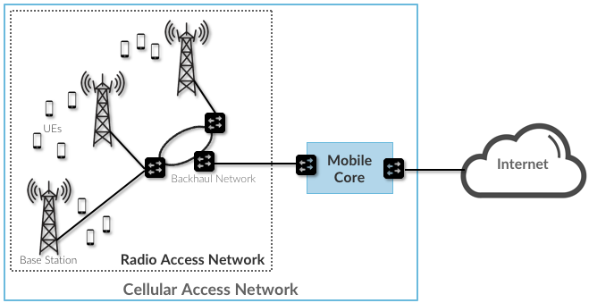
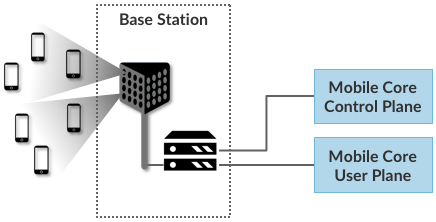
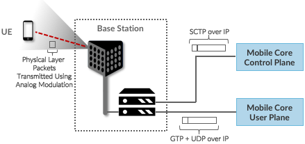
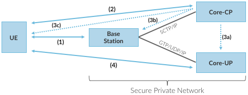
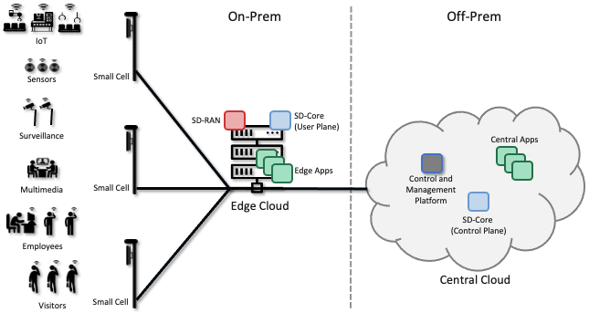

Chapter 2:  Architecture
========================

.. The general plan is for the sections in this chapter to introduce
   the chapters that follow. It introduces high-level concepts and
   terminology, but does not go into implementation details.  The main
   takeaways should be an understanding of the main concepts (e.g.,
   support for mobility, slicing/QoS, security/authentication,
   identity/addresses), but without saying too much about how this is
   realized. In a sense, this chapter doubles as a Requirements
   discussion.

   This chapter use to follow the transimission primer, and so assumes
   QCI is already defined. We'll need to include "2.2 Radio Transmission"
   to introduce a few terms and concepts like this. Generally, this
   section will need to set up the over-the-air interface as distinct
   from the RAN.

   In the big picture, we have to talk about how such a system is
   managed, and since our goal is to democratize the mobile network,
   we adopt best practices in cloud-based managed services.

   May want to explain that the components introduced in this chapter
   can be distributed, for example between the edge and central
   clouds. Different partitions/distributions will make sense in
   different usage scenarios; it’s a matter of economics. But now we
   have options we didn’t have before.

This chapter identifies the main architectural components of cellular
access networks. It focuses on the components that are common to both
4G and 5G, and as such, establishes a foundation for understanding the
advanced features of 5G presented in later chapters.

This overview is partly an exercise in introducing 3GPP terminology. For
someone that is familiar with the Internet, this terminology can seem
arbitrary (e.g., “eNB” is a “base station”), but it is important to keep
in mind that this terminology came out of the 3GPP standardization
process, which has historically been concerned about telephony and
almost completely disconnected from the IETF and other Internet-related
efforts. To further confuse matters, the 3GPP terminology often changes
with each generation (e.g., a base station is called eNB in 4G and gNB
in 5G). We address situations like this by using generic terminology
(e.g., base station), and referencing the 3GPP-specific counterpart only
when the distinction is helpful.

.. _reading_terminology:
.. admonition:: Further Reading
		
   This example is only the tip of the terminology iceberg. For a
   slightly broader perspective on the complexity of terminology in
   5G, see Marcin Dryjanski’s blog post: `LTE and 5G Differences:
   System Complexity
   <https://www.grandmetric.com/blog/2018/07/14/lte-and-5g-differences-system-complexity/>`__.
   July 2018.

2.1 Overview
------------

The cellular network provides wireless connectivity to devices that are
on the move. These devices, which are known as *User Equipment (UE)*,
have traditionally corresponded to smartphones and tablets, but will
increasingly include cars, drones, industrial and agricultural machines,
robots, home appliances, medical devices, and so on.

.. _fig-cellular:

	    
    Cellular networks consists of a Radio Access Network
    (RAN) and a Mobile Core.

As shown in :numref:`Figure %s <fig-cellular>`, the cellular network
consists of two main subsystems: the *Radio Access Network (RAN)* and
the *Mobile Core*. The RAN manages the radio spectrum, making sure it
is used efficiently and meets the quality-of-service requirements of
every user.  It corresponds to a distributed collection of base
stations. As noted above, in 4G these are (somewhat cryptically) named
*eNodeB* (or *eNB*), which is short for *evolved Node B*.  In 5G they
are known as *gNB*. (The g stands for "next Generation".)

The Mobile Core is a bundle of functionality (as opposed to a
device) that serves several purposes.

-  Provides Internet (IP) connectivity for both data and voice services.
-  Ensures this connectivity fulfills the promised QoS requirements.
-  Tracks user mobility to ensure uninterrupted service.
-  Tracks subscriber usage for billing and charging.

Note that Mobile Core is another example of a generic term. In 4G
this is called the *Evolved Packet Core (EPC)* and in 5G it is called
the *Next Generation Core (NG-Core)*.

Even though the word “Core” is in its name, from an Internet
perspective, the Mobile Core is still part of the access network,
effectively providing a bridge between the RAN in some geographic area
and the greater IP-based Internet. 3GPP provides significant
flexibility in how the Mobile Core is geographically deployed, but for
our purposes, assuming each instantiation of the Mobile Core serves a
metropolitan area is a good working model. The corresponding RAN would
then span several dozens (or even hundreds) of cell towers.

Taking a closer look at :numref:`Figure %s <fig-cellular>`, we see that a
*Backhaul Network* interconnects the base stations that implement the RAN with
the Mobile Core. This network is typically wired, may or may not have
the ring topology shown in the Figure, and is often constructed from
commodity components found elsewhere in the Internet. For example, the
*Passive Optical Network (PON)* that implements Fiber-to-the-Home is a
prime candidate for implementing the RAN backhaul. The backhaul network
is obviously a necessary part of the RAN, but it is an implementation
choice and not prescribed by the 3GPP standard.

Although 3GPP specifies all the elements that implement the RAN and
Mobile Core in an open standard—including sub-layers we have not yet
introduced—network operators have historically bought proprietary
implementations of each subsystem from a single vendor. This lack of an
open source implementation contributes to the perceived “opaqueness” of
the cellular network in general, and the RAN in particular. And while it
is true that an eNodeB implementation does contain sophisticated
algorithms for scheduling transmission on the radio spectrum—algorithms
that are considered valuable intellectual property of the equipment
vendors—there is significant opportunity to open and disaggregate both
the RAN and the Mobile Core. The following two sections describe each,
in turn.

Before getting to those details, :numref:`Figure %s <fig-cups>`
redraws components from :numref:`Figure %s <fig-cellular>` to
highlight two important distinctions. The first is that a base station has an analog
component (depicted by an antenna) and a digital component (depicted
by a processor pair). The second is that the Mobile Core is
partitioned into a *Control Plane* and *User Plane*, which is similar
to the control/data plane split that someone familiar with the
Internet would recognize. (3GPP also recently introduced a
corresponding acronym—\ *CUPS, Control and User Plane Separation*—to
denote this idea.) The importance of these two distinctions will
become clear in the following discussion.

.. _fig-cups:

    
    Mobile Core divided into a Control Plan and a User
    Plane, an architectural feature known as CUPS: Control and User
    Plane Separation

2.2 Radio Transmission
----------------------

.. Establish the distinction between the over-the-air interface and
   the RAN, and introduce the minimum terminology needed in the rest
   of this chapter (most notably, the opportunity to differential
   quality-of-service). Could draw parallel to optical link. The radio
   tranmission chapter is alreay a minimal primer, so this section
   will likely be pretty short.

Before describing the two major subsystems of the mobile cellular
network—the RAN and Mobile Core—we first call attention to the
obvious: that the base stations that comprise the RAN communicate with
UEs via radio transmission. This book is not about the physics of this
over-the-air interface, and only skims the surface of the information
theory and coding theory that underlies it. But identifying the
abstract properties of wireless communication is an essential
foundation for understanding the rest of the 5G architecture.

If you imagine the base stations as implementing a multi-layer
protocol stack (which as we'll see in Chapter 4, they do), then radio
transmission is the responsibility of the bottom-most layers of that
stack. Chapter 3 introduces radio transimission with enough detail to
lay the necessary foundation, so we're able to understand all the
layers that come above it.

Notably, the RAN is responsible for managing how the radio spectrum is
shared among thousands or millions of UEs connected to hundreds or
thousands of basestations in a geographic region, such as a metro
area. Our primary task in Chapter 3 is to establish an abstraction
interface by which the RAN can manage that spectrum without having to
worry about the details of waveforms, modulation, or coding
algorithms. All important topics, to be sure, but the realm of
information theorist rather than system design that is the focus of
this book.

For the purpose of this chapter, all we need to know is that there are
two fundamental pieces of information shared between the higher layers
of the base station stack that manage the RAN as a whole, and the
lower layers of the stack that manage radio transmissions on a
particular base station. One is the signal-to-noise ratio that the
base station observes when communicating with a given UE. This is
called the *Channel Quality Indicator (CQI)* and it is passed *up*
from the radio. The second is the quality-of-service the network wants
to give a particular UE. This is called the *QoS Class Indicator
(QCI)* and it is passed *down* to the radio. We will fill in more
details about both of these parameters in Chapter 3, but this
high-level summary is sufficient to describe the RAN and Mobile Core.

.. sidebar:: Uniqueness of Wireless Links

   Talk about quality of the "link" being continuous in a wireless
   network, versus discrete in a wireline network (the link is up or
   it is down). Quality plays a role in handover, but it's more
   complicated than "picking the best." You have to play the value
   delivered to a given UE against the aggregate goodness of the
   shared spectrum.

2.3 Radio Access Network
------------------------

We now describe the RAN by sketching the role each base station plays.
Keep in mind this is kind of like describing the Internet by explaining
how a router works—a not unreasonable place to start, but it doesn't
fully do justice to the end-to-end story.

First, each base station establishes the wireless channel for a
subscriber’s UE upon power-up or upon handover when the UE is active.
This channel is released when the UE remains idle for a predetermined
period of time. Using 3GPP terminology, this wireless channel is said to
provide a *bearer service*. The term “bearer” has historically been used in
telecommunications (including early wireline technologies like
ISDN) to denote a data channel, as opposed to a channel that
carries signaling information.

.. _fig-active-ue:
.. figure:: figures/Slide03.png 
    :width: 500px
    :align: center

    Base Station detects (and connects to) active UEs.

Second, each base station establishes “3GPP Control Plane”
connectivity between the UE and the corresponding Mobile Core Control
Plane component, and forwards signaling traffic between the two. This
signaling traffic enables UE authentication, registration, and
mobility tracking.

.. _fig-control-plane:
.. figure:: figures/Slide04.png 
    :width: 500px
    :align: center
	    
    Base Station establishes control plane connectivity
    between each UE and the Mobile Core.

Third, for each active UE, the base station establishes one or more
tunnels between the corresponding Mobile Core User Plane component.

.. _fig-user-plane:
.. figure:: figures/Slide05.png 
    :width: 500px
    :align: center
	    
    Base station establishes one or more tunnels between
    each UE and the Mobile Core’s User Plane.

Fourth, the base station forwards both control and user plane packets
between the Mobile Core and the UE. These packets are tunnelled over
SCTP/IP and GTP/UDP/IP, respectively. SCTP (Stream Control Transport
Protocol) is an alternative reliable transport to TCP, tailored to carry
signaling (control) information for telephony services. GTP (a nested
acronym corresponding to (General Packet Radio Service) Tunneling
Protocol) is a 3GPP-specific tunneling protocol designed to run over
UDP.

As an aside, it is noteworthy that connectivity between the RAN and the
Mobile Core is IP-based. This was introduced as one of the main changes
between 3G and 4G. Prior to 4G, the internals of the cellular network
were circuit-based, which is not surprising given its origins as a voice
network.

.. _fig-tunnels:

	    
    Base Station to Mobile Core (and Base Station to Base
    Station) control plane tunneled over SCTP/IP and user plane
    tunneled over GTP/UDP/IP.

Fifth, each base station coordinates UE handovers with neighboring
base stations, using direct station-to-station links. Exactly like the
station-to-core connectivity shown in the previous figure, these links
are used to transfer both control plane (SCTP over IP) and user plane
(GTP over UDP/IP) packets. The decsion as to when to do a handover is
based on the CQI values being reported by the radio on each of the
base stations within range of the UE.

.. _fig-handover:
.. figure:: figures/Slide07.png 
    :width: 500px
    :align: center
	    
    Base Stations cooperate to implement UE hand over.
    
Sixth, the base stations coordinate wireless multi-point transmission to
a UE from multiple base stations, which may or may not be part of a UE
handover from one base station to another.

.. _fig-link-aggregation:
.. figure:: figures/Slide08.png 
    :width: 500px
    :align: center
	    
    Base Stations cooperate to implement multipath
    transmission (link aggregation) to UEs.

The main takeaway is that the base station can be viewed as a
specialized forwarder. In the Internet-to-UE direction, it fragments
outgoing IP packets into physical layer segments and schedules them
for transmission over the available radio spectrum, and in the
UE-to-Internet direction it assembles physical layer segments into IP
packets and forwards them (over a GTP/UDP/IP tunnel) to the upstream
user plane of the Mobile Core. Also, based on observations of the
wireless channel quality and per-subscriber policies, it decides
whether to (a) forward outgoing packets directly to the UE, (b)
indirectly forward packets to the UE via a neighboring base station,
or (c) utilize multiple paths to reach the UE. The third case has the
option of either spreading the physical payloads across multiple base
stations or across multiple carrier frequencies of a single base
station (including Wi-Fi).

In other words, the RAN as a whole (i.e., not just a single base
station) not only supports handovers (an obvious requirement for
mobility), but also *link aggregation* and *load balancing*,
mechanisms that are familiar to anyone who understands the
Internet. These functions imply a global decision-making process,
whereby it’s possible to forward traffic to a different base station
(or to multiple base stations) in an effort to make efficient use of
the radio spectrum over a larger geographic area. We will revisit how
such RAN-wide (global) decisions can be made using SDN techniques in a
later chapter.

2.4 Mobile Core
---------------

The main function of the Mobile Core is to provide external packet
data network (i.e., Internet) connectivity to mobile subscribers,
while ensuring that they are authenticated and their observed service
qualities satisfy their subscription SLAs. An important aspect of the
Mobile Core is that it needs to manage all subscribers’ mobility by
keeping track of their last whereabouts at the granularity of the
serving base station. It is this support for security, mobility, and
QoS that differentiate the cellular network from WiFi. The following
also serves to fill in some details about how each individual UE
connects to the network.

We start with the security architecture, which is grounded in two 
trust assumptions.  First, each Base Station trusts that it is 
connected to the Mobile Core by a secure private network, over which 
it establishes the tunnels introduced in :numref:`Figure %s 
<fig-tunnels>`: a GTP/UDP/IP tunnel to the Core's User Plane (Core-UP) 
and a SCTP/IP tunnel to the Core's Control Plane (Core-CP). Second,
each UE has an operator-provided SIM card, which uniquely identifies 
the subscriber (i.e., phone number) and establishes the radio 
parameters (e.g., frequency band) needed to communicate with that 
operator's Base Stations. The SIM card also includes a secret key that 
the UE uses to authenticate itself.

.. Talk about IMSIs here, and that the Core maps phone numbers into an
   IMSI. Also an opportunityt to explain how roaming works.

.. _fig-secure:

	    
    Sequence of steps to establish secure Control and User Plane 
    channels. 

With this starting point, :numref:`Figure %s <fig-secure>` shows the 
per-UE connection sequence. When a UE first becomes active, it 
communicates with a nearby Base Station over a temporary 
(unauthenticated) radio link (Step 1).  The Base Station forwards the 
request to the Core-CP over the existing tunnel, and the Core-CP 
(specifically, the MME in 4G and the AMF in 5G) initiates an 
authentication protocol with the UE (Step 2). 3GPP identifies a set of 
options for authentication and encryption, where the actual protocols 
used are an implementation choice. For example, *Advanced Encryption 
Standard* (AES) is one of the options for encryption. Note that this 
authentication exchange is initially in the clear since the Base 
Station to UE link is not yet secure. 

Once the UE and Core-CP are satisfied with each other's identity, the
Core-CP informs the other components of the parameters they will need
to service the UE (Step 3). This includes: (a) instructing the Core-UP
to initialize the user plane (e.g., assign an IP address to the UE and
set the appropriate QCI); (b) instructing the Base Station to
establish an encrypted channel to the UE; and (c) giving the UE the
symmetric key it will need to use the encrypted channel with the Base
Station.  The symmetric key is encrypted using the public key of the
UE (so only the UE can decrypt it, using its secret key). Once
complete, the UE can use the end-to-end user plane channel through the
Core-UP (Step 4).

There are three additional details of note about this process. First,
the secure control channel between the UE and the Core-CP set up 
during Step 2 remains available, and is used by the Core-CP to send 
additional control instructions to the UE during the course of the 
session. 

Second, the user plane channel established during Step 4 is referred
to as the *Default Bearer Service*, but additional channels can be
established between the UE and Core-UP, each with a potentially
different QCI. This might be done on an application-by-application
basis, for example, under the control of the Mobile Core doing *Deep
Packet Inspection* (DPI) on the traffic, looking for flows that
require special treatment.

.. _fig-per-hop:
.. figure:: figures/Slide35.png 
    :width: 500px 
    :align: center 
	    
    Sequence of per-hop tunnels involved in an end-to-end User Plane 
    channel. 

In practice, these per-flow tunnels are often bundled into an single
inter-component tunnel, which makes it impossible to differentiate the
level of service given to any particular end-to-end UE channel. This
is a limitation of 4G that 5G has ambitions to correct.

Support for mobility can now be understood as the process of 
re-executing one or more of the steps shown in :numref:`Figure %s 
<fig-secure>` as the UE moves throughout the RAN.  The unauthenticated 
link indicated by (1) allows the UE to be known to all Base Station 
within range. (We refer to these as *potential links* in later 
chapters.) Based on the signal's measured CQI, the Base Stations 
communicate directly with each other to make a handover decision. Once 
made, the decision is then communicated to the Mobile Core,
re-triggering the setup functions indicated by (3), which in turn 
re-builds the user plane tunnel between the Base Station and the SGW 
shown in :numref:`Figure %s <fig-per-hop>` (or correspondingly,
between the Base Station and the UPF in 5G). One of the most unique 
features of the cellular network is that the Mobile Core's user plane 
(e.g., UPF in 5G) buffers data during the handover transition,
avoiding dropped packets and subsequent end-to-end retransmissions. 

In other words, the cellular network maintains the *UE session* in the 
face of mobility (corresponding to the control and data channels 
depicted by (2) and (4) in :numref:`Figure %s <fig-secure>`,
respectively), but it is able to do so only when the same Mobile Core 
serves the UE (i.e., only the Base Station changes).  This would 
typically be the case for a UE moving within a metropolitan area. 
Moving between metro areas—and hence, between Mobile Cores—is 
indistinguishable from power cycling a UE. The UE is assigned a new IP 
address and no attempt is made to buffer and subsequently deliver 
in-flight data. Independent of mobility, but relevant to this 
discussion, any UE that becomes inactive for a period of time also 
loses its session, with a new session established and a new IP address 
assigned when the UE becomes active again. 

Note that this session-based approach can be traced to the cellular 
network's roots as a connection-oriented network. An interesting 
thought experiment is whether the Mobile Core will continue to evolve 
so as to better match the connectionless assumptions of the Internet 
protocols that typically run on top of it. 

2.5 Managed Cloud Service
-------------------------

.. Lifted from OPs book (as a starting point)

Aether is a Kubernetes-based edge cloud, augmented with a 5G-based
connectivity service. Aether is targeted at enterprises that want to
take advantage of 5G connectivity in support of mission-critical edge
applications requiring predictable, low-latency connectivity. In
short, “Kubernetes-based” means Aether is able to host container-based
services, and “5G-based connectivity” means Aether is able to connect
those services to mobile devices throughout the enterprise's physical
plant. This combination of features to support deployment of edge
applications, coupled with Aether being offered as a managed service,
means Aether can fairly be characterized as a Platform-as-a-Service
(PaaS).

Aether supports this combination by implementing both the RAN and the
user plane of the Mobile Core on-prem, as cloud-native workloads
co-located on the Aether cluster. This is often referred to as *local
breakout* because it enables direct communication between mobile
devices and edge applications without data traffic leaving the
enterprise. This scenario is depicted in :numref:`Figure %s
<fig-hybrid>`, which does not name the edge applications, but
substituting Internet-of-Things (IoT) would be an illustrative
example.

.. _fig-hybrid:

   Overview of Aether as a hybrid cloud, with edge apps and the 5G
   data plane (called *local breakout*) running on-prem and various
   management and control-related workloads running in a central
   cloud.

The approach includes both edge (on-prem) and centralized (off-prem)
components. This is true for edge apps, which often have a centralized
counterpart running in a commodity cloud. It is also true for the 5G
Mobile Core, where the on-prem User Plane (UP) is paired with a
centralized Control Plane (CP). The central cloud shown in this figure
might be private (i.e., operated by the enterprise), public (i.e.,
operated by a commercial cloud provider), or some combination of the
two (i.e., not all centralized elements need to run in the same
cloud). Also shown in :numref:`Figure %s <fig-hybrid>` is a
centralized *Control and Management Platform*. This represents all the
functionality needed to offer Aether as a managed service, with system
administrators using a portal exported by this platform to operate the
underlying infrastructure and services within their enterprise. The
rest of this book is about everything that goes into implementing that
*Control and Management Platform*.
   
