Chapter 2:  Architecture
========================

.. The general plan is for the sections in this chapter to introduce
   each of the chapters that follow. It introduces high-level concepts
   and terminology, but does not go into implementation details.  The
   main takeaways should be an understanding of the main concepts
   (e.g., support for mobility, slicing/QoS, security/authentication,
   identity/addresses), but without saying too much about how they are
   realized.

   Ideally, this chapter doubles as a Requirements discussion. We need
   to make a pass that emphasizes that perspective.

   The last section needs to accomplish two things. One is to explain
   that we have several degrees of freedom in how the individual
   components are deployed/distributed, but then zero in on the
   enterprise and private deployments. The second is to explain that
   the system as a whole has to be managed and operated, but then zero
   in on best practices in cloud-based managed services.
   
This chapter identifies the main architectural components of the
mobile cellular networks. We need to introduce some terminology to do
this, which can be confusing for those whose networking background
comes from the Internet. This is partly because some of what needs to
happen in a mobile network, such as keeping track of which base
station is serving a given mobile device, doesn't really have a
parallel in fixed networks. On top of that, the terminology came out
of the 3GPP standardization process, which was historically concerned
with telephony and almost completely disconnected from the IETF and
other Internet-related efforts. To further confuse matters, 3GPP
terminology often changes with each generation (e.g., a base station
is called eNB in 4G and gNB in 5G). We address situations like this by
using generic terminology (e.g., base station), and referencing the
3GPP-specific counterpart only when the distinction is helpful.  This
example is only the tip of the terminology iceberg. Marcin Dryjanski’s
blog post gives a broader perspective on the complexity of terminology
in 5G.

.. _reading_terminology:
.. admonition:: Further Reading
		
   Marcin Dryjanski. `LTE and 5G Differences: System Complexity
   <https://www.grandmetric.com/blog/2018/07/14/lte-and-5g-differences-system-complexity/>`__.
   July 2018.

2.1 Overview
------------

The mobile cellular network provides wireless connectivity to devices
that are (potentially) on the move. These devices, which are known as *User
Equipment (UE)*, have traditionally corresponded to mobile phones and
tablets, but increasingly including cars, drones, industrial and
agricultural machines, robots, home appliances, medical devices, and
so on. In some cases, the UEs may be devices that do not move, e.g.,
router interfaces using cellular connectivity to provide broadband
access to remote dwellings.

.. _fig-cellular:
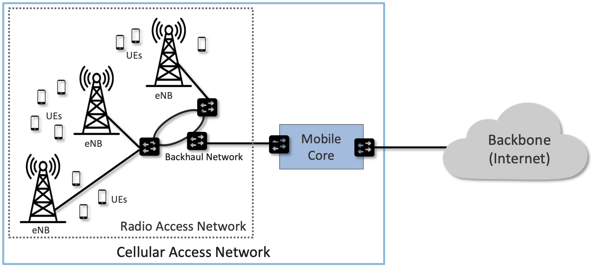
	    
    Mobile cellular networks consists of a Radio Access Network (RAN)
    and a Mobile Core.

As shown in :numref:`Figure %s <fig-cellular>`, the mobile cellular
network consists of two main subsystems: the *Radio Access Network
(RAN)* and the *Mobile Core*. The RAN manages the radio spectrum,
making sure it is used efficiently and meets the quality of service
requirements of every user.  It corresponds to a distributed
collection of base stations. As noted above, these are cryptically
named *eNodeB* or *eNB* (which is short for *evolved Node B*) in 4G.
In 5G, base stations are known as *gNB*, where the "g" stands for
*next Generation*.

The Mobile Core is a bundle of functionality (conventionally packaged
as one or more devices) that serves several purposes.

-  Authenticates devices prior to attaching them to the network
-  Provides Internet (IP) connectivity for both data and voice services.
-  Ensures this connectivity fulfills the promised QoS requirements.
-  Tracks user mobility to ensure uninterrupted service.
-  Tracks subscriber usage for billing and charging.

For readers familiar with the Internet architecture and Wi-Fi as a
common access technology, some of these functions might look a bit
surprising. For example, Wi-Fi, like most of the Internet, normally
provides a best-effort service, whereas cellular networks often aim to
deliver some sort of QoS guarantee. Tracking subscribers for both
mobility and billing are also not the sort of things we tend to think
about in the Internet, but they are considered important functions for
cellular networks. The reasons for these differences are numerous,
including the typically large costs of acquiring cellular spectrum and
maintaining the infrastructure to use it such as radio towers. With
that large investment, there is a desire to recoup costs by charging
subscribers, which in turn leads to making some sort of service
guarantees to those subscribers to justify the cost. There is also a
need to maximize the efficiency of spectrum usage. Much of the
complexity of the mobile core follows from these requirements being
imposed by service providers. Even when we get to enterprises running
their own 5G networks, they still need to manage the usage of spectrum
to obtain the benefits of 5G over Wi-Fi, such as more predictable
control over latency and bandwidth.

Note that Mobile Core is another example of a generic term. In 4G it
was called the *Evolved Packet Core (EPC)* and in 5G it is called the
*Next Generation Core (NG-Core)*. Moreover, even though the word
“Core” is in its name, the Mobile Core runs near the edge of the
network, effectively providing a bridge between the RAN in some
geographic area and the greater IP-based Internet. 3GPP provides
significant flexibility in how the Mobile Core is geographically
deployed, ranging from minimal deployments (the RAN and the mobile
core can be co-located) to areas that are hundreds of kilometers
wide. A common model is that an instantiation of the Mobile Core
serves a metropolitan area. The corresponding RAN would then span
several dozens (or even hundreds) of cell towers in that geographic
area.

Taking a closer look at :numref:`Figure %s <fig-cellular>`, we see
that a *Backhaul Network* interconnects the base stations that
implement the RAN with the Mobile Core. This network is typically
wired, may or may not have the ring topology shown in the figure, and
is often constructed from commodity components found elsewhere in the
Internet. For example, the *Passive Optical Network (PON)* that
implements Fiber-to-the-Home is a prime candidate for implementing the
RAN backhaul, with the RAN effectively running as an *overlay* on top
of whatever technology is used. Switched ethernet, such as you might
find in an enterprise, is another suitable choice. The backhaul
network is obviously a necessary part of the RAN, but it is an
implementation choice and not prescribed by the 3GPP standard.

Although 3GPP specifies all the elements that implement the RAN and
Mobile Core in an open standard—including sub-layers we have not yet
introduced—network operators have historically bought proprietary
implementations of each subsystem from a single vendor. This lack of
an open source implementation contributes to the perceived
“opaqueness” of the mobile cellular network in general, and the RAN in
particular. And while it is true that base stations contain
sophisticated algorithms for scheduling transmission on the radio
spectrum—algorithms that are considered valuable intellectual property
of the equipment vendors—there is significant opportunity to open and
disaggregate both the RAN and the Mobile Core. This book gives a
recipe for how to do exactly that.

Before getting to those details, we have three more architectural
concepts to introduce. First, :numref:`Figure %s <fig-cups>` redraws
components from :numref:`Figure %s <fig-cellular>` to highlight the
fact that a base station has an analog component (depicted by an
antenna) and a digital component (depicted by a processor pair). This
book mostly focuses on the latter, but we introduce enough information
about the over-the-air radio transmission to appreciate its impact on
the overall architecture.

.. _fig-cups:
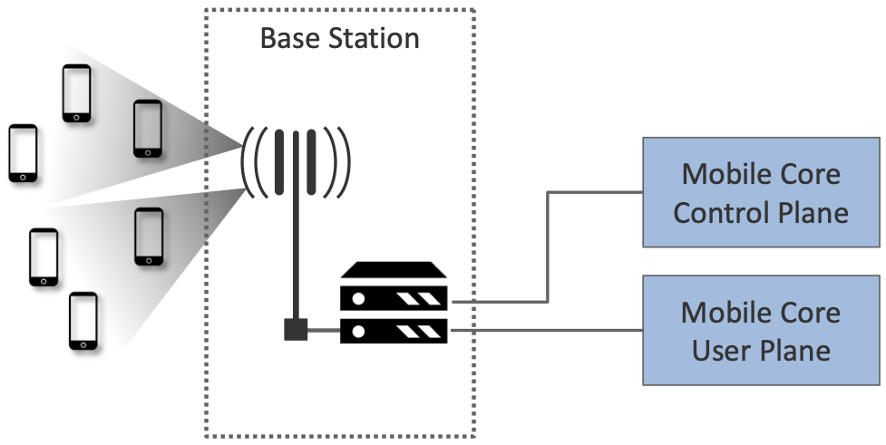
    
    Mobile Core divided into a Control Plan and a User Plane, an
    architectural feature known as CUPS: Control and User Plane
    Separation.

The second concept, also depicted in :numref:`Figure %s <fig-cups>`,
is to partition the Mobile Core into a *Control Plane* and *User
Plane*. This is similar to the control/data plane split that anyone
familiar with the Internet would recognize, and draws in particular on
the ideas of software-defined networking (SDN) by placing control and
user planes in separate devices. 3GPP has introduced a corresponding
acronym—\ *CUPS, Control and User Plane Separation*—to denote this
idea. One motivation for CUPS is to enable control plane resources and
data plane resources to be scaled independently of each other. 

Finally, one of the key aspirational goals of 5G is the ability to
segregate traffic for different usage domains into isolated *network
slices*, each of which delivers a different level of service to a
collection of devices and applications. Thinking of a network slice as
a wireless version of a virtual network is a fair approximation,
although as we'll see in later chapters, the implementation details
differ.

.. _fig-slice:
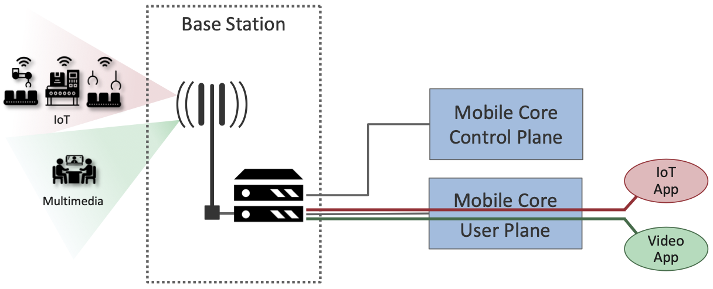
    
    Different usage domains (e.g., IoT and Video Streaming)
    instantiate distinct *network slices* to connect a set of devices
    with one or more applications.

For example, :numref:`Figure %s <fig-slice>` shows two slices, one
supporting IoT workloads and the other supporting multimedia streaming
traffic. As we'll see throughout the book, an important question is
how slicing is realized end-to-end, across the radio, the RAN, and the
Mobile Core. This is done through a combination of allocating distinct
resources to each slice and scheduling shared resources on behalf of a
set of slices.

2.2 Radio Transmission
----------------------

.. Establish the distinction between the over-the-air interface and
   the RAN, and introduce the minimum terminology needed in the rest
   of this chapter (most notably, the opportunity to differential
   quality-of-service). Could draw parallel to optical link. The radio
   transmission chapter is already a minimal primer, so this section
   will likely be pretty short.

Before describing the RAN and Mobile Core subsystems, we first call
attention to the obvious: that the base stations that comprise the RAN
communicate with UEs via electromagnetic radio waves. This book is not
about the physics of this over-the-air communication, and only skims
the surface of the information theory that underlies it. But
identifying the abstract properties of wireless communication is an
essential foundation for understanding the rest of the 5G
architecture.

If you imagine the base stations as implementing a multi-layer
protocol stack (which, as we'll see in Chapter 4, they do), then radio
transmission is the responsibility of the bottom-most layers of that
stack, where (a) digital/analog conversion happens, and (b) analog
radio waves are transmitted/received. Chapter 3 introduces radio
transmission with enough specificity to lay the necessary foundation,
so we're able to understand all the layers that come above it.

For the purposes of this chapter, we only need to understand the
following. First, the RAN is responsible for managing how the radio
spectrum is shared among thousands of UEs connected to hundreds of
base stations in a geographic region. The primary purpose of Chapter 3
is to establish an abstract interface by which the RAN can manage that
spectrum without having to worry about the details of waveforms,
modulation, or coding algorithms. All important topics, to be sure,
but in the realm of information theory rather than system design that
is the focus of this book.

.. _fig-quality:
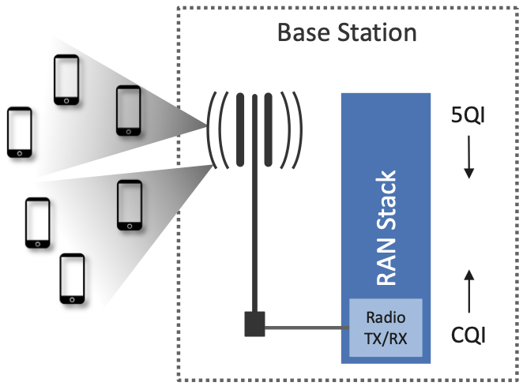
    
    Abstractly, measures of signal quality (CQI) and declarations
    of intended data delivery quality (QCI) are passed up and down
    the RAN stack.

Second, there are two important pieces of information shared between
the higher layers of the base station protocol stack that manages the
RAN as a whole, and the lower layers of the stack that manage radio
transmissions on a particular base station. One is the signal-to-noise
ratio that the base station observes when communicating with each
UE. This is called the *Channel Quality Indicator (CQI)* and it is
passed *up* from the radio. The other is the quality of service the
network wants to give a particular UE. This is called the *QoS Class
Indicator (QCI)* and it is passed *down* to the radio. This abstract
summary, as shown in :numref:`Figure %s <fig-quality>`, is sufficient
to introduce the RAN and Mobile Core. We will fill in more details
about both of these parameters in Chapter 3.

.. sidebar:: Uniqueness of Wireless Links

   While it is common in networking to abstract the link layer by
   treating the link as something that just delivers packets at some
   rate from point A to point B, there are important differences
   between wireless links and fixed links that cannot be entirely
   abstracted away at higher layers. This is especially true when
   mobile devices are involved, as the quality of a link will vary
   depending on the distance between transmitter and receiver, the
   relative velocity of the endpoints, reflections of radio waves from
   other objects, and interference from other transmitters. All of
   these factors come into play in determining the Channel Quality
   Indicator (CQI).

   Further complicating the picture in a mobile network is that a
   given UE is often within reach of more than one base station,
   presenting the option to handover the UE from one base station to
   another. The decision to do so is not just a matter of picking the
   base station with the best channel quality, but rather a matter of
   trying to optimize the whole system, in which the goal is to
   support as many UEs as possible at the desired quality level given the
   available spectrum and coverage. 

..   Talk about quality of the "link" being continuous in a wireless
..   network, versus discrete in a wireline network (the link is up or
     it is down). Quality plays a role in handover, but it's more
     complicated than "picking the best." You have to play the value
     delivered to a given UE against the aggregate goodness of the
     shared spectrum.

Finally, like the rest of the mobile cellular network, the radio comes
with a set of acronyms, with *LTE (Long-Term Evolution)* and *NR
(New Radio)* being the two most widely known. These are marketing
terms commonly associated with the radio technology for 4G and 5G,
respectively. They are important only in the sense that many of the
new features promised by 5G can be directly attributed to improvements
in the underlying radio technology. For our purposes, the key is the
set of new *use cases* the upgraded radio technology enables, and
why. We introduce these improvements to the radio in Chapter 3, and
tie them to the use cases they enable. Subsequent chapters will then
explain how the RAN and Mobile Core need to evolve so as to deliver on
this potential.

2.3 Radio Access Network
------------------------

We now describe the RAN by sketching the role each base station plays.
Keep in mind this is like describing the Internet by explaining
how a router works—not an unreasonable place to start, but it doesn't
fully do justice to the end-to-end story.

First, each base station establishes the wireless channel for a
subscriber’s UE upon power-up or upon handover when the UE is active.
This channel is released when the UE remains idle for a predetermined
period of time. Using 3GPP terminology, this wireless channel is said
to provide a *bearer service*. The term “bearer” has historically been
used in telecommunications (including early wireline technologies such as
ISDN) to denote a data channel, as opposed to a channel that carries
signaling information.

.. _fig-active-ue:
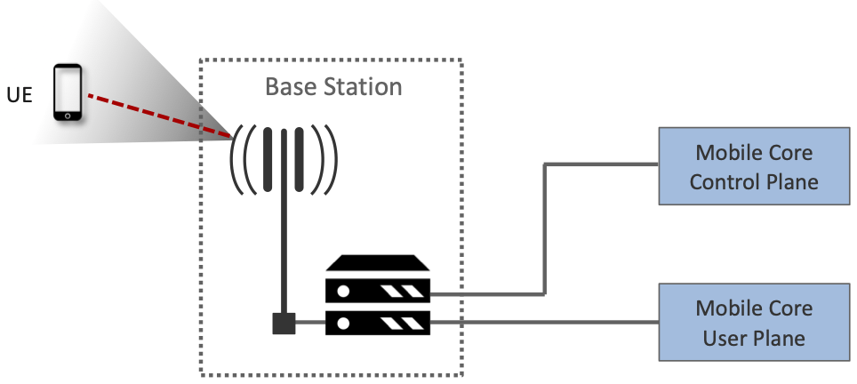

    Base Station detects (and connects to) active UEs.

Second, each base station establishes “3GPP Control Plane”
connectivity between the UE and the corresponding Mobile Core Control
Plane component, and forwards signaling traffic between the two. This
signaling traffic enables UE authentication, registration, and
mobility tracking.

.. _fig-control-plane:
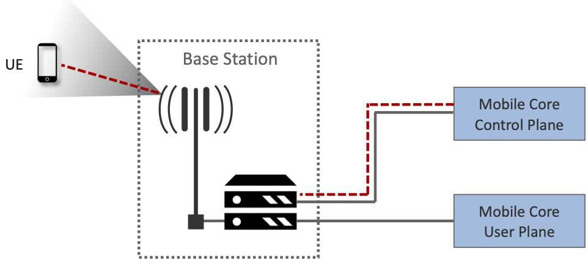
	    
    Base Station establishes control plane connectivity
    between each UE and the Mobile Core.

Third, for each active UE, the base station establishes one or more
tunnels to the corresponding Mobile Core User Plane component.
:numref:`Figure %s <fig-user-plane>` shows just two (one for voice and
one for data), and while in practice 4G was limited to just two, 5G
aspires to support many such tunnels as part of a generalized network
slicing mechanism.

.. _fig-user-plane:
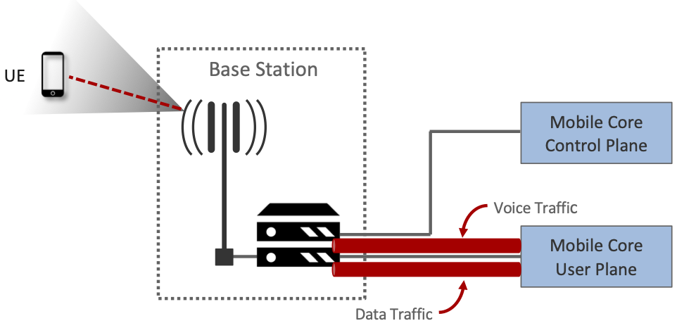
	    
    Base station establishes one or more tunnels between each UE and
    the Mobile Core’s User Plane.

Fourth, the base station forwards both control and user plane packets
between the Mobile Core and the UE. These packets are tunnelled over
SCTP/IP and GTP/UDP/IP, respectively. SCTP (Stream Control Transport
Protocol) is an alternative reliable transport to TCP, tailored to carry
signaling (control) information for telephony services. GTP (a nested
acronym corresponding to (General Packet Radio Service) Tunneling
Protocol) is a 3GPP-specific tunneling protocol designed to run over
UDP.

It is noteworthy that connectivity between the RAN and the Mobile Core
is IP-based. This was introduced as one of the main changes between 3G
and 4G. Prior to 4G, the internals of the cellular network were
circuit-based, which is not surprising given its origins as a voice
network. This also helps to explain why in Section 2.1 we
characterized the RAN Backhaul as an overlay running on top of some
Layer 2 technology.

.. _fig-tunnels:
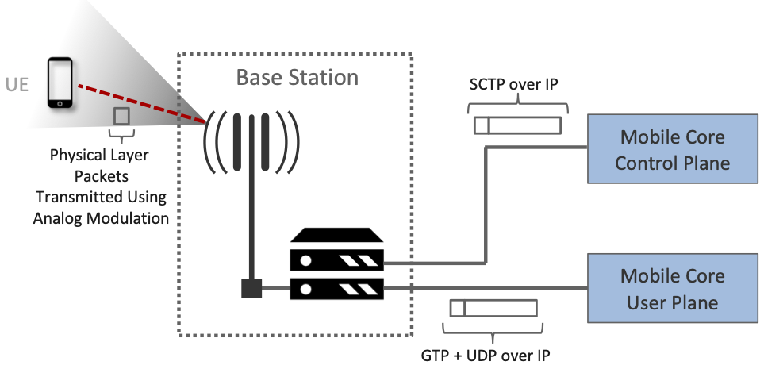
	    
    Base Station to Mobile Core (and Base Station to Base
    Station) control plane tunneled over SCTP/IP and user plane
    tunneled over GTP/UDP/IP.

Fifth, each base station coordinates UE handovers with neighboring
base stations, using direct station-to-station links. Exactly like the
station-to-core connectivity shown in the previous figure, these links
are used to transfer both control plane (SCTP over IP) and user plane
(GTP over UDP/IP) packets. The decision as to when to do a handover is
based on the CQI values being reported by the radio on each of the
base stations within range of the UE, coupled with the QCI value those
base stations know the RAN has promised to deliver to the UE.

.. _fig-handover:
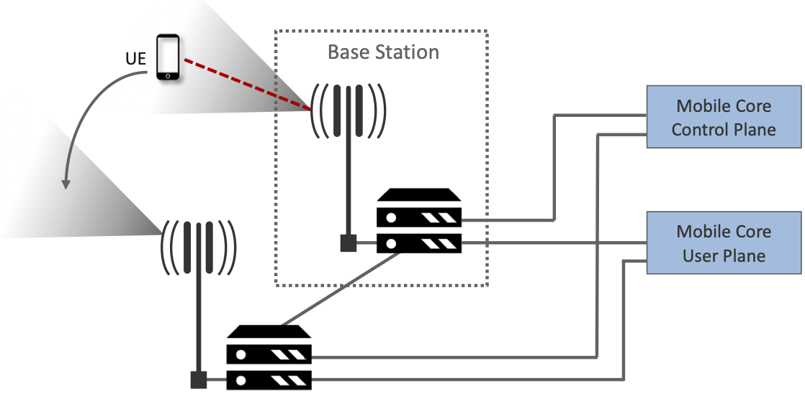
	    
    Base Stations cooperate to implement UE hand over.
    
Sixth, the base stations coordinate wireless multi-point transmission to
a UE from multiple base stations, which may or may not be part of a UE
handover from one base station to another.

.. _fig-link-aggregation:
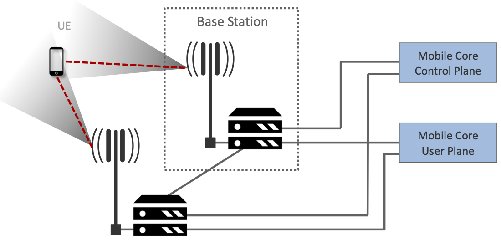
	    
    Base Stations cooperate to implement multipath transmission (link
    aggregation) to UEs.

The main takeaway is that the base station can be viewed as a
specialized forwarder. In the Internet-to-UE direction, it fragments
outgoing IP packets into physical layer segments and schedules them
for transmission over the available radio spectrum, and in the
UE-to-Internet direction it assembles physical layer segments into IP
packets and forwards them (over a GTP/UDP/IP tunnel) to the upstream
user plane of the Mobile Core. Also, based on observations of the
wireless channel quality and per-subscriber policies, it decides
whether to (a) forward outgoing packets directly to the UE, (b)
indirectly forward packets to the UE via a neighboring base station,
or (c) utilize multiple paths to reach the UE. The third case has the
option of either spreading the physical payloads across multiple base
stations or across multiple carrier frequencies of a single base
station (including Wi-Fi).

In other words, the RAN as a whole (i.e., not just a single base
station) not only supports handovers (an obvious requirement for
mobility), but also *link aggregation* and *load balancing*,
mechanisms that are similar to those found in other types of networks.
These functions imply a global decision-making process, whereby it’s
possible to forward traffic to a different base station (or to
multiple base stations) in an effort to make efficient use of the
radio spectrum over a larger geographic area. We will revisit how such
RAN-wide (global) decisions can be made using SDN techniques in
Chapter 4.

2.4 Mobile Core
---------------

At the most basic level, the function of the Mobile Core is to provide
packet data network connectivity to mobile subscribers, i.e., connect
them to the Internet. (The mobile network assumes that multiple packet
data networks can exist, but in practice the Internet is the one that
matters). As we noted above, there is more to providing this
connectivity than meets the eye: the Mobile Core ensures that
subscribers are authenticated and aims to deliver the service
qualities to which they have subscribed. As subscribers may move
around among base station coverage areas, the Mobile Core needs to
keeping track of their whereabouts at the granularity of the serving
base station. The reasons for this tracking are discussed further in
Chapter 5. It is this support for security, mobility, and QoS that
differentiates the cellular network from Wi-Fi.

We start with the security architecture, which is grounded in two
trust assumptions.  First, each base station trusts that it is
connected to the Mobile Core by a secure private network, over which
it establishes the tunnels introduced in :numref:`Figure %s
<fig-tunnels>`: a GTP/UDP/IP tunnel to the Core's User Plane (Core-UP)
and a SCTP/IP tunnel to the Core's Control Plane (Core-CP). Second,
each UE has an operator-provided SIM card, which contains information
that uniquely identifies the subscriber and includes a secret key that
the UE uses to authenticate itself.

The identifier burned into each SIM card, called an *IMSI
(International Mobile Subscriber Identity)*, is a globally unique identifier
for every device connected to the global mobile network. Each IMSI is
a 64-bit, self-describing identifier, which is to say, it includes a
*Format* field that effectively serves as a mask for extracting other
relevant fields. For example, the following is the interpretation we
assume in this book (where IMSIs are commonly represented as a
15-digit decimal number):

* **MCC:** Mobile Country Code (3-digit decimal number).

* **MNC:** Mobile Network Code (3-digit decimal number).

* **ENT:** Enterprise Code (3-digit decimal number).
   
* **SUB:** Subscriber (6-digit decimal number).

The first two fields (*MCC*, *MNC*) are universally understood to
uniquely identify the MNO, while that last two fields are one example
of how an MNO might use additional hierarchical structure to uniquely
identify every device it serves. (We are working towards delivering 5G
connectivity to enterprises, hence the *ENT* field, but other MNOs
might assign the last 9 digits using some other structure.) The *MCC*
and *MNC* play a role in roaming: when a UE tries to connect to a
"foreign network" those fields are used to find the "home network",
where the rest of the IMSI leads to a subscriber profile that says
whether or not roaming is enabled for this device. The following walks
through what happens when a device connects to its home network; more
information about the global ramifications is given at the end of the
section.

.. _fig-secure:
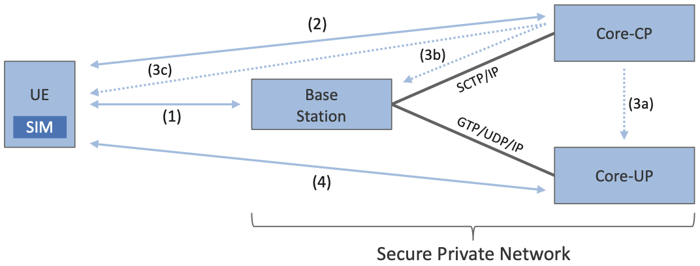
	    
    Sequence of steps to establish secure Control and User Plane 
    channels. 

With this starting point, :numref:`Figure %s <fig-secure>` shows the
per-UE connection sequence. When a UE first becomes active, it
communicates with a nearby base station over a temporary
(unauthenticated) radio link (Step 1).  The base station forwards the
request to the Core-CP over the existing tunnel, and the Core-CP
(assuming it recognizes the IMSI) initiates an authentication protocol
with the UE (Step 2). 3GPP identifies a set of options for
authentication and encryption, where the actual protocols used are an
implementation choice. For example, *Advanced Encryption Standard*
(AES) is one of the options for encryption. Note that this
authentication exchange is initially in the clear since the base
station to UE link is not yet secure.

Once the UE and Core-CP are satisfied with each other's identity, the
Core-CP informs the other components of the parameters they will need
to service the UE (Step 3). This includes: (a) instructing the Core-UP
to initialize the user plane (e.g., assign an IP address to the UE and
set the appropriate QCI); (b) instructing the base station to
establish an encrypted channel to the UE; and (c) giving the UE the
symmetric key it will need to use the encrypted channel with the base
station.  The symmetric key is encrypted using the public key of the
UE (so only the UE can decrypt it, using its secret key). Once
complete, the UE can use the end-to-end user plane channel through the
Core-UP (Step 4).

There are three additional details of note about this process. First,
the secure control channel between the UE and the Core-CP set up
during Step 2 remains available, and is used by the Core-CP to send
additional control instructions to the UE during the course of the
session. In other words, unlike the Internet, the network is able to
"control" the communication settings in edge devices.

Second, the user plane channel established during Step 4 is referred
to as the *Default Bearer Service*, but additional channels can be
established between the UE and Core-UP, each with a potentially
different QCI. This might be done on an application-by-application
basis, for example, under the control of the Mobile Core doing *Deep
Packet Inspection* (DPI) on the traffic, looking for flows that
require special treatment.

.. _fig-per-hop:
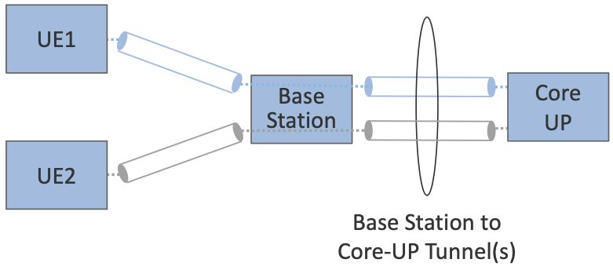
	    
    Sequence of per-hop tunnels involved in an end-to-end User Plane 
    channel. 

In practice, these per-flow tunnels are often bundled into an single
inter-component tunnel, which makes it impossible to differentiate the
level of service given to any particular end-to-end UE channel. This
is a limitation of 4G that 5G has ambitions to correct as part of its
support for network slicing.

Support for mobility can now be understood as the process of
re-executing one or more of the steps shown in :numref:`Figure %s
<fig-secure>` as the UE moves throughout the RAN.  The unauthenticated
link indicated by (1) allows the UE to be known to all base stations
within range. (We refer to these as *potential links* in later
chapters.)  Based on the signal's measured CQI, the base stations
communicate directly with each other to make a handover decision. Once
made, the decision is then communicated to the Mobile Core,
re-triggering the setup functions indicated by (3), which in turn
re-builds the user plane tunnel between the base station and the
Core-UP shown in :numref:`Figure %s <fig-per-hop>`. One of the most
unique features of the cellular network is that the Mobile Core's user
plane buffers data during the handover transition, avoiding dropped
packets and subsequent end-to-end retransmissions.

In other words, the mobile cellular network maintains the *UE session*
in the face of mobility (corresponding to the control and data
channels depicted by (2) and (4) in :numref:`Figure %s <fig-secure>`,
respectively), but it is able to do so only when the same Mobile Core
serves the UE (i.e., only the base station changes).  This would
typically be the case for a UE moving within a metropolitan area.
Moving between metro areas—and hence, between Mobile Cores—is
indistinguishable from power cycling a UE. The UE is assigned a new IP
address and no attempt is made to buffer and subsequently deliver
in-flight data. Independent of mobility, but relevant to this
discussion, any UE that becomes inactive for a period of time also
loses its session, with a new session established and a new IP address
assigned when the UE becomes active again.

Note that this session-based approach can be traced to the mobile
cellular network's roots as a connection-oriented network. An
interesting thought experiment is whether the Mobile Core will
continue to evolve so as to better match the connectionless
assumptions of the Internet protocols that typically run on top of it.

We conclude this overview of the Mobile Core by returning to the role
it plays in implementing a *global* mobile network. It is probably
already clear that each MNO implements a database of subscriber
information, allowing it to map an IMSI to a profile that records what
services (roaming, data plane, hot spot support) the subscriber is
paying for. This record also includes the international phone number
for the device. How this database is realized is an implementation
choice (of which we'll see an example in Chapter 5), but 3GPP defines
an interface by which one Mobile Core (running on behalf of one MNO)
queries another Mobile Core (running on behalf of some other MNO), to
map between the IMSI, the phone number, and the subscriber profile.

2.5 Managed Cloud Service
-------------------------

.. Lifted from OPs book (as a starting point)

.. Needs to describe various deployment options before settling into
   the enterprise (edge cloud) story that we plan to continue
   throughout the rest of the book. Main theme is: Orchestration is the
   final component.

The architectural overview presented up to this point focuses on the
functional elements of the mobile cellular network. We now turn our
attention to how this functionality is operationalized, and we do so
in a decidedly software-defined and cloud-native way. This lays the
foundation for the rest of the book, which builds towards supporting
5G connectivity as a managed cloud service. This is a marked change
from the conventional Telco approach, whereby an operator bought
purpose-built devices from a handful of vendors, and then managed them
using the legacy OSS/BSS machinery that was originally designed for
the telephony network.\ [#]_

.. [#] OSS/BSS stands for Operation Support System / Business Support
       System, and even traditional MNOs are now re-imagining them by
       adopting cloud practices. But this transition is a slow process
       due to all the legacy systems the Telcos need to continue
       supporting.
       
When we talk about "operationalizing" a network, we are referring to a
substantial system that operators (whether they are traditional MNOs
or cloud service providers) use to activate and manage all the
constituent components (whether they are purpose-built devices or
software running on commodity hardware). And because these network
operators are people, one high-level summary is that this management
layer (whether it is an OSS/BSS or a cloud orchestrator) provides a
way to map high-level *Intents* onto low-level *Actions*.

.. _fig-intent:
.. figure:: figures/ops/Slide2.png
   :width: 300px
   :align: center

   High-level summary of the role operationalization plays in a
   network deployment.

This overview, as illustrated in :numref:`Figure %s <fig-intent>`, is
obviously quite abstract. To make the discussion more concrete, we use
an open source implementation, called Aether, as an example.  Aether
is a Kubernetes-based edge cloud, augmented with a 5G-based
connectivity service. Aether is targeted at enterprises that want to
take advantage of 5G connectivity in support of edge applications that
require predictable, low-latency connectivity. In short,
“Kubernetes-based” means Aether is able to host container-based
services, with Kubernetes being the platform used to orchestrate the
services, and “5G-based connectivity” means Aether is able to connect
those services to mobile devices throughout the enterprise's physical
environment.

Aether supports this combination by implementing both the RAN and the
user plane of the Mobile Core on-prem, as cloud-native workloads
co-located on the Aether cluster. This is often referred to as *local
breakout* because it enables direct communication between mobile
devices and edge applications without data traffic leaving the
enterprise, in contrast to what would happen with standard,
operator-provided 5G service. This scenario is depicted in
:numref:`Figure %s <fig-hybrid>`, which shows unnamed edge
applications running on-prem. Those edge applications might include
the local processing of sensor data or control applications for the
IoT devices, for example.

.. _fig-hybrid:
.. figure:: figures/ops/Slide3.png
   :width: 700px
   :align: center

   Overview of Aether as a hybrid cloud, with edge apps and the 5G
   data plane (called *local breakout*) running on-prem and various
   management and control-related workloads running in a central
   cloud.

The approach includes both edge (on-prem) and centralized (off-prem)
components. This is true for edge apps, which often have a centralized
counterpart running in a commodity cloud. It is also true for the 5G
Mobile Core, where the on-prem User Plane (UP) is paired with a
centralized Control Plane (CP). The central cloud shown in this figure
might be private (i.e., operated by the enterprise), public (i.e.,
operated by a commercial cloud provider), or some combination of the
two (i.e., not all centralized elements need to run in the same
cloud).

Also shown in :numref:`Figure %s <fig-hybrid>` is a centralized
*Control and Management Platform*. This is Aether's version of the
"Management Layer" depicted in :numref:`Figure %s <fig-intent>`, and it
represents all the functionality needed to offer Aether as a managed
cloud service, with system administrators using a portal exported by
this platform to operate the underlying infrastructure and services
within their enterprise.
   
Once we deconstruct the individual components in more details in the
next three chapters, we return to the question of how the resulting
set of components can be assembled into an operational edge cloud in
Chapter 6. The end result is 5G connectivity as a managed cloud service.

.. Is this the right place to talk about assumed technologies:
   Kubernetes, Helm, Docker. Could just reproduce 1.3 from the OPs
   book (Cloud Technology), perhaps in an Appendix.
