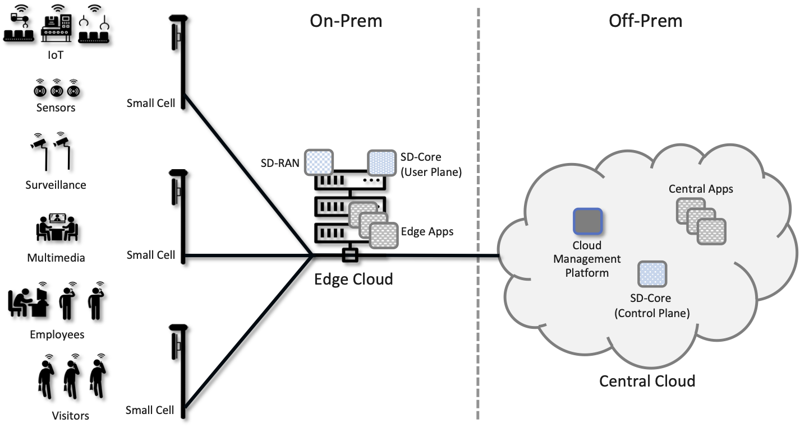
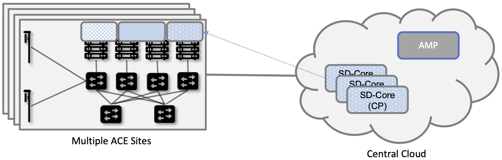

Chapter 6:  Managed Cloud Service
=================================

.. This is where we show how all the pieces can be pulled together
   into an end-to-end solution that can be deployed in enterprises as
   a managed service. Introduce an example use case or two (e.g.,
   IoT), so we have application(s) that take advantage of the system
   we just built.

   This is where we talk about the “managed service” aspect of the
   system, which can’t be ignored because managing a 5G network is a
   big part of the democratization story. Avoid pivoting to a full
   operationalization discussion, which we tell elsewhere (which we
   likely introduce as part of Background material in Chapter 1).
   Probably focus on "user/operator" perspective (rather than
   "under the covers" perspective).

   Current language presumes no specific knowledge of the components
   (e.g., SD-Core or SD-RAN). We will need to be adjusted to account
   for the previous chapters.

   Current language assumes the intro to Kubernetes and Helm from Ch1
   of the OPs book. We will need to provide this background. (See end
   of 1.3 for a similar issue.)

   Probably need to talk generally about ther configurations and
   deployments. Maybe in a concluding section.

This chapter describes how to assemble all the pieces described in the
previous chapters to provide 5G connectivity as a managed cloud
service. Such a service, which is sometimes referred to as *Private
5G*, is gaining traction as a way to deliver 5G to enterprises in
support of a trend known as *Industry 4.0*: A combination of
intelligent devices, robust wireless connectivity, and cloud-based
AI/ML capabilities, all working together to enable software-based
optimization and innovation.

Connecting industry assets to the cloud has the potential to bring
transformative benefits. This starts with collecting deep operational
data on assets and infrastructure, from sensors, video feeds and
telemetry from machinery. It also includes applying ML to this data to
gain insights, identify patterns and predict outcomes (e.g., when a
device is likely to fail), followed by automating industrial processes
so as to minimize human intervention and enable remote operations
(e.g., power optimization, idling quiescent machinery). In general,
the goal is to create an IT foundation for continually improving
industrial operations through software.

Rather than describe a cloud-based 5G service in abstract terms, we
use a particular implementation (the Aether edge cloud introduced in
Chapter 2) as an illustrative example. Aether is an operational edge
cloud, built from open source components, and deployed to multiple
sites. Most importantly, Aether includes an API that edge apps can use
to customize 5G connectivity to better meet their objectives.

6.1 Target Cloud Deployment
---------------------------

We start by describing the target deployment environment...

6.1.1 Edge Cloud
~~~~~~~~~~~~~~~~

An Aether edge deployment, called ACE (Aether Connected Edge), is a
Kubernetes-based cluster. It consists of one or more server racks
interconnected by a leaf-spine switching fabric, with an SDN control
plane (denoted SD-Fabric) managing the fabric. We briefly saw
SD-Fabric in Chapter 5 as an implementation option for the Mobile
Core's User Plane Function (UPF), but for an in-depth description of
SD-Fabric, we refer you to a companion book.

.. _reading_sdn:
.. admonition:: Further Reading 
   
   `Software-Defined Networks: A Systems Approach 
   <https://sdn.systemsapproach.org>`__.  November 2021.

.. _fig-ace:

   Aether Connected Edge (ACE) = The cloud platform (Kubernetes and
   SD-Fabric) plus the 5G connectivity service (RAN and User Plane of
   Mobile Core). Dotted lines (e.g., between SD-RAN and the individual
   base stations, and between the Network OS and the individual
   switches) represent control relationships (e.g., SD-RAN controls
   the small cells and SD-Fabric controls the switches).
	
As shown in :numref:`Figure %s <fig-ace>`, ACE hosts two additional
microservice-based subsystems on top of this platform; they
collectively implement *5G-as-a-Service*. The first subsystem, SD-RAN,
is the SDN-based implementation of the Radio Access Network described
in Chapter 4. It controls the small cell base stations deployed
throughout the enterprise. The second subsystem, SD-Core, is an
SDN-based implementation of the User Plane half of the Mobile Core
described in Chapter 5. It is responsible for forwarding traffic
between the RAN and the Internet. The SD-Core Control Plane (CP) runs
off-site, and is not shown in :numref:`Figure %s <fig-ace>`. Both
subsystems (as well as the SD-Fabric), are deployed as a set of
microservices, just as any other cloud native workload.

Once ACE is running in this configuration, it is ready to host a
collection of cloud-native edge applications (not shown in
:numref:`Figure %s <fig-ace>`). What’s unique to ACE is the ability to
connect such applications to mobile devices throughout the enterprise
using the 5G Connectivity Service implemented by SD-RAN and
SD-Core. This service is offered as a managed service, with enterprise
system administrators able to use a programmatic API (and associated
GUI portal) to control that service; that is, authorize devices,
restrict access, set QoS profiles for different devices and
applications, and so on.

6.1.2 Hybrid Cloud
~~~~~~~~~~~~~~~~~~

While it is possible to instantiate a single ACE cluster in just one
site, Aether is designed to support multiple ACE deployments, all of
which are managed from the central cloud. Such a hybrid cloud scenario
is depicted in :numref:`Figure %s <fig-aether>`, which shows two
subsystems running in the central cloud: (1) one or more instances of
the Mobile Core Control Plane (CP), and (2) the Aether Management
Platform (AMP).

Each SD-Core CP controls one or more SD-Core UPFs.  Exactly how CP
instances (running centrally) are paired with UPF instances (running
at the edges) is a runtime decision, and depends on the degree of
isolation the enterprise sites require. AMP is responsible for
managing all the centralized and edge subsystems (as introduced in the
next section).

.. _fig-aether:
.. figure:: figures/ops/Slide4.png
   :width: 600px
   :align: center

   Aether runs in a hybrid cloud configuration, with Control Plane of
   Mobile Core and the Aether Management Platform (AMP) running in the
   Central Cloud.

There is an important aspect of this hybrid cloud that is not obvious
from :numref:`Figure %s <fig-aether>`, which is that the “hybrid
cloud” we keep referring to is best described as a set of Kubernetes
clusters, rather than a set of physical clusters.  This is because,
while each ACE site usually corresponds to a physical cluster built
out of bare-metal components, each of the SD-Core CP subsystems shown
in :numref:`Figure %s <fig-aether>` is actually deployed in a logical
Kubernetes cluster on a commodity cloud. The same is true for
AMP. Aether’s centralized components are able to run in Google Cloud
Platform, Microsoft Azure, and Amazon’s AWS. They also run as an
emulated cluster implemented by a system like KIND—Kubernetes in
Docker—making it possible for developers to run these components on
their laptop.

To be clear, Kubernetes adopts generic terminology, such as “cluster”
and “service”, and gives it very specific meaning. In
Kubernetes-speak, a *Cluster* is a logical domain in which Kubernetes
manages a set of containers. This “Kubernetes cluster” may have a
one-to-one relationship with an underlying physical cluster, but it is
also possible that a Kubernetes cluster is instantiated inside a
datacenter, as one of potentially thousands of such logical
clusters. And as we'll see in a later chapter, even an ACE edge site
sometimes hosts more than one Kubernetes cluster, for example, one
running production services and one used for trial deployments of new
services.

6.1.3 Stakeholders
~~~~~~~~~~~~~~~~~~

.. This section includes topics that are somewhat tangential to this
   book, but maybe there's something worth including.
   
With the understanding that our target environment is a collection of
Kubernetes clusters—some running on bare-metal hardware at edge sites
and some running in central datacenters—there is an orthogonal issue
of how decision-making responsibility for those clusters is shared
among multiple stakeholders. Identifying the relevant stakeholders is
an important prerequisite for establishing a cloud service, and while
the example we use may not be suitable for all situations, it does
illustrate the design implications.

For Aether, we care about two primary stakeholders: (1) the *cloud
operators* that manage the hybrid cloud as a whole, and (2) the
*enterprise users* that decide on a per-site basis how to take
advantage of the local cloud resources (e.g., what edge applications
to run and how to slice connectivity resources among those apps).  We
sometimes call the latter "enterprise admins" to distinguish them from
"end-users" that might want to manage their own personal devices.

The architecture is multi-tenant in the sense that it authenticates
and isolates these stakeholders, allowing each to access only those
objects they are responsible for. This makes the approach agnostic as
to whether all the edge sites belong to a single organization (with
that organization also responsible for operating the cloud), or
alternatively, there being a separate organization that offers a
managed service to a set of distinct enterprises (each of which spans
one or more sites). The architecture can also accommodate end-users,
and provide them with a "self-service" portal, but we do not elaborate
on that possibility.

There is a potential third stakeholder of note—third-party service
providers—which points to the larger issue of how we deploy and manage
additional edge applications. To keep the discussion tangible—but
remain in the open source arena—we use OpenVINO as an illustrative
example. OpenVINO is a framework for deploying AI inference models,
which is interesting in the context of Aether because one of its use
cases is processing video streams, for example to detect and count
people that enter the field of view of a collection of 5G-connected
cameras. For our purposes, OpenVINO is just like the 5G-related
components we're already incorporating into our hybrid cloud: it is
deployed as a Kubernetes-based set of microservices.

.. _reading_openvino:
.. admonition:: Further Reading 

   `OpenVINO Toolkit <https://docs.openvino.ai>`__.

6.2 Operationalizing the Cloud
------------------------------

.. Compare the "intro blubs" included below (from the Architecture
   chapter of the OPs book) with the introductory material in each of
   the subsequent chapters of that book.

Once deployed, cloud services have to be operationalized. This is the
essence of offering 5G as a *managed service*.  In Aether, this
responsibility falls to the Aether Management Platform (AMP), which as
shown in :numref:`Figure %s <fig-amp>`, manages both the distributed
set of ACE clusters and the other control clusters running in the
central cloud. The following is and overview of AMP. For more details
about all the subsystems involved in operationalizing an edge cloud,
we refer you to a companion book.

.. _reading_ops:
.. admonition:: Further Reading 
   
   `Edge Cloud Operations:: A Systems Approach 
   <https://ops.systemsapproach.org>`__.  June 2022.

AMP includes one or more portals targeted at different stakeholders,
with :numref:`Figure %s <fig-amp>` showing the two examples discussed
in the previous section: a User Portal intended for enterprise admins
who need to manage services delivered to a local site, and an
Operations Portal intended for the ops team responsible for keeping
Aether up-to-date and running smoothly. Again, other stakeholders
(classes of users) are possible, but this distinction does represent a
natural division between those that *use* cloud services and those
that *operate* cloud services.

.. _fig-amp:
.. figure:: figures/ops/Slide5.png
   :width: 600px
   :align: center

   The four subsystems that comprise AMP: Resource Provisioning,
   Lifecycle Management, Runtime Control, and Monitoring & Logging.
   
We do not focus on these portals, which can be thought of as offering
a particular class of users a subset of AMP functionality, but we
instead describe the aggregate functionality supported by AMP, which
is organized around four subsystems:

* Resource Provisioning: Responsible for initializing and configuring
  resources (e.g., servers, switches) that add, replace, or upgrade
  capacity for Aether.
  
* Lifecycle Management: Responsible for continuous integration and
  deployment of software functionality available on Aether.
  
* Runtime Control: Responsible for the ongoing configuration and
  control of the services (e.g., connectivity) provided by Aether.
  
* Monitoring & Logging: Responsible for collecting, archiving,
  evaluating, and analyzing operational data generated by Aether
  components.
  
Internally, each of these subsystems is implemented as a highly
available cloud service, running as a collection of microservices. The
design is cloud-agnostic, so AMP can be deployed in a public cloud
(e.g., Google Cloud, AWS, Azure), an operator-owned Telco cloud, (e.g,
AT&T’s AIC), or an enterprise-owned private cloud. For a pilot
deployment of Aether, AMP runs in the Google Cloud. The rest of this
section introduces these four subsystems.

6.2.1 Resource Provisioning
~~~~~~~~~~~~~~~~~~~~~~~~~~~

Resource Provisioning configures and bootstraps resources (both
physical and virtual), bringing them up to a state so Lifecycle
Management can take over and manage the software running on those
resources. It roughly corresponds to Day 0 operations, and includes
both the hands-on aspect of installing and physically connecting
hardware, and the inventory-tracking required to manage physical
assets.

.. _fig-provision:

   High-level overview of Resource Provisioning.

:numref:`Figure %s <fig-provision>` gives a high-level overview. As a
consequence of the operations team physically connecting resources to
the cloud and recording attributes for those resources in an Inventory
Repo, a Zero-Touch Provisioning system (a) generates a set of
configuration artifacts that are stored in a Config Repo and used
during Lifecycle Management, and (b) initializes the newly deployed
resources so they are in a state that Lifecycle Management is able to
control.

Clearly, the “Install & Inventory” step requires human involvement,
and some amount of hands-on resource-prep is necessary, but the goal
is to minimize the operator configuration steps (and associated
expertise) and maximize the automation carried out by the Zero-Touch
Provisioning system. Also realize that :numref:`Figure %s
<fig-provision>` is biased towards provisioning a physical cluster,
such as the edge sites in Aether. For a hybrid cloud that also
includes one or more virtual clusters running in central datacenters,
it is necessary to provision those virtual resources as well.

6.2.2 Lifecycle Management
~~~~~~~~~~~~~~~~~~~~~~~~~~

Lifecycle Management is the process of integrating debugged, extended,
and refactored components (often microservices) into a set of
artifacts (e.g., Docker containers and Helm charts), and subsequently
deploying those artifacts to the operational cloud. It includes a
comprehensive testing regime, and typically, a procedure by which
developers inspect and comment on each others’ code.

.. _fig-lifecycle:
.. figure:: figures/ops/Slide7.png 
   :width: 600px 
   :align: center 

   High-level overview of Lifecycle Management. 

:numref:`Figure %s <fig-lifecycle>` gives a high-level overview, where
it is common to split the integration and deployment phases, the
latter of which combines the integration artifacts from the first
phase with the configuration artifacts generated by Resource
Provisioning described in the previous subsection. The figure does not
show any human intervention (after development), which implies any
patches checked into the code repo trigger integration, and any new
integration artifacts trigger deployment. This is commonly referred to
as Continuous Integration / Continuous Deployment (CI/CD), although in
practice, operator discretion and other factors are also taken into
account before deployment actually happens.

One of the key responsibilities of Lifecycle Management is version
control, which includes evaluating dependencies, but also the
possibility that it will sometimes be necessary to both roll out new
versions of software and rollback to old versions, as well as operate
with multiple versions deployed simultaneously. Managing all the
configuration state needed to successfully deploy the right version of
each component in the system is the central challenge, which we
address in Chapter 4.

6.2.3 Runtime Control
~~~~~~~~~~~~~~~~~~~~~

Once deployed and running, Runtime Control provides a programmatic API
that can be used by various stakeholders to manage whatever abstract
service(s) the system offers, such as 5G connectivity.  As shown in
:numref:`Figure %s <fig-control>`, Runtime Control partially addresses
the “management silo” issue raised in Chapter 1, so users do not need
to know that connectivity potentially spans four different components,
or how to control/configure each of them individually. (Or, as in the
case of the Mobile Core, that SD-Core is distributed across two
clouds, with the CP sub-part responsible for controlling the UP
sub-part.) In the case of the connectivity service, for example, users
only care about being able to authorize devices and set QoS parameters
on an end-to-end basis.

.. _fig-control:
.. figure:: figures/ops/Slide8.png
   :width: 400px
   :align: center

   Example use case that requires ongoing runtime control.

Note that :numref:`Figure %s <fig-control>` focuses on
5G-as-a-Service, but the same idea applies to all services the cloud
offers to end users. Thus, we can generalize the figure so Runtime
Control mediates access to any of the underlying microservices (or
collections of microservices) the cloud designer wishes to make
publicly accessible, including the rest of AMP! In effect, Runtime
Control implements an abstraction layer, codified with a programmatic
API.

Given this mediation role, Runtime Control provides mechanisms to
model (represent) the abstract services to be offered to users; store
any configuration and control state associated with those models;
apply that state to the underlying components, ensuring they remain in
sync with the operator’s intentions; and authorize the set API calls
users try to invoke on each service.

	
6.2.4 Monitoring and Logging
~~~~~~~~~~~~~~~~~~~~~~~~~~~~

In addition to controlling service functionality, a running system has
to be continuously monitored so that operators can diagnose and
respond to failures, tune performance, do root cause analysis, perform
security audits, and understand when it is necessary to provision
additional capacity. This requires mechanisms to observe system
behavior, collect and archive the resulting data, analyze the data and
trigger various actions in response, and visualize the data in human
consumable dashboards (similar to the example shown in :numref:`Figure
%s <fig-monitor>`).

.. _fig-monitor:
.. figure:: figures/ops/Slide9.png
   :width: 500px
   :align: center

   Example Aether dashboard, showing the health of one of the
   subsystems (SD-Core).

In broad terms, it is common to think of this aspect of cloud
management as having two parts: a monitoring component that collects
quantitative metrics (e.g., load averages, transmission rates,
ops-per-second) and a logging component that collects diagnostic
messages (i.e., text strings explaining various event). Both include a
timestamp, so it is possible to link quantitative analysis with
qualitative explanations in support of diagnostics and analytics.

6.2.5 Summary
~~~~~~~~~~~~~

.. Currently cut-and-pasted. Requires some thought as to what message
   we're trying to reenforce here. Maybe want to include a little of
   the DevOps story.
   
This overview of the management architecture could lead one to
conclude that these four subsystems were architected, in a rigorous,
top-down fashion, to be completely independent.  But that is not
the case. It is more accurate to say that the system evolved bottom
up, solving the next immediate problem one at a time, all the while
creating a large ecosystem of open source components that can be used
in different combinations. What we are presenting in this book is a
retrospective description of an end result, organized into four
subsystems to help make sense of it all.

There are, in practice, many opportunities for interactions among the
four components, and in some cases, there are overlapping concerns
that lead to considerable debate. This is what makes operationalizing
a cloud a thorny problem. For example, it's difficult to draw a crisp
line between where resource provisioning ends and lifecycle management
begins. One could view provisioning as "Step 0" of lifecycle
management. As an other example, the runtime control and monitoring
subsystems are often combined in a single user interface, giving
operators a way to both read (monitor) and write (control) various
parameters of a running system. Connecting those two subsystems is how
we build closed loop control.

A third example is even more nebulous. Lifecycle management usually
takes responsibility for *configuring* each component, while runtime
control takes responsibility for *controlling* each component. Where
you draw the line between configuration and control is somewhat
arbitrary. Do configuration changes only happen when you first boot a
component, or can you change the configuration of a running system,
and if you do, how does that differ from changing a control parameter?
The difference is usually related to frequency-of-change (which is in
turn related to how disruptive to existing traffic/workload the change
is), but at the end of the day, it doesn't matter what you call it, as
long as the mechanisms you use meet all of your requirements.

Of course, an operational system doesn't tolerate such ambiguities
very well. Each aspect of management has to be supported in a
well-defined, efficient and repeatable way. That's why we include a
description of a concrete realization of each of the four subsystems,
reflecting one particular set of design choices. We call out the
opportunities to make different engineering decisions, along with the
design rationale behind our choices, as we add more details in the
chapters that follow.

6.3 Connectivity API
--------------------

.. Currently just lifted from OPs book. Need to reconcile with Runtime
   Contol subsection above, and refocus to be on-point.  For example,
   YANG might be an unnecessary implementation detail: we care about
   the API and not the models (although the API cares about resources).

Resource Provisioning, Lifecycle Management, and Monitoring are
essential ingredients for offering a managed cloud service, but they
work largely under-the-covers. The visible aspect of the service is
the programmatic interface it provides to users, giving them the
ability to control and customized the underlying connectivity
service. This API is implemented by the Runtime Control subsystem
outlined in the previous section, but what we really care about is the
interface itself. Using Aether as a concrete example, this section
describes such an API.

Like many cloud services, the API for 5G-as-a-Service is RESTful.
This means it supports REST's GET, POST, PATCH, and DELETE operations
on a set of resources (objects):

* GET: Retrieve an object.
* POST: Create an object.
* PUT,  PATCH: Modify an existing object.
* DELETE: Delete an object.

Each object, in turn, is typically defined by a data model.  In Aether
this model is specified in YANG, but rather than dive into the
particulars of YANG, this section describes the models informally by
simply identifying and describing the relevant fields.

Every object contains an `id` field that is used to uniquely identify
the object.  Some objects contain references to other objects. For
example, many objects contain references to the `Enterprise` object,
which allows them to be associated with a particular enterprise. That
is, references are constructed using the `id` field of the referenced
object. 

In addition to the `id` field, several other fields are also common to
all models. These include:

* `description`: A human-readable description, used to store additional context about the object.
* `display-name`: A human-readable name that is shown in the GUI.

As these fields are common to all models, we omit them from the
per-model descriptions that follow. Note that we use upper case to
denote a model (e.g., `Enterprise`) and lower case to denote a field
within a model (e.g., `enterprise`).

6.3.1 Enterprises
~~~~~~~~~~~~~~~~~

Aether is deployed in enterprises, and so needs to define
representative set of organizational abstractions. These include
`Enterprise`, which forms the root of a customer-specific
hierarchy. The `Enterprise` model is referenced by many other objects,
and allows those objects to be scoped to a particular Enterprise for
ownership and role-based access control purposes. `Enterprise`
contains the following fields:

* `connectivity-service`: A list of backend subsystems that implement
  connectivity for this enterprise. Corresponds to an API endpoint to
  the SD-Core, SD-Fabric, and SD-RAN.

`Enterprises` are further divided into `Sites`. A site is a
point-of-presence for an `Enterprise` and may be either physical or
logical (i.e. a single geographic location could contain several
logical sites). `Site` contains the following fields:

* `enterprise`: A link to the `Enterprise` that owns this site.
* `imsi-definition`: A description of how IMSIs are constructed for
  this site. Contains the following sub-fields:

   * `mcc`: Mobile country code.
   * `mnc`: Mobile network code.
   * `enterprise`: A numeric enterprise id.
   * `format`: A mask that allows the above three fields to be
     embedded into an IMSI. For example `CCCNNNEEESSSSSS` will
     construct IMSIs using a 3-digit MCC, 3-digit MNC, 3-digit ENT,
     and a 6-digit subscriber.

The `imsi-definition` is specific to the mobile cellular network, and
corresponds to the unique identifier burned into every SIM card.

6.3.2 Connectivity Service
~~~~~~~~~~~~~~~~~~~~~~~~~~

Aether models 5G connectivity as a `Slice`, which represents an
isolated communication channel (and associated QoS parameters) that
connects a set of devices (modeled as a `Device-Group`) to a set of
applications (each of which is modeled as an `Application`).  For
example, an enterprise might configure one slice to carry IoT traffic
and another slice to carry video traffic. The `Slice` model has the
following fields:

* `device-group`: A list of `Device-Group` objects that can participate in this `Slice`. Each
  entry in the list contains both the reference to the `Device-Group` as well as an `enable`
  field which may be used to temporarily remove access to the group.
* `application`: A list of `Application` objects that are either allowed or denied for this
  `Slice`. Each entry in the list contains both a reference to the `Application` as well as an
  `allow` field which can be set to `true` to allow the application or `false` to deny it.
* `template`: Reference to the `Template` that was used to initialize this `Slice`.
* `upf`: Reference to the User Plane Function (`UPF`) that should be used to process packets
  for this `Slice`. It's permitted for multiple `Slices` to share a single `UPF`.
* `enterprise`: Reference to the `Enterprise` that owns this `Slice`.
* `site`: Reference to the `Site` where this `Slice` is deployed.
* `sst`, `sd`: 3GPP-defined slice identifiers assigned by the operations team.
* `mbr.uplink`, `mbr.downlink`, `mbr.uplink-burst-size`,
  `mbr.downlink-burst-size`.  Maximum bit-rate and burst sizes for
  this slice.
  
The rate-related parameters are initialized using a selected
`template`, as described below. Also note that this example
illustrates how modeling can be used to enforce invariants, in this
case, that the `Site` of the `UPF` and `Device-Group` must match the
`Site` of the `Slice`. That is, the physical devices that connect to a
slice and the UPF that implements the core segment of the slice must
be constrained to a single physical location.

At one end of a Slice is a `Device-Group`, which identifies a set of
devices that are allowed to use the Slice to connect to various
applications. The `Device-Group` model contains the following fields:

* `imsis`: A list of IMSI ranges. Each range has the following
  fields:

   * `name`: Name of the range. Used as a key.
   * `imsi-range-from`: First subscriber in the range.
   * `imsi-range-to`: Last subscriber in the range. Can be omitted if
     the range only contains one IMSI.
* `ip-domain`: Reference to an `IP-Domain` object that describes the
  IP and DNS settings for UEs within this group.
* `site`: Reference to the site where this `Device-Group` may be
  used. Indirectly identifies the `Enterprise` as `Site` contains a
  reference to `Enterprise`.
* `mbr.uplink`, `mbr.downlink`: Maximum bit-rate for the device group.
* `traffic-class`: The traffic class to be used for devices in this group.  

At the other end of a Slice is a list of `Application` objects, which
specifies the endpoints for the program devices talk to. The
`Application` model contains the following fields:

* `address`: The DNS name or IP address of the endpoint.
* `endpoint`: A list of endpoints. Each has the following
  fields:

   * `name`: Name of the endpoint. Used as a key.
   * `port-start`: Starting port number.
   * `port-end`: Ending port number.
   * `protocol`:  Protocol (`TCP|UDP`) for the endpoint.
   * `mbr.uplink`, `mbr.downlink`: Maximum bitrate for devices communicating with this
     application:
   * `traffice-class`: Traffic class for devices communicating with this application.

* `enterprise`: Link to an `Enterprise` object that owns this application. May be left empty
  to indicate a global application that may be used by multiple
  enterprises.

Note that Aether's *Slice* abstraction is similar to 3GPP's
specification of a "slice".  The `Slice` model definition includes a
combination of 3GPP-specified identifiers (e.g., `sst` and `sd`), and
details about the underlying implementation (e.g., `upf` denotes the
UPF implementation for the Core's user plane). The `Slice` model also
includes fields related to RAN slicing, with the Runtime Control
subsystem responsible for stitching together end-to-end connectivity
across the RAN, Core, and Fabric.

6.3.3 QoS Profiles
~~~~~~~~~~~~~~~~~~

Associated with each Slice is a QoS-related profile that governs how
traffic that slice carries is to be treated. This starts with a
`Template` model, which defines the valid (accepted) connectivity
settings. Aether Operations is responsible for defining these (the
features they offer must be supported by the backend subsystems), with
enterprises selecting the template they want applied to any instances
of the connectivity service they create (e.g., via a drop-down
menu). That is, templates are used to initialize `Slice` objects. The
`Template` model has the following fields:

* `sst`, `sd`: Slice identifiers, as specified by 3GPP.
* `mbr.uplink`, `mbr.downlink`: Maximum uplink and downlink bandwidth.
* `mbr.uplink-burst-size`, `mbr.downlink-burst-size`: Maximum burst size.
* `traffic-class`: Link to a `Traffic-Class` object that describes the
  type of traffic.

You will see that the `Device-Group` an `Application` models include
similar fields. The idea is that QoS parameters are established for
the slice as a whole (based on the selected `Template`) and then
individual devices and applications connected to that slice can define
their own, more-restrictive QoS parameters on an instance-by-instance
basis.
  
The `Traffic-Class` model, in turn, specifies the classes of traffic,
and includes the following fields:

* `arp`: Allocation and retention priority.
* `qci`: QoS class identifier.
* `pelr`: Packet error loss rate.
* `pdb`: Packet delay budget.

6.3.4 Other Models
~~~~~~~~~~~~~~~~~~

The above description references other models, which we do not fully
described here. They include `AP-List`, which specifies a list of
access points (radios); `IP-Domain`, which specifies IP and DNS
settings; and `UPF`, which specifies the User Plane Function (the data
plane element of the SD-Core) that should forward packets on behalf of
this particular instance of the connectivity service. The `UPF` model
is necessary because Aether supports two different implementations:
one runs as a microservice on a server and the other runs as a P4
program loaded into the switching fabric, as described in Chapter 5.
