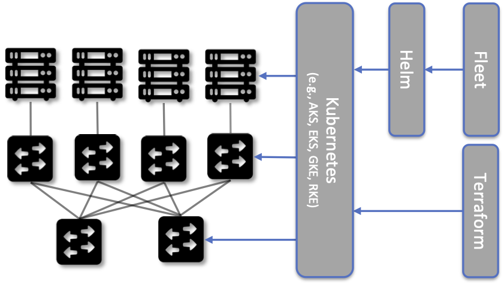
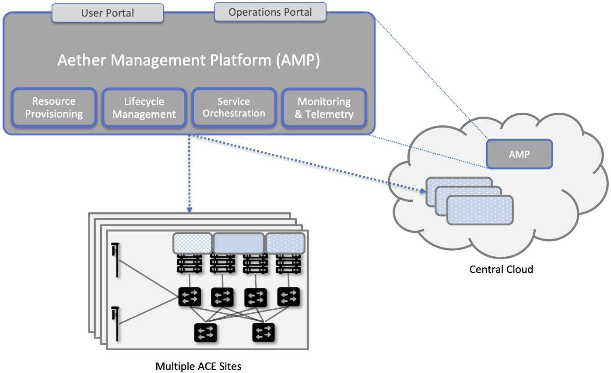

Chapter 6:  Managed Cloud Service
=================================

.. This is where we show how all the pieces can be pulled together
   into an end-to-end solution that can be deployed in enterprises as
   a managed service. Introduce an example use case or two (e.g.,
   IoT), so we have application(s) that take advantage of the system
   we just built.

   This is where we talk about the “managed service” aspect of the
   system, which can’t be ignored because managing a 5G network is a
   big part of the democratization story. Avoid pivoting to a full
   operationalization discussion, which we tell elsewhere (which we
   likely introduce as part of Background material in Chapter 1).
   Probably focus on "user/operator" perspective (rather than
   "under the covers" perspective).

This chapter identifies all the subsystems that go into building and
operationalizing a cloud capable of running an assortment of
cloud-native services. We use Aether to illustrate specific design
choices, and so we start by describing why an enterprise might install
a system like Aether in the first place.

Edge clouds like Aether are an important component of a trend called
Industry 4.0: A combination of intelligent devices, robust wireless
connectivity, and cloud-based AI/ML capabilities, all working together
to enable software-based optimization and innovation.

Connecting industry assets to the cloud has the potential to bring
transformative benefits. This starts with collecting deep operational
data on assets and infrastructure, from sensors, video feeds and
telemetry from machinery. It also includes applying ML to this data to
gain insights, identify patterns and predict outcomes (e.g., when a
device is likely to fail), followed by automating industrial processes
so as to minimize human intervention and enable remote operations
(e.g., power optimization, idling quiescent machinery). In general,
the goal is to create an IT foundation for continually improving
industrial operations through software.

As for why we refer to Aether as a PaaS for such use cases, the answer
is somewhat subjective. Generally, a PaaS offers more than virtualized
compute and storage (that is what IaaS does), and includes additional
layers of "middleware" to enable application developers to deploy
their applications without dealing with all the intricacies of
managing the underlying infrastructure. In the case of Aether, the
platform includes support for 5G connectivity, including an API that
edge apps can use to customize that connectivity to better meet their
objectives.  This does not preclude also loading an ML-platform or an
IoT-platform onto Aether, further enhancing the application support it
provides.

6.1 Edge Cloud
--------------

The edge cloud, which in Aether is called ACE (Aether Connected Edge),
is a Kubernetes-based cluster. It is a platform that consists of one
or more server racks interconnected by a leaf-spine switching fabric,
with an SDN control plane (denoted SD-Fabric) managing the fabric.

.. _fig-ace:
.. figure:: figures/ops/Slide3.png
   :width: 400px
   :align: center

   Aether Connected Edge (ACE) = The cloud platform (Kubernetes and
   SD-Fabric) plus the 5G connectivity service (RAN and User Plane of
   Mobile Core). Dotted lines (e.g., between SD-RAN and the individual
   base stations, and between the Network OS and the individual
   switches) represent control relationships (e.g., SD-RAN controls
   the small cells and SD-Fabric controls the switches).
	
As shown in :numref:`Figure %s <fig-ace>`, ACE hosts two additional
microservice-based subsystems on top of this platform; they
collectively implement *5G-Connectivity-as-a-Service*. The first
subsystem, SD-RAN, is an SDN-based implementation of the 5G Radio
Access Network (RAN). It controls the small cell base stations
deployed throughout the enterprise. The second subsystem, SD-Core, is
an SDN-based implementation of the User Plane half of the Mobile
Core. It is responsible for forwarding traffic between the RAN and the
Internet. The SD-Core Control Plane (CP) runs off-site, and is not
shown in :numref:`Figure %s <fig-ace>`. Both subsystems (as well as
the SD-Fabric), are deployed as a set of microservices, but details
about the functionality implemented by these containers is otherwise
not critical to this discussion. For our purposes, they are
representative of any cloud native workload. (The interested reader is
referred to our companion 5G and SDN books for more information about
the internal working of SD-RAN, SD-Core, and SD-Fabric.)

.. _reading_5g:
.. admonition:: Further Reading 

   `5G Mobile Networks: A Systems Approach 
   <https://5G.systemsapproach.org>`__
   
   `Software-Defined Networks: A Systems Approach 
   <https://sdn.systemsapproach.org>`__

Once ACE is running in this configuration, it is ready to host a
collection of edge applications (not shown in :numref:`Figure %s
<fig-ace>`), and as with any Kubernetes-based cluster, a Helm chart
would be the preferred way to deploy such applications. What’s unique
to ACE is the ability to connect such applications to mobile devices
throughout the enterprise using the 5G Connectivity Service
implemented by SD-RAN and SD-Core. This service is offered as a
managed service, with enterprise system administrators able to use a
programmatic API (and associated GUI portal) to control that service;
that is, authorize devices, restrict access, set QoS profiles for
different devices and applications, and so on. How to provide such a
runtime control interface is the topic of Chapter 5.

6.2 Hybrid Cloud
-----------------

While it is possible to instantiate a single ACE cluster in just one
site, Aether is designed to support multiple ACE deployments, all of
which are managed from the central cloud. Such a hybrid cloud scenario
is depicted in :numref:`Figure %s <fig-aether>`, which shows two
subsystems running in the central cloud: (1) one or more instances of
the Mobile Core Control Plane (CP), and (2) the Aether Management
Platform (AMP).

Each SD-Core CP controls one or more SD-Core UPs, as specified by
3GPP, the standards organization responsible for 5G. Exactly how CP
instances (running centrally) are paired with UP instances (running at
the edges) is a runtime decision, and depends on the degree of
isolation the enterprise sites require. AMP is responsible for
managing all the centralized and edge subsystems (as introduced in the
next section).

.. _fig-aether:

   Aether runs in a hybrid cloud configuration, with Control Plane of
   Mobile Core and the Aether Management Platform (AMP) running in the
   Central Cloud.

There is an important aspect of this hybrid cloud that is not obvious
from :numref:`Figure %s <fig-aether>`, which is that the “hybrid
cloud” we keep referring to is best described as a set of Kubernetes
clusters, rather than a set of physical clusters.  This is because,
while each ACE site usually corresponds to a physical cluster built
out of bare-metal components, each of the SD-Core CP subsystems shown
in :numref:`Figure %s <fig-aether>` is actually deployed in a logical
Kubernetes cluster on a commodity cloud. The same is true for
AMP. Aether’s centralized components are able to run in Google Cloud
Platform, Microsoft Azure, and Amazon’s AWS. They also run as an
emulated cluster implemented by a system like KIND—Kubernetes in
Docker—making it possible for developers to run these components on
their laptop.

To be clear, Kubernetes adopts generic terminology, such as “cluster”
and “service”, and gives it very specific meaning. In
Kubernetes-speak, a *Cluster* is a logical domain in which Kubernetes
manages a set of containers. This “Kubernetes cluster” may have a
one-to-one relationship with an underlying physical cluster, but it is
also possible that a Kubernetes cluster is instantiated inside a
datacenter, as one of potentially thousands of such logical
clusters. And as we'll see in a later chapter, even an ACE edge site
sometimes hosts more than one Kubernetes cluster, for example, one
running production services and one used for trial deployments of new
services.

6.3 Stakeholders
----------------

With the understanding that our target environment is a collection of
Kubernetes clusters—some running on bare-metal hardware at edge sites
and some running in central datacenters—there is an orthogonal issue
of how decision-making responsibility for those clusters is shared
among multiple stakeholders. Identifying the relevant stakeholders is
an important prerequisite for establishing a cloud service, and while
the example we use may not be suitable for all situations, it does
illustrate the design implications.

For Aether, we care about two primary stakeholders: (1) the *cloud
operators* that manage the hybrid cloud as a whole, and (2) the
*enterprise users* that decide on a per-site basis how to take
advantage of the local cloud resources (e.g., what edge applications
to run and how to slice connectivity resources among those apps).  We
sometimes call the latter "enterprise admins" to distinguish them from
"end-users" that might want to manage their own personal devices.

The architecture is multi-tenant in the sense that it authenticates
and isolates these stakeholders, allowing each to access only those
objects they are responsible for. This makes the approach agnostic as
to whether all the edge sites belong to a single organization (with
that organization also responsible for operating the cloud), or
alternatively, there being a separate organization that offers a
managed service to a set of distinct enterprises (each of which spans
one or more sites). The architecture can also accommodate end-users,
and provide them with a "self-service" portal, but we do not elaborate
on that possibility.

There is a potential third stakeholder of note—third-party service
providers—which points to the larger issue of how we deploy and manage
additional edge applications. To keep the discussion tangible—but
remain in the open source arena—we use OpenVINO as an illustrative
example. OpenVINO is a framework for deploying AI inference models,
which is interesting in the context of Aether because one of its use
cases is processing video streams, for example to detect and count
people that enter the field of view of a collection of 5G-connected
cameras.

.. _reading_openvino:
.. admonition:: Further Reading 

   `OpenVINO Toolkit <https://docs.openvino.ai>`__.

On the one hand, OpenVINO is just like the 5G-related components we're
already incorporating into our hybrid cloud: it is deployed as a
Kubernetes-based set of microservices. On the other hand, we have to
ask who is responsible for managing it, which is to say “who
operationalizes OpenVINO?”

One answer is that the operators that already manage the rest of the
hybrid cloud also manage the collection of edge applications added to
cloud. Enterprise admins might activate and control those apps on a
site-by-site basis, but it is the operations team already responsible
for provisioning, deploying, and managing those edge clouds that also
does the same for OpenVINO and any other applications that run on that
cloud. Generalizing from one edge service (5G connectivity) to
arbitrarily many edge services has implications for control and
management (which we’ll discuss throughout the book), but
fundamentally nothing changes in the course we’ve already set out for
ourselves.

Having the cloud operator *curate and manage* a set of edge services
is the assumption Aether makes (and we assume throughout this book),
but for completeness, we take note of two other possibilities.  One is
that we extend our hybrid architecture to support independent
third-party service providers. Each new edge service acquires its own
isolated Kubernetes cluster from the edge cloud, and then the
3rd-party provider subsumes all responsibility for managing the
service running in that cluster. From the perspective of the cloud
operator, though, the task just became significantly more difficult
because the architecture would need to support Kubernetes as a managed
service, which is sometimes called *Container-as-a-Service (CaaS)*.\ [#]_
Creating isolated Kubernetes clusters on-demand is a step further than
we take things in this book, in part because there is a second
possible answer that seems more likely to happen.

.. [#] This is not strictly an either-or-situation. It is possible to
       curate an edge service, provision cluster resources for it, but
       then delegate operational responsibility to a 3rd-party service
       provider.

This second approach is that a multi-cloud emerges *within*
enterprises. Today, most people equate multi-cloud with services
running across multiple hyperscalers, but with edge clouds becoming
more common, it seems likely that enterprises invite multiple edge
clouds onto their local premises, some hyperscaler-provided and some
not, each hosting a different subset of edge services. For example,
one edge cloud might host a 5G connectivity service and another might
host an AI platform like OpenVINO. The question this raises is whether
the cloud management technologies described in this book still apply
in that setting. The answer is yes: the fundamental management
challenges remain the same, the main difference is knowing when to
directly control a Kubernetes cluster (as we do in this book) and when
to do so indirectly through the manager for that cluster. There are
also new problems that are unique to multi-clouds (e.g., inter-cloud
service discovery), but they are beyond the scope of this book.

6.4 Control and Management
--------------------------

We are now ready to describe the architecture of the Aether Management
Platform (AMP), which as shown in :numref:`Figure %s <fig-amp>`,
manages both the distributed set of ACE clusters and the other control
clusters running in the central cloud. And illustrating the recursive
nature of the management challenge, AMP is also responsible for
managing AMP!

AMP includes one or more portals targeted at different stakeholders,
with :numref:`Figure %s <fig-amp>` showing the two examples we focus
on in this book: a User Portal intended for enterprise admins who
need to manage services delivered to a local site, and an Operations
Portal intended for the ops team responsible for keeping Aether
up-to-date and running smoothly. Again, other stakeholders (classes of
users) are possible, but this distinction does represent a natural
division between those that *use* cloud services and those that
*operate* cloud services.

.. _fig-amp:
.. figure:: figures/ops/Slide5.png
   :width: 600px
   :align: center

   The four subsystems that comprise AMP: Resource Provisioning,
   Lifecycle Management, Runtime Control, and Monitoring & Logging.
   
We do not focus on these portals, which can be thought of as offering
a particular class of users a subset of AMP functionality, but we
instead describe the aggregate functionality supported by AMP, which
is organized around four subsystems:

* Resource Provisioning: Responsible for initializing and configuring
  resources (e.g., servers, switches) that add, replace, or upgrade
  capacity for Aether.
  
* Lifecycle Management: Responsible for continuous integration and
  deployment of software functionality available on Aether.
  
* Runtime Control: Responsible for the ongoing configuration and
  control of the services (e.g., connectivity) provided by Aether.
  
* Monitoring & Logging: Responsible for collecting, archiving,
  evaluating, and analyzing operational data generated by Aether
  components.
  
Internally, each of these subsystems is implemented as a highly
available cloud service, running as a collection of microservices. The
design is cloud-agnostic, so AMP can be deployed in a public cloud
(e.g., Google Cloud, AWS, Azure), an operator-owned Telco cloud, (e.g,
AT&T’s AIC), or an enterprise-owned private cloud. For a pilot
deployment of Aether, AMP runs in the Google Cloud.

The rest of this section introduces these four subsystems, with the
chapters that follow filling in more detail about each. 
   

2.4.1 Resource Provisioning
~~~~~~~~~~~~~~~~~~~~~~~~~~~

Resource Provisioning configures and bootstraps resources (both
physical and virtual), bringing them up to a state so Lifecycle
Management can take over and manage the software running on those
resources. It roughly corresponds to Day 0 operations, and includes
both the hands-on aspect of installing and physically connecting
hardware, and the inventory-tracking required to manage physical
assets.

.. _fig-provision:
.. figure:: figures/ops/Slide6.png
   :width: 500px
   :align: center

   High-level overview of Resource Provisioning.

:numref:`Figure %s <fig-provision>` gives a high-level overview. As a
consequence of the operations team physically connecting resources to
the cloud and recording attributes for those resources in an Inventory
Repo, a Zero-Touch Provisioning system (a) generates a set of
configuration artifacts that are stored in a Config Repo and used
during Lifecycle Management, and (b) initializes the newly deployed
resources so they are in a state that Lifecycle Management is able to
control.

Recall from Chapter 1 that we called out the "Aether platform" as
distinct from the cloud-native workloads that are hosted on the
platform. This is relevant here because Resource Provisioning has to
get this platform up-and-running before Lifecycle Management can do
its job. But in another example of circular dependencies, Lifecycle
Management then plays a role in keeping the underlying platform
up-to-date.
	
Clearly, the “Install & Inventory” step requires human involvement,
and some amount of hands-on resource-prep is necessary, but the goal
is to minimize the operator configuration steps (and associated
expertise) and maximize the automation carried out by the Zero-Touch
Provisioning system. Also realize that :numref:`Figure %s
<fig-provision>` is biased towards provisioning a physical cluster,
such as the edge sites in Aether. For a hybrid cloud that also
includes one or more virtual clusters running in central datacenters,
it is necessary to provision those virtual resources as well. Chapter
3 describes provisioning from this broader perspective, considering
both physical and virtual resources.

2.4.2 Lifecycle Management
~~~~~~~~~~~~~~~~~~~~~~~~~~

Lifecycle Management is the process of integrating debugged, extended,
and refactored components (often microservices) into a set of
artifacts (e.g., Docker containers and Helm charts), and subsequently
deploying those artifacts to the operational cloud. It includes a
comprehensive testing regime, and typically, a procedure by which
developers inspect and comment on each others’ code.

.. _fig-lifecycle:

   High-level overview of Lifecycle Management. 

:numref:`Figure %s <fig-lifecycle>` gives a high-level overview, where
it is common to split the integration and deployment phases, the
latter of which combines the integration artifacts from the first
phase with the configuration artifacts generated by Resource
Provisioning described in the previous subsection. The figure does not
show any human intervention (after development), which implies any
patches checked into the code repo trigger integration, and any new
integration artifacts trigger deployment. This is commonly referred to
as Continuous Integration / Continuous Deployment (CI/CD), although in
practice, operator discretion and other factors are also taken into
account before deployment actually happens.

One of the key responsibilities of Lifecycle Management is version
control, which includes evaluating dependencies, but also the
possibility that it will sometimes be necessary to both roll out new
versions of software and rollback to old versions, as well as operate
with multiple versions deployed simultaneously. Managing all the
configuration state needed to successfully deploy the right version of
each component in the system is the central challenge, which we
address in Chapter 4.

2.4.3 Runtime Control
~~~~~~~~~~~~~~~~~~~~~

Once deployed and running, Runtime Control provides a programmatic API
that can be used by various stakeholders to manage whatever abstract
service(s) the system offers (e.g., 5G connectivity in the case of
Aether). As shown in :numref:`Figure %s <fig-control>`, Runtime
Control partially addresses the “management silo” issue raised in
Chapter 1, so users do not need to know that connectivity potentially
spans four different components, or how to control/configure each of
them individually. (Or, as in the case of the Mobile Core, that
SD-Core is distributed across two clouds, with the CP sub-part
responsible for controlling the UP sub-part.) In the case of the
connectivity service, for example, users only care about being able to
authorize devices and set QoS parameters on an end-to-end basis.

.. _fig-control:
.. figure:: figures/ops/Slide8.png
   :width: 400px
   :align: center

   Example use case that requires ongoing runtime control.

Note that :numref:`Figure %s <fig-control>` focuses on
Connectivity-as-a-Service, but the same idea applies to all services
the cloud offers to end users. Thus, we can generalize the figure so
Runtime Control mediates access to any of the underlying microservices
(or collections of microservices) the cloud designer wishes to make
publicly accessible, including the rest of AMP! In effect, Runtime
Control implements an abstraction layer, codified with a programmatic
API.

Given this mediation role, Runtime Control provides mechanisms to
model (represent) the abstract services to be offered to users; store
any configuration and control state associated with those models;
apply that state to the underlying components, ensuring they remain in
sync with the operator’s intentions; and authorize the set API calls
users try to invoke on each service. These details are spelled out in
Chapter 5.

	
2.4.4 Monitoring and Logging
~~~~~~~~~~~~~~~~~~~~~~~~~~~~

In addition to controlling service functionality, a running system has
to be continuously monitored so that operators can diagnose and
respond to failures, tune performance, do root cause analysis, perform
security audits, and understand when it is necessary to provision
additional capacity. This requires mechanisms to observe system
behavior, collect and archive the resulting data, analyze the data and
trigger various actions in response, and visualize the data in human
consumable dashboards (similar to the example shown in :numref:`Figure
%s <fig-monitor>`).

.. _fig-monitor:
.. figure:: figures/ops/Slide9.png
   :width: 500px
   :align: center

   Example Aether dashboard, showing the health of one of the
   subsystems (SD-Core).

In broad terms, it is common to think of this aspect of cloud
management as having two parts: a monitoring component that collects
quantitative metrics (e.g., load averages, transmission rates,
ops-per-second) and a logging component that collects diagnostic
messages (i.e., text strings explaining various event). Both include a
timestamp, so it is possible to link quantitative analysis with
qualitative explanations in support of diagnostics and analytics.

2.4.5 Summary
~~~~~~~~~~~~~

This overview of the management architecture could lead one to
conclude that these four subsystems were architected, in a rigorous,
top-down fashion, to be completely independent.  But that is not
the case. It is more accurate to say that the system evolved bottom
up, solving the next immediate problem one at a time, all the while
creating a large ecosystem of open source components that can be used
in different combinations. What we are presenting in this book is a
retrospective description of an end result, organized into four
subsystems to help make sense of it all.

There are, in practice, many opportunities for interactions among the
four components, and in some cases, there are overlapping concerns
that lead to considerable debate. This is what makes operationalizing
a cloud a thorny problem. For example, it's difficult to draw a crisp
line between where resource provisioning ends and lifecycle management
begins. One could view provisioning as "Step 0" of lifecycle
management. As an other example, the runtime control and monitoring
subsystems are often combined in a single user interface, giving
operators a way to both read (monitor) and write (control) various
parameters of a running system. Connecting those two subsystems is how
we build closed loop control.

A third example is even more nebulous. Lifecycle management usually
takes responsibility for *configuring* each component, while runtime
control takes responsibility for *controlling* each component. Where
you draw the line between configuration and control is somewhat
arbitrary. Do configuration changes only happen when you first boot a
component, or can you change the configuration of a running system,
and if you do, how does that differ from changing a control parameter?
The difference is usually related to frequency-of-change (which is in
turn related to how disruptive to existing traffic/workload the change
is), but at the end of the day, it doesn't matter what you call it, as
long as the mechanisms you use meet all of your requirements.

Of course, an operational system doesn't tolerate such ambiguities
very well. Each aspect of management has to be supported in a
well-defined, efficient and repeatable way. That's why we include a
description of a concrete realization of each of the four subsystems,
reflecting one particular set of design choices. We call out the
opportunities to make different engineering decisions, along with the
design rationale behind our choices, as we add more details in the
chapters that follow.

