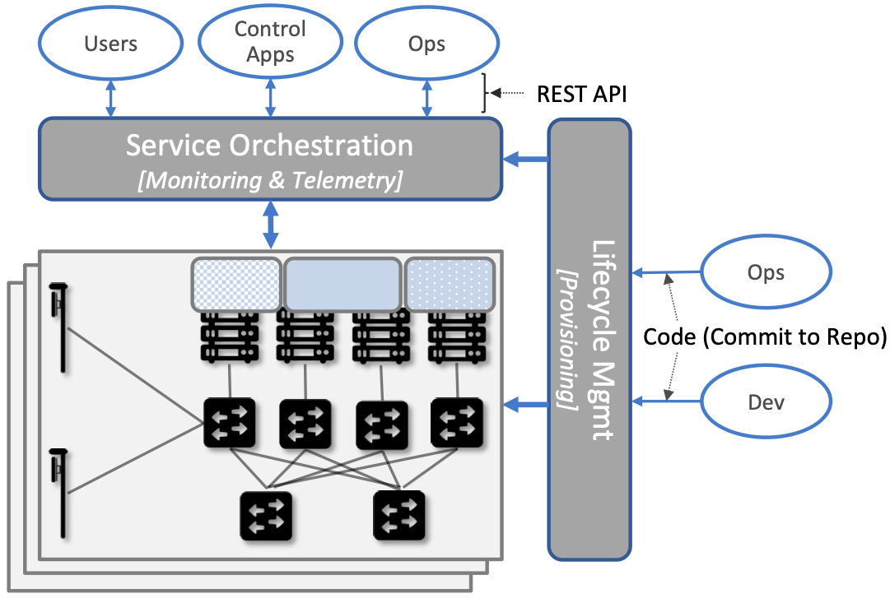

Chapter 6:  Managed Cloud Service
=================================

.. This is where we show how all the pieces can be pulled together
   into an end-to-end solution that can be deployed in enterprises as
   a managed service. Introduce an example use case or two (e.g.,
   IoT), so we have application(s) that take advantage of the system
   we just built.

   This is where we talk about the “managed service” aspect of the
   system, which can’t be ignored because managing a 5G network is a
   big part of the democratization story. Avoid pivoting to a full
   operationalization discussion, which we tell elsewhere (which we
   likely introduce as part of Background material in Chapter 1).
   Probably focus on "user/operator" perspective (rather than
   "under the covers" perspective).

   Current language presumes no specific knowledge of the components
   (e.g., SD-Core or SD-RAN). We will need to be adjusted to account
   for the previous chapters.

   Probably need to talk generally about ther configurations and
   deployments. Maybe in a concluding section.

This chapter describes how to assemble all the pieces described in the
previous chapters to provide 5G connectivity as a managed cloud
service. Such a service, which is sometimes called *Private 5G*, is
gaining traction as a way to deliver 5G to enterprises in support of
Industry 4.0.

The first step is to implement all the components using cloud native
building blocks. We start by introducing those building blocks in
Section 6.1. The second step is to introduce yet another component—a
*Management Platform*—that is responsible for operationalizing
5G-as-a-Service. The rest of this chapter describes how to build a
Management Platform using open source tools.

Before getting into the details, it is important to remember that
mobile cell service (both voice and broadband) has been offered as a
Telco service for 40 years. Treating it as a managed cloud service is
a significant departure from that history, especially when it comes to
how the resulting connectivity is operated and managed. In particular,
the cloud-based Management Platform described in this chapter is
significantly different than the legacy OSS/BSS mechanisms that have
traditionally been the centerpiece of the Telco management story. The
terminology is also different, but that only matters if you are trying
to map Telco terminology onto cloud terminology. This is a topic we
take up in a companinion book, and focus instead on a from-scratch
cloud-based design.

.. _reading_ops:
.. admonition:: Further Reading 
   
   `Edge Cloud Operations:: A Systems Approach 
   <https://ops.systemsapproach.org>`__.  June 2022.

.. Maybe should note that you'll see "Mgmt/Orchestrator" in
   Core-specific and RAN-specific architecture diagrams. We're
   describing one "up a level" that spans both (and the fabric that
   connects them.

6.1 Building Blocks
-------------------

The implementation strategy starts with commodity hardware and open
source software. These building blocks will be familar to anyone that
has built a cloud native application, but they deserve to be
explicitly named in a discussion of mobile celluar networks, which
have historically been built using closed proprietary hardware
devices.

The hardware building blocks include bare-metal servers and switches,
which might include ARM or x86 processor chips and Tomahawk or Tofino
switching chips, respectively. A physical cloud cluster is then
constructed with the hardware building blocks arranged as shown in
:numref:`Figure %s <fig-hw>`: one or more racks of servers connected
by a leaf-spine switching fabric. We show the servers above the
switching fabric to emphasize that software running on the servers
controls the switches (as we will see in the next section).

.. _fig-hw:
.. figure:: figures/ops/Slide4.png
   :width: 400px
   :align: center

   Example building block components used to construct an edge cloud,
   including commodity servers and switches, interconnected by a
   leaf-spine switching fabric.

The software building blocks start with the following open source
components:

1. Docker containers package software functionality.

2. Kubernetes instantiates and interconnects a set of containers.

3. Helm specifies how collections of related containers are
   interconnected to build microservice-based applications.

4. Terraform provisions a set of one or more Kubernetes clusters,
   configuring them to host microservice applications.

Docker is a container runtime that leverages OS isolation APIs to
instantiate and run multiple containers, each of which is an instance
defined by a Docker image. Docker images are most frequently built
using a Dockerfile, which uses a layering approach that allows sharing
and building customized images on top of base images. A final image
for a particular task incorporates all dependencies required by the
software that is to run in the container, resulting in a container
image that is portable across servers, depending only on the kernel
and Docker runtime. We also assume one or more image artifact
repositories of Docker containers that we will want to deploy in our
cloud, of which `<https://hub.docker.com/>`__ is the best known
example.

.. _reading_docker:
.. admonition:: Further Reading

   `Docker Tutorial
   <https://www.docker.com/101-tutorial>`__.

Kubernetes is a container management system. It provides a
programmatic interface for scaling container instances up and down,
allocating server resources to them, setting up virtual networks to
interconnect those instances, and opening service ports that external
clients can use to access those instances. Behind the scenes,
Kubernetes monitors the liveness of those containers, and
automatically restarts any that have failed. In other words, if you
instruct Kubernetes to spin up three instances of microservice X,
Kubernetes will do its best to keep three instances of the container
that implements X running at all times.

.. _reading_k8s:
.. admonition:: Further Reading

   `Kubernetes Tutorial
   <https://kubernetes.io/docs/tutorials/kubernetes-basics/>`__.

Helm is a configuration manager that runs on top of Kubernetes. It
issues calls against the Kubernetes API according to an
operator-provided specification, known as a *Helm Chart*. It is now
common practice for cloud applications built from a set of
microservices to publish a Helm chart that defines how the application
is to be deployed on a Kubernetes cluster. See
`<https://artifacthub.io/>`__ for a collection of publicly available
Helm Charts.

.. _reading_helm:
.. admonition:: Further Reading

   `Helm Tutorial
   <https://helm.sh/docs/intro/quickstart/>`__.

Terraform is an infrastructure manager that sets up one or more
Kubernetes clusters, provisioning them so they are ready to host a
collection of Helm-specified applications. It does this using an
approach known as *Infrastructure-as-Code*, which documents exactly
how the infrastructure is to be configured in a declarative format
that can be (a) checked into a repo, and (b) executed just like any
piece of software.  Terraform assumes an underlying provisioning API,
with Microsoft's Azure Kubernetes Service (AKS), AWS's Amazon Elastic
Kubernetes Service (EKS), Google's Google Kubernetes Engine (GKE) and
Rancher's Rancher Kubernetes Engine (RKE) being widely available
examples.

6.2 Example Deployment
----------------------

Using these building blocks, it is possible to construct a wide range
of deployment scenarios for a managed 5G service. For illustrative
purposes, we use a particular deployment based on the Aether edge
cloud introduced in Chapter 2. Aether is an operational edge cloud
that has been deployed to multiple sites, and most importantly,
includes an API that edge apps can use to customize 5G connectivity to
better meet their objectives.

6.2.1 Edge Cloud
~~~~~~~~~~~~~~~~

An Aether edge deployment, called ACE (Aether Connected Edge), is a
Kubernetes-based cluster. It consists of one or more server racks
interconnected by a leaf-spine switching fabric, with an SDN control
plane (denoted SD-Fabric) managing the fabric. We briefly saw
SD-Fabric in Chapter 5 as an implementation option for the Mobile
Core's User Plane Function (UPF), but for an in-depth description of
SD-Fabric, we refer you to a companion book.

.. _reading_sdn:
.. admonition:: Further Reading 
   
   `Software-Defined Networks: A Systems Approach 
   <https://sdn.systemsapproach.org>`__.  November 2021.

.. _fig-ace:
.. figure:: figures/ops/Slide5.png
   :width: 350px
   :align: center

   Aether Connected Edge (ACE) = The cloud platform (Kubernetes and
   SD-Fabric) plus the 5G connectivity service (RAN and User Plane of
   Mobile Core). Dotted lines (e.g., between SD-RAN and the individual
   base stations, and between the Network OS and the individual
   switches) represent control relationships (e.g., SD-RAN controls
   the small cells and SD-Fabric controls the switches).
	
As shown in :numref:`Figure %s <fig-ace>`, ACE hosts two additional
microservice-based subsystems on top of this platform; they
collectively implement *5G-as-a-Service*. The first subsystem, SD-RAN,
is the SDN-based implementation of the Radio Access Network described
in Chapter 4. It controls the small cell base stations deployed
throughout the enterprise. The second subsystem, SD-Core, is an
SDN-based implementation of the User Plane half of the Mobile Core
described in Chapter 5. It is responsible for forwarding traffic
between the RAN and the Internet. The SD-Core Control Plane (CP) runs
off-site, and is not shown in :numref:`Figure %s <fig-ace>`. Both
subsystems (as well as the SD-Fabric), are deployed as a set of
microservices, just as any other cloud native workload.

Once an edge cluster is running in this configuration, it is ready to
host a collection of cloud-native edge applications (not shown in
:numref:`Figure %s <fig-ace>`). What’s unique to our example
configuration is its ability to connect such applications to mobile
devices throughout the enterprise using the 5G Connectivity Service
implemented by SD-RAN and SD-Core. This service is offered as a
managed service, with enterprise system administrators able to use a
programmatic API (and associated GUI portal) to control that service;
that is, authorize devices, restrict access, set QoS profiles for
different devices and applications, and so on.

6.2.2 Hybrid Cloud
~~~~~~~~~~~~~~~~~~

While it is possible to instantiate a single ACE cluster in just one
site, Aether is designed to support multiple edge deployments, all of
which are managed from the central cloud. Such a hybrid cloud scenario
is depicted in :numref:`Figure %s <fig-aether>`, which shows two
subsystems running in the central cloud: (1) one or more instances of
the Mobile Core Control Plane (CP), and (2) the Aether Management
Platform (AMP).

Each SD-Core CP controls one or more SD-Core UPFs.  Exactly how CP
instances (running centrally) are paired with UPF instances (running
at the edges) is a runtime decision, and depends on the degree of
isolation the enterprise sites require. AMP is responsible for
managing all the centralized and edge subsystems (as introduced in the
next section).

.. Discussion variable number of Cores, vs one-per-metro as suggested
   earlier. This is for isolation purposes (and potentially, customization).
   

.. _fig-aether:
.. figure:: figures/ops/Slide6.png
   :width: 600px
   :align: center

   Aether runs in a hybrid cloud configuration, with Control Plane of
   Mobile Core and the Aether Management Platform (AMP) running in the
   Central Cloud.

There is an important aspect of this hybrid cloud that is not obvious
from :numref:`Figure %s <fig-aether>`, which is that the “hybrid
cloud” we keep referring to is best described as a set of Kubernetes
clusters, rather than a set of physical clusters.  This is because,
while each ACE site usually corresponds to a physical cluster built
out of bare-metal components, each of the SD-Core CP subsystems shown
in :numref:`Figure %s <fig-aether>` is actually deployed in a logical
Kubernetes cluster on a commodity cloud. The same is true for
AMP. Aether’s centralized components are able to run in Google Cloud
Platform, Microsoft Azure, and Amazon’s AWS. They also run as an
emulated cluster implemented by a system like KIND—Kubernetes in
Docker—making it possible for developers to run these components on
their laptop.

Finally, note that while we describe each ACE cluster as starting with
bare-metal (with AMP responsible for booting the hardware into a state
that is ready to host Kubernetes workloads), an alternative is to
start with an edge deployment that is managed by one of the
hyperscalers as an extension of their core datacenters. Google’s
Anthos, Microsoft’s Azure Arc, and Amazon’s ECS-Anywhere are examples
of such edge cloud products.

6.2.3 Stakeholders
~~~~~~~~~~~~~~~~~~
   
With the understanding that our target environment is a collection of
Kubernetes clusters—some running on bare-metal hardware at edge sites
and some running in central datacenters—there is an orthogonal issue
of how decision-making responsibility for those clusters is shared
among multiple stakeholders. Identifying the relevant stakeholders is
an important prerequisite for establishing a cloud service, and while
the example we use may not be suitable for all situations, it does
illustrate the design implications.

For Aether, we care about two primary stakeholders: (1) the *cloud
operators* who manage the hybrid cloud as a whole, and (2) the
*enterprise users* who decide on a per-site basis how to take
advantage of the local cloud resources (e.g., what edge applications
to run and how to slice connectivity resources among those apps).  We
sometimes call the latter "enterprise admins" to distinguish them from
"end-users" that might want to manage their own personal devices.

Aether is multi-tenant in the sense that it authenticates and isolates
these stakeholders, allowing each to access only those objects they
are responsible for. This makes the approach agnostic as to whether
all the edge sites belong to a single organization (with that
organization also responsible for operating the cloud), or
alternatively, there being a separate organization that offers a
managed service to a set of distinct enterprises (each of which spans
one or more sites).

There is a third stakeholder of note—third-party service
providers—which points to the larger issue of how we deploy and manage
the edge applications that take advantage of 5G-as-a-Service. The
approach Aether adopts is to expect service providers to make their
applications available either as source code (which works for open
source or in-house apps), or as standard cloud native artifacts (e.g.,
Docker images and Helm charts). The alternative would be for edge
service providers to share operational responsibility for the edge
cloud with the cloud operator, which is possible if the infrastructure
running at the edge is either multi-tenant or a multi-cloud.

6.3 Management Platform 
------------------------

Once deployed, 5G-as-a-Service has to be operationalized; this is the
essence of offering 5G as a *managed service*.  In general this
responsibility falls to the Management Platform, which in Aether
corresponds to the centralized AMP component shown in :numref:`Figure
%s <fig-amp>`, manages both the distributed set of ACE clusters and
the other control clusters running in the central cloud. The following
uses AMP to illustrate how to deliver 5G-as-a-Service. For more
details about all the subsystems involved in operationalizing an edge
cloud, we refer you to the companion book mentioned in the
introduction to this chapter.

6.3.1 Overview
~~~~~~~~~~~~~~

AMP includes one or more portals targeted at different stakeholders,
with :numref:`Figure %s <fig-amp>` showing the two examples discussed
in the previous section: a User Portal intended for enterprise admins
who need to manage services delivered to a local site, and an
Operations Portal intended for the ops team responsible for keeping
Aether up-to-date and running smoothly. Again, other stakeholders
(classes of users) are possible, but this distinction does represent a
natural division between those that *use* cloud services and those
that *operate* cloud services.

.. _fig-amp:
.. figure:: figures/ops/Slide7.png
   :width: 600px
   :align: center

   The four subsystems that comprise AMP: Resource Provisioning,
   Lifecycle Management, Runtime Control, and Monitoring & Logging.
   
We do not focus on these portals, which can be thought of as offering
a particular class of users a subset of AMP functionality, but we
instead describe the aggregate functionality supported by AMP, which
is organized around the four subsystems shown in :numref:`Figure %s
<fig-amp>`.

* **Resource Provisioning** is responsible for initializing resources
  (e.g., servers, switches) that add, replace, or upgrade capacity.
  It configures and bootstraps both physical and virtual resources,
  bringing them up to a state so Lifecycle Management can take over
  and manage the software running on those resources.

* **Lifecycle Management** is responsible for continuous integration
  and deployment of the software components that collectively
  implement 5G-as-a-Service. It adopts the GitOps practice of
  *Configuration-as-Code*, using Helm Charts and Terraform Templates
  to specify how functionality is to be deployed and configured.

* **Runtime Control** provides a means to manage services once they
  are operational. It defines an API that hides the implementation
  details of the underlying microservices (which in the case of Aether
  spans four Kubernetes applications and multiple clouds) is userd
  to manage the provided services (5G connectivity in the case of Aether).

* **Monitoring & Telemetry** is responsible for collecting, archiving,
  evaluating, and analyzing operational data generated by the
  underlying components. It makes it possible to diagnose and respond
  to failures, tune performance, do root cause analysis, perform
  security audits, and understand when it is necessary to provision
  additional capacity.
    
Although an edge cloud management platform includes all four
subsystems, it is simpler to collapase them into a the two dimensional
schematic shown in :numref:`Figure %s <fig-2D>`. This representation
serves our purposes because (1) where one draws a line between where
resource provisioning lifecycle management is somewhat subjective,
with provisioning serving as "Step 0" of lifecycle management; and (2)
runtime control and monitoring are often combined in a single user
interface, providing a way to both monitor (read) and control (write)
various parameters of a running system, which in turn makes it
possible to support closed loop control.

.. _fig-2D:

   Simplified representation of the management platform, highlighting
   the off-line and on-line aspects of cloud management.

As shown in in :numref:`Figure %s <fig-2D>`, Lifecycle Management
(including Resource Provisioning) runs off-line, adjacent to the
hybrid cloud. It is how Operators and Developers specify changes to
the system by checking code (including configuration specs) into a
repo, which in turn triggers an upgrade of the running system. Runtime
Control (including Monitoring and Telemetry) runs on-line, layered on
top of the hybrid cloud being managed. It defines an API that Users
and Operators use to read and write parameters of the running system.

6.3.2 Lifecycle Management
~~~~~~~~~~~~~~~~~~~~~~~~~~~~~~~~~~~

:numref:`Figure %s <fig-cicd>` gives an overview of the
pipeline/toolchain that make up the two halves of Lifecycle
Management—Continuous Integration (CI) and Continuous Deployment
(CD). The key thing to focus on is the Image and Config Repos in the
middle. They represent the “interface” between the two halves: CI
produces Docker Images and Helm Charts, storing them in the respective
Repositories, while CD consumes Docker Images and Helm Charts, pulling
them from the respective Repositories.

.. _fig-cicd:
.. figure:: figures/ops/Slide8.png
   :width: 600px
   :align: center

   Overview of the CI/CD pipeline.

The Config Repo also contains declarative specifications of the
infrastructure artifacts produced by Resource Provisioning,
specifically, the Terraform templates. These files are input to Lifecycle
Management, which implies that Terraform gets invoked as part of CI/CD
whenever these files change. In other words, CI/CD keeps both the
software-related components in the underlying cloud platform and the
microservice workloads that run on top of that platform up to date.

.. sidebar:: Continuous Delivery vs Deployment

    *You will also hear CD refer to "Continuous Delivery" instead of
    "Continuous Deployment", but we are interested in the complete
    end-to-end process, so CD will always imply the latter in this
    book. But keep in mind that "continuous" does not necessarily mean
    "instantaneous"; there can be a variety of gating functions
    injected into the CI/CD pipeline to control when and how upgrades
    get rolled out. The important point is that all the stages in the pipeline
    are automated.*

    *So what exactly does "Continuous Delivery" mean? Arguably, it's
    redundant when coupled with "Continuous Integration" since the
    set of artifacts being produced by the CI half of the pipeline
    (e.g., Docker images) is precisely what's being delivered. There
    is no "next step" unless you also deploy those artifacts. It's
    hair-splitting, but some would argue CI is limited to testing new
    code and Continuous Delivery corresponds to the final "publish
    the artifact" step. For our purposes, we lump "publish the
    artifact" into the CI half of the pipeline.*

There are three takeaways from this overview. The first is that by
having well-defined artifacts passed between CI and CD (and between
Resource Provisioning and CD), all three subsystems are loosely
coupled, and able to perform their respective tasks independently. The
second is that all authoritative state needed to successfully build
and deploy the system is contained within the pipeline, specifically,
as declarative specifications in the Config Repo. This is the
cornerstone of *Configuration-as-Code* (also sometimes called
*GitOps*), the cloud native approach to CI/CD that we are describing
in this book. The third is that there is an opportunity for operators
to apply discretion to the pipeline, as denoted by the *"Deployment
Gate"* in the Figure, controlling what features get deployed
when. This topic is discussed in the sidebar, as well as at other
points throughout this chapter.

The third repository shown in :numref:`Figure %s <fig-cicd>` is
the Code Repo (on the far left). Although not explicitly indicated,
developers are continually checking new features and bug fixes into
this repo, which then triggers the CI/CD pipeline. A set of tests and
code reviews are run against these check-ins, with the output of those
tests/reviews reported back to developers, who modify their patch sets
accordingly. (These develop-and-test feedback loops are implied by the
dotted lines in :numref:`Figure %s <fig-cicd>`.)

The far right of :numref:`Figure %s <fig-cicd>` shows the set of
deployment targets, with *Staging* and *Production* called out as two
illustrative examples. The idea is that a new version of the software
is deployed first to a set of Staging clusters, where it is subjected
to realistic workloads for a period of time, and then rolled out to
the Production clusters once the Staging deployments give us
confidence that the upgrade is reliable.

This is a simplified depiction of what happens in practice. In
general, there can be more than two distinct versions of the cloud
software deployed at any given time. One reason this happens is that
upgrades are typically rolled out incrementally (e.g., a few sites at
a time over an extended period of time), meaning that even the
production system plays a role in “staging” new releases. For example,
a new version might first be deployed on 10% of the production
machines, and once it is deemed reliable, is then rolled out to the
next 25%, and so on. The exact rollout strategy is a controllable
parameter, as described in more detail in Section 4.4.

Finally, two of the CI stages shown in :numref:`Figure %s
<fig-cicd>` identify a *Testing* component. One is a set of
component-level tests that are run against each patch set checked into
the Code Repo. These tests gate integration; fully merging a patch
into the Code Repo requires first passing this preliminary round of
tests. Once merged, the pipeline runs a build across all the
components, and a second round of testing happens on a *Quality
Assurance (QA)* cluster. Passing these tests gate deployment, but note
that testing also happens in the Staging clusters, as part of the CD
end of the pipeline. 

6.3.3 Runtime Control
~~~~~~~~~~~~~~~~~~~~~

*Runtime Control* is responsible for managing services once
they are up-and-running, which in our case means providing a
programmatic API that can be used by various stakeholders to manage
the 5G connectivity service.  As shown in :numref:`Figure %s
<fig-control>`, Runtime Control hides the implementation details of 5G
connectivity, which spans four different components and multiple
clouds, providing a coherent service interface that for users that
care about being able to authorize devices and set QoS parameters on
an end-to-end basis.

.. _fig-control:
.. figure:: figures/ops/Slide9.png
   :width: 400px
   :align: center

   Example use case that requires ongoing runtime control.

Finally, * Monitoring & Telemetry* is responsible for collecting,
archiving, evaluating, and analyzing operational data generated by the
underlying components. It makes it possible for operators to diagnose
and respond to failures, tune performance, do root cause analysis,
perform security audits, and understand when it is necessary to
provision additional capacity. This requires mechanisms to observe
system behavior, collect and archive the resulting data, analyze the
data and trigger various actions in response, and visualize the data
in human consumable dashboards (similar to the example shown in
:numref:`Figure %s <fig-monitor>`).

.. _fig-monitor:
.. figure:: figures/ops/Slide10.png
   :width: 500px
   :align: center

   Example Aether dashboard, showing the health of one of the
   subsystems (SD-Core).

In broad terms, it is common to think of this aspect of cloud
management as having two parts: a monitoring component that collects
quantitative metrics (e.g., load averages, transmission rates,
ops-per-second) and a logging component that collects diagnostic
messages (i.e., text strings explaining various event). Both include a
timestamp, so it is possible to link quantitative analysis with
qualitative explanations in support of diagnostics and analytics.
   
Given this mediation role, Runtime Control provides mechanisms to
model (represent) the abstract services to be offered to users; store
any configuration and control state associated with those models;
apply that state to the underlying components, ensuring they remain in
sync with the operator’s intentions; and authorize the set API calls
users try to invoke on each service. (from above)

.. Currently just lifted from OPs book. Need to reconcile with Runtime
   Contol subsection above, and refocus to be on-point.  For example,
   YANG might be an unnecessary implementation detail: we care about
   the API and not the models (although the API cares about resources).

6.4 Connectivity API
--------------------------

.. Currently cut-and-pasted from OPs book. We probably want to
   introduce more narrative/intuition, and reduce the use of bulleted
   lists.

   
The visible aspect of a 5G service is the programmatic interface it
provides to users, giving them the ability to control and customized
the underlying connectivity service. This API is implemented by the
Runtime Control subsystem outlined in the previous section, but what
we really care about is the interface itself. Using Aether as a
concrete example, this section describes such an API.

Like many cloud services, the API for 5G-as-a-Service is RESTful.
This means it supports REST's GET, POST, PATCH, and DELETE operations
on a set of resources (objects):

* GET: Retrieve an object.
* POST: Create an object.
* PUT,  PATCH: Modify an existing object.
* DELETE: Delete an object.

Each object, in turn, is typically defined by a data model.  In Aether
this model is specified in YANG, but rather than dive into the
particulars of YANG, this section describes the models informally by
simply identifying and describing the relevant fields.

Every object contains an `id` field that is used to uniquely identify
the object.  Some objects contain references to other objects. For
example, many objects contain references to the `Enterprise` object,
which allows them to be associated with a particular enterprise. That
is, references are constructed using the `id` field of the referenced
object. 

In addition to the `id` field, several other fields are also common to
all models. These include:

* `description`: A human-readable description, used to store additional context about the object.
* `display-name`: A human-readable name that is shown in the GUI.

As these fields are common to all models, we omit them from the
per-model descriptions that follow. Note that we use upper case to
denote a model (e.g., `Enterprise`) and lower case to denote a field
within a model (e.g., `enterprise`).

6.4.1 Enterprises
~~~~~~~~~~~~~~~~~

Aether is deployed in enterprises, and so needs to define
representative set of organizational abstractions. These include
`Enterprise`, which forms the root of a customer-specific
hierarchy. The `Enterprise` model is referenced by many other objects,
and allows those objects to be scoped to a particular Enterprise for
ownership and role-based access control purposes. `Enterprise`
contains the following fields:

* `connectivity-service`: A list of backend subsystems that implement
  connectivity for this enterprise. Corresponds to an API endpoint to
  the SD-Core, SD-Fabric, and SD-RAN.

`Enterprises` are further divided into `Sites`. A site is a
point-of-presence for an `Enterprise` and may be either physical or
logical (i.e. a single geographic location could contain several
logical sites). `Site` contains the following fields:

* `enterprise`: A link to the `Enterprise` that owns this site.
* `imsi-definition`: A description of how IMSIs are constructed for
  this site. Contains the following sub-fields:

   * `mcc`: Mobile country code.
   * `mnc`: Mobile network code.
   * `enterprise`: A numeric enterprise id.
   * `format`: A mask that allows the above three fields to be
     embedded into an IMSI. For example `CCCNNNEEESSSSSS` will
     construct IMSIs using a 3-digit MCC, 3-digit MNC, 3-digit ENT,
     and a 6-digit subscriber.

The `imsi-definition` is specific to the mobile cellular network, and
corresponds to the unique identifier burned into every SIM card.

6.4.2 Slice Abstraction
~~~~~~~~~~~~~~~~~~~~~~~

Aether models 5G connectivity as a `Slice`, which represents an
isolated communication channel (and associated QoS parameters) that
connects a set of devices (modeled as a `Device-Group`) to a set of
applications (each of which is modeled as an `Application`).  For
example, an enterprise might configure one slice to carry IoT traffic
and another slice to carry video traffic. The `Slice` model has the
following fields:

* `device-group`: A list of `Device-Group` objects that can participate in this `Slice`. Each
  entry in the list contains both the reference to the `Device-Group` as well as an `enable`
  field which may be used to temporarily remove access to the group.
* `application`: A list of `Application` objects that are either allowed or denied for this
  `Slice`. Each entry in the list contains both a reference to the `Application` as well as an
  `allow` field which can be set to `true` to allow the application or `false` to deny it.
* `template`: Reference to the `Template` that was used to initialize this `Slice`.
* `upf`: Reference to the User Plane Function (`UPF`) that should be used to process packets
  for this `Slice`. It's permitted for multiple `Slices` to share a single `UPF`.
* `enterprise`: Reference to the `Enterprise` that owns this `Slice`.
* `site`: Reference to the `Site` where this `Slice` is deployed.
* `sst`, `sd`: 3GPP-defined slice identifiers assigned by the operations team.
* `mbr.uplink`, `mbr.downlink`, `mbr.uplink-burst-size`,
  `mbr.downlink-burst-size`.  Maximum bit-rate and burst sizes for
  this slice.
  
The rate-related parameters are initialized using a selected
`template`, as described below. Also note that this example
illustrates how modeling can be used to enforce invariants, in this
case, that the `Site` of the `UPF` and `Device-Group` must match the
`Site` of the `Slice`. That is, the physical devices that connect to a
slice and the UPF that implements the core segment of the slice must
be constrained to a single physical location.

At one end of a Slice is a `Device-Group`, which identifies a set of
devices that are allowed to use the Slice to connect to various
applications. The `Device-Group` model contains the following fields:

* `imsis`: A list of IMSI ranges. Each range has the following
  fields:

   * `name`: Name of the range. Used as a key.
   * `imsi-range-from`: First subscriber in the range.
   * `imsi-range-to`: Last subscriber in the range. Can be omitted if
     the range only contains one IMSI.
* `ip-domain`: Reference to an `IP-Domain` object that describes the
  IP and DNS settings for UEs within this group.
* `site`: Reference to the site where this `Device-Group` may be
  used. Indirectly identifies the `Enterprise` as `Site` contains a
  reference to `Enterprise`.
* `mbr.uplink`, `mbr.downlink`: Maximum bit-rate for the device group.
* `traffic-class`: The traffic class to be used for devices in this group.  

At the other end of a Slice is a list of `Application` objects, which
specifies the endpoints for the program devices talk to. The
`Application` model contains the following fields:

* `address`: The DNS name or IP address of the endpoint.
* `endpoint`: A list of endpoints. Each has the following
  fields:

   * `name`: Name of the endpoint. Used as a key.
   * `port-start`: Starting port number.
   * `port-end`: Ending port number.
   * `protocol`:  Protocol (`TCP|UDP`) for the endpoint.
   * `mbr.uplink`, `mbr.downlink`: Maximum bitrate for devices communicating with this
     application:
   * `traffice-class`: Traffic class for devices communicating with this application.

* `enterprise`: Link to an `Enterprise` object that owns this application. May be left empty
  to indicate a global application that may be used by multiple
  enterprises.

Note that Aether's *Slice* abstraction is similar to 3GPP's
specification of a "slice".  The `Slice` model definition includes a
combination of 3GPP-specified identifiers (e.g., `sst` and `sd`), and
details about the underlying implementation (e.g., `upf` denotes the
UPF implementation for the Core's user plane). The `Slice` model also
includes fields related to RAN slicing, with the Runtime Control
subsystem responsible for stitching together end-to-end connectivity
across the RAN, Core, and Fabric.

6.4.3 QoS Profiles
~~~~~~~~~~~~~~~~~~

Associated with each Slice is a QoS-related profile that governs how
traffic that slice carries is to be treated. This starts with a
`Template` model, which defines the valid (accepted) connectivity
settings. Aether Operations is responsible for defining these (the
features they offer must be supported by the backend subsystems), with
enterprises selecting the template they want applied to any instances
of the connectivity service they create (e.g., via a drop-down
menu). That is, templates are used to initialize `Slice` objects. The
`Template` model has the following fields:

* `sst`, `sd`: Slice identifiers, as specified by 3GPP.
* `mbr.uplink`, `mbr.downlink`: Maximum uplink and downlink bandwidth.
* `mbr.uplink-burst-size`, `mbr.downlink-burst-size`: Maximum burst size.
* `traffic-class`: Link to a `Traffic-Class` object that describes the
  type of traffic.

You will see that the `Device-Group` an `Application` models include
similar fields. The idea is that QoS parameters are established for
the slice as a whole (based on the selected `Template`) and then
individual devices and applications connected to that slice can define
their own, more-restrictive QoS parameters on an instance-by-instance
basis.
  
The `Traffic-Class` model, in turn, specifies the classes of traffic,
and includes the following fields:

* `arp`: Allocation and retention priority.
* `qci`: QoS class identifier.
* `pelr`: Packet error loss rate.
* `pdb`: Packet delay budget.

6.4.4 Other Models
~~~~~~~~~~~~~~~~~~

The above description references other models, which we do not fully
described here. They include `AP-List`, which specifies a list of
access points (radios); `IP-Domain`, which specifies IP and DNS
settings; and `UPF`, which specifies the User Plane Function (the data
plane element of the SD-Core) that should forward packets on behalf of
this particular instance of the connectivity service. The `UPF` model
is necessary because Aether supports two different implementations:
one runs as a microservice on a server and the other runs as a P4
program loaded into the switching fabric, as described in Chapter 5.
