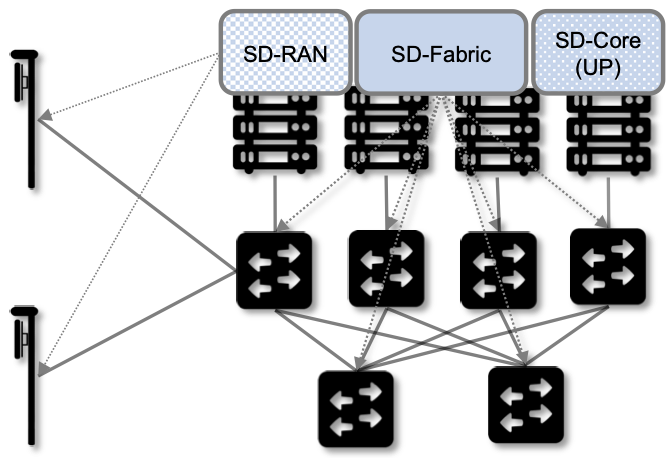
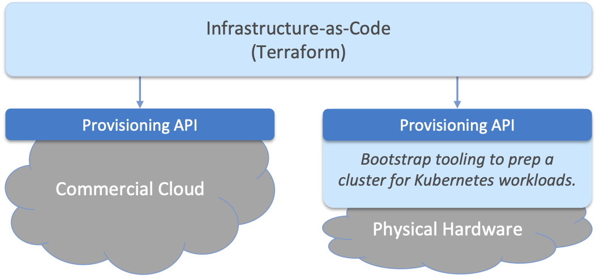
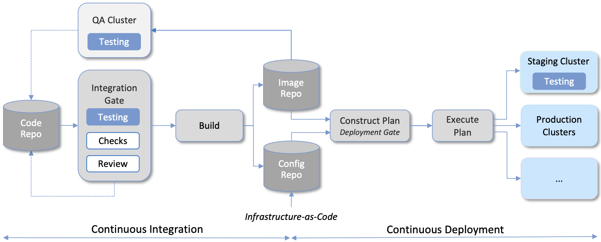
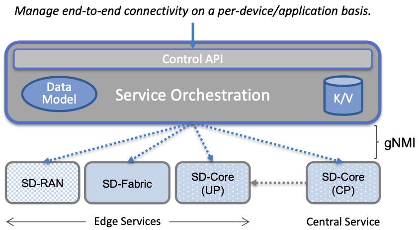

Chapter 6:  Managed Cloud Service
=================================

.. This is where we show how all the pieces can be pulled together
   into an end-to-end solution that can be deployed in enterprises as
   a managed service. 

   Current version is one edit pass beyond a cut-and-paste from the
   OPs book. Still needs a thorough edit to even out the level of
   detail and highlight the essential ideas.

   Would probably benefit from a use case (e.g., IoT) to help tie it
   all together.
   
This chapter describes how to assemble all the pieces described in the
previous chapters to provide 5G connectivity as a managed cloud
service. Such a service might be deployed in enterprises, for example,
in support of collection of operational data, video, robots, IoT
devices, and so on—a set of use cases sometimes referred to as
Industry 4.0.

The first step is to implement all the components using cloud native
building blocks. We start by introducing those building blocks in
Section 6.1. The second step is to introduce yet another component—a
*Cloud Management Platform*—that is responsible for operationalizing
5G-as-a-Service. The rest of the sections describe how to build such a
management system using open source tools.

Before getting into the details, it is important to remember that
mobile cellular service (both voice and broadband) has been offered as a
Telco service for 40 years. Treating it as a managed cloud service is
a significant departure from that history, most notably in how the
connectivity it provides is operated and managed. As a consequence,
the Cloud Management Platform described in this chapter is
significantly different from the legacy OSS/BSS mechanisms that have
traditionally been the centerpiece of the Telco management
machinery. The terminology is also different, but that only matters if
you are trying to map Telco terminology onto cloud terminology (which
we are not). We take up the "terminology mapping problem" in a
companion book, and here focus instead on a from-scratch cloud-based
design.

.. _reading_ops:
.. admonition:: Further Reading 
   
    L. Peterson, A. Bavier, S. Baker, Z. Williams, and B. Davie. `Edge
    Cloud Operations: A Systems Approach
    <https://ops.systemsapproach.org/lifecycle.html>`__. June 2022.

.. Should note (here or in Ch4 & 5) that you'll see "Mgmt/Orchestrator"
   in Core-specific and RAN-specific architecture diagrams. We're
   describing one "up a level" that spans both (and the fabric that
   connects them)

6.1 Building Blocks
-------------------

The implementation strategy starts with commodity hardware and open
source software. These building blocks will be familiar to anyone who
has built a cloud native application, but they deserve to be
explicitly named in a discussion of mobile cellular networks, which
have historically been built using closed, proprietary hardware
devices.

The hardware building blocks include bare-metal servers and switches,
which might include ARM or x86 processor chips and Tomahawk or Tofino
switching chips, respectively. A physical cloud cluster is then
constructed with the hardware building blocks arranged as shown in
:numref:`Figure %s <fig-hw>`: one or more racks of servers connected
by a leaf-spine switching fabric. We show the servers above the
switching fabric to emphasize that software running on the servers
controls the switches (as we will see in the next section).

.. _fig-hw:
.. figure:: figures/ops/Slide4.png
   :width: 400px
   :align: center

   Example building block components used to construct an edge cloud,
   including commodity servers and switches, interconnected by a
   leaf-spine switching fabric.

The software building blocks start with the following open source
components:

1. Docker containers package software functionality.

2. Kubernetes instantiates and interconnects a set of containers.

3. Helm specifies how collections of related containers are
   interconnected to build microservice-based applications.

4. Fleet specifies how a set of Kubernetes applications are to be
   deployed on the available infrastructure.

5. Terraform provisions a set of one or more Kubernetes clusters,
   configuring them to host microservice applications.

Docker is a container runtime that leverages OS isolation APIs to
instantiate and run multiple containers, each of which is an instance
defined by a Docker image. Docker images are most frequently built
using a Dockerfile, which uses a layering approach that allows sharing
and building customized images on top of base images. A final image
for a particular task incorporates all dependencies required by the
software that is to run in the container, resulting in a container
image that is portable across servers, depending only on the kernel
and Docker runtime. We also assume one or more image artifact
repositories of Docker containers that we will want to deploy in our
cloud, of which `<https://hub.docker.com/>`__ is the best known
example.

.. _reading_docker:
.. admonition:: Further Reading

   `Docker Tutorial
   <https://www.docker.com/101-tutorial>`__.

Kubernetes is a container management system. It provides a
programmatic interface for scaling container instances up and down,
allocating server resources to them, setting up virtual networks to
interconnect those instances, and opening service ports that external
clients can use to access those instances. Behind the scenes,
Kubernetes monitors the liveness of those containers, and
automatically restarts any that have failed. In other words, if you
instruct Kubernetes to spin up three instances of microservice X,
Kubernetes will do its best to keep three instances of the container
that implements X running at all times.

.. _reading_k8s:
.. admonition:: Further Reading

   `Kubernetes Tutorial
   <https://kubernetes.io/docs/tutorials/kubernetes-basics/>`__.

Helm is a configuration manager that runs on top of Kubernetes. It
issues calls against the Kubernetes API according to a
developer-provided specification, known as a *Helm Chart*. It is now
common practice for cloud applications built from a set of
microservices to publish a Helm chart that defines how the application
is to be deployed on a Kubernetes cluster. See
`<https://artifacthub.io/>`__ for a collection of publicly available
Helm Charts.

.. _reading_helm:
.. admonition:: Further Reading

   `Helm Tutorial
   <https://helm.sh/docs/intro/quickstart/>`__.

Fleet an application deployment manager that is responsible for
installing a *Bundle* of Helm Charts on one or more target
clusters. If we were trying to deploy a single Chart on just one
Kubernetes cluster, then Helm would be sufficient. The value of Fleet
is that it scales up that process, helping us manage the deployment of
multiple charts across multiple clusters. Moreover, Fleet does this
using an approach known as *Configuration-as-Code*, where the desired
configuration is checked into a repo, just like any other
software. Checking a new or updated updated Bundle into a repo
triggers the deployment of the corresponding applications.

.. _reading_fleet:
.. admonition:: Further Reading

   `Fleet: GitOps at Scale
   <https://fleet.rancher.io/>`__.

Terraform is an infrastructure manager that, in our scenario,
provisions one or more Kubernetes clusters, preparing them to host a
collection of Helm-specified applications. It does this using an
approach known as *Infrastructure-as-Code*, which documents exactly
how the infrastructure is to be configured in a declarative format
that can be (a) checked into a repo, (b) version-controlled, and (c)
executed just like any piece of software.  Terraform assumes an
underlying provisioning API, with Microsoft's Azure Kubernetes Service
(AKS), AWS's Amazon Elastic Kubernetes Service (EKS), Google's Google
Kubernetes Engine (GKE) and Rancher's Rancher Kubernetes Engine (RKE)
being widely available examples.

.. _reading_terraform:
.. admonition:: Further Reading

   `Terraform Tutorials
   <https://learn.hashicorp.com/terraform>`__.

The inter-related roles of Helm, Fleet, and Terraform can be
confusing, in part because there is overlap in what each tries to do.
One distinction is that Helm Charts are typically specified by
*developers* as a way of specifying how an application is constructed
from a set of microservices, whereas Fleet and Terraform give
*operators* an opportunity to specify details of their particular
deployment scenarios. A second distinction is that Helm and Fleet help
manage the *applications running on* one or more Kubernetes clusters,
whereas Terraform is used to set up and configure the *underlying
Kubernetes clusters* in the first place. Again, there is overlap in
the capabilities of these respective tools, but these two distinctions
characterize how they are used in Aether. The more general takeaway is
that cloud management has to accommodate both developers and
operators, and to clearly delineate between applications and
platforms.

6.2 Example Deployment
----------------------

Using these building blocks, it is possible to construct a wide range
of deployment scenarios for a managed 5G service. For illustrative
purposes, we use a particular deployment based on the Aether edge
cloud introduced in Chapter 2. Aether is an operational edge cloud
that has been deployed to multiple sites, and most importantly for our
purposes, includes an API that edge apps can use to customize 5G
connectivity to better meet their objectives.

6.2.1 Edge Cloud
~~~~~~~~~~~~~~~~

An Aether edge deployment, called ACE (Aether Connected Edge), is a
Kubernetes-based cluster. It consists of one or more server racks
interconnected by a leaf-spine switching fabric, with an SDN control
plane (denoted SD-Fabric) managing the fabric. We briefly saw
SD-Fabric in Chapter 5 as an implementation option for the Mobile
Core's User Plane Function (UPF), but for an in-depth description of
SD-Fabric, we refer you to a companion book.

.. _reading_sdn:
.. admonition:: Further Reading 
   
   L. Peterson, C. Cascone, B. O'Connor, T. Vachuska, and B. Davie.
   `Software-Defined Networks: A Systems Approach 
   <https://sdn.systemsapproach.org>`__.  November 2021.

.. _fig-ace:

   Aether Connected Edge (ACE) = The cloud platform (Kubernetes and
   SD-Fabric) plus the 5G connectivity service (RAN and User Plane of
   Mobile Core). Dotted lines (e.g., between SD-RAN and the individual
   base stations, and between the Network OS and the individual
   switches) represent control relationships (e.g., SD-RAN controls
   the small cells and SD-Fabric controls the switches).
	
As shown in :numref:`Figure %s <fig-ace>`, ACE hosts two additional
microservice-based subsystems on top of this platform; they
collectively implement *5G-as-a-Service*. The first subsystem, SD-RAN,
is the SDN-based implementation of the Radio Access Network described
in Chapter 4. It controls the small cell base stations deployed
throughout the enterprise. The second subsystem, SD-Core, is an
SDN-based implementation of the User Plane half of the Mobile Core
described in Chapter 5. It is responsible for forwarding traffic
between the RAN and the Internet. The SD-Core Control Plane (CP) runs
off-site, and is not shown in :numref:`Figure %s <fig-ace>`. Both
subsystems (as well as the SD-Fabric), are deployed as a set of
microservices, just as any other cloud native workload.

Once an edge cluster is running in this configuration, it is ready to
host a collection of cloud-native edge applications (not shown in
:numref:`Figure %s <fig-ace>`). What’s unique to our example
configuration is its ability to connect such applications to mobile
devices throughout the enterprise using the 5G Connectivity Service
implemented by SD-RAN and SD-Core, without the resulting network
traffic ever leaving the enterprise; a scenario known as *local
breakout*.  Moreover, this service is offered as a managed service,
with enterprise system administrators able to use a programmatic API
(and associated GUI portal) to control that service; that is,
authorize devices, restrict access, set QoS profiles for different
devices and applications, and so on.

6.2.2 Hybrid Cloud
~~~~~~~~~~~~~~~~~~

While it is possible to instantiate a single ACE cluster in just one
site, Aether is designed to support multiple edge deployments, all of
which are managed from the central cloud. Such a hybrid cloud scenario
is depicted in :numref:`Figure %s <fig-aether>`, which shows two
subsystems running in the central cloud: (1) one or more
instantiations of the Mobile Core Control Plane (CP), and (2) the
Aether Management Platform (AMP).

Each SD-Core CP controls one or more SD-Core UPFs.  Exactly how CP
instances (running centrally) are paired with UPF instances (running
at the edges) is a runtime decision, and depends on the degree of
isolation the enterprise sites require. AMP is Aether's realization of
a Cloud Management Platform; it is responsible for managing all the
centralized and edge subsystems (as introduced in the next section).

.. Discuss variable number of Cores, vs one-per-metro as suggested
   earlier. This is for isolation purposes (and potentially, customization).
   

.. _fig-aether:
.. figure:: figures/ops/Slide6.png
   :width: 600px
   :align: center

   Aether runs in a hybrid cloud configuration, with Control Plane of
   Mobile Core and the Aether Management Platform (AMP) running in the
   Central Cloud.

There is an important aspect of this hybrid cloud that is not obvious
from :numref:`Figure %s <fig-aether>`, which is that the “hybrid
cloud” we keep referring to is best described as a set of Kubernetes
clusters, rather than a set of physical clusters.  This is because,
while each ACE site usually corresponds to a physical cluster built
out of bare-metal components, each of the SD-Core CP subsystems shown
in :numref:`Figure %s <fig-aether>` is actually deployed in a logical
Kubernetes cluster on a commodity cloud. The same is true for
AMP. Aether’s centralized components are able to run in Google Cloud
Platform, Microsoft Azure, and Amazon’s AWS. They also run as an
emulated cluster implemented by a system like KIND (Kubernetes in
Docker), making it possible for developers to run these components on
their laptops.

.. sidebar:: Near-Edge vs Far-Edge

   *We use enterprises as the exemplar edge deployment in this book,
   without prescribing a role for traditional MNOs. When traditional
   MNOs are involved, it is not uncommon for them to make a
   distinction between the "near-edge" and the "far-edge", where the
   far-edge corresponds to the enterprise and the near-edge
   corresponds to their traditional aggregation points (or Central
   Offices), as described in Section 1.2. In such a scenario, it is
   typically the case that the RU and DU are located at the far-edge
   (on-prem), while the CU—along with both the Control and User Planes
   of the Mobile Core—run in the near-edge. Such a configuration does
   not support local breakout, since all traffic must travel to the
   near-edge before being routed to the edge app (which might be
   running back in the enterprise).*

   *In contrast, the deployment described in this Chapter has
   everything except the Mobile Core Control Plane (CP) running
   on-prem. Moreover, because there is no traditional MNO involved,
   there is no near-edge to speak of, with the Core CP instead running
   in a central cloud. For example, this section describes a
   deployment with SD-Core (CP) running in the Google Cloud. It is the
   case, however, that the SD-Core (CP) can optionally run on-prem if
   a fully local configuration is preferred. Where each component runs
   is a configuration option.*

6.2.3 Stakeholders
~~~~~~~~~~~~~~~~~~

With the understanding that our target environment is a collection of
Kubernetes clusters—some running on bare-metal hardware at edge sites
and some running in central datacenters—there is an orthogonal issue
of how decision-making responsibility for those clusters is shared
among multiple stakeholders. Identifying the relevant stakeholders is
an important prerequisite for establishing a cloud service, and while
the example we use may not be suitable for all situations, it does
illustrate the design implications.

For Aether, we care about two primary stakeholders: (1) the *cloud
operators* who manage the hybrid cloud as a whole, and (2) the
*enterprise users* who decide on a per-site basis how to take
advantage of the local cloud resources (e.g., what edge applications
to run and how to slice connectivity resources among those apps).  We
sometimes call the latter "enterprise admins" to distinguish them from
"end-users" who might want to manage their own personal devices.

Aether is multi-tenant in the sense that it authenticates and isolates
these stakeholders, allowing each to access only those objects they
are responsible for. This makes the approach agnostic as to whether
all the edge sites belong to a single organization (with that
organization also responsible for operating the cloud), or
alternatively, there being a separate organization that offers a
managed service to a set of distinct enterprises (each of which spans
one or more sites).

There is a third stakeholder of note—third-party service
providers—which points to the larger issue of how we deploy and manage
the edge applications that take advantage of 5G-as-a-Service. The
approach Aether adopts is to expect service providers to make their
applications available either as source code (which works for open
source or in-house apps), or as standard cloud native artifacts (e.g.,
Docker images and Helm charts). Either format can be fed into the
Lifecycle Management pipeline described in Section 6.3.2. The
alternative would be for edge service providers to share operational
responsibility for the edge cloud with the cloud operator, which is
possible if the infrastructure running at the edge is either
multi-tenant or a multi-cloud.

6.2.4 Alternative Configurations
~~~~~~~~~~~~~~~~~~~~~~~~~~~~~~~~

The deployment just described is Aether in its full glory. Simpler
configurations are also possible, which makes sense in less demanding
scenarios. Examples include:

* Small edge clusters can be built with only a single switch (or two
  switches for resiliency), with or without SDN-based control. In the
  limit, an Aether edge can run on a single server.

* It is possible to substitute legacy small cells for an SD-RAN
  solution that includes a near RT-RIC and associated xApps.

* It is possible co-locate both AMP and the SD-Core CP on the edge
  cluster, resulting in a complete Aether deployment that is
  self-contained in a single site.

These are all straightforward configuration options. A very different
approach is to start with an edge cluster that is managed by one of
the hyperscalers, rather than have Aether provision Kubernetes on
bare-metal.  Google’s Anthos, Microsoft’s Azure Arc, and Amazon’s
ECS-Anywhere are examples of such edge cloud products.  In such a
scenario, AMP still manages the SD-Core and SD-RAN applications
running on top of Kubernetes, but not the underlying platform (which
may or may not include an SDN-based switching fabric).

Another variable in how 5G can be deployed at the edge is related to
who owns the underlying cloud infrastructure. Instead of a cloud
provider, an enterprise, or a traditional MNO owning the hardware,
there are situations where a third-party, often called a *neutral
host*, owns an operates the hardware (along with the real estate it
sits in), and then rents access to these resources to multiple 5G
providers. Each mobile service provider is then a tenant of of that
shared infrastructure.

This kind of arrangement has existed for years, albeit with
conventional RAN devices, but shifting to a cloud-based design makes
it possible for neutral hosts to lease access to *virtualized* edge
resources to their tenants. In principle, the only difference between
this scenario and today's multi-tenant clouds is that such providers
would offer edge resources—located in cell towers, apartment
buildings, and dense urban centers—instead of datacenter resources.
The business arrangements would also have to be different from Private
5G, but the technical design outlined in this book still applies.

6.3 Cloud Management Platform 
------------------------------

Operationalizing the hardware and software components described in the
previous two sections is the essence of what it means to offer 5G as a
*managed service*.  This responsibility falls to the Cloud Management
Platform, which in Aether corresponds to the centralized AMP component
shown in :numref:`Figure %s <fig-aether>`. AMP manages both the
distributed set of ACE clusters and one or more SD-Core CP clusters
running in the central cloud.

The following uses AMP to illustrate how to deliver 5G-as-a-Service,
but the approach generalizes because AMP is based on widely-used open
source tools. For more details about all the subsystems involved in
operationalizing an edge cloud, we refer you to the companion book
mentioned in the introduction to this chapter.

.. _fig-amp:
.. figure:: figures/ops/Slide7.png
   :width: 600px
   :align: center

   The four subsystems that comprise AMP: Resource Provisioning,
   Lifecycle Management, Service Orchestrator, and Monitoring & Telemetry.

At a high level, AMP is organized around the four subsystems shown in
:numref:`Figure %s <fig-amp>`:

* **Resource Provisioning** is responsible for initializing resources
  (e.g., servers, switches) that add, replace, or upgrade capacity.
  It configures and bootstraps both physical and virtual resources,
  bringing them up to a state so Lifecycle Management can take over
  and manage the software running on those resources.

* **Lifecycle Management** is responsible for continuous integration
  and deployment of the software components that collectively
  implement 5G-as-a-Service. It adopts the GitOps practice of
  *Configuration-as-Code*, using Helm Charts, Terraform Templates, and
  Fleet Bundles to specify how functionality is to be deployed and
  configured.

* **Service Orchestration** provides a means to manage services once
  they are operational. It defines an API that hides the
  implementation details of the underlying microservices, and is used
  to manage the provided 5G connectivity service.

* **Monitoring & Telemetry** is responsible for collecting, archiving,
  evaluating, and analyzing operational data generated by the
  underlying components. It makes it possible to diagnose and respond
  to failures, tune performance, do root cause analysis, perform
  security audits, and understand when it is necessary to provision
  additional capacity.
    
AMP implements all four subsystems, but an alternative perspective
that characterizes the management platform as having *online* and
*offline* components is also instructive. Such a two dimensional
schematic is shown in :numref:`Figure %s <fig-2D>`.  Lifecycle
Management (coupled with Resource Provisioning) runs offline, sitting
adjacent to the hybrid cloud. Operators and Developers provision and
change the system by checking code (including configuration specs)
into a repo, which in turn triggers an upgrade of the running system.
Service Orchestration (coupled with Monitoring and Telemetry) runs
online, layered on top of the hybrid cloud being managed. It defines
an API that can be used to read and write parameters of the running
system, which serves as a foundation for building closed-loop control.

.. _fig-2D:
.. figure:: figures/ops/Slide11.png 
   :width: 500px 
   :align: center 

   Alternative representation of the management platform, highlighting
   the offline and online aspects of cloud management.

The offline and online aspects of cloud management are related in the
sense that the offline component is also responsible for
lifecycle-managing the online component. This is because the latter is
deployed as a collection of Kubernetes applications, just like SD-Core
and SD-RAN. Version management is a key aspect of this relationship
since the runtime API to the 5G connectivity service has to stay in
sync with the underlying implementation of the constituent
subsystems. How Aether realizes version control is described in more
detail in the companion Edge Cloud Operations book.

6.3.1 Resource Provisioning
~~~~~~~~~~~~~~~~~~~~~~~~~~~~~~~~

Resource Provisioning is the process of bringing virtual and physical
resources online. For physical resources, it has both a hands-on
component (racking and connecting devices) and a bootstrap component
(configuring how the resources boot into a "ready" state). When
utilizing virtual resources (e.g., VMs instantiated on a commercial
cloud) the "rack and connect" step is carried out by a sequence of API
calls rather than a hands-on technician.

Because we want to automate the sequence of calls needed to activate
virtual infrastructure, we adopt an approach known as
*Infrastructure-as-Code*. This is where Terraform comes into play.
The general idea is to document, in a declarative format that can be
"executed", exactly what our infrastructure is to look like. The code
defines how the infrastructure is to be configured.

When a cloud is built from a combination of virtual and physical
resources, as is the case for a hybrid cloud like Aether, we need a
seamless way to accommodate both. To this end, our approach is to
first overlay a *logical structure* on top of hardware resources,
making them roughly equivalent to the virtual resources we get from a
commercial cloud provider. This results in a hybrid scenario similar
to the one shown in :numref:`Figure %s <fig-infra>`.  One way to think
about this is that the task of booting hardware into the "ready" state
involves installing and configuring several subsystems that
collectively form the cloud platform. It is this platform that
Terraform interacts with, indirectly, through a cloud provisioning API.

.. _fig-infra:

    Resource Provisioning in a hybrid cloud that includes both
    physical and virtual resources.

6.3.2 Lifecycle Management
~~~~~~~~~~~~~~~~~~~~~~~~~~~~~~~~~~~

Lifecycle Management is concerned with updating and evolving a running
system over time. :numref:`Figure %s <fig-cicd>` gives an overview of
the pipeline/toolchain that make up the two halves of Lifecycle
Management—Continuous Integration (CI) and Continuous Deployment
(CD). The key thing to focus on is the Image and Config Repos in the
middle. They represent the “interface” between the two halves: CI
produces Docker Images and Helm Charts, storing them in the respective
Repositories, while CD consumes Docker Images and Helm Charts, pulling
them from the respective Repositories.

.. _fig-cicd:

   Overview of the CI/CD pipeline.

The Config Repo also contains declarative specifications of the
infrastructure artifacts (specifically, Terraform templates and Fleet
Bundles). These files are input to Lifecycle Management, which implies
that Terraform and Fleet gets invoked as part of CI/CD whenever these
files change. In other words, CI/CD keeps both the software-related
components in the underlying cloud platform and the microservice
workloads that run on top of that platform up to date.

.. sidebar:: Continuous Delivery vs Deployment

    *You will also hear CD refer to "Continuous Delivery" instead of
    "Continuous Deployment", but we are interested in the complete
    end-to-end process, so CD will always imply the latter in this
    book. But keep in mind that "continuous" does not necessarily mean
    "instantaneous"; there can be a variety of gating functions
    injected into the CI/CD pipeline to control when and how upgrades
    get rolled out. The important point is that all the stages in the pipeline
    are automated.*

    *So what exactly does "Continuous Delivery" mean? Arguably, it's
    redundant when coupled with "Continuous Integration" since the
    set of artifacts being produced by the CI half of the pipeline
    (e.g., Docker images) is precisely what's being delivered. There
    is no "next step" unless you also deploy those artifacts. It's
    hair-splitting, but some would argue CI is limited to testing new
    code and Continuous Delivery corresponds to the final "publish
    the artifact" step. For our purposes, we lump "publish the
    artifact" into the CI half of the pipeline.*

There are three takeaways from this overview. The first is that by
having well-defined artifacts passed between CI and CD (and between
operators responsible for resource provisioning and CD), the
subsystems are loosely coupled, and able to perform their respective
tasks independently. The second is that all authoritative state needed
to successfully build and deploy the system is contained within the
pipeline, specifically, as declarative specifications in the Config
Repo. This is the cornerstone of *Configuration-as-Code* (also known
as *GitOps*), the cloud native approach to CI/CD. The third is that
there is an opportunity for operators to apply discretion to the
pipeline, as denoted by the *"Deployment Gate"* in the Figure,
controlling what features get deployed when. (Keep in mind that
"continuous" does not necessarily mean "instantaneous"; there can be a
variety of gating functions injected into the CI/CD pipeline to
control when upgrades get rolled out.)

The third repository shown in :numref:`Figure %s <fig-cicd>` is the
Code Repo (on the far left). Developers continually check new features
and bug fixes into this repo, which triggers the CI/CD pipeline. A set
of tests and code reviews are run against these check-ins, with the
output of those tests/reviews reported back to developers, who modify
their patch sets accordingly. (These develop-and-test feedback loops
are implied by the dotted lines in :numref:`Figure %s <fig-cicd>`.)

The far right of :numref:`Figure %s <fig-cicd>` shows the set of
deployment targets, with *Staging* and *Production* called out as two
illustrative examples. The idea is that a new version of the software
is deployed first to a set of Staging clusters, where it is subjected
to realistic workloads for a period of time, and then rolled out to
the Production clusters once the Staging deployments give us
confidence that the upgrade is reliable.

Finally, two of the CI stages shown in :numref:`Figure %s <fig-cicd>`
identify a *Testing* component. One is a set of component-level tests
that are run against each patch set checked into the Code Repo. These
tests gate integration; fully merging a patch into the Code Repo
requires first passing this preliminary round of tests. Once merged,
the pipeline runs a build across all the components, and a second
round of testing happens on a *Quality Assurance (QA)*
cluster. Passing these tests gate deployment, but as just noted,
testing also happens in the Staging clusters as part of the CD end of
the pipeline.

6.3.3 Service Orchestration
~~~~~~~~~~~~~~~~~~~~~~~~~~~

Service Orchestration is responsible for managing the Kubernetes
workloads once they are up and running, which in our case means
providing a programmatic API that can be used by various stakeholders
to manage the 5G connectivity service.  As shown in :numref:`Figure %s
<fig-control>`, the Service Orchestrator hides the implementation
details of 5G connectivity, which spans four different components and
multiple clouds. It does this by providing a coherent service
interface for users, enabling them to authorize
devices and set QoS parameters on an end-to-end basis.

.. _fig-control:

   Example use case that requires ongoing runtime control.

In other words, the Service Orchestrator defines an abstraction layer
on top of a collection of backend components, effectively turning them
into an externally visible (and controllable) cloud service. In some
situations a single backend component might implement the entirety of
a service, but in the case of 5G, which is constructed from a
collection of disaggregated components, Service Orchestration is where
we define an API that logically integrates those components into a
unified and coherent whole.  It is also an opportunity to “raise the
level of abstraction” for the underlying subsystems, hiding
unnecessary implementation details.

We describe this connectivity interface in Section 6.4. For now, our
focus is on the main issues Service Orchestration must address in
order to offer such an API.  At a high level, it must:

1. Authenticate the principal wanting to perform the operation.

2. Determine if that principal has sufficient privilege to carry out the
   operation.

3. Push the new parameter setting(s) to one or more backend components.

4. Record the specified parameter setting(s), so the new value(s)
   persist.

Central to this role is the requirement that Service Orchestration be
able to represent a set of abstract objects, which is to say, it
implements a *data model*. The API is then generated from this data
model, and persistent state associated with instances of the models is
stored in a Key/Value store. Aether uses YANG to specify the models,
in part because it is a rich language for data modeling, but also
because there is a robust collection of YANG-based tools that we can
build upon.

.. _reading_yang:
.. admonition:: Further Reading

   `YANG - A Data Modeling Language for the Network Configuration Protocol
   <https://datatracker.ietf.org/doc/html/rfc6020>`__. RFC 6020. October 2010.

Finally, changes to the model-defined parameters must be propagated to
the backend components, and in practice there is no established
API for doing this. Aether assumes gNMI as its southbound interface to
communicate configuration changes to the software services, where an
Adapter (not shown in the figure) has to be written for any services
that do not support gNMI natively.

6.3.4 Monitoring and Telemetry
~~~~~~~~~~~~~~~~~~~~~~~~~~~~~~~~~~~~~

Collecting telemetry data for a running system is an essential
function of the management platform. It enables operators to monitor
system behavior, evaluate performance, make informed provisioning
decisions, respond to failures, identify attacks, and diagnose
problems. There are three types of telemetry data—*metrics*, *logs*,
and *traces*\—along with open source software stacks available to help
collect, store, and act upon each of them.

Metrics are quantitative data about a system. These include common
performance metrics such as link bandwidth, CPU utilization, and
memory usage, but also binary results corresponding to "up" and
"down", as well as other state variables that can be encoded
numerically.  These values are produced and collected periodically
(e.g., every few seconds), either by reading a counter, or by
executing a runtime test that returns a value.  These metrics can be
associated with physical resources such as servers and switches,
virtual resources such as VMs and containers, or high-level
abstractions such as the *Connectivity Service* described in the next
section. Given these many possible sources of data, the job of the
metrics monitoring stack is to collect, archive, visualize, and
optionally analyze this data. Prometheus is a popular open source tool
for storing and querying metrics.

.. _reading_monitor:
.. admonition:: Further Reading

   `Prometheus <https://prometheus.io/docs/introduction/overview/>`__.

Logs are the qualitative data that is generated whenever a noteworthy
event occurs. This information can be used to identify problematic
operating conditions (i.e., it may trigger an alert), but more
commonly, it is used to troubleshoot problems after they have been
detected. Various system components—all the way from the low-level OS
kernel to high-level cloud services—write messages that adhere to a
well-defined format to the log. These messages include a timestamp,
which makes it possible for the logging stack to parse and correlate
messages from different components. ElasticSearch is a widely-used
tool for storing and analyzing log messages.

.. _reading_logging:
.. admonition:: Further Reading

   `ElasticSearch
   <https://www.elastic.co/elasticsearch/>`__.

Traces are a record of causal relationships (e.g., Service A calls
Service B) resulting from user-initiated transactions or jobs. They
are related to logs, but provide more specialized information about
the context in which different events happen. Tracing is
well understood in a single program, where an execution trace is
commonly recorded as an in-memory call stack, but traces are
inherently distributed across a graph of network-connected
microservices in a cloud setting. This makes the problem challenging,
but also critically important because it is often the case that the
only way to understand time-dependent phenomena—such as why a
particular resource is overloaded—is to understand how multiple
independent workflows interact with each other.  Jaeger is a popular
open source tool used for tracing.

.. _reading_tracing:
.. admonition:: Further Reading 

   `Jaeger: End-to-End Distributed Tracing 
   <https://www.jaegertracing.io/>`__. 

Finally, note that our framing of monitoring and telemetry as part of
the online aspect of management is somewhat simplistic. Certainly
telemetry data is collected from online processes embedded in a
running system, and such data can be coupled with online control
operations to realize closed-loop control, but it is also the case
that some telemetry data is evaluated offline. This is true for logs
and traces used to diagnose problems, and for performance data used to
make provisioning decisions, both of which can lead to code changes
that feed back into the next iteration of lifecycle management.

6.4 Connectivity API
--------------------------

.. It would be helpful to add a "usage example", maybe as a follow-on
   Section 6.5.

The visible aspect of a 5G service is the programmatic interface it
provides to users, giving them the ability to control and customize
the underlying connectivity service. This API is implemented by the
Service Orchestrator outlined in the previous section, but what we
really care about is the interface itself. Using Aether as a concrete
example, this section describes such an API.

Like many cloud services, the API for 5G-as-a-Service is RESTful.
This means it supports REST's GET, POST, PATCH, and DELETE operations
on a set of resources (objects):

* GET: Retrieve an object.
* POST: Create an object.
* PUT,  PATCH: Modify an existing object.
* DELETE: Delete an object.

Each object, in turn, is typically defined by a data model.  In Aether
this model is specified in YANG, but rather than dive into the
particulars of YANG, this section describes the models informally by
describing the relevant fields.

Every object contains an `id` field that is used to uniquely identify
the object.  Some objects contain references to other objects. For
example, many objects contain references to the `Enterprise` object,
which allows them to be associated with a particular enterprise. That
is, references are constructed using the `id` field of the referenced
object. 

In addition to the `id` field, several other fields are also common to
all models. These include:

* `description`: A human-readable description, used to store additional context about the object.
* `display-name`: A human-readable name that is shown in the GUI.

As these fields are common to all models, we omit them from the
per-model descriptions that follow. Note that we use upper case to
denote a model (e.g., `Enterprise`) and lower case to denote a field
within a model (e.g., `enterprise`).

6.4.1 Enterprises
~~~~~~~~~~~~~~~~~

Aether is deployed in enterprises, and so needs to define a
representative set of organizational abstractions. These include
`Enterprise`, which forms the root of a customer-specific
hierarchy. The `Enterprise` model is referenced by many other objects,
and allows those objects to be scoped to a particular Enterprise for
ownership and role-based access control purposes. `Enterprise`
contains the following fields:

* `connectivity-service`: A list of backend subsystems that implement
  connectivity for this enterprise. This list corresponds to the API
  endpoint for the SD-Core, SD-Fabric, and SD-RAN components.

`Enterprises` are further divided into `Sites`. A site is a
point-of-presence for an `Enterprise` and may be either physical or
logical (i.e., a single geographic location could contain several
logical sites). The`Site` model, in turn, contains the following
fields:

* `enterprise`: A link to the `Enterprise` that owns this site.
* `imsi-definition`: A description of how IMSIs are constructed for
  this site. It consists of the following sub-fields:

   * `mcc`: Mobile country code.
   * `mnc`: Mobile network code.
   * `enterprise`: A numeric enterprise id.
   * `format`: A mask that defines how the above three fields are
     encoded in an IMSI. For example `CCCNNNEEESSSSSS` specifies an
     IMSI with a 3-digit MCC, a 3-digit MNC, a 3-digit ENT, and a 6-digit
     subscriber.

As a reminder, an IMSI is burned into every SIM card, and is used to
identify and locate UEs throughout the global cellular network.

6.4.2 Slices
~~~~~~~~~~~~

Aether models 5G connectivity as a `Slice`, which represents an
isolated communication channel (and associated QoS parameters) that
connects a set of devices (modeled as a `Device-Group`) to a set of
applications (each of which is modeled as an `Application`).  For
example, an enterprise might configure one slice to carry IoT traffic
and another slice to carry video traffic. The `Slice` model has the
following fields:

* `device-group`: A list of `Device-Group` objects that can participate in this `Slice`. Each
  entry in the list contains both the reference to the `Device-Group` as well as an `enable`
  field which may be used to temporarily remove access to the group.

* `application`: A list of `Application` objects that are either allowed or denied for this
  `Slice`. Each entry in the list contains both a reference to the `Application` as well as an
  `allow` field which can be set to `true` to allow the application or `false` to deny it.
* `template`: Reference to the `Template` that was used to initialize this `Slice`.
* `upf`: Reference to the User Plane Function (`UPF`) that should be
  used to process packets for this `Slice`. Multiple `Slices` may share
  a single `UPF`.
* `enterprise`: Reference to the `Enterprise` that owns this `Slice`.
* `site`: Reference to the `Site` where this `Slice` is deployed.
* `sst`, `sd`: 3GPP-defined slice identifiers assigned by the operations team.
* `mbr.uplink`, `mbr.downlink`, `mbr.uplink-burst-size`,
  `mbr.downlink-burst-size`.  Maximum bit-rate and burst sizes for
  this slice.
  
The rate-related parameters are initialized using a selected
`template`, as described below, but these values may be changed at
runtime. Also note that this example illustrates how modeling can be
used to enforce invariants, in this case, that the `Site` of the `UPF`
and `Device-Group` must match the `Site` of the `Slice`. That is, the
physical devices that connect to a slice and the UPF that implements
the core segment of the slice must be constrained to a single physical
location.

At one end of a Slice is a `Device-Group`, which identifies a set of
devices that are allowed to use the Slice to connect to various
applications. The `Device-Group` model contains the following fields:

* `imsis`: A list of IMSI ranges. Each range has the following
  fields:

   * `name`: Name of the range. Used as a key.
   * `imsi-range-from`: First IMSI in the range.
   * `imsi-range-to`: Last IMSI in the range. Can be omitted if
     the range only contains one IMSI.
* `ip-domain`: Reference to an `IP-Domain` object that describes the
  IP and DNS settings for UEs within this group.
* `site`: Reference to the site where this `Device-Group` may be
  used. (This field indirectly identifies the `Enterprise` since a
  `Site` contains a reference to `Enterprise`.) 
* `mbr.uplink`, `mbr.downlink`: Maximum bit-rate for the device group.
* `traffic-class`: The traffic class to be used for devices in this group.  

At the other end of a Slice is a list of `Application` objects, which
specifies the endpoints for the program devices talk to. The
`Application` model contains the following fields:

* `address`: The DNS name or IP address of the endpoint.
* `endpoint`: A list of endpoints. Each has the following
  fields:

   * `name`: Name of the endpoint. Used as a key.
   * `port-start`: Starting port number.
   * `port-end`: Ending port number.
   * `protocol`:  Protocol (`TCP|UDP`) for the endpoint.
   * `mbr.uplink`, `mbr.downlink`: Maximum bitrate for devices communicating with this
     application.
   * `traffic-class`: Traffic class for devices communicating with this application.

* `enterprise`: Link to an `Enterprise` object that owns this
  application. May be left empty to indicate a global application that
  may be used by multiple enterprises.

Note that Aether's *Slice* abstraction is similar to 3GPP's
specification of a "slice", but the `Slice` model includes a
combination of 3GPP-specified identifiers (e.g., `sst` and `sd`), and
details about the underlying implementation (e.g., `upf` denotes the
UPF implementation for the Core's user plane). The `Slice` model also
includes fields related to RAN slicing, with the Service Orchestrator
responsible for stitching together end-to-end connectivity across the
RAN, Core, and Fabric.

6.4.3 QoS Profiles
~~~~~~~~~~~~~~~~~~

Associated with each Slice is a QoS-related profile that governs how
traffic carried by that slice is to be treated. This starts with a
`Template` model, which defines the valid (accepted) connectivity
settings. The Aether Operations team is responsible for defining these (the
features they offer must be supported by the backend subsystems), with
enterprises selecting the template they want applied to any instances
of the connectivity service they create (e.g., via a drop-down
menu). That is, templates are used to initialize `Slice` objects. The
`Template` model has the following fields:

* `sst`, `sd`: Slice identifiers, as specified by 3GPP.
* `mbr.uplink`, `mbr.downlink`: Maximum uplink and downlink bandwidth.
* `mbr.uplink-burst-size`, `mbr.downlink-burst-size`: Maximum burst size.
* `traffic-class`: Link to a `Traffic-Class` object that describes the
  type of traffic.

You will see that the `Device-Group` and `Application` models include
similar fields. The idea is that QoS parameters are established for
the slice as a whole (based on the selected `Template`) and then
individual devices and applications connected to that slice can define
their own, more-restrictive QoS parameters on an instance-by-instance
basis.
  
Finally, the `Traffic-Class` model specifies the classes of traffic,
and includes the following fields:

* `arp`: Allocation and retention priority.
* `qci`: QoS class identifier.
* `pelr`: Packet error loss rate.
* `pdb`: Packet delay budget.

6.4.4 Other Models
~~~~~~~~~~~~~~~~~~

The above description references other models, which we do not fully
describe here. They include `AP-List`, which specifies a list of
access points (radios); `IP-Domain`, which specifies IP and DNS
settings; and `UPF`, which specifies the User Plane Function (the data
plane element of the SD-Core) that is to forward packets on behalf of
this particular instance of the connectivity service. The `UPF` model
is necessary because Aether supports two different implementations:
one runs as a microservice on a server and the other runs as a P4
program loaded into the switching fabric. Both implementations are
described in Chapter 5.
