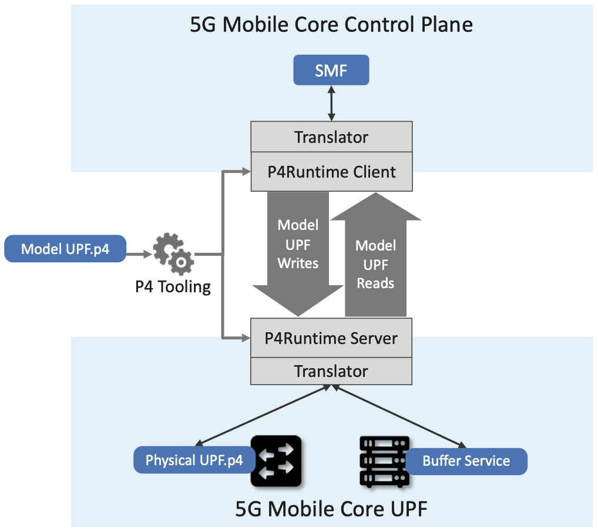

Chapter 5:  Mobile Core
============================

.. Mostly written from scratch, with the following hold-over
   content that might find a home here (including this old
   intro paragarph).

   Includes new Magma content, mostly in terms of going into much more
   detail about the cloud native implementation than we currently have.

   Includes a distributed implementation, where the User Plane runs at
   the edge (local breakout) and the Control Plane runs in the
   cloud. This is where we describe the P4-based implementation of the
   UPF.  May address the 4G / 5G / WiFi convergence story as a side
   discussion.

The Mobile Core provides IP connectivity to the RAN. It authenticates
UEs as they connect, tracks them as they move from one base station to
another, ensures that this connectivity fulfills the promised QoS
requirements, and meters usage for billing and charging.

Historically, all of these functions were provided by a proprietary
network appliance. But like the rest of the 5G mobile network, this
appliance is being disaggregated and implemented as a cloud service,
with the goal of improving feature velocity for new classes of
applications. It is also the case that as the range of use cases grows
larger, a one-size-fits-all approach will become problematic. The
expectation is that it should be possible to customize and specialize
the Mobile Core on an per-application basis.

This chapter introduces the functional elements of the Mobile Core,
and describes different strategies for implementing that
functionality.

5.1  Managing Identity
----------------------

There are two equally valid views of the Mobile Core. The
Internet-centric view is that each instantiation of the Mobile Core
serves as a router that connects a physical RAN (one of many possible
access network technologies, not unlike WiFi) to the global
Internet. In this view, IP addresses serve as the unique global
identifier that makes it possible for any RAN-connected device to
communication with any Internet addressable device or service. The
3GPP-centric view is that a distributed set of Mobile Cores
(interconnected by one or more backbone technologies, of which the
Internet is just one example) cooperate to turn a set of physical RANs
into one logically global RAN. In this perspective, the IMSI burned
into device SIM card serves as the global identifier that makes it
possible for any two mobile devices to call each other.

Both of these perspectives are correct, but with broadband
communication using Internet protocols like HTTP and TCP to access
cloud services being the dominant use case, this section takes an
Internet-centric perspective of the Mobile Core. But before getting to
that, we first need to understand two things about the 3GPP-centric
perspective.

First, while we often talk about the Mobile Core as though it were a
self-contained component deployed in some geographic region, this is
really only the case for a single instantiation of the Mobile Core,
for example, as depicted in :numref:`Figure %s <fig-cellular>` of
Chapter 2. More generally, you can think of the collection of all
Mobile Core instantiations deployed across the globe as cooperating to
implement a distributed mobility service.

Second, at the heart of this "distributed mobility service" is
functionality that tracks devices as they move throughout the global
RAN. The Mobile Core also has significant responsibility managing the
UEs connected a given physical RAN—which will be our focus throughout
the rest of this chapter—but this global-connectivity requirement
influences the overall architecture.

Recall from Section 2.4 that the 64-bit IMSI included in every SIM
card uniquely identifies every RAN-connected device. This means you
can think of this IMSI as similar to a 48-bit 802.11 address,
including how addresses are assigned to ensure uniqueness: `(MCC,
MNC)` pairs are assigned by a global authority to every MNO, each of
which then decides how to uniquely assign the rest of the IMSI
identifier space to devices.

Unlike 802.11 addresses, however, IMSIs are also used to locate (and
route packets to) UEs. A logically centralized (but hierarchically
distributed) database maps IMSIs onto the collection of information
needed to successfully connect to the corresponding UE. This includes
a combination of relatively *static* information about the level of
service the UE expects (including the corresponding phone number and
subscriber profile/account information), and more *dynamic*
information about the current location of the UE (including which
Mobile Core instantiation and base station currently connects the UE
to the global RAN).\ [#]_

.. [#] This logically centralized mapping service has a name, or
       rather, several names that keep changing from from generation
       to generation. In 2G and 3G it was called HLR (Home Location
       Registry). In 4G the HLR maintains only static information and
       a separate HSS (Home Subscriber Server) maintains the more
       dynamic information. In 5G the HLR is renamed the UDR (Unified
       Data Registry) and the HSS is renamed UDM (Unified Data
       Management). We will see the UDM in Section 5.2 because of the
       role it plays *within* a single instance of the Mobile Core.

There are, of course, many more details to the process—including how
to find a UE that has roamed to another MNO's network—but conceptually
the process is straightforward.  (As a thought experiment, imagine how
you would build a "logically global ethernet" using just 802.11
addresses, rather than depending on the additional layer of addressing
provided by IP.) For our purposes, the important takeaway is that
IMSIs are used to locate the Mobile Core instantiation that is then
responsible for authenticating the UE, tracking the UE as it moves
from base station to base station within that Core's geographic
region, and forwarding packets to/from the UE.

There is one other issue worth highlighting. The odds of someone
trying to "call" or "text" a UE that corresponds to an IoT device,
drone, camera, or robot are virtually zero. It is the IP address
assigned to each UE (by the local Mobile Core) that is used to
*locate* (route packets to) the UE. In this context, the IMSI plays
exactly the same role in a physical RAN as an ethernet address plays
in a LAN, and the Mobile Core serves exactly the same purpose as any
access router.

5.2 Functional Components
-------------------------

The 5G Mobile Core, which 3GPP calls the *NG-Core*, adopts a
microservice-like architecture. We say “microservice-like” because
while the 3GPP specification spells out this level of disaggregation,
it is really just prescribing a set of functional blocks and not an
implementation. A set of functional blocks is very different from the
collection of engineering decisions that go into designing a
microservice-based system. That said, viewing the collection of
components shown in :numref:`Figure %s <fig-5g-core>` as a set of
microservices is a good working model.

.. _fig-5g-core:
.. figure:: figures/Slide22.png 
    :width: 700px 
    :align: center 
	    
    5G Mobile Core (NG-Core), represented as a collection of
    microservices.

Starting with the User Plane (UP), the *UPF (User Plane Function)*
forwards traffic between RAN and the Internet. In addition to IP
packet forwarding, the UPF is responsible for policy enforcement,
lawful intercept, traffic usage reporting, and QoS policing. These are
all common functions in access routers, even if they go beyond what
you usually find in enterprise or backbone routers. The other detail
of note is that because the RAN is an overlay network, the RAN side of
the UPF is responsible for encapsulating and decapsulating packets
transmitted to base stations (as depicted in :numref:`Figure %s
<fig-tunnels>` of Section 2.3).

The rest of the functional elements in :numref:`Figure %s
<fig-5g-core>` implement the Control Plane (CP). Of these, two
represent the majority of the functionality that's unique to the
Mobile Core CP (as sketched in :numref:`Figure %s <fig-secure>` of
Section 2.4):

*  *AMF (Core Access and Mobility Management Function):* Responsible for
   connection and reachability management, mobility management, access
   authorization, and location services.
   
*  *SMF (Session Management Function):* Manages each UE session,
   including IP address allocation, selection of associated UP
   function, control aspects of QoS, and control aspects of UP
   routing.

In other words, the AMF authorizes access when a UE first connects to
one of the local base stations, and then tracks (but does not control)
which base station currently serves each UE. The SMF then allocates an
IP address to each AMF-authorized UE, and maintains per-device session
state, as long as the UE is active within the local RAN.

One unusual aspect of the Mobile Core is that the per-UE session state
maintained by the SMF potentially includes a reference to a packet
buffer (the buffer itself in maintained by the UPF) in which packets
destine to a UE currently in the middle of being handed off from one
base station to another are queued during the transition. This feature
was originally designed to avoid data loss during a voice call, but
its value is less obvious when the data is an IP packet since
end-to-end protocols like TCP are prepared to retransmit lost
packets. On the other hand, if hand-offs are too frequent, they can
be problematic for TCP.

Continuing with our inventory of control-related elements in
:numref:`Figure %s <fig-5g-core>`, several of them provide generic
functionality one might find in any microservice based application:

-  *AUSF (Authentication Server Function):* Authenticates UEs, and so
   is similar to an *Authentication Service* like OpenID.

-  *UDM (Unified Data Management):* Manages user identity (including
   the generation of authentication credentials), and so is similar to an
   *Authorization Service* like OAuth2.

-  *SDSF (Structured Data Storage Network Function):* Used to store
   structured data, and so is similar to an *SQL Database* like MySQL.

-  *UDSF (Unstructured Data Storage Network Function):* Used to store
   unstructured data, and so is similar to a *Key/Value Store* like
   MongoDB.

-  *NEF (Network Exposure Function):* Exposes select capabilities to
   third-party services (including translation between internal and
   external representations for data), and so is similar to an *API
   Server* like OpenAPI.

- *NRF (NF Repository Function):* Used to discover available services
  (network functions), and so is similar to a *Discovery Service* like
  Consul.

Note that while the above list identifies well-known open source
counterparts for each 3GPP-specified control function, we do this
primarily to help explain the general role each component plays.
While simply substituting the open source component is sometimes a
viable implementation option (e.g., MongoDB can be used to implement a
UDSF), doing so is often not possible. This is because of assumptions
3GPP makes about the schema for the associated data, or about how
functionality is factored between related components (e.g., how AUSF,
UMD, and AMF collectively implement AAA). We will see how to cope with
such issues in Section 5.3, where we talk about implementation details
in more detail.

Finally, :numref:`Figure %s <fig-5g-core>` shows two other functional
elements that are not easily categorized, in large part because they
are under-specified:

- *PCF (Policy Control Function):* Manages the policy rules, which
   includes a northbound interface that the management plane can use
   to install those rules.

-  *NSSF (Network Slicing Selector Function):* Manages how network
   slices are selected to serve a given UE.

Keep in mind that even though 3GPP does not directly prescribe a
microservice implementation, the overall design clearly points to a
cloud native solution as the desired end-state for the Mobile Core.
Of particular note, introducing distinct storage services means that
all the other services can be stateless, and hence, more readily
scalable.  Also note that :numref:`Figure %s <fig-5g-core>` adopts
another implementation strategy that is common in cloud native
systems, namely, assuming each component supports a RESTful API.

Deployment Options
~~~~~~~~~~~~~~~~~~~~~~~~~~~~

.. Seems out-of-place, but maybe some of this remains (perhaps boiled
   down to a sidebar. Might also introduce some 4G/EPC terminology here.
   
With an already deployed 4G RAN/EPC in the field and a new 5G
RAN/NG-Core deployment underway, we can’t ignore the issue of
transitioning from 4G to 5G (an issue the IP-world has been grappling
with for 20 years). 3GPP officially spells out multiple deployment
options, which can be summarized as follows.

-  Standalone 4G / Stand-Alone 5G
-  Non-Standalone (4G+5G RAN) over 4G’s EPC
-  Non-Standalone (4G+5G RAN) over 5G’s NG-Core

The second of the three options, which is generally referred to as
“NSA“, involves 5G base stations being deployed alongside the
existing 4G base stations in a given geography to provide a data-rate
and capacity boost. In NSA, control plane traffic between the user
equipment and the 4G Mobile Core utilizes (i.e., is forwarded through)
4G base stations, and the 5G base stations are used only to carry user
traffic. Eventually, it is expected that operators complete their
migration to 5G by deploying NG Core and connecting their 5G base
stations to it for Standalone (SA) operation. NSA and SA operations
are illustrated in :numref:`Figure %s <fig-nsa>`.

.. _fig-nsa:

	    
    NSA and SA options for 5G deployment.

One reason we call attention to the phasing issue is that we face a
similar challenge in the chapters that follow. The closer the following
discussion gets to implementation details, the more specific we have to
be about whether we are using 4G components or 5G components. As a
general rule, we use 4G components—particularly with respect to the
Mobile Core, since that’s what's available in open source today—and trust
the reader can make the appropriate substitution without loss of
generality. Like the broader industry, the open source community is in
the process of incrementally evolving its 4G code base into its
5G-compliant counterpart.

.. _reading_migration:
.. admonition:: Further Reading

    For more insight into 4G to 5G migration strategies, see
    `Road to 5G: Introduction and Migration
    <https://www.gsma.com/futurenetworks/wp-content/uploads/2018/04/Road-to-5G-Introduction-and-Migration_FINAL.pdf>`__.
    GSMA Report, April 2018.

5.3 Control Plane
----------------------

Drill down on how one might implement the Mobile Core CP. Probably
borrows heavily from Magma.

5.4 User Plane
--------------------

Drill down on implementation options for the UPF.

5.4.1 Microservice Implementation
~~~~~~~~~~~~~~~~~~~~~~~~~~~~~~~~~~~~

5.4.2 P4 Implementation
~~~~~~~~~~~~~~~~~~~~~~~~~~~~

Borrow heavily from MacDavid's paper.
