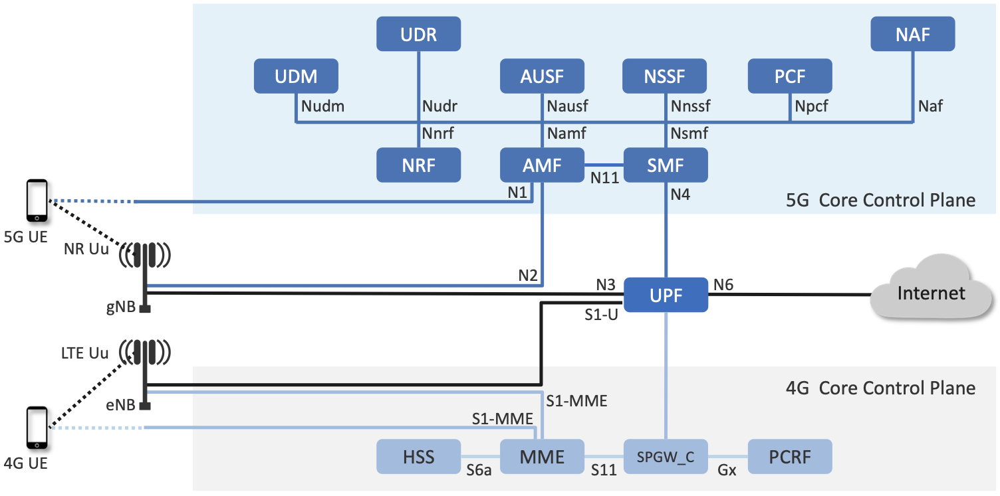

Chapter 5:  Mobile Core
============================

.. Mostly written from scratch, with the following hold-over
   content that might find a home here (including this old
   intro paragarph).

   Includes new Magma content, mostly in terms of going into much more
   detail about the cloud native implementation than we currently have.

   Includes a distributed implementation, where the User Plane runs at
   the edge (local breakout) and the Control Plane runs in the
   cloud. This is where we describe the P4-based implementation of the
   UPF.  May address the 4G / 5G / WiFi convergence story as a side
   discussion.

The Mobile Core provides IP connectivity to all the UEs connected to
the RAN. It authenticates UEs as they connect to the RAN, tracks them
as they move from one base station to another, ensures that this
connectivity fulfills the promised QoS requirements, and ultimately,
meters usage for billing and charging.

Historically, all of these functions were provided in bundled,
proprietary network appliances, but like the rest of the 5G mobile
network, these appliances are being disaggregated and implemented as
cloud services.  In doing so, the goal is to improve feature velocity,
making it easier to evolve the mobile network to support massive IoT,
mission-critical applications, and high-speed broadband. It is also
the case that as the range of use cases grows larger, a
one-size-fits-all approach will become problematic. The expectation
is that it should be possible to customize and specialize the Mobile Core
on an per-application basis.

This chapter introduces the functional elements of the Mobile Core,
and describes different strategies for implementing that
functionality.

5.1  Managing Identity
----------------------

There are two equally valid views of the Mobile Core. The
Internet-centric view is that each instantiation of the Mobile Core
serves as a router that connects a physical RAN (one of many possible
access network technologies, not unlike WiFi) to the global
Internet. In this view, IP addresses serve as the unique global
identifier that makes it possible for any RAN-connected device to
communication with any Internet addressable device or service. The
3GPP-centric view is that a distributed set of Mobile Cores
(interconnected by one or more backbone technologies, of which the
Internet is just one example) cooperate to turn a set of physical RANs
into a logically global RAN. In this perspective, the IMSI burned into
device SIM card serves as the global identifier that makes it possible
for any two mobile devices to call each other.

Both of these perspectives are correct, but with broadband
communication using Internet protocols like HTTP and TCP to access
cloud services being the dominant use case, this section takes an
Internet-centric perspective of the Mobile Core. But before getting to
that, we first need to understand two things about the 3GPP-centric
perspective.

First, while we often talk about the Mobile Core as though it were a
self-contained component deployed in some geographic region, this is
really only the case for a single instantiation of the Mobile Core,
for example, as depicted in :numref:`Figure %s <fig-cellular>` of
Chapter 2. More generally, however, you can think of the collection of
all Mobile Core instantiations deployed across the globe as
cooperating to implement a distributed mobility service.

Second, at the heart of this "distributed mobility service" is
functionality that tracks devices as they move throughout the global
RAN. The Mobile Core also has significant responsibility managing the
UEs connected the local physical RAN—which will be our focus
throughout the rest of this chapter—but it is this global aspect that
we summarize here.

Recall from Section 2.4 that the 64-bit IMSI included in every SIM
card uniquely identifies every RAN-connected device. This means you
can think of this IMSI as playing the same role as a 48-bit ethernet
address, including how addresses are assigned to ensure uniqueness:
`(MCC, MNC)` pairs are assigned by a global authority, with each MNO
deciding how to uniquely assign the rest of the IMSI identifier space
to devices.

Unlike ethernet addresses, however, IMSIs are used to locate UEs.  A
logically centralized database, known as the *Home Locator Register
(HLR)*, maps IMSIs onto the collection of information needed
successfully connect to the corresponding UE. This includes (a) which
Mobile Core instantiation currently connects the UE to the global RAN,
and (b) what level of service that UE subscribes to. (A second
database, playing much the same role as DNS in the Internet, maps
phone numbers to IMSIs.)

There are, of course, many more details to the process—including how
to find a UE that has roamed to another MNO's network—but conceptually
the process is straightforward. For our purposes, the important
takeaway is that IMSIs are used to locate the Mobile Core
instantiation that is then responsible for authenticating the UE,
tacking the UE as it moves from base station to base station within
that Core's geographic region, and forwarding packets to the UE.

There is one final issue worth highlighting. The odds of someone
trying to "call" or "text" a UE that corresponds to an IoT device,
drone, camera, or robot are virtually zero. It is the IP address
assigned to each UE (by the local Mobile Core) that is used to
"locate" (route packets to) the UE. In this context, the IMSI plays
exactly the same role in a physical RAN as an ethernet address plays
in a LAN, and the Mobile Core serves exactly the same purpose as any
access router.

5.2 Functional Components
-------------------------

A terminology and 3GPP-heavy intro to the core (for completeness), but
the real point of this first section is to introduce and explain the
functional components; the fundamental "problems" that the core must
solve. These include session management, mobility management, and
subscriber authentication/management (which just happen to be names of
the main three functional elements in the 5G schematic).

.. For now I cut-and-pasted both 4G and 5G (and joint deployment) but
   we probably want to cut back to just 5G (and deployment may reduce
   to a sidebar).

4G Mobile Core 
~~~~~~~~~~~~~~

The 4G Mobile Core, which 3GPP officially refers to as the *Evolved 
Packet Core (EPC)*, consists of five main components, the first three of 
which run in the Control Plane (CP) and the second two of which run in 
the User Plane (UP). 

-  MME (Mobility Management Entity): Tracks and manages the movement of 
   UEs throughout the RAN. This includes recording when the UE is not 
   active. 

-  HSS (Home Subscriber Server): A database that contains all 
   subscriber-related information. 

-  PCRF (Policy & Charging Rules Function): Tracks and manages policy 
   rules and records billing data on subscriber traffic. 

-  SGW (Serving Gateway): Forwards IP packets to and from the RAN. 
   Anchors the Mobile Core end of the bearer service to a (potentially 
   mobile) UE, and so is involved in handovers from one base station to 
   another. 

-  PGW (Packet Gateway): Essentially an IP router, connecting the Mobile 
   Core to the external Internet. Supports additional access-related 
   functions, including policy enforcement, traffic shaping, and 
   charging. 

Although specified as distinct components, in practice the SGW 
(RAN-facing) and PGW (Internet-facing) are often combined in a single 
device, commonly referred to as an S/PGW. The end result is illustrated 
in :numref:`Figure %s <fig-4g-core>`. 

.. _fig-4g-core:
.. figure:: figures/Slide21.png 
    :width: 500px 
    :align: center 
	    
    4G Mobile Core (Evolved Packet Core). 

Note that 3GPP is flexible in how the Mobile Core components are 
deployed to serve a geographic area. For example, a single MME/PGW pair 
might serve a metropolitan area, with SGWs deployed across ~10 edge 
sites spread throughout the city, each of which serves ~100 base 
stations. But alternative deployment configurations are allowed by the 
spec. 

5G Mobile Core 
~~~~~~~~~~~~~~

The 5G Mobile Core, which 3GPP calls the *NG-Core*, adopts a 
microservice-like architecture, where we say “microservice-like” because 
while the 3GPP specification spells out this level of disaggregation, it 
is really just prescribing a set of functional blocks and not an 
implementation. A set of functional blocks is very 
different from the collection of engineering decisions that go into 
designing a microservice-based system. That said, viewing the collection of 
components shown in :numref:`Figure %s <fig-5g-core>` 
as a set of microservices is a good working model. 

The following organizes the set of functional blocks into three groups. 
The first group runs in the Control Plane (CP) and has a counterpart in 
the EPC. 

-  AMF (Core Access and Mobility Management Function): Responsible for connection 
   and reachability management, mobility management, access 
   authentication and authorization, and location services. Manages the 
   mobility-related aspects of the EPC’s MME. 

-  SMF (Session Management Function): Manages each UE session, including 
   IP address allocation, selection of associated UP function, control 
   aspects of QoS, and control aspects of UP routing. Roughly 
   corresponds to part of the EPC’s MME and the control-related aspects 
   of the EPC’s PGW. 

-  PCF (Policy Control Function): Manages the policy rules that other CP 
   functions then enforce. Roughly corresponds to the EPC’s PCRF. 

-  UDM (Unified Data Management): Manages user identity, including the 
   generation of authentication credentials. Includes part of the 
   functionality in the EPC’s HSS. 

-  AUSF (Authentication Server Function): Essentially an authentication 
   server. Includes part of the functionality in the EPC’s HSS. 

The second group also runs in the Control Plane (CP) but does not have 
a direct counterpart in the EPC:

-  SDSF (Structured Data Storage Network Function): A “helper” service 
   used to store structured data. Could be implemented by an “SQL 
   Database” in a microservices-based system. 

-  UDSF (Unstructured Data Storage Network Function): A “helper” service 
   used to store unstructured data. Could be implemented by a “Key/Value 
   Store” in a microservices-based system. 

-  NEF (Network Exposure Function): A means to expose select 
   capabilities to third-party services, including translation between 
   internal and external representations for data. Could be implemented 
   by an “API Server” in a microservices-based system. 

-  NRF (NF Repository Function): A means to discover available services. 
   Could be implemented by a “Discovery Service” in a 
   microservices-based system. 

-  NSSF (Network Slicing Selector Function): A means to select a Network 
   Slice to serve a given UE. Network slices are essentially a way to 
   partition network resources in order to 
   differentiate service given to different users. It is a key feature 
   of 5G that we discuss in depth in a later chapter. 

The third group includes the one component that runs in the User Plane 
(UP):

-  UPF (User Plane Function): Forwards traffic between RAN and the 
   Internet, corresponding to the S/PGW combination in EPC. In addition 
   to packet forwarding, it is responsible for policy enforcement, lawful 
   intercept, traffic usage reporting, and QoS policing. 

Of these, the first and third groups are best viewed as a 
straightforward refactoring of 4G’s EPC, while the second group—despite 
the gratuitous introduction of new terminology—is 3GPP’s way of pointing 
to a cloud native solution as the desired end-state for the Mobile Core. 
Of particular note, introducing distinct storage services means that all 
the other services can be stateless, and hence, more readily scalable. 
Also note that :numref:`Figure %s <fig-5g-core>` adopts an idea that’s 
common in microservice-based systems, namely, to show a *message bus*
interconnecting all the components rather than including a full set of 
pairwise connections. This also suggests a well-understood 
implementation strategy. 

.. _fig-5g-core:

	    
    5G Mobile Core (NG-Core). 

Stepping back from these details, and with the caveat that we are 
presuming an implementation, the main takeaway is that we can 
conceptualize the Mobile Core as a graph of services. You will 
sometimes hear this called a *Service Graph* or *Service Chain*, the 
latter being more prevalent in NFV-oriented documents. Another term,
*Service Mesh*, has taken on a rather specific meaning in cloud native 
terminology—we'll avoid overloading that term here. 3GPP is silent on 
the specific terminology since it is considered an implementation 
choice rather than part of the specification. We describe our 
implementation choices in later chapters. 

Deployment Options
~~~~~~~~~~~~~~~~~~~~~~~~~~~~

.. Seems out-of-place, but maybe some of this remains (perhaps boiled
   down to a sidebar.
   
With an already deployed 4G RAN/EPC in the field and a new 5G
RAN/NG-Core deployment underway, we can’t ignore the issue of
transitioning from 4G to 5G (an issue the IP-world has been grappling
with for 20 years). 3GPP officially spells out multiple deployment
options, which can be summarized as follows.

-  Standalone 4G / Stand-Alone 5G
-  Non-Standalone (4G+5G RAN) over 4G’s EPC
-  Non-Standalone (4G+5G RAN) over 5G’s NG-Core

The second of the three options, which is generally referred to as
“NSA“, involves 5G base stations being deployed alongside the
existing 4G base stations in a given geography to provide a data-rate
and capacity boost. In NSA, control plane traffic between the user
equipment and the 4G Mobile Core utilizes (i.e., is forwarded through)
4G base stations, and the 5G base stations are used only to carry user
traffic. Eventually, it is expected that operators complete their
migration to 5G by deploying NG Core and connecting their 5G base
stations to it for Standalone (SA) operation. NSA and SA operations
are illustrated in :numref:`Figure %s <fig-nsa>`.

.. _fig-nsa:
.. figure:: figures/Slide23.png 
    :width: 600px
    :align: center
	    
    NSA and SA options for 5G deployment.

One reason we call attention to the phasing issue is that we face a
similar challenge in the chapters that follow. The closer the following
discussion gets to implementation details, the more specific we have to
be about whether we are using 4G components or 5G components. As a
general rule, we use 4G components—particularly with respect to the
Mobile Core, since that’s what's available in open source today—and trust
the reader can make the appropriate substitution without loss of
generality. Like the broader industry, the open source community is in
the process of incrementally evolving its 4G code base into its
5G-compliant counterpart.

.. _reading_migration:
.. admonition:: Further Reading

    For more insight into 4G to 5G migration strategies, see
    `Road to 5G: Introduction and Migration
    <https://www.gsma.com/futurenetworks/wp-content/uploads/2018/04/Road-to-5G-Introduction-and-Migration_FINAL.pdf>`__.
    GSMA Report, April 2018.

5.3 Control Plane
----------------------

Drill down on how one might implement the Mobile Core CP. Probably
borrows heavily from Magma.

5.4 User Plane
--------------------

Drill down on implementation options for the UPF.

5.4.1 Microservice Implementation
~~~~~~~~~~~~~~~~~~~~~~~~~~~~~~~~~~~~

5.4.2 P4 Implementation
~~~~~~~~~~~~~~~~~~~~~~~~~~~~

Borrow heavily from MacDavid's paper.
