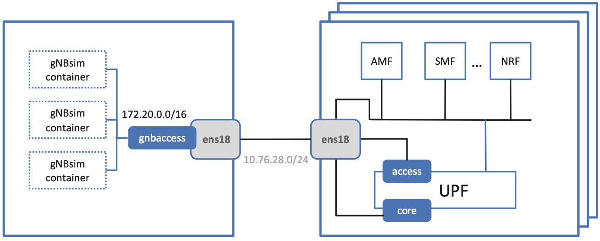

Chapter 5:  Mobile Core
============================

.. Mostly written from scratch, with the following hold-over
   content that might find a home here (including this old
   intro paragarph).

   Includes new Magma content, mostly in terms of going into much more
   detail about the cloud native implementation than we currently have.

   Includes a distributed implementation, where the User Plane runs at
   the edge (local breakout) and the Control Plane runs in the
   cloud. This is where we describe the P4-based implementation of the
   UPF.  May address the 4G / 5G / WiFi convergence story as a side
   discussion.

The Mobile Core provides IP connectivity to the RAN. It authenticates
UEs as they connect, tracks them as they move from one base station to
another, ensures that this connectivity fulfills the promised QoS
requirements, and meters usage for billing.

Historically, all of these functions were provided by a proprietary
network appliance. But like the rest of the 5G mobile network, this
appliance is being disaggregated and implemented as a cloud service,
with the goal of improving feature velocity for new classes of
applications. It is also the case that as the range of use cases grows
more diverse, a one-size-fits-all approach will become
problematic. The expectation is that it should be possible to
customize and specialize the Mobile Core on an per-application basis.

This chapter introduces the functional elements of the Mobile Core,
and describes different strategies for implementing that
functionality.

5.1  Identity Management
------------------------

There are two equally valid views of the Mobile Core. The
Internet-centric view is that each instantiation of the Mobile Core
serves as a router that connects a physical RAN (one of many possible
access network technologies, not unlike WiFi) to the global
Internet. In this view, IP addresses serve as the unique global
identifier that makes it possible for any RAN-connected device to
communication with any Internet addressable device or service. The
3GPP-centric view is that a distributed set of Mobile Cores
(interconnected by one or more backbone technologies, of which the
Internet is just one example) cooperate to turn a set of physical RANs
into one logically global RAN. In this perspective, the IMSI burned
into device SIM card serves as the global identifier that makes it
possible for any two mobile devices to communicate with each other.

Both of these perspectives are correct, but since broadband
communication using Internet protocols to access cloud services is
the dominant use case, this section takes an Internet-centric
perspective of the Mobile Core. But before getting to that, we first
need to understand several things about the 3GPP-centric perspective.

For starters, we need to be aware of the distinction between
“identity” and “identifier”. The first term is commonly used when
talking about principals or users, and the second term is used when
talking about abstract objects or physical devices. Unfortunately, the
two terms are conflated in the 3GPP architecture: The acronym IMSI
explicitly includes the word "Identity", where the "S" in both IMSI
and SIM stands for subscriber (a kind of principal), yet the IMSI is
also used as a global identifier for a UE connected to the mobile
network. This conflation breaks down when there could be tens or
hundreds of IoT devices for every person, with no obvious association
among them. Accounting for this problem is an “architecture alignment”
fix we discuss in the next chapter when we describe how to provide
Private 5G Connectivity as a managed cloud service.

If we take the view that an IMSI is primarily a global identifier for
UEs, then we can think of it as the mobile network’s equivalent of a
48-bit 802.3 or 802.11 MAC address. This includes how addresses are
assigned to ensure uniqueness: (MCC, MNC) pairs are assigned by a
global authority to every MNO, each of which then decides how to
uniquely assign the rest of the IMSI identifier space to devices. This
approach is similar to how network vendors are assigned a unique
prefix for all the MAC addresses they configure into the NIC cards and
WiFi chips they ship, but with one big difference: It is the MNO,
rather than the vendor, that is responsible for assigning IMSIs to SIM
cards. This makes the IMSI allocation problem closer to how the
Internet assigns IP addresses to end hosts, but unlike DHCP, the
IMSI-to-device binding is static.

This is important because, unlike 802.11 addresses, IMSIs are also
intended to support global routing. (Here, we are using a liberal
notion of routing—to locate an object—and focusing on the original
3GPP-perspective of the global RAN in which the Internet is just a
possible packet network that interconnects Mobile Cores.) A
hierarchically distributed database maps IMSIs onto the collection of
information needed to forward data to the corresponding device. This
includes a combination of relatively *static* information about the
level of service the device expects to receive (including the
corresponding phone number and subscriber profile/account
information), and more *dynamic* information about the current
location of the device (including which Mobile Core, and which base
station served by that Core, currently connects the device to the
global RAN).

This mapping service has a name, or rather, several names that keep
changing from from generation to generation. In 2G and 3G it was
called HLR (Home Location Registry). In 4G the HLR maintains only
static information and a separate HSS (Home Subscriber Server)
maintains the more dynamic information. In 5G the HLR is renamed the
UDR (Unified Data Registry) and the HSS is renamed UDM (Unified Data
Management). We will see the UDM in Section 5.2 because of the role it
plays *within* a single instance of the Mobile Core.

There are, of course, many more details to the process—including how
to find a device that has roamed to another MNO's network—but
conceptually the process is straightforward. (As a thought experiment,
imagine how you would build a "logically global WiFi" using just
802.11 addresses, rather than depending on the additional layer of
addressing provided by IP.) The important takeaway is that IMSIs are
used to locate the Mobile Core instance that is then responsible for
authenticating the device, tracking the device as it moves from base
station to base station within that Core's geographic region, and
forwarding packets to/from the device.

Two additional observations about the relationship between IMSIs and IP
addresses are worth highlighting. First, the odds of someone trying to
"call" or "text" an IoT device, drone, camera, or robot are virtually
zero. It is the IP address assigned to each device (by the local
Mobile Core) that is used to locate (route packets to) the device. In
this context, the IMSI plays exactly the same role in a physical RAN
as an 802.11 address plays in a LAN, and the Mobile Core behaves just
like any access router.

Second, whether a device connects to a RAN or some other access
network, it is automatically assigned a new IP address any time it
moves from one coverage domain to another. Even for voice calls in the
RAN case, ongoing calls are dropped whenever a device moves between
instantiations of the Mobile Core (i.e., uninterrupted mobility is
supported only within the region served by a given Core). This is
typically not a problem when the RAN is being used to deliver
broadband connectivity because Internet devices are almost always
clients *requesting* a cloud service; they just start issuing requests
with their new (dynamically assigned) IP address.

Also note that while we sometimes talk about the Mobile Core as though
it were a self-contained component deployed in some geographic region,
this is really only the case for a single instance of the Mobile Core,
for example, as depicted in :numref:`Figure %s <fig-cellular>` of
Chapter 2. More generally, you should think of the collection of all
Mobile Core instantiations deployed across the globe as cooperating to
implement a distributed mobility service.

Next, at the heart of that distributed mobility service is
functionality that tracks devices as they move throughout the global
RAN. The Mobile Core also has significant responsibility managing the
UEs connected a given physical RAN—which will be our focus throughout
the rest of this chapter—but this global-connectivity requirement
influences the overall architecture.

Recall from Section 2.4 that the 64-bit IMSI included in every SIM
card uniquely identifies every RAN-connected device. This means you
can think of this IMSI as similar to a 48-bit 802.11 address. This
includes how addresses are assigned to ensure uniqueness: `(MCC, MNC)`
pairs are assigned by a global authority to every MNO, each of which
then decides how to uniquely assign the rest of the IMSI identifier
space to devices.

Unlike 802.11 addresses, however, IMSIs are also used to locate (and
route packets to) UEs. A hierarchically distributed database maps
IMSIs onto the collection of information needed to successfully
connect to the corresponding UE. This includes a combination of
relatively *static* information about the level of service the UE
expects (including the corresponding phone number and subscriber
profile/account information), and more *dynamic* information about the
current location of the UE (including which Mobile Core and base
station currently connects the UE to the global RAN).

This mapping service has a name, or rather, several names that keep
changing from from generation to generation. In 2G and 3G it was
called HLR (Home Location Registry). In 4G the HLR maintains only
static information and a separate HSS (Home Subscriber Server)
maintains the more dynamic information. In 5G the HLR is renamed the
UDR (Unified Data Registry) and the HSS is renamed UDM (Unified Data
Management). We will see the UDM in Section 5.2 because of the role it
plays *within* a single instance of the Mobile Core.

There are, of course, many more details to the process—including how
to find a UE that has roamed to another MNO's network—but conceptually
the process is straightforward.  (As a thought experiment, imagine how
you would build a "logically global ethernet" using just 802.11
addresses, rather than depending on the additional layer of addressing
provided by IP.) For our purposes, the important takeaway is that
IMSIs are used to locate the Mobile Core instance that is then
responsible for authenticating the UE, tracking the UE as it moves
from base station to base station within that Core's geographic
region, and forwarding packets to/from the UE.

Finally, there are two other observations about mobility and
addressing worth highlighting.  First, the odds of someone trying to
"call" or "text" a UE that corresponds to an IoT device, drone,
camera, or robot are virtually zero. It is the IP address assigned to
each UE (by the local Mobile Core) that is used to *locate* (route
packets to) the UE. In this context, the IMSI plays exactly the same
role in a physical RAN as an 802.11 address plays in a LAN, and the
Mobile Core behaves just like any access router.

Second, whether a device connects to a RAN or some other access
network, it is automatically assigned a new IP address any time it
moves from one coverage domain to another. Even in the RAN case,
ongoing calls are dropped whenever a device moves between
instantiations of the Mobile Core (i.e., mobility is supported only
*within* the region served by a given Mobile Core). But this is
typically not a problem for the RAN (or for any other access network,
for that matter) because mobile devices are usually clients
requesting service; they just start making requests with their new IP
address.

5.2 Functional Components
-------------------------

The 5G Mobile Core, which 3GPP calls the *NG-Core*, adopts a
microservice-like architecture. We say “microservice-like” because
while the 3GPP specification spells out this level of disaggregation,
it is really just describing a set of functional blocks and not
prescribing an implementation. In practice, a set of functional blocks
is very different from the collection of engineering decisions that go
into designing a microservice-based system. That said, viewing the
collection of components shown in :numref:`Figure %s <fig-5g-core>` as
a set of microservices is a reasonable working model (for now).

.. _fig-5g-core:
.. figure:: figures/Slide22.png 
    :width: 700px 
    :align: center 
	    
    5G Mobile Core (NG-Core), represented as a collection of
    microservices, where 3GPP defines the interfaces connecting the
    Mobile Core CP ane UP to the RAN (denoted N2 and N3, respectively).

Starting with the User Plane (UP), the *UPF (User Plane Function)*
forwards traffic between RAN and the Internet. In addition to IP
packet forwarding, the UPF is responsible for policy enforcement,
lawful intercept, traffic usage reporting, and QoS policing. These are
all common functions in access routers, even if they go beyond what
you usually find in enterprise or backbone routers. The other detail
of note is that because the RAN is an overlay network, the RAN side of
the UPF (corresponding to the N3 interface) is responsible for
encapsulating and decapsulating packets transmitted to base stations
(as depicted in :numref:`Figure %s <fig-tunnels>` of Section 2.3).

The rest of the functional elements in :numref:`Figure %s
<fig-5g-core>` implement the Control Plane (CP). Of these, two
represent the majority of the functionality that's unique to the
Mobile Core CP (as sketched in :numref:`Figure %s <fig-secure>` of
Section 2.4):

*  *AMF (Core Access and Mobility Management Function):* Responsible for
   connection and reachability management, mobility management, access
   authorization, and location services.
   
*  *SMF (Session Management Function):* Manages each UE session,
   including IP address allocation, selection of associated UP
   function, control aspects of QoS, and control aspects of UP
   routing.

In other words, the AMF authorizes access when a UE first connects to
one of the local base stations, and then tracks (but does not control)
which base station currently serves each UE. The SMF then allocates an
IP address to each AMF-authorized UE, and directly interacts with the
UPF to maintain per-device session state.

Of particular note, the per-UE session state controlled by the SMF (and
implemented by the UPF) includes a packet buffer in which packets
destine to a UE currently in the middle of being handed off from one
base station to another are queued during the transition. This feature
was originally designed to avoid data loss during a voice call, but
its value is less obvious when the data is an IP packet since
end-to-end protocols like TCP are prepared to retransmit lost
packets. On the other hand, if hand-offs are too frequent, they can be
problematic for TCP.

Before continuing with our inventory of control-related elements in
:numref:`Figure %s <fig-5g-core>`, it is important to note we show
only a fraction of the full set that 3GPP defines. The full set is
includes a wide-range of possible features, many of which are either
speculative (i.e., identify potential functionality) or overly
prescriptive (i.e., identify well-known cloud native microservices).
We limit our discussion to functional elements that provide value in
the private 5G deployments that we focus on. Of these, several provide
functionality similar to what one might find in any microservice-based
application:

-  *AUSF (Authentication Server Function):* Authenticates UEs.

-  *UDM (Unified Data Management):* Manages user identity, including 
   the generation of authentication credentials.

-  *UDR (Unified Data Registry):* Manages user static subscriber
   related information.

-  *UDSF (Unstructured Data Storage Network Function):* Used to store
   unstructured data, and so is similar to a *Key/Value Store*.

-  *NEF (Network Exposure Function):* Exposes select capabilities to
   third-party services, and so is similar to an *API Server*.

- *NRF (NF Repository Function):* Used to discover available services
  (network functions), and so is similar to a *Discovery Service*.

Note that while the above list includes well-known microservices that
are similar to some of 3GPP-specified control functions, we do this
primarily to help explain the general role each component plays.  In
some cases, substituting an existing cloud native component is a
viable implementation option. For example, MongoDB can be used to
implement a UDSF. In other cases, however, such a one-for-one swap is
not possible due to assumptions 3GPP makes. For example, AUSF, UMD,
UMR, and AMF collectively implement a *Authentication and
Authorization Service*, but an option like OAuth2 could not be used in
their place because (a) UMD and UMR are assumed to be part of the
global identity mapping service discussed in Section 5.1, and (b) 3GPP
specifies the interface by which the various components request
service from each other (e.g., AMF connects to the RAN via the N2
depicted in the figure). We will see how to cope with such
issues in Section 5.3, where we talk about implementation details in
more detail.

Finally, :numref:`Figure %s <fig-5g-core>` shows two other functional
elements that export a northbound interface to the management plane
(not shown):

-  *PCF (Policy Control Function):* Manages the policy rules for the
   rest of the Mobile Core CP.

-  *NSSF (Network Slicing Selector Function):* Manages how network
   slices are selected to serve a given UE.

Keep in mind that even though 3GPP does not directly prescribe a
microservice implementation, the overall design clearly points to a
cloud native solution as the desired end-state for the Mobile Core.
Of particular note, introducing a distinct storage service means that
all the other services can be stateless, and hence, more readily
scalable.

5.3 Control Plane
----------------------

This section describes two different strategies for implementing the
Mobile Core CP. Both correspond to open source projects that are
readily available for download and experimentation.

5.3.1 SD-Core
~~~~~~~~~~~~~

Our first example, called SD-Core, is a nearly one-for-one translation
of the functional blocks shown in :numref:`Figure %s <fig-5g-core>`
into a cloud native implementation. A high-level schematic is shown in
:numref:`Figure %s <fig-sd-core>`, where each element corresponds to
scalable set of Kubernetes-hosted containers. We include this
schematic even though it looks quite similar to :numref:`Figure %s
<fig-5g-core>` because it highlights three implementation details.

.. _reading_sd-core:
.. admonition:: Further Reading

    `SD-Core <https://opennetworking.org/sd-core/>`__.

.. _fig-sd-core:

	    
    SD-Core implementation of the Mobile Core Control Plane, including
    support for Standalone (SA) deployment of both 4G and 5G.

First, SD-Core supports both the 5G and 4G versions of the Mobile
Core,\ [#]_  which share a common User Plane (UPF). We have not discussed
details of the 4G Core, but the obvious takeaway is that it is much
less disaggregated.  In particular, the components in the 5G Core are
stateless and so can be horizontally scaled out as load dictates,
whereas that is not the case for the 4G Core. (For completeness, the
rough correspondence between 4G and 5G is: MME-to-AMF, SPGW_C-to-SMF,
HSS-to-UDM, and PCRF-to-PCF.) Although not shown in the schematic,
there is also a scalable Key/Value Store microservice based on MongoDB.
It is used to make all Core-related state persistent for both the 4G
and 5G Control Planes.

.. [#] SD-Core's 4G Core is a fork of the OMEC project and its 5G Core
       is a fork of the Free5GC project.

.. Maybe should say more about SD-Core's origin story.

Second, :numref:`Figure %s <fig-sd-core>` illustrates 3GPP's
*Standalone (SA)* deployment option, in which 4G and 5G networks
co-exist. They share a UPF implementation, but the UPFs are
instantiated separately for each RAN/Core pair, with support for both
the 4G and 5G interfaces, denoted *S1-U* and *N3*, respectively.
Although not obvious from the SA example, 3GPP defines an alternative
transition plan, called *NSA (Non-Standalone)*, in which separate 4G
and 5G RANs were paired with either a 4G Core or a 5G Core. The
details of how that works are not relevant to this discussion, except
to make the point that production networks almost never get to enjoy a
"flag day" on which a new version is universally substituted for an
old version. A migration plan has to be part of the design. More
information on this topic can be found in a GSMA Report.

.. _reading_migration:
.. admonition:: Further Reading

    `Road to 5G: Introduction and Migration
    <https://www.gsma.com/futurenetworks/wp-content/uploads/2018/04/Road-to-5G-Introduction-and-Migration_FINAL.pdf>`__.
    GSMA Report, April 2018.

Third, :numref:`Figure %s <fig-sd-core>` should make it clear that the
3GPP has been busy specifying inter-component interfaces. These
include over-the-air interfaces between base stations and UEs (e.g.,
*NR Uu*), control interfaces between the Core and both UEs and base
stations (e.g., *N1* and *N2*, respectfully), a user plane interface
between the Core and base stations (e.g., *N3*), microservice
interfaces between the components that implement the Core (e.g.,
*Nudm*), and a data plane interface between the Core and the backbone
network (e.g., *N6*). Some of these interfaces are necessary for
interoperability (e.g., *N1* and *N Uu* make it possible to connect
your phone to any MNO's network), but others could be seen as being
unnecessarily prescriptive. We'll see how Magma addresses this
situation in the next section.

5.3.2 Magma
~~~~~~~~~~~

5.4 User Plane
--------------------

Drill down on implementation options for the UPF.

5.4.1 Microservice Implementation
~~~~~~~~~~~~~~~~~~~~~~~~~~~~~~~~~~~~

5.4.2 P4 Implementation
~~~~~~~~~~~~~~~~~~~~~~~~~~~~

Borrow heavily from MacDavid's paper.
