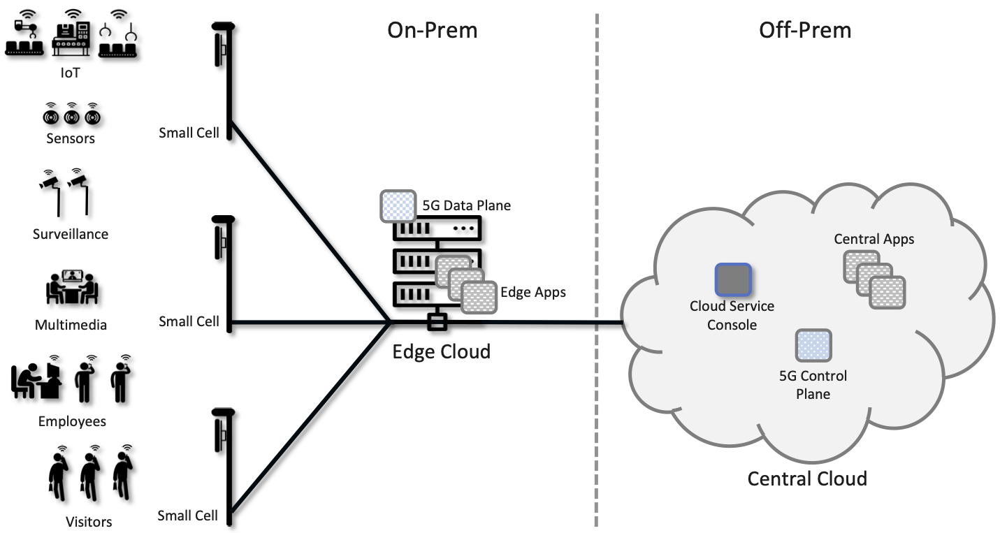

Chapter 1:  Introduction
===========================

.. Similar to current Chapter 1, but with more emphasis on the
   relevance beyond traditional Mobile Operators. For example, our end
   goal is showing how this technology can be integrated into edge
   clouds running in enterprises (and used as part of their Industry
   Transformation 4.0). In other words, in addition to describing the
   technology, this book is also about (a) democratizing the access
   network, and (b) applying the technology to new use cases.
   
   Also talk about two enabling technologies: SDN and Cloud
   Native. These can easily be positioned as two aspects of the
   general concept of cloudifying the mobile access network, which at
   the end of the day, is the big message of this book. (Doing this
   sets up the next point.)
   
   The edge cloud subsection currently starts from the operator
   perspective. We’ll want to instead start from first principles
   (there is value at the edge) and then ask about the options as to
   where the edge is… Central Office is one choice, but on-prem is
   another (this is how the SIGCOMM Tutorial was organized). This
   means we conclude the Intro chapter with a high-level overview of
   Aether (or its generic counterpart).

Mobile networks, which have a 40-year history that parallels the
Internet’s, have undergone significant change. The first two
generations supported voice and then text, with 3G defining the
transition to broadband access, supporting data rates measured in
hundreds of kilobits-per-second. Today, the industry is transitioning
from 4G (with data rates typically measured in the few
megabits-per-second) to 5G, with the promise of a tenfold increase in
data rates.

But 5G is about much more than increased bandwidth. 5G represents a
fundamental rearchitecting of the access network in a way that
leverages several key technology trends and sets it on a path to
enable much greater innovation. In the same way that 3G defined the
transition from voice to broadband, 5G’s promise is primarily about
the transition from a single access service (broadband connectivity)
to a richer collection of edge services and devices. 5G is expected to
provide support for immersive user interfaces (e.g., AR/VR),
mission-critical applications (e.g., public safety, autonomous
vehicles), and the Internet-of-Things (IoT). Because these use cases
will include everything from home appliances to industrial robots to
self-driving cars, 5G won’t just support humans accessing the Internet
from their smartphones, but also swarms of autonomous devices working
together on their behalf.

There is more to supporting these services than just improving
bandwidth or latency to individual users.  As we will see, a
fundamentally different edge network architecture is required. The
requirements for this architecture are ambitious, and can be
illustrated by three classes of capabilities:

- To support *Massive Internet-of-Things*, potentially including
  devices with ultra-low energy (10+ years of battery life), ultra-low
  complexity (10s of bits-per-second), and ultra-high density (1
  million nodes per square kilometer).

- To support *Mission-Critical Control*, potentially including
  ultra-high availability (greater than 99.999% or "five nines"),
  ultra-low latency (as low as 1 ms), and extreme mobility (up to 100
  km/h).
  
- To support *Enhanced Mobile Broadband*, potentially including extreme data rates
  (multi-Gbps peak, 100+ Mbps sustained) and extreme
  capacity (10 Tbps of aggregate throughput per square kilometer).
  
These targets will certainly not be met overnight, but that's in keeping
with each generation of the mobile network being a decade-long
endeavor.

On top of these quantitative improvements to the capabilities of the
access network, 5G is being viewed as a chance for building a platform
to support innovation. Whereas prior access networks were generally
optimized for known services (such as voice calls and SMS), the
Internet has been hugely successful in large part because it supported
a wide range of applications that were not even thought of when it was
first designed. The 5G network is very much being designed with this
same goal of enabling all sorts of future applications beyond those we
fully recognize today. For an example of the grand vision for 5G, see
the whitepaper from one of the industry leaders.

.. _reading_vision:
.. admonition:: Further Reading

   Qualcomm Whitepaper. `Making 5G NR a Reality
   <https://www.qualcomm.com/media/documents/files/whitepaper-making-5g-nr-a-reality.pdf>`__.
   December 2016.

The 5G mobile network, because it is on an evolutionary path and not a
point solution, includes standardized specifications, a range of
implementation choices, and a long list of aspirational goals. Because
this leaves so much room for interpretation, our approach to
describing 5G is grounded in two mutually supportive principles. The
first is to apply a *systems lens*, which is to say, we explain the
sequence of design decisions that lead to a solution rather than fall
back on enumerating the overwhelming number of acronyms or individual
point technologies as a *fait accompli*. The second is to aggressively
disaggregate the system.  Building a disaggregated, virtualized, and
software-defined 5G access network is the direction the industry is
already headed (for good technical and business reasons), but breaking
the 5G network down into its elemental components is also the best way
to explain how 5G works.  It also helps to illustrate how 5G might
evolve in the future to provide even more value.

.. sidebar:: Evolutionary Path

	That 5G is on an evolutionary path is the central theme of
	this book.  We call attention to its importance here, and
	revisit the topic throughout the book.

	We are writing this book for *system generalists*, with the
	goal of helping bring a community that understands a broad
	range of systems issues (but knows little or nothing about the
	cellular network) up to speed so they can play a role in its
	evolution. This is a community that understands both feature
	velocity and best practices in building robust scalable
	systems, and so has an important role to play in bringing all
	of 5G's potential to fruition.

What this all means is that there is no single, comprehensive definition
of 5G, any more than there is for the Internet. It is a complex and
evolving system, constrained by a set of standards that purposely give
all the stakeholders many degrees of freedom. In the chapters that
follow, it should be clear from the context whether we are talking about
*standards* (what everyone must do to interoperate), *trends* (where
the industry seems to be headed), or *implementation choices*
(examples to make the discussion more concrete). By adopting a systems
perspective throughout, our intent is to describe 5G in a way that
helps the reader navigate this rich and rapidly evolving system.

1.1 Standardization Landscape
-----------------------------

As of 3G, the generational designation corresponds to a standard defined
by the *3rd Generation Partnership Project (3GPP)*. Even though its name
has “3G” in it, the 3GPP continues to define the standards for 4G and 5G,
each of which corresponds to a sequence of releases of the standard.
Release 15 is considered the demarcation point between 4G and 5G, with
Release 17 scheduled for 2021. Complicating the terminology, 4G
was on a multi-release evolutionary path referred to as *Long Term
Evolution (LTE)*. 5G is on a similar evolutionary path, with several
expected releases over its lifetime.

While 5G is an ambitious advance beyond 4G, it is also the case that
understanding 4G is the first step to understanding 5G, as several
aspects of the latter can be explained as bringing a new
degree-of-freedom to the former. In the chapters that follow, we often
introduce some architectural feature of 4G as a way of laying the
foundation for the corresponding 5G component.

Like Wi-Fi, cellular networks transmit data at certain bandwidths in the
radio spectrum. Unlike Wi-Fi, which permits anyone to use a channel at
either 2.4 or 5 GHz (these are unlicensed bands), governments have
auctioned off and licensed exclusive use of various frequency bands to
service providers, who in turn sell mobile access service to their
subscribers.

There is also a shared-license band at 3.5 GHz, called *Citizens
Broadband Radio Service (CBRS)*, set aside in North America for
cellular use. Similar spectrum is being set aside in other
countries. The CBRS band allows 3 tiers of users to share the
spectrum: first right of use goes to the original owners of this
spectrum (naval radars and satellite ground stations); followed by
priority users who receive this right over 10MHz bands for three years
via regional auctions; and finally the rest of the population, who can
access and utilize a portion of this band as long as they first check
with a central database of registered users.  CBRS, along with
standardization efforts to extend mobile cellular networks to operate
in the unlicensed bands, open the door for private cellular networks
similar to Wi-Fi. This is proving attractive to enterprises.

The specific frequency bands that are licensed for cellular networks
vary around the world, and are complicated by the fact that network
operators often simultaneously support both old/legacy technologies and
new/next-generation technologies, each of which occupies a different
frequency band. The high-level summary is that traditional cellular
technologies range from 700-2400 MHz, with new mid-spectrum
allocations now happening at 6 GHz, and millimeter-wave (mmWave)
allocations opening above 24 GHz.

While the specific frequency band is not directly relevant to
understanding 5G from an architectural perspective, it does impact the
physical-layer components, which in turn has indirect ramifications on
the overall 5G system. We identify and explain these ramifications in
later chapters, keeping in mind that ensuring the allocated spectrum
is used *efficiently* is a critical design goal.

1.2 Access Networks
-------------------

.. This section focuses on the traditional Telco perspective

The mobile cellular network is part of the access network that
implements the Internet’s so-called *last mile*. (Another common
access technology is *Passive Optical Networks (PON)*, colloquially
known as Fiber-to-the-Home.) These mobile access networks are provided
by both big and small *Mobile Network Operators (MNOs)*. Global MNOs
like AT&T run access networks at thousands of aggregation
points-of-presence across a country like the US, along with a national
backbone that interconnects those sites. Small regional and municipal
MNOs might run an access network with one or two points-of-presence,
and then connect to the rest of the Internet through some large
operator’s backbone.

.. _fig-global:
.. figure:: figures/Slide1.png 
    :width: 500px
    :align: center
    
    A global mobile network built by first aggregating traffic from
    hundreds of wireless base stations, and then interconnecting those
    aggregation points over the Internet.

As illustrated in :numref:`Figure %s <fig-global>`, access networks
are physically anchored at thousands of aggregation points-of-presence
within close proximity to end users, each of which serves anywhere
from 1,000-100,000 subscribers, depending on population density. In
practice, the physical deployment of these “edge” locations vary from
operator to operator, but one possible scenario is to anchor both the
cellular and wireline access networks in Telco *Central Offices*.

Historically, the Central Office—officially known as the *PSTN
(Public Switched Telephone Network) Central Office*—anchored wired
access (both telephony and broadband), while the cellular network
evolved independently by deploying a parallel set of *Mobile Telephone
Switching Offices (MTSO)*. Each MTSO serves as a *mobile aggregation*
point for the set of cell towers in a given geographic area. For our
purposes, the important idea is that such aggregation points exist, and
it is reasonable to think of them as defining the edge of the
operator-managed access network. For simplicity, we sometimes use the
term “Central Office” as a synonym for both types of edge sites.

Finally, one aspect the the mobile network that may not be obvious
from :numref:`Figure %s <fig-global>` is that it supports global
connectivity, independent of the Internet (which is technically just
one of many available backbone technologies). That is, the cellular
network supports a universal addressing scheme, similar in principle
(but significantly different in details) from the Internet's universal
IP-based addressing scheme. This addressing scheme makes it possible
to establish a voice call between any two cell phones, but of course,
IP addresses still come into play when trying to establish a data
(broadband) connection to/from a cell phone or other mobile
device. Understanding the relationship between mobile addresses and IP
addresses is a topic we will explore in later chapters.

1.3 Managed Cloud Service
-------------------------

.. This section pivots to the new cloud perspective

The previous section gives a decidely Telco-centric view of the mobile
cellular network, which makes sense because Telcos have been the
dominant MNOs for the past 40+ years. But with 5G's focus on
broadening the set of services is supports, and embracing general
platforms that can host yet-to-be-invented applications, the mobile
cellular network is starting to blur the line between the access
network and the cloud.

The rest of this book explains what that means in detail, but as an
overview, thinking of 5G connectivity as a cloud service means that
instead of using purpose-built devices and telephony-based operational
practices to deliver mobile connectivity, the 5G network is built from
commodity hardware, software-defined networks, and cloud-based
operational practices. And just as with familiar cloud applications,
the end result is a system that increases both feature velocity and
operational uniformity.  These advantages are available to legacy
MNOs, but whether they will fully embrace them is yet to be seen, so
we do not limit ourselves to existing stakeholders or business
models. In particular, this book focuses on how enterprises can be
their own MNOs, or alternatively, acquire 5G connectivity as a managed
cloud service from non-traditional MNOs.

.. _fig-enterprise:

    
    Enterprise-based deployment of 5G connectivity, running as a
    managed cloud service.

To this end, :numref:`Figure %s <fig-enterprise>` depicts a simplified
5G deployment that the rest of this book works toward. At a
high-level, the figure shows a wide-range of enterprise use cases that
might take advantage of 5G connectivity, with the data plane of the 5G
service running on-prem (on an edge cloud running within the
enterprise), and the control plane of the 5G service running off-prem
(in the global cloud).\ [#]_ Enterprise administrators control their
service through a management console, much in the same way they might
log into an AWS, GCP, or Azure console to control a cloud-based
storage or compute service. Finally, applications are distributed
across both edge and centralized clouds, taking advantage of what is
commonly referred to as a *hybrid cloud*.

.. [#] We use the terms "data plane" and "control plane" in the
       generic sense in this description. As we'll see in Chapter 2,
       the 5G architecture has a more complex structure and uses
       different terminology.
   
Hosting a 5G connectivity service on an edge cloud is perfectly
aligned with one of the most pronounce trends in cloud computing:
moving elements of the cloud from the datacenter to locations that are
in close proximity to end users and their devices. Before looking at
how to realize 5G on an edge cloud, we start by considering why edge
clouds are gaining momentum in the first place.

The cloud began as a collection of warehouse-sized datacenters, each
of which provided a cost-effective way to power, cool, and operate a
scalable number of servers. Over time, this shared infrastructure
lowered the barrier to deploying scalable Internet services, but
today, there is increasing pressure to offer
low-latency/high-bandwidth cloud applications that cannot be
effectively implemented in remote datacenters. Augmented Reality (AR),
Virtual Reality (VR), Internet-of-Things (IoT), and Autonomous
Vehicles are all examples of this kind of application. Such
applications benefit from moving at least part of their functionality
out of the datacenter and towards the edge of the network, closer to
end users.

Where this edge is *physically* located depends on who you ask. If you
ask a network operator that already owns and operates thousands of
Central Offices, then their Central Offices are an obvious answer.
Others might claim the edge is located at the 14,000 Starbucks across
the US, and still others might point to the tens-of-thousands of cell
towers spread across the globe. Our approach is to be location
agnostic, but to make the discussion concrete, we use enterprises as
our exemplar deployment.

.. sidebar:: CORD: Central Office Re-architected as a Datacenter

  Concurrent with cloud providers pursing edge deployments, network
  operators began to re-architect their access network to use the same
  commodity hardware and best practices in building scalable software
  as the cloud providers. Such a design, which is sometimes referred
  to as CORD *(Central Office Re-architected as a Datacenter)*,
  supports both the access network and edge services co-located on a
  shared cloud platform. This platform is then replicated across
  hundreds or thousands of operator sites, including Central Offices.

  Traditional network operators did this because they wanted to take
  advantage of the same economies of scale and feature velocity as
  cloud providers. CORD gave them a general architecture to work
  towards, but also an open source Kubernetes-based reference
  implementation to model their solutions on. That original
  implementation of CORD is the direct predecessor to the Aether
  platform we use as a reference implementation in this book.

  At the same time network operators began to investigate a CORD-based
  approach, they also encouraged their vendors to shift from selling
  hardware appliances to *Virtualized Network Functions (VNFs)*, as
  part of an initiative that is widely known as the *Network Function
  Virtualization (NFV)*. Unfortunately, the commercially available
  VNFs tended to be packaged as VMs that required a one-off
  configurations, leaving operators with a set of management silos,
  and far short of the operational uniformity of cloud native systems.

An important takeaway from this discussion is that to understand how 5G
is being implemented, it is helpful to have a working understanding of
how clouds are built. This includes the use of *commodity hardware*
(both servers and white-box switches), horizontally scalable
*microservices* (also referred to as *cloud native*), and
*Software-Defined Networks (SDN)*. It is also helpful to have an
appreciation for how cloud software is developed, tested, deployed, and
operated, including practices like *DevOps* and *Continuous Integration
/ Continuous Deployment (CI/CD)*. We recommend two companion books to
help fill the gaps in your understanding of these foundational
technologies.

.. _reading_devops:
.. admonition:: Further Reading

   `Software-Defined Networks: A Systems Approach 
   <https://sdn.systemsapproach.org/>`__. November 2021.

   `Edge Cloud Operations: A Systems Approach 
   <https://ops.systemsapproach.org/>`__. June 2022.

In summary, a major goal of 5G is to take advantage of cloud
technologies, with traditional MNOs announcing plans to build
so-called *Telco Clouds*.  What is actually happening instead, is that
that access technology is being subsumed into the cloud, running as
yet another cloud native workload. It would be more accurate to refer
to the resulting system now emerging as the *Cloud-based Telco*. One
reading of this book is as a roadmap to such an outcome. (More
information about the related CORD initiative is also available.)

.. _reading_cord:
.. admonition:: Further Reading

    L. Peterson, *et al*. `Central Office Re-architected as a
    Datacenter, IEEE Communications.
    <https://wiki.opencord.org/download/attachments/1278027/PETERSON_CORD.pdf>`__.
    IEEE Communications, October 2016.

    A.D. Little Report. `Who Dares Wins!  How Access Transformation Can
    Fast-Track Evolution of Operator Production Platforms
    <https://www.adlittle.com/en/who-dares-wins>`__.  September 2019.
