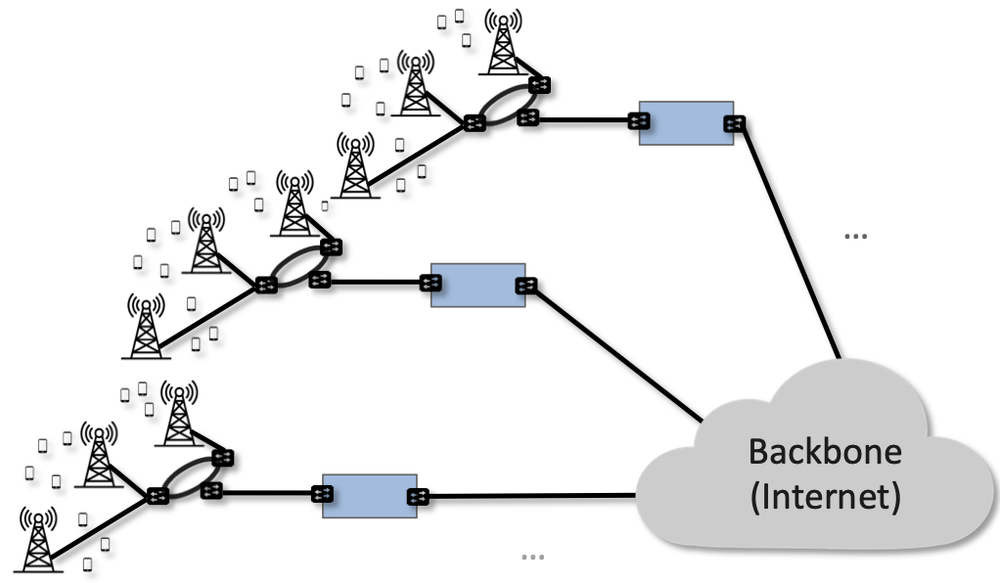

Chapter 1:  Introduction
===========================

Mobile networks, which have a 40-year history that parallels the
Internet’s, have undergone significant change. The first two
generations supported voice and then text, with 3G defining the
transition to broadband access, supporting data rates measured in
hundreds of kilobits per second. Today, the industry is transitioning
from 4G (with data rates typically measured in the few
megabits per second) to 5G, with the promise of a tenfold increase in
data rates.

But 5G is about much more than increased bandwidth. 5G represents a
fundamental rearchitecting of the access network in a way that
leverages several key technology trends and sets it on a path to
enable much greater innovation. In the same way that 3G defined the
transition from voice to broadband, 5G’s promise is primarily about
the transition from a single access service (broadband connectivity)
to a richer collection of edge services and devices. 5G is expected to
provide support for immersive user interfaces (e.g., AR/VR),
mission-critical applications (e.g., public safety, autonomous
vehicles), and the Internet of Things (IoT). Because these use cases
will include everything from home appliances to industrial robots to
self-driving cars, 5G will support not only humans accessing the Internet
from their smartphones, but also swarms of autonomous devices working
together on their behalf.

There is more to supporting these services than just improving
bandwidth or latency to individual users.  As we will see, a
fundamentally different edge network architecture is required. The
requirements for this architecture are ambitious, and can be
illustrated by three classes of capabilities:

- To support *Massive Internet of Things*, potentially including
  devices with ultra-low energy (10+ years of battery life), ultra-low
  complexity (10s of bits per second), and ultra-high density (1
  million nodes per square kilometer).

- To support *Mission-Critical Control*, potentially including
  ultra-high availability (greater than 99.999% or "five nines"),
  ultra-low latency (as low as 1 ms), and extreme mobility (up to 100
  km/h).
  
- To support *Enhanced Mobile Broadband*, potentially including extreme data rates
  (multi-Gbps peak, 100+ Mbps sustained) and extreme
  capacity (10 Tbps of aggregate throughput per square kilometer).
  
These targets will certainly not be met overnight, but that's in keeping
with each generation of the mobile network being a decade-long
endeavor.

On top of these quantitative improvements to the capabilities of the
access network, 5G is being viewed as a chance for building a platform
to support innovation. Whereas prior access networks were generally
optimized for known services (such as voice calls and SMS), the
Internet has been hugely successful in large part because it supported
a wide range of applications that were not even thought of when it was
first designed. The 5G network is designed with this same goal:
enabling future applications beyond those we fully recognize today.
For an example of the grand vision for 5G, see the whitepaper
from one of the industry leaders.

.. _reading_vision:
.. admonition:: Further Reading

   Qualcomm Whitepaper. `Making 5G NR a Reality
   <https://www.qualcomm.com/media/documents/files/whitepaper-making-5g-nr-a-reality.pdf>`__.
   December 2016.

The 5G mobile network, because it is on an evolutionary path and not a
point solution, includes standardized specifications, a range of
implementation choices, and a long list of aspirational goals. Because
this leaves so much room for interpretation, our approach to
describing 5G is grounded in three mutually supportive principles. The
first is to apply a *systems lens*, which is to say, we explain the
sequence of design decisions that lead to a solution rather than fall
back on enumerating the overwhelming number of acronyms or individual
point technologies as a *fait accompli*. The second is to aggressively
disaggregate the system.  Building a disaggregated, virtualized, and
software-defined 5G access network is the direction the industry is
already headed (for good technical and business reasons), but breaking
the 5G network down into its elemental components is also the best way
to explain how 5G works.

The third principle is to illustrate how 5G can be realized in
practice by drawing on specific engineering decisions made in an open
source implementation. This implementation leverages best practices in
building cloud apps, which is an essential aspect of 5G evolving into
a platform for new services. This implementation also targets
enterprises that are increasingly deploying 5G locally, and using it
to help automate their manufacturing, retail, and business practices—a
trend that has been dubbed *Industry 4.0*. Such enterprise-level
deployments are known as *Private 5G*, but there is nothing about the
technical approach that couldn't be adopted throughout the more
traditional "public mobile network" that comes to mind when you think
about your cell service today. The only difference is that private
deployments are more aggressively embracing the cloud practices that
will ultimately distinguish 5G from earlier generations.

.. _reading_industry4.0:
.. admonition:: Further Reading

	K. Schwab. `The Fourth Industrial Revolution
	<https://www.weforum.org/about/the-fourth-industrial-revolution-by-klaus-schwab>`__. 
	World Economic Forum.

What this all means is that there is no simple definition of 5G, any
more than there is for the Internet. It is a complex and evolving
system, constrained by a set of standards that purposely give all the
stakeholders many degrees of freedom. In the chapters that follow, it
should be clear from the context whether we are talking about
*standards* (what everyone must do to interoperate), *trends* (where
the industry seems to be headed), or *implementation choices*
(examples to make the discussion more concrete). By adopting a systems
perspective throughout, our intent is to describe 5G in a way that
helps the reader navigate this rich and rapidly evolving system.

1.1 Standardization Landscape
-----------------------------

As of 3G, the generational designation corresponds to a standard
defined by the *3rd Generation Partnership Project (3GPP)*. Even
though its name has “3G” in it, the 3GPP continues to define the
standards for 4G, 5G, and so on, each of which corresponds to a
sequence of releases of the standard.  Release 15 is considered the
demarcation point between 4G and 5G, with Release 17 having been
completed in 2022.

In addition to 3GPP-defined standards, national governments establish
how the radio spectrum is used locally. Unlike Wi-Fi, for which there
is international agreement that permits anyone to use a channel at
either 2.4 or 5 GHz (these are unlicensed bands), governments have
auctioned off and licensed exclusive use of various frequency bands to
service providers, who in turn sell mobile access service to their
subscribers. The use of licensed spectrum brings certain benefits such
as greater control over the quality of service delivered, while also
imposing costs both in terms of paying for licenses and in the
complexity of the systems needed to manage access to the spectrum. We
will explore how these costs and benefits play out in subsequent
chapters.

There is also a shared-license band at 3.5 GHz, called *Citizens
Broadband Radio Service (CBRS)*, set aside in North America for
cellular use. Similar spectrum is being set aside in other countries.
The CBRS band allows 3 tiers of users to share the spectrum: first
right of use goes to the original owners of this spectrum (naval
radars and satellite ground stations); followed by priority users who
receive this right over 10MHz bands for three years via regional
auctions; and finally the rest of the population, who can access and
utilize a portion of this band as long as they first check with a
central database of registered users.  CBRS, along with
standardization efforts to extend mobile cellular networks to operate
in the unlicensed bands, opens the door for private cellular networks
similar to Wi-Fi. This is proving especially attractive to enterprises
looking to establish a *Private 5G* service.

The specific frequency bands that are licensed for cellular networks
vary around the world, and are complicated by the fact that network
operators often simultaneously support both old/legacy technologies and
new/next-generation technologies, each of which occupies a different
frequency band. The high-level summary is that traditional cellular
technologies range from 700-2400 MHz, with new mid-spectrum
allocations now happening at 6 GHz, and millimeter-wave (mmWave)
allocations opening above 24 GHz.

While the specific frequency band is not directly relevant to
understanding 5G from an architectural perspective, it does impact the
physical-layer components, which in turn has indirect ramifications on
the overall 5G system. We identify and explain these ramifications in
later chapters, keeping in mind that ensuring the allocated spectrum
is used *efficiently* is a critical design goal.

Finally, in addition to the long-established 3GPP standards body and
the set of national regulatory agencies around the world, a new
organization—called the *Open-RAN Alliance (O-RAN)* —has recently been
established to focus on "opening up the Radio Access Network". We'll
see specifically what this means and how the O-RAN differs from the
3GPP in Chapter 4, but for now, its existence highlights an important
dynamic in the industry: 3GPP has become a vendor-dominated
organization, with network operators (AT&T and China Mobile were the
founding members) creating O-RAN to break vendor lock-in.

1.2 Access Networks
-------------------

.. This section focuses on the traditional Telco perspective

The mobile cellular network is part of the access network that
implements the Internet’s so-called *last mile*. (Another common
access technology is *Passive Optical Networks (PON)*, colloquially
known as Fiber-to-the-Home.) These mobile access networks have
historically been provided by both big and small *Mobile Network
Operators (MNOs)*. Global MNOs like AT&T run access networks at
thousands of aggregation points of presence across a country like the
US, along with a national backbone that interconnects those
sites. Small regional and municipal MNOs might run an access network
with one or two points of presence, and then connect to the rest of
the Internet through some large operator’s backbone.

.. _fig-global:

    
    A global mobile network built by first aggregating traffic from
    hundreds of wireless base stations, and then interconnecting those
    aggregation points over the Internet.

As illustrated in :numref:`Figure %s <fig-global>`, access networks
are physically anchored at thousands of aggregation points of presence
within close proximity to end users, each of which serves anywhere
from 1,000-100,000 subscribers, depending on population density. In
practice, the physical deployment of these “edge” locations vary from
operator to operator, but one possible scenario is to anchor both the
cellular and wireline access networks in Telco *Central Offices*.

Historically, the Central Office—officially known as the *PSTN (Public
Switched Telephone Network) Central Office*—anchored wired access
(both telephony and broadband), while the cellular network evolved
independently by deploying a parallel set of *Mobile Telephone
Switching Offices (MTSO)*. Each MTSO serves as a *mobile aggregation*
point for the set of cell towers in a given geographic area. For our
purposes, the important idea is that such aggregation points exist,
and it is reasonable to think of them as defining the edge of an
operator-managed access network. For simplicity, we sometimes use the
term “Central Office” as a synonym for both types of edge sites.

Finally, one aspect the the mobile network that may not be obvious
from :numref:`Figure %s <fig-global>` is that it supports global
connectivity, independent of the Internet (which is technically just
one of many available backbone technologies). That is, the cellular
network supports a universal addressing scheme, similar in principle
(but significantly different in details) from the Internet's universal
IP-based addressing scheme. This addressing scheme makes it possible
to establish a voice call between any two cell phones, but of course,
IP addresses still come into play when trying to establish a data
(broadband) connection to/from a cell phone or other mobile
device. Understanding the relationship between mobile addresses and IP
addresses is a topic we will explore in later chapters.

1.3 Managed Cloud Service
-------------------------

.. This section pivots to the new cloud perspective

The previous section gives a decidedly Telco-centric view of the mobile
cellular network, which makes sense because Telcos have been the
dominant MNOs for the past 40+ years. But with 5G's focus on
broadening the set of services it supports, and embracing general
platforms that can host yet-to-be-invented applications, the mobile
cellular network is starting to blur the line between the access
network and the cloud.

.. sidebar:: 5G, Wi-Fi, and the Role of Spectrum

  WiFi networks use unlicensed radio spectrum that do not require WiFi
  network operators to get advance regulatory approval.  At the same
  time, anyone can access the same spectrum, subject to limits on
  transmission power. As a result, WiFi networks share their bands
  with devices including baby monitors, cordless phones, etc., so the
  WiFi MAC layer assumes the presence of physical-layer interference. 
  Enterprise WiFi deployments, such as those on college campuses and
  in corporate office buildings, perform more centralized management
  of interference across multiple overlapping access points, but risk
  of interference remains and thus the service remains best-effort.

  Cellular access networks typically use licensed spectrum that is
  owned or leased by the carrier for long periods of time at high
  cost. Even "lightly licensed" spectrum such as CBRS offers more
  control over interference than Wi-Fi. Since the cellular radio has
  exclusive access to spectrum over a geographic region, cellular
  waveforms are designed for wide-area coverage and high spectral
  efficiency. Managing access to the spectrum, as we shall see, is an
  important aspect of the 5G architecture.

  Many of the differences between 5G and Wi-Fi follow from the
  differences in spectrum and radio characteristics. For example,
  cellular deployments, with the expense of spectrum being a given,
  have historically been carried out by well-resourced actors who can
  acquire land, build and connect towers, and hire skilled
  staff. However, the rise of enterprise 5G and the availability of
  lightly licensed spectrum is leading to a blurring of the lines
  between the two approaches.

The rest of this book explains what that means in detail. As an
overview, thinking of 5G connectivity as a cloud service means that
instead of using purpose-built devices and telephony-based operational
practices to deliver mobile connectivity, the 5G network is built from
commodity hardware, software-defined networks, and cloud-based
operational practices. And, just as with familiar cloud applications,
the end result is a system that increases both feature velocity and
operational uniformity.  These advantages are available to legacy
MNOs, but whether they will fully embrace them is yet to be seen, so
we do not limit ourselves to existing stakeholders or business
models. In particular, this book focuses on how enterprises can be
their own MNOs, or alternatively, acquire private 5G connectivity as a
managed cloud service from non-traditional MNOs.

To this end, :numref:`Figure %s <fig-enterprise>` depicts a simplified
Private 5G deployment that the rest of this book works toward. At a
high level, the figure shows a wide range of enterprise use cases that
might take advantage of 5G connectivity, with the data plane of the 5G
service running on-prem (on an edge cloud running within the
enterprise), and the control plane of the 5G service running off-prem
(in the global cloud).\ [#]_ Enterprise administrators control their
service through a management console, much in the same way they might
log into an AWS, GCP, or Azure console to control a cloud-based
storage or compute service. Finally, applications are distributed
across both edge and centralized clouds, taking advantage of what is
commonly referred to as a *hybrid cloud*.

.. [#] We use the terms "data plane" and "control plane" in the
       generic sense in this description. As we'll see in Chapter 2,
       the 5G architecture has a more complex structure and uses
       different terminology.

.. _fig-enterprise:
.. figure:: figures/ops/Slide1.png 
    :width: 600px
    :align: center
    
    Enterprise-based deployment of 5G connectivity, running as a
    managed cloud service.       
   
Hosting a 5G connectivity service on an edge cloud is perfectly
aligned with one of the most pronounce trends in cloud computing:
moving elements of the cloud from the datacenter to locations that are
in close proximity to end users and their devices. Before looking at
how to realize 5G on an edge cloud, we start by considering why edge
clouds are gaining momentum in the first place.

The cloud began as a collection of warehouse-sized datacenters, each
of which provided a cost-effective way to power, cool, and operate a
scalable number of servers. Over time, this shared infrastructure
lowered the barrier to deploying scalable Internet services, but
today, there is increasing pressure to offer
low-latency/high-bandwidth cloud applications that cannot be
effectively implemented in remote datacenters. Augmented Reality (AR),
Virtual Reality (VR), Internet of Things (IoT), and Autonomous
Vehicles are all examples of this kind of application. Such
applications benefit from moving at least part of their functionality
out of the datacenter and towards the edge of the network, closer to
end users.

The idea of such deployments is to first collect operational data on
assets and infrastructure, from sensors, video feeds and telemetry
from machinery. It then applies ML to this data to gain insights,
identify patterns and predict outcomes (e.g., when a device is likely
to fail). The final step is to automate industrial processes so as to
minimize human intervention and enable remote operations (e.g., power
optimization, idling quiescent machinery). The overall goal is to
create an IT foundation for continually improving industrial
operations through software.

But precisely where this edge is *physically* located depends on who
you ask. If you ask a network operator that already owns and operates
thousands of Central Offices, then their Central Offices are an
obvious answer.  Others might claim the edge is located at the 14,000
Starbucks across the US, and still others might point to the
tens of thousands of cell towers spread across the globe. Our approach
is to be location agnostic, but to make the discussion concrete, we
use enterprises as our exemplar deployment.

At the same time cloud providers started pursing edge deployments,
network operators began to re-architect their access network to use
the same commodity hardware and best practices in building scalable
software as the cloud providers. Such a design, which is sometimes
referred to as CORD *(Central Office Re-architected as a Datacenter)*,
supports both the access network and edge services co-located on a
shared cloud platform. This platform is then replicated across
hundreds or thousands of operator sites, including Central Offices.

Traditional network operators did this because they wanted to take
advantage of the same economies of scale and feature velocity as cloud
providers. CORD gave them a general architecture to work towards, but
also an open source Kubernetes-based reference implementation to model
their solutions on. That original implementation of CORD is the direct
predecessor to the Aether platform we use as a reference
implementation in this book.

.. _reading_cord:
.. admonition:: Further Reading

    L. Peterson, *et al*. `Central Office Re-architected as a
    Datacenter, IEEE Communications.
    <https://wiki.opencord.org/download/attachments/1278027/PETERSON_CORD.pdf>`__.
    IEEE Communications, October 2016.

    A.D. Little Report. `Who Dares Wins!  How Access Transformation Can
    Fast-Track Evolution of Operator Production Platforms
    <https://www.adlittle.com/en/who-dares-wins>`__.  September 2019.

An important takeaway from this discussion is that to understand how 5G
is being implemented, it is helpful to have a working understanding of
how clouds are built. This includes the use of *commodity hardware*
(both servers and bare-metal switches), horizontally scalable
*microservices* (also referred to as *cloud native*), and
*Software-Defined Networks (SDN)*. It is also helpful to have an
appreciation for how cloud software is developed, tested, deployed, and
operated, including practices like *DevOps* and *Continuous Integration
/ Continuous Deployment (CI/CD)*. We recommend two companion books to
help fill the gaps in your understanding of these foundational
technologies.

.. _reading_devops:
.. admonition:: Further Reading

   `Software-Defined Networks: A Systems Approach 
   <https://sdn.systemsapproach.org/>`__. November 2021.

   `Edge Cloud Operations: A Systems Approach 
   <https://ops.systemsapproach.org/>`__. June 2022.

1.4 Beyond 5G
------------------

From the moment MNOs started rolling out 5G in 2019, people started
talking about what comes next. The obvious answer is 6G, but it's not
at all clear that the decadal generations of the past 40 years will
continue into the future. Today, you often hear alternatives like
“NextG” and “Beyond 5G” more often than 6G, which could be a sign that
the industry is undergoing a fundamental shift. And there is an
argument that we're in the midst of a sea change that will render the
generational distinction largely meaningless. There are two
complementary reasons for this, both at the heart of what's important
about Private 5G.

The first factor is that by adopting cloud technologies, the mobile
cellular network is hoping to cash in on the promise of feature
velocity.  This "agility" story was always included in the early 5G
promotional material, as part of the case for why a 5G upgrade would
be a worthwhile investment, but the consequence of those technologies
now finding their way into the mainstream is that new features can be
introduced rapidly and deployed continuously. At some point, the
frequency of continual improvements render generational distinctions
irrelevant.

The second factor is that agility isn’t only about cadence; it’s also
about customization. That is, these changes can be introduced
bottom-up—for example by enterprises and their edge cloud partners in
the case of Private 5G—without necessarily depending on (or waiting
for) a global standardization effort.  If an enterprise finds a new
use case that requires a specialized deployment, only its Private 5G
deployment needs to adopt the necessary changes. Reaching agreement
with all the incumbent stakeholders will no longer be a requirement.

It's anyone's guess where this will take us, but it will be
interesting to see how this dynamic impacts the role of
standardization: what aspects of the mobile network require global
agreement and what aspects do not because they can evolve on a
case-by-case basis.  While standards often spur innovation (TCP and
HTTP are two great examples from the Internet experience), sometimes
standards actually serve as a barrier to competition, and hence,
innovation.  Now that software is eating the mobile cellular
network—with Private 5G deployed in enterprises likely setting the
pace—we will learn which standards are which.

In summary, that 5G is on an evolutionary path is the central theme of
this book.  We call attention to its importance here, and revisit the
topic throughout the book. We are writing this book for *system
generalists*, with the goal of helping bring a community that
understands a broad range of systems issues (but knows little or
nothing about the cellular network) up to speed so they can play a
role in its evolution. This is a community that understands both
feature velocity and best practices in building robust scalable
systems, and so has an important role to play in bringing all of 5G's
potential to fruition.
