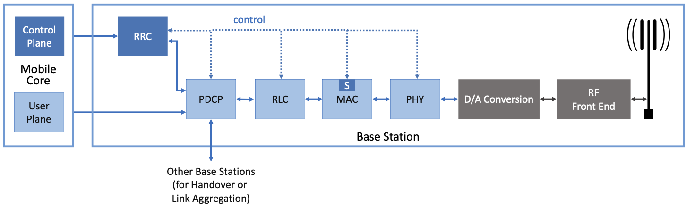
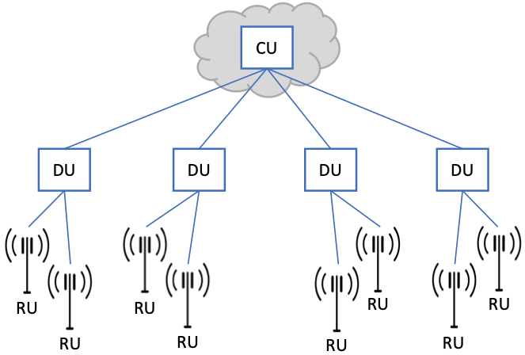
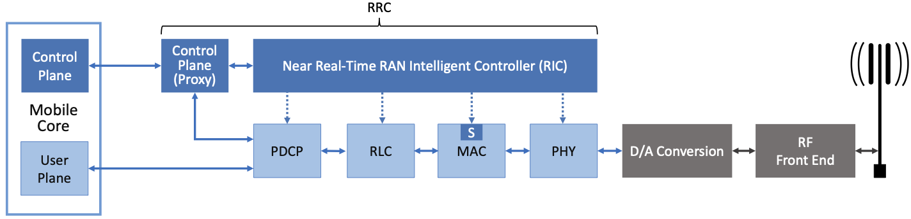
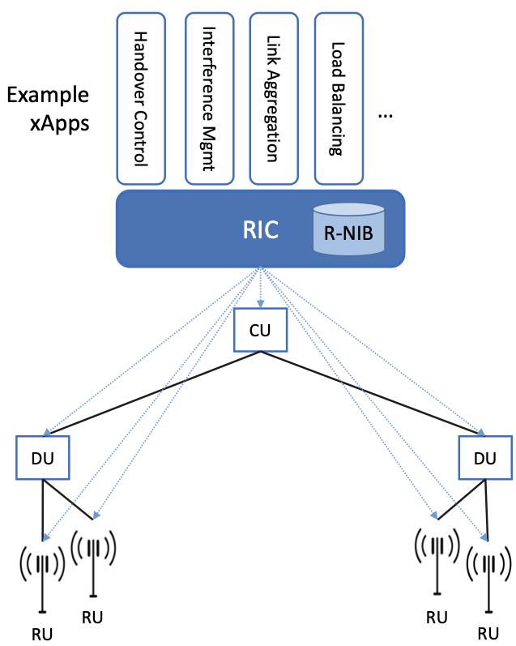
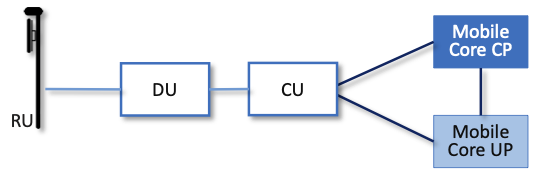

Chapter 4:  Radio Access Network
================================

.. This chapter would benefit from one or two "case studies" of xApps:
   detail the info they collect, decisions they make, and settings
   they push. Perhaps using this to contrast different "decision
   points" would help explain the value of the three control loops
   called out in the last section (which would be a good place to put
   these examples).

The high-level description of the RAN in Chapter 2 was mostly silent
about the RAN's internal structure. We now focus on those details, and
in doing so, explain how the RAN is being transformed in 5G.

You can think of the RAN as having one main job: to transfer packets
between the mobile core and a set of UEs. This means it is deeply
involved in the management and scheduling of radio spectrum that we
discussed in the last chapter, but there is more to it than that. We
start by describing the stages in the RAN's packet processing
pipeline, and then showing how these stages are being disaggregated,
distributed, and implemented.

Note that the deconstruction of the RAN presented in this chapter
represents a combination of standardized specifications and
implementation strategies. The former continues to be under the
purview of the 3GPP, but the latter are primarily influenced by a
second organization: the *Open-RAN Alliance (O-RAN)* introduced in
Chapter 1. O-RAN is led by network operators with the goal of
developing a software-based implementation of the RAN that eliminates
vendor lock-in. Such business forces are certainly a factor in where
5G mobile networks are headed, but our goal in this chapter is to
identify the technical design decisions involved in that evolution.

4.1 Packet Processing Pipeline
------------------------------

:numref:`Figure %s <fig-pipeline>` shows the packet processing stages
historically bundled in base stations, as specified by the 3GPP
standard. Note that the figure depicts the base station as a pipeline
(running left-to-right for packets sent to the UE) but it is equally
valid to view it as a protocol stack (as is typically done in official
3GPP documents). Also note that (for now) we are agnostic as to how
these stages are implemented. Since we are ultimately heading
towards a cloud-based implementation, one possible implementation
strategy would be a microservice per box.

.. _fig-pipeline:

    RAN processing pipeline, including both user and
    control plane components.

The key stages are as follows.

-  RRC (Radio Resource Control) → Responsible for configuring the
   coarse-grained and policy-related aspects of the pipeline. The RRC runs
   in the RAN's control plane; it does not process packets in the user
   plane.

-  PDCP (Packet Data Convergence Protocol) → Responsible for compressing
   and decompressing IP headers, ciphering and deciphering, integrity
   protection and integrity verification, duplication, reordering and
   in-order delivery, and out-of-order delivery.

-  RLC (Radio Link Control) → Responsible for segmentation and
   reassembly, as well as reliably transmitting/receiving segments
   using error correction through ARQ (automatic repeat request).

-  MAC (Media Access Control) → Responsible for buffering, multiplexing
   and demultiplexing segments, including all real-time scheduling
   decisions about what segments are transmitted when. Also able to make
   a “late” forwarding decision (i.e., to alternative carrier
   frequencies, including Wi-Fi).

-  PHY (Physical Layer) → Responsible for coding and modulation (as
   discussed in Chapter 3), including FEC.

The last two stages in :numref:`Figure %s <fig-pipeline>` (D/A
conversion and the RF front-end) are beyond the scope of this book.

While it is simplest to view the stages in :numref:`Figure %s
<fig-pipeline>` as a pure left-to-right pipeline, the Scheduler
described in Section 3.2 (denoted "S" in the figure) runs in the MAC
stage/layer, and implements the “main loop” for outbound traffic:
It reads data from the upstream RLC and schedules transmissions to the
downstream PHY. Since the Scheduler determines the number of bytes to
transmit to a given UE during each time period (based on all the
factors outlined in Chapter 3), it must request (get) a segment of
that length from the upstream queue. In practice, the size of the
segment that can be transmitted on behalf of a single UE during a
single scheduling interval can range from a few bytes to an entire IP
packet.

Also note that a combination of the RRC and PDCP are responsible for
the observation made in Section 2.3: that a *"base station can be
viewed as a specialized forwarder"*. The control plane logic that
decides whether this base station should continue processing a packet
or forward it to another base station runs in the RRC, and the
corresponding user plane mechanism that carries out the forwarding
decision is implemented in the PDCP. The interface between these two
elements is defined by the 3GPP spec, but the decision-making logic is
an implementation choice (and historically proprietary). This control
logic is generically referred as the *Radio Resource Management
(RRM)*, not to be confused with the standards-defined RRC stage
depicted in :numref:`Figure %s <fig-pipeline>`.

4.2 Split RAN
-------------

The next step is to understand how the functionality outlined above is
partitioned between physical elements, and hence, “split” across
centralized and distributed locations. The dominant option has
historically been "no split," with the entire pipeline shown in
:numref:`Figure %s <fig-pipeline>` running in the base station. Going
forward, the 3GPP standard has been extended to allow for multiple
split-points, with the partition shown in :numref:`Figure %s
<fig-split-ran>` being actively pursued by the operator-led O-RAN
Alliance. It is the split we adopt throughout the rest of this
book. Note that the split between centralized and distributed
components mirrors the split made in SDN, with similar motivations. We
discuss further how SDN techniques are applied to the RAN below.

.. _fig-split-ran:
.. figure:: figures/sdn/Slide2.png
    :width: 600px
    :align: center

    Split RAN processing pipeline distributed across a
    Central Unit (CU), Distributed Unit (DU), and Radio Unit (RU).

This results in a RAN-wide configuration similar to that shown in
:numref:`Figure %s <fig-ran-hierarchy>`, where a single *Central Unit
(CU)* running in the cloud serves multiple *Distributed Units (DUs)*,
each of which in turn serves multiple *Radio Units (RUs)*. Critically,
the RRC (centralized in the CU) is responsible for making only
near-real-time configuration and control decisions, while the
Scheduler that is part of the MAC stage is responsible for all
real-time scheduling decisions.

.. _fig-ran-hierarchy:

    Split RAN hierarchy, with one CU serving multiple DUs,
    each of which serves multiple RUs.

Because scheduling decisions for radio transmission are made by the
MAC layer in real time, a DU needs to be “near” (within 1ms) the RUs
it manages. (You can't afford to make scheduling decisions based on
out-of-date channel information.) One familiar configuration is to
co-locate a DU and an RU in a cell tower. But when an RU corresponds
to a small cell, many of which might be spread across a modestly-sized
geographic area (e.g., a mall, campus, or factory), then a single DU
would likely service multiple RUs. The use of mmWave in 5G is likely
to make this latter configuration all the more common.

Also note that the Split RAN changes the nature of the Backhaul
Network, which originally connected the base stations back to the
Mobile Core. With the Split RAN there are multiple connections, which
are officially labeled as follows.

-  RU-DU connectivity is called the Fronthaul
-  DU-CU connectivity is called the Midhaul
-  CU-Mobile Core connectivity is called the Backhaul

For more insight into design considerations for interconnecting the
distributed components of a Split RAN, we recommend the NGMN Alliance
Report.

.. _reading_backhaul:
.. admonition:: Further Reading

    `RAN Evolution Project: Backhaul and Fronthaul Evolution
    <https://www.ngmn.org/wp-content/uploads/NGMN_RANEV_D4_BH_FH_Evolution_V1.01.pdf>`__.
    NGMN Alliance Report, March 2015.

One observation about the CU (which becomes relevant in Chapter 6 when
we incorporate it into a managed cloud service) is that one might
co-locate the CU and Mobile Core in the same cluster, meaning the
backhaul is implemented in the cluster switching fabric. In such a
configuration, the midhaul then effectively serves the same purpose as
the original backhaul, and the fronthaul is constrained by the
predictable/low-latency requirements of the MAC stage's real-time
scheduler. This situation is further complicated by the fact that the
mobile core itself may be disaggregated, as discussed in Chapter 5.

A second observation about the CU shown in :numref:`Figure %s
<fig-split-ran>` is that it encompasses two functional blocks—the RRC
and the PDCP—which lie on the RAN's control plane and user plane,
respectively. This separation is consistent with the idea of CUPS
introduced in Chapter 2, and plays an increasingly important role as
we dig deeper into how the RAN is implemented. For now, we note that
the two parts are sometimes referred to as the CU-CP and CU-UP,
respectively.

We conclude our description of the split RAN architecture with the
alternative depiction in :numref:`Figure %s <fig-split-alt>`.
For completeness, this figure identifies the standardized interfaces
between the components (e.g., N2, N3, F1-U, F1-C, and Open Fronthaul).
We're not going to talk about these interfaces, except to note that
they exist and there is a corresponding 3GPP specification that spells
out the details. Instead, we're going to comment on the availability
of open source implementations for each component.

.. _fig-split-alt:
.. figure:: figures/sdn/Slide10.png
    :width: 150px
    :align: center

    Alternative depiction of the Split RAN components, showing the
    3GPP-specified inter-unit interfaces.

With respect to the Central Unit, most of the complexity is in the
CU-CP, which, as we'll see in the next section, is being re-engineered
using SDN, with open source solutions available. With respect to the
Radio Unit, nearly all the complexity is in D/A conversion and how the
resulting analog signal is amplified. Incumbent vendors have
significant proprietary know-how in this space, which will almost
certainly remain closed.

With respect to the Distributed Unit, the news is mixed, and
correspondingly, the figure shows more detail. The High-PHY
module—which corresponds to all but the RF modulation step of
:numref:`Figure %s <fig-modulation>` in Section 3.1—is one of the most
complex components in the RAN stack. An open source implementation of
the High-PHY, known as FlexRAN, exists and is widely used in
commercial products. The only caveat is that the software license
restricts usage to Intel processors, although it is also the case that
the FlexRAN software exploits Intel-specific hardware capabilities. As
for the rest of the DU, the MAC is the other source of high-value
closed technology, particularly in how scheduling is done. There is an
open source version made available by the Open Air Initiative (OAI),
but its usage is restricted to research-only deployments.

.. _reading_du-impl:
.. admonition:: Further Reading

    `FlexRAN: Reference Architecture for Wireless Access
    <https://www.intel.com/content/www/us/en/developer/topic-technology/edge-5g/tools/flexran.html>`__.

    `Open Air Interface  <https://openairinterface.org/>`__.

4.3 Software-Defined RAN
------------------------

We now describe how the RAN is being implemented according to SDN
principles, resulting in an SD-RAN. The key architectural insight is
shown in :numref:`Figure %s <fig-rrc-split>`, where the RRC from
:numref:`Figure %s <fig-pipeline>` is partitioned into two
sub-components: the one on the left provides a 3GPP-compliant way for
the RAN to interface to the Mobile Core's control plane (the figure
labels this sub-component as a "Proxy"), while the one on the right
opens a new programmatic API for exerting software-based control over
the pipeline that implements the RAN user plane.

To be more specific, the left sub-component simply forwards control
packets between the Mobile Core and the PDCP, providing a path over
which the Mobile Core can communicate with the UE for control
purposes, whereas the right sub-component implements the core of the
RRC's control functionality (which as we explained in Section 4.1 is
also known as RRM). This latter component is commonly referred to as
the *RAN Intelligent Controller (RIC)* in O-RAN architecture
documents, so we adopt this terminology. The "Near-Real Time"
qualifier indicates the RIC is part of 10-100ms control loop
implemented in the CU, as opposed to the ~1ms control loop required by
the MAC scheduler running in the DU.

.. _fig-rrc-split:

    RRC disaggregated into a Mobile Core facing control plane
    component (a proxy) and a Near-Real-Time Controller.

Although not shown in :numref:`Figure %s <fig-rrc-split>`, keep in
mind (from :numref:`Figure %s <fig-split-ran>`) that the RRC and the
PDCP form the CU. Reconciling these two figures is a little bit messy, but
to a first approximation, the PDCP corresponds to the CU-UP and
RRC-Proxy corresponds to the CU-CP, with the RIC "lifted out" and
responsible for overseeing both. We postpone a diagram depicting this
relationship until Section 4.5, where we summarize the end-to-end
result. For now, the important takeaway is that the SDN-inspired
refactoring of the RAN is free both to move functionality around and to
introduce new module boundaries, as long as the original 3GPP-defined
interfaces are preserved.

.. _fig-ran-controller:

    Example set of control applications (xApps) running on top of
    Near-Real-Time RAN Controller (RIC), controlling a distributed set
    of Split RAN elements (CU, DU, RU).

Completing the picture, :numref:`Figure %s <fig-ran-controller>` shows
the Near-RT RIC implemented as an SDN Controller hosting a set of SDN
control apps. The RIC maintains a *RAN Network Information Base
(R-NIB)*—a common set of information that can be consumed by numerous
control apps. The R-NIB includes time-averaged CQI values and other
per-session state (e.g., GTP tunnel IDs, 5QI values for the type of
traffic), while the MAC (as part of the DU) maintains the
instantaneous CQI values required by the real-time scheduler. More
generally, the R-NIB includes the following state:

* Fixed Nodes (RU/DU/CU Attributes)

  -  Identifiers
  -  Version
  -  Config Report
  -  RRM config
  -  PHY resource usage

* Mobile Nodes (UE Attributes)

  - Devices

    -  Identifiers
    -  Capability
    -  Measurement Config
    -  State (Active/Idle)

  - Links (*Actual* and *Potential*)

    -  Identifiers
    -  Link Type
    -  Config/Bearer Parameters
    -  5QI Value

* Virtual Constructs (Slice Attributes)

  -  Links
  -  Bearers/Flows
  -  Validity Period
  -  Desired KPIs
  -  MAC RRM Configuration
  -  RRM Control Configuration

The four example Control Apps (xApps) in :numref:`Figure %s
<fig-ran-controller>` do not constitute an exhaustive list, but they
do represent the sweet spot for SDN, with its emphasis on central
control over distributed forwarding. These functions—Link Aggregation
Control, Interference Management, Load Balancing, and Handover
Control—are often implemented by individual base stations with only
local visibility, but they have global consequences. The SDN approach
is to collect the available input data centrally, make a globally
optimal decision, and then push the respective control parameters back
to the base stations for execution. Evidence using an analogous
approach to optimize wide-area networks over many years (see, for
example, B4) is compelling.

.. _reading_b4:
.. admonition:: Further Reading

   For an example of how SDN principles have been successfully applied
   to a production network, we recommend `B4: Experience with a
   Globally-Deployed Software Defined WAN
   <https://cseweb.ucsd.edu/~vahdat/papers/b4-sigcomm13.pdf>`__.  ACM
   SIGCOMM, August 2013.

One way to characterize xApps is based on the current practice of
controlling the mobile link at two different levels. At a fine-grained
level, per-node and per-link control are conducted using the RRM
functions that are distributed across the individual base stations.\
[#]_ RRM functions include scheduling, handover control, link and
carrier aggregation control, bearer control, and access control. At a
coarse-grained level, regional mobile network optimization and
configuration is conducted using *Self-Organizing Network (SON)*
functions. These functions oversee neighbor lists, manage load
balancing, optimize coverage and capacity, aim for network-wide
interference mitigation, manage centrally configured parameters, and
so on. As a consequence of these two levels of control, it is not
uncommon to see reference to *RRM Applications* and *SON
Applications*, respectively, in O-RAN documents for SD-RAN. For
example, the Interference Management and Load Balancing xApps in
:numref:`Figure %s <fig-ran-controller>` are SON Applications, while
the other two xApps are RRM Applications.

.. [#] Pedantically, Radio Resource Management (RRM) is another name
       for the collection of control functionality typically
       implemented in the RRC stage of the RAN pipeline.

Keep in mind, however, that this characterization of xApps is based on
past (pre-SDN) implementations of the RAN. This is helpful as the
industry transitions to SD-RAN, but the situation is likely to change.
SDN is transforming the RAN, so new ways of controlling the
RAN—resulting in applications that do not fit neatly into the RRM vs SON
dichotomy—can be expected to emerge over time.

4.4 Near Real-Time RIC
----------------------

Drilling down to the next level of detail, :numref:`Figure %s
<fig-ric>` shows an exemplar implementation of a RIC based on a
retargeting of the Open Network OS (ONOS) for the SD-RAN use
case. ONOS (described in our SDN book) was originally designed to
support traditional wireline network switches using standard
interfaces (OpenFlow, P4Runtime, etc.). For the SD-RAN use case, the
ONOS-based RIC instead supports a set of RAN-specific north- and
south-facing interfaces, but internally takes advantage of the same
collection of subsystems (microservices) as in the wireline case.\
[#]_

.. [#] Technically, the O-RAN definition of the RIC refers to the
       combination of xApps and the underlying platform (in our case
       ONOS), but we emphasize the distinction between the two, in keeping
       with the SDN model of distinguishing between the Network OS
       and the suite of Control Apps that run on it.

.. _fig-ric:
.. figure:: figures/sdn/Slide6.png
    :width: 400px
    :align: center

    O-RAN compliant RAN Intelligent Controller (RIC) built by adapting
    and extending ONOS.

Specifically, the ONOS-based RIC includes a Topology Service to keep
track of the fixed RAN infrastructure, a Device Service to track the
UEs, and a Configuration Service to manage RAN-wide configuration
state. All three of these services are implemented as Kubernetes-based
microservices, and take advantage of a scalable key-value store.

Of the three interfaces called out in :numref:`Figure %s <fig-ric>`,
the **A1** and **E2** interfaces are based on pre-existing 3GPP
standards. The third, **xApp SDK**, is specific to the ONOS-based
implementation. The O-RAN Alliance is using it to drive towards a
unified API (and corresponding SDK) for building RIC-agnostic xApps.

The A1 interface provides a means for the mobile operator's management
plane—typically called the *OSS/BSS (Operations Support System /
Business Support System)* in the Telco world—to configure the RAN. We
briefly introduced the OSS/BSS in Section 2.5, but all you need to
know about it for our purposes is that such a component sits at the
top of all Telco software stacks. It is the source of all
configuration settings and business logic needed to operate a
network. You can think of A1 as the RAN's counterpart to gNMI/gNOI
(gRPC Network Management Interface/gRPC Network Operations Interface),
a pair of configuration APIs commonly used to configure commodity
cloud hardware.

The Near-RT RIC uses the E2 interface to control the underlying RAN
elements, including the CU, DUs, and RUs. A requirement of the E2
interface is that it be able to connect the Near-RT RIC to different
types of RAN elements from different vendors. This range is reflected
in the API, which revolves around a *Service Model* abstraction. The
idea is that each RAN element advertises a Service Model, which
effectively defines the set of RAN Functions the element is able to
support. The RIC then issues a combination of the following four
operations against this Service Model.

* **Report:** RIC asks the element to report a function-specific value setting.
* **Insert:** RIC instructs the element to activate a user plane function.
* **Control:** RIC instructs the element to activate a control plane function.
* **Policy:** RIC sets a policy parameter on one of the activated functions.

Of course, it is the RAN element, through its published Service Model,
that defines the relevant set of functions that can be activated, the
variables that can be reported, and policies that can be set. The
O-RAN community is working on three vendor-agnostic Service
Models. The first, called *Key Performance Measurement* (abbreviated
*E2SM-KPM*), specifies the metrics that can be retrieved from RAN
elements. The second, called *RAN Control* (abbreviated *E2SM-RC*),
specifies parameters that can be set to control RAN elements. The
third, called *Cell Configuration and Control* (abbreviated
*E2SM-CCC*), exposes configuration parameters at the cell level.

In simple terms, E2SM-KPM defines what values can be *read* and
E2SM-RC and E2SM-CCC defines what values can be *written*. Because
the available values can be highly variable across all possible
devices, we can expect different vendors will support only a subset
of the entire collection. This will limit the "universality" the
O-RAN was hoping to achieve in an effort to break vendor lock-in,
but that outcome is familiar to network operators who have been
dealing with divergent *Management Information Bases (MIBs)* since
the earliest days of the Internet.

Finally, the xApp SDK, which is specific to the ONOS-based
implementation, is currently little more than a "pass through" of the
E2 interface. This implies the xApps are expected to be aware of the
available Service Models. One of the challenges the SDK has to deal
with is how data passed to/from the RAN elements is encoded. For
historical reasons, the E2 interface uses ASN.1 formatting, whereas
the ONOS-RIC internally uses gRPC and Protocol Buffers to communicate
between the set of microservices. The south-bound E2 interface in
:numref:`Figure %s <fig-ric>` translates between the two formats. The
SDK currently makes the gRPC-based API available to xApps.

.. _reading_onos:
.. admonition:: Further Reading

   To learn more about the details of ONOS and its interfaces, we
   recommend the chapter in our SDN book that covers it in
   depth. `Software-Defined Networks: A Systems Approach. Chapter 6:
   Network OS <https://sdn.systemsapproach.org/onos.html>`__.

4.5 Control Loops
-----------------

We conclude this description of RAN internals by revisiting the
sequence of steps involved in disaggregation, which, as the previous
three sections reveal, is being pursued in multiple tiers. In doing
so, we tie up several loose ends, and focus attention on the resulting
three control loops.

In the first tier of disaggregation, 3GPP defines multiple options for
how the RAN can be split and distributed, with the pipeline shown in
:numref:`Figure %s <fig-pipeline>` disaggregated into the
independently operating CU, DU, and RU components shown in
:numref:`Figure %s <fig-disagg1>`. The O-RAN Alliance has selected
specific disaggregation options from 3GPP and is developing open
interfaces between these components.

.. _fig-disagg1:

    First tier of RAN disaggregation: Split RAN.

The second tier of disaggregation focuses on the control/user plane
separation (CUPS) of the CU, resulting in the CU-UP and CU-CP shown in
:numref:`Figure %s <fig-disagg2>`. The control plane in question is
the 3GPP control plane, where the CU-UP realizes a pipeline for user
traffic and the CU-CP focuses on control message signaling between
Mobile Core and the disaggregated RAN components (as well as to the
UE).

.. _fig-disagg2:
.. figure:: figures/sdn/Slide8.png
    :width: 450px
    :align: center

    Second tier of RAN disaggregation: CUPS.

The third tier follows the SDN paradigm by separating most of RAN
control (RRC functions) from the disaggregated RAN components, and
logically centralizing them as applications running on an SDN
Controller, which corresponds to the Near-RT RIC shown previously in
:numref:`Figures %s <fig-rrc-split>` and :numref:`%s
<fig-ran-controller>`. This SDN-based disaggregation is repeated in
:numref:`Figure %s <fig-ctl_loops>`, which also shows the
O-RAN-prescribed interfaces A1 and E2 introduced in the previous
section. (Note that all the edges in :numref:`Figures %s
<fig-disagg1>` and :numref:`%s <fig-disagg2>` correspond to
3GPP-defined interfaces, as identified in Section 4.2, but their
details are outside the scope of this discussion.)

.. _fig-ctl_loops:
.. figure:: figures/sdn/Slide9.png
    :width: 800px
    :align: center

    Third tier of RAN disaggregation: SDN.

Taken together, the A1 and E2 interfaces complete two of the three
major control loops of the RAN: the outer (non-real-time) loop has the
Non-RT RIC as its control point and the middle (near-real-time) loop
has the Near-RT RIC as its control point. The third (innermost)
control loop—shown in :numref:`Figure %s <fig-ctl_loops>` running
inside the DU—includes the real-time Scheduler embedded in the MAC
stage of the RAN pipeline. The two outer control loops have rough time
bounds of >>1sec and >10ms, respectively. As we saw in Chapter 2,
the real-time control loop is assumed to be <1ms.

This raises the question of how specific functionality is distributed
between the Non-RT RIC, Near-RT RIC, and DU. Starting with the second
pair (i.e., the two inner loops), it is the case that not all RRC
functions can be centralized; some need to be implemented in the
DU. The SDN-based disaggregation then focuses on those that can be
centralized, with the Near-RT RIC supporting the RRC applications and
the SON applications mentioned in Section 4.3.

.. What's an example of an RRC function that needs to be distributed
   to the DU?

Turning to the outer two control loops, the Near RT-RIC opens the
possibility of introducing policy-based RAN control, whereby
interrupts (exceptions) to operator-defined policies would signal the
need for the outer loop to become involved. For example, one can
imagine developing learning-based controls, where the inference
engines for these controls would run as applications on the Near
RT-RIC, and their non-real-time learning counterparts would run
elsewhere. The Non-RT RIC would then interact with the Near-RT RIC to
deliver relevant operator policies from the Management Plane to the
Near RT-RIC over the A1 interface.
