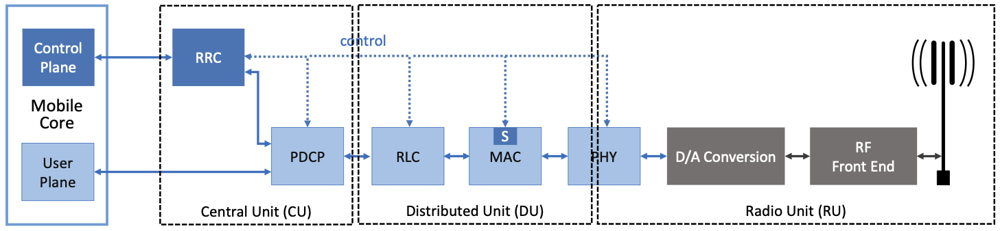
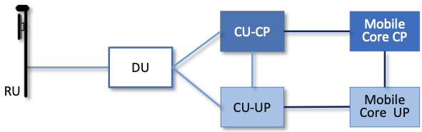
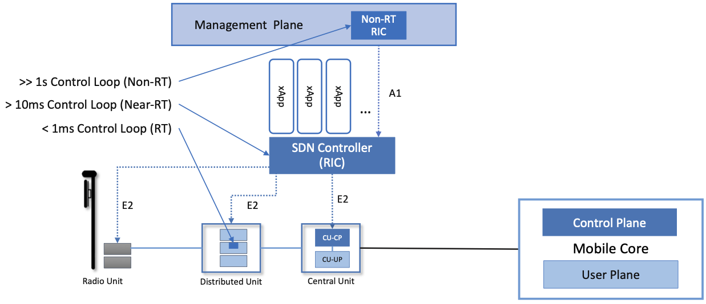

Chapter 4:  Radio Access Network
================================

.. Focuses on the protocol stack that historically runs in the eNodeB,
   but is being disaggregated. Borrows from current Chapter 4,
   expanded to include SD-RAN details (some of which may be
   extracted from the SDN book).

The high-level description of the RAN in Chapter 2 was mostly silent
about the RAN’s internal structure. We now focus on those details, and
in doing so, explain how the RAN is being transformed in 5G. This
involves first describing the stages in the RAN's packet processing
pipeline, and then showing how these stages are being disaggregated,
distributed, and implemented.

Note that the deconstruction of the RAN presented in this chapter
represents a combination of standardized specifications and
implementation strategies. The former continues to be under the
purview of the 3GPP, but the latter is primarily influended by a
second organization: the *Open-RAN Alliance (O-RAN)*. The O-RAN is led
by network operators (AT&T and China Mobile are the founding members),
with the goal of catalyzing a software-based implementation of the RAN
that breaks the vendor lock-in that dominates today’s marketplace.
Such business forces are certainly a factor in where 5G mobile
networks are headed, but our goal in this chapter is to identify the
technical design decisions involved in that evolution.

4.1 Packet Processing Pipeline
------------------------------

:numref:`Figure %s <fig-pipeline>` shows the packet processing stages
historically bundled in base stations, as specified by the 3GPP
standard. Note that the figure depicts the base station as a pipeline
(running left-to-right for packets sent to the UE) but it is equally
valid to view it as a protocol stack (as is typically done in official
3GPP documents). Also note that (for now) we are agnostic as to how
these stages are implemented, but since we are ultimately heading
towards a cloud-based implementation, you can think of each as
corresponding to a microservice (if that is helpful).

.. _fig-pipeline:
.. figure:: figures/sdn/Slide1.png 
    :width: 600px
    :align: center
	    
    RAN processing pipeline, including both user and
    control plane components.

The key stages are as follows.

-  RRC (Radio Resource Control) → Responsible for configuring the
   coarse-grain and policy-related aspects of the pipeline. The RRC runs
   in the RAN’s control plane; it does not process packets on the user
   plane.

-  PDCP (Packet Data Convergence Protocol) → Responsible for compressing
   and decompressing IP headers, ciphering and integrity protection, and
   making an “early” forwarding decision (i.e., whether to send the
   packet down the pipeline to the UE or forward it to another base
   station).

-  RLC (Radio Link Control) → Responsible for segmentation and
   reassembly, including reliably transmitting/receiving segments by
   implementing a form of ARQ (automatic repeat request).

-  MAC (Media Access Control) → Responsible for buffering, multiplexing
   and demultiplexing segments, including all real-time scheduling
   decisions about what segments are transmitted when. Also able to make
   a “late” forwarding decision (i.e., to alternative carrier
   frequencies, including Wi-Fi).

-  PHY (Physical Layer) → Responsible for coding and modulation (as
   discussed in an earlier chapter), including FEC.

The last two stages in :numref:`Figure %s <fig-pipeline>` (D/A
conversion and the RF front-end) are beyond the scope of this book.

While it is simplest to view the stages in :numref:`Figure %s
<fig-pipeline>` as a pure left-to-right pipeline, the Scheduler
described in Section 3.2 (denoted "S" in the figure) runs in the MAC
stage, and implements the “main loop” for outbound traffic: It reads
data from the upstream RLC and schedules transmissions to the
downstream PHY.  Since the Scheduler determines the number of bytes to
transmit to a given UE during each time period (based on all the
factors outlined in Chapter 3), it must request (get) a segment of
that length from the upstream queue. In practice, the size of the
segment that can be transmitted on behalf of a single UE during a
single scheduling interval can range from a few bytes to an entire IP
packet.

4.2 Split RAN
-------------

The next step is to understand how the functionality outlined above is
partitioned between physical elements, and hence, “split” across
centralized and distributed locations. The dominant option has
historically been "no split," with the entire pipeline shown in
:numref:`Figure %s <fig-pipeline>` running in the base station.  Going
forward, the 3GPP standard has been extended to allow for multiple
split-points, with the partition shown in :numref:`Figure %s
<fig-split-ran>` being actively pursued by the operator-led O-RAN
Alliance. It is the split we adopt throughout the rest of this book.

.. _fig-split-ran:

    Split-RAN processing pipeline distributed across a
    Central Unit (CU), Distributed Unit (DU), and Radio Unit (RU).

This results in a RAN-wide configuration similar to that shown in
:numref:`Figure %s <fig-ran-hierarchy>`, where a single *Central Unit
(CU)* running in the cloud serves multiple *Distributed Units (DUs)*,
each of which in turn serves multiple *Radio Units (RUs)*. Critically,
the RRC (centralized in the CU) is responsible for making only
near-real-time configuration and control decisions, while the
Scheduler that is part of the MAC stage is responsible for all
real-time scheduling decisions.

.. _fig-ran-hierarchy:
.. figure:: figures/sdn/Slide3.png 
    :width: 400px
    :align: center
	    
    Split-RAN hierarchy, with one CU serving multiple DUs,
    each of which serves multiple RUs.

Because scheduling decisions for radio transmission are made by the
MAC layer in real time, a DU needs to be “near” (within 1ms) the RUs
it manages. (You can't afford to make scheduling decisions based on
out-of-date channel information.) One familiar configuration is to
co-locate a DU and an RU in a cell tower. But when an RU corresponds
to a small cell, many of which might be spread across a modestly-sized
geographic area (e.g., a mall, campus, or factory), then a single DU
would likely service multiple RUs. The use of mmWave in 5G is likely
to make this later configuration all the more common.

Also note that the split-RAN changes the nature of the Backhaul
Network, which originally connected the base stations back to the
Mobile Core.  With the split-RAN there are multiple connections, which
are officially labeled as follows.

-  RU-DU connectivity is called the Fronthaul
-  DU-CU connectivity is called the Midhaul
-  CU-Mobile Core connectivity is called the Backhaul

One observation about the CU (which becomes relevant in Chapter 6 when
we incorporate it into a managed cloud service) is that one might
co-locate the CU and Mobile Core in the same cluster, meaning the
backhaul is implemented in the cluster switching fabric. In such a
configuration, the midhaul then effectively serves the same purpose as
the original backhaul, and the fronthaul is constrained by the
predictable/low-latency requirements of the MAC stage’s real-time
scheduler.

A second observation about the CU shown in :numref:`Figure %s
<fig-split-ran>` is that it encompasses two functional blocks—the RRC
and the PDCP—which lie on the RAN's control plane and user plane,
respectively. This separation is consistent with the idea of CUPS
introduced in Chapter 2, and plays an increasingly important role as
we dig deeper into how the RAN is implemented. For now, we note that
the two parts are sometimes referred to as the CU-C and CU-U,
respectively.

.. _reading_backhaul:
.. admonition:: Further Reading

    For more insight into design considerations for
    interconnecting the distributed components of a Split RAN, see
    `RAN Evolution Project: Backhaul and Fronthaul Evolution
    <https://www.ngmn.org/wp-content/uploads/NGMN_RANEV_D4_BH_FH_Evolution_V1.01.pdf>`__.
    NGMN Alliance Report, March 2015.

4.3 Software-Defined RAN
------------------------

We now describe how the RAN is being implemented according to SDN
principles, resulting in an SD-RAN. The key architectural insight is
shown in :numref:`Figure %s <fig-rrc-split>`, where the RRC from
:numref:`Figure %s <fig-pipeline>` is partitioned into two
sub-components: the one on the left provides a 3GPP-compliant way for
the RAN to interface to the Mobile Core’s control plane (the figure
labels this sub-component as a "Proxy"), while the one on the right
opens a new programmatic API for exerting software-based control over
the pipeline that implements the RAN user plane.

To be more specific, the left sub-component simply forwards control
packets between the Mobile Core and the PDCP, providing a path over
which the Mobile Core can communicate with the UE for control
purposes, whereas the right sub-component implements the core of the
RRC’s control functionality. This component is commonly referred to as
the *RAN Intelligent Controller (RIC)* in O-RAN architecture
documents, so we adopt this terminology.  The "Near-Real Time"
qualifier indicates the RIC is part of 10-100ms control loop implemented
in the CU, as opposed to the ~1ms control loop required by the MAC
scheduler running in the DU.

.. _fig-rrc-split:
.. figure:: figures/sdn/Slide4.png 
    :width: 600px
    :align: center
	    
    RRC disaggregated into a Mobile Core facing control plane
    component (a proxy) and a Near-Real-Time Controller.

Although not shown in :numref:`Figure %s <fig-rrc-split>`, keep in
mind (from :numref:`Figure %s <fig-split-ran>`) that the RRC the PDCP,
form the CU. Trying to reconcile these two figures is a little bit
messy, but to a first approximation, the PDCP corresponds to the CU-U
and RRC-Proxy corresponds to the CU-C, with the RIC "lifted out" and
responsible for overseeing both.  We postpone a diagram depicting this
relationship until Section 4.5, where we summarize the end-to-end
result. For now, the important takeaway is that the SDN-inspired
refactoring of the RAN is free to both move functionality around and
introduce new module boundaries, as long as the original 3GPP-defined
interfaces are preserved.

Completing the picture, :numref:`Figure %s <fig-ran-controller>` shows
the Near-RT RIC implemented as an SDN Controller hosting a set of SDN
control apps. The RIC maintains a *RAN Network Information Base
(R-NIB)*—a common set of information that can be consumed by numerous
control apps. The R-NIB includes time-averaged CQI values and other
per-session state (e.g., GTP tunnel IDs, QCI values for the type of
traffic), while the MAC (as part of the DU) maintains the
instantaneous CQI values required by the real-time scheduler.
Specifically, the R-NIB includes the following state.

* Fixed Nodes (RU/DU/CU Attributes)

  -  Identifiers
  -  Version
  -  Config Report
  -  RRM config
  -  PHY resource usage

* Mobile Nodes (UE Attributes)

  - Devices

    -  Identifiers
    -  Capability
    -  Measurement Config
    -  State (Active/Idle)

  - Links (*Actual*  and *Potential*)

    -  Identifiers
    -  Link Type
    -  Config/Bearer Parameters
    -  QCI Value

* Virtual Constructs (Slices Attributes)

  -  Links
  -  Bearers/Flows
  -  Validity Period
  -  Desired KPIs
  -  MAC RRM Configuration
  -  RRM Control Configuration

.. _fig-ran-controller:
.. figure:: figures/sdn/Slide5.png 
    :width: 400px
    :align: center
	    
    Example set of control applications (xApps) running on top of
    Near-Real-Time RAN Controller (RIC), controlling a distributed set
    of Split-RAN elements (CU, DU, RU).

The four example Control Apps (xApps) in :numref:`Figure %s
<fig-ran-controller>` are not intended to be an exhaustive list, but
they do represent the sweet spot for SDN, with its emphasis on central
control over distributed forwarding. These functions—Link Aggregation
Control, Interference Management, Load Balancing, and Handover
Control—are currently implemented by individual base stations with
only local visibility, but they have global consequences. The SDN
approach is to collect the available input data centrally, make a
globally optimal decision, and then push the respective control
parameters back to the base stations for execution. Evidence using an
analogous approach to optimize wide-area networks over many years (see
for example B4) is compelling.

.. _reading_b4:
.. admonition:: Further Reading

   For an example of how SDN principles have been successfully applied
   to a production network, we recommend `B4: Experience with a
   Globally-Deployed Software Defined WAN
   <https://cseweb.ucsd.edu/~vahdat/papers/b4-sigcomm13.pdf>`__.  ACM
   SIGCOMM, August 2013.

One way to characterize xApps is based on the current practice of
controlling the mobile link at two different levels. At a fine-grain
level, per-node and per-link control is conducted using Radio Resource
Management (RRM) functions that are distributed across the individual
base stations.  RRM functions include scheduling, handover control,
link and carrier aggregation control, bearer control, and access
control.  At a coarse-grain level, regional mobile network
optimization and configuration is conducted using *Self-Organizing
Network (SON)* functions. These functions oversee neighbor lists,
manage load balancing, optimize coverage and capacity, aim for
network-wide interference mitigation, centrally configure parameters,
and so on. As a consequence of these two levels of control, it is not
uncommon to see reference to *RRM Applications* and *SON
Applications*, respectively, in O-RAN documents for SD-RAN. For
example, the Interference Managment xApp in :numref:`Figure %s
<fig-ran-controller>` is a SON Application, while the other three
xApps are RRM Applications.

Note that this characterization of xApps based on past (pre-SDN)
implementations of the RAN is helpful as the industry transitions to
SD-RAN, one could argue that is it will not be particularly useful in
the long-term. SDN brings a transfomative change to the RAN, and we
can expect new ways of controlling the RAN that do fit neatly into the
RRC or SON buckets to emerge over time.

4.4 Near Real-Time RIC
----------------------

.. This is where we talk about some implementation details for the  
   ONOS RIC. Currently cut-and-pasted from SDN book, where there  
   was significant assumed knowledge of ONOS.

Drilling down to the next level of detail, :numref:`Figure %s
<fig-ric>` shows an exemplar implementation of a RIC based on a
retargeting of the Open Network OS (ONOS) for the SD-RAN use
case. ONOS was originally designed to support traditional wireline
network switches using a combination of OpenFlow, P4Runtime, gNMI, and
gNOI interfaces. The ONOS-based RIC instead supports a set of
RAN-specific north- and south-facing interfaces, but internally takes
advantage of the same collection of subsystems (microservices) as
in the wireline case.

.. _fig-ric:
.. figure:: figures/sdn/Slide6.png
    :width: 400px
    :align: center

    O-RAN compliant RAN Intelligent Controller (RIC) built by adapting
    and extending ONOS.

Specifically, the ONOS-based RIC includes a Topology Service to keep
track of the fixed RAN infrastructure, a Device Service to track and
control the mobile devices, and a Configuration Service to manage
RAN-wide configuration state. All three of these services are
implemented as Kubernetes-based microservices, and take advantage of a
scalable Key/Value Store.

Returning to the three interfaces called out in :numref:`Figure %s
<fig-ric>`, the first two (**A1** and **E2**) are based on
pre-existing 3GPP standards, with the O-RAN well on its way to
defining standardized extensions. The third, denoted **xApp SDK** in
:numref:`Figure %s <fig-ric>`, is specific to the ONOS-based
implementation. The O-RAN is using it to inform a convergence on a
unified API (and corresponding SDK) for building RIC-agnostic xApps.

The A1 interface provides a means for the mobile operator's management
plane—typically called the *OSS/BSS (Operations Support System /
Business Support System)* in the Telco world—to configure the RAN.  We
have not discussed the Telco OSS/BSS up to this point, but it is safe
to assume such a component sits at the top of any Telco software
stack. It is the source of all configuration settings and business
logic needed to operate a network. You can think of it as the RAN
counterpart to gNMI/gNOI, a pair of configuration APIs commonly used
to configure cloud devices.

The Near-RT RIC uses the E2 interface to control the underlying RAN
elements, including the CU, DUs, and RUs. A requirement of the E2
interface is that it be able to connect the Near-RT RIC to different
types of RAN elements from different vendors. This range is reflected
in the API, which revolves around a *Service Model* abstraction. The
idea is that each RAN element advertises a Service Model, which
effectively defines the set of RAN Functions the element is able to
support. The RIC then issues a combination of the following four
operations against this Service Model.

* **Report:** RIC asks the element to report a function-specific value setting.
* **Insert:** RIC instructs the element to activate a user plane function.
* **Control:** RIC instructs the element to activate a control plane function.
* **Policy:** RIC sets a policy parameter on one of the activated functions.

Of course, it is the RAN element, through its published Service Model,
that defines the relevant set of functions that can be activated, the
variables that can be reported, and policies that can be set.

Finally, the xApp SDK, which is specific to the ONOS-based
implementation, is currently little more than a "pass through" of the
E2 interface, which implies the xApps must be aware of the available
Service Models. This is problematic in that it implicitly couples
applications with devices, but defining a device-agnostic version is
still a work-in-progress.

4.5 Control Loops
-----------------

.. The way to tie everything together is to show the full
   top-to-bottom picture with the three control loops.

   What's RRM?

We conclude this description of RAN internals by re-visiting the
sequence of steps involved in disaggregation, which as the previous
three sections reveal, is being pursued in multiple tiers. In doing
so, we tie up several loose ends, and focus attention on the resulting
three control loops.

In the first tier of disaggregation, 3GPP standards provide multiple
options of how horizontal RAN splits can take place. Horizontal
disaggregation basically splits the RAN pipeline shown in
:numref:`Figure %s <fig-pipeline>` into the independently operating
components shown in :numref:`Figure %s <fig-disagg1>` illustrates
horizontal disaggregation of the RAN from a single base station into
three distinct components: CU, DU and RU. The O-RAN Alliance has
selected specific disaggregation options from 3GPP and is developing
open interfaces between these components.

.. _fig-disagg1:
.. figure:: figures/sdn/Slide7.png 
    :width: 450px 
    :align: center 
       
    First tier of RAN disaggregation: Split RAN.

The second tier of disaggregation is vertical, focusing on
control/user plane separation (CUPS) of the CU, and resulting in CU-U
and CU-C shown in :numref:`Figure %s <fig-disagg2>`. The control
plane in question is the 3GPP control plane, where the CU-U realizes a
pipeline for user traffic and the CU-C focuses on control message
signaling between Mobile Core and the disaggregated RAN components (as
well as to the UE).

.. _fig-disagg2:

       
    Second tier of RAN disaggregation: CUPS. 

The third tier follows the SDN paradigm by carrying vertical
disaggregation one step further. It does this by separating most of
RAN control (RRC functions) from the disaggregated RAN components, and
logically centralizing them as applications running on an SDN
Controller, which corresponds to the Near-RT RIC shown previously in
:numref:`Figures %s <fig-rrc-split>` and :numref:`%s
<fig-ran-controller>`. This SDN-based vertical disaggregation is
repeated here in :numref:`Figure %s <fig-ctl_loops>`.  The figure also
shows the additional O-RAN prescribed interfaces, which we already
discussed in the previous section.
    
.. _fig-ctl_loops:

       
    Third tier of RAN disaggregation: SDN.

Taken together, the A1 and E2 interfaces complete two of the three
major control loops of the RAN: the outer (non-real-time) loop has the
Non-RT RIC as its control point and the middle (near-real-time) loop
has the Near-RT RIC as its control point. The third (inner) control
loop, which is shown in :numref:`Figure %s <fig-ctl_loops>` runs
inside the DU: It includes the real-time Scheduler embedded in the MAC
stage of the RAN pipeline. The two outer control loops have rough time
bounds of >>1sec and >10ms, respectively, and as we saw in Chapter 2,
the real-time control loop is assumed to be <1ms.
 
This raises the question of how specific functionality is distributed  
between the Non-RT RIC, Near-RT RIC, and DU. Starting with the second  
pair (i.e., the two inner loops), it is important to recognize that  
not all RRM functions can be centralized. After horizontal and  
vertical CUPS disaggregation, the RRM functions are split between CU-C  
and DU. For this reason, the SDN-based vertical disaggregation focuses  
on centralizing CU-C-side RRM functions in the Near-RT RIC. In
addition to RRM control, this includes all the SON applications.

Turning to the outer two control loops, the Near RT-RIC opens the
possibility of introducing policy-based RAN control, whereby
interrupts (exceptions) to operator-defined policies would signal the
need for the outer loop to become involved. For example, one can
imagine developing learning-based controls, where the inference
engines for these controls would run as applications on the Near
RT-RIC, and their non-real-time learning counterparts would run
elsewhere. The Non-RT RIC would then interact with the Near-RT RIC to
deliver relevant operator policies from the Management Plane to the
Near RT-RIC over the A1 interface.

