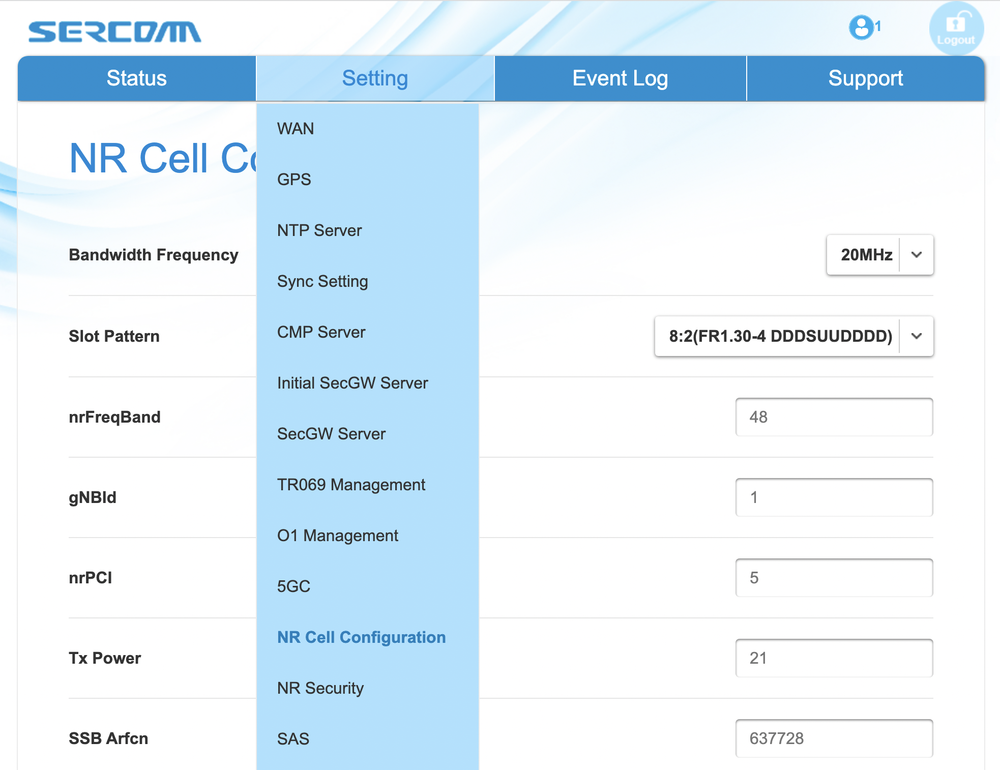

Physical RAN
---------------

We are now ready to replace the emulated RAN with physical gNBs and
real UEs. You will need to edit ``hosts.ini`` to reflect the Aether
cluster you want to support, where just a single server is sufficient
and there is no reason to include nodes in the ``[gnbsim_nodes]`` set.
We also assume you start with a variant of ``vars/main.yml``
customized for running physical 5G radios, which is easy to do:

.. code-block::

   $ cd vars
   $ cp main-gNB.yml main.yml

The following focuses on a single gNB, which we assume is connected to
the same L2 network as the Aether cluster. In our running example,
this implies both are on subnet ``10.76.28.0/24``.

Modify Configuration
~~~~~~~~~~~~~~~~~~~~~~~~

Modify the ``core`` section of ``vars/main.yml`` to match the
following, substituting your local details for ``ens18`` and
``10.76.28.113``. Of particular note, setting ``ran_subnet`` to the
empty string indicates that the gNB is connected to the same physical
L2 network as your Aether cluster, and the new ``values_file`` is
tailored for a physical RAN rather than the emulated RAN we've been
using.

.. code-block::

   core:
       standalone: "true"
       data_iface: ens18
       values_file: "deps/5gc/roles/core/templates/radio-5g-values.yaml"
       ran_subnet: ""
       helm:
           chart_ref: aether/sd-core
           chart_version: 0.12.6
       upf:
           ip_prefix: "192.168.252.0/24"
       amf:
           ip: "10.76.28.113"

Prepare UEs
~~~~~~~~~~~~

5G-connected devices must have a SIM card, which you are responsible
for creating and inserting.  You will need a SIM card writer (these
are readily available for purchase on Amazon) and a PLMN identifier
constructed from a valid MCC/MNC pair. For our purposes, we use two
different PLMN ids: ``315010`` constructed from MCC=315 (US) and
MNC=010 (CBRS), and ``00101`` constructed from MCC=001 (TEST) and
MNC=01 (TEST). You should use whatever values are appropriate for your
local environment.  You then assign an IMSI and two secret keys to
each SIM card. Throughout this section, we use the following values as
exemplars:

* IMSI: each one is unique, matching pattern ``315010*********`` (up to 15 digits)
* OPc: ``69d5c2eb2e2e624750541d3bbc692ba5``
* Key: ``000102030405060708090a0b0c0d0e0f``

Note that the actual config files distributed with OnRamp have IMSIs
constructed using PLMN id ``00101``. Both sets of examples are taken
from working deployments, so either should work as a model you can
emulate in your deployment, although it is certainly easiest to start
with the existing code. So they are easy to distinguish, note that the
IMSIs used in emulations are constructed using PLMN id ``20893``.

Insert the SIM cards into whatever devices you plan to connect to
Aether.  Be aware that not all phones support the CBRS frequency bands
that Aether uses. Aether is known to work with recent iPhones (11 and
greater), Google Pixel phones (4 and greater) and OnePlus phones.  CBRS
may also be supported by recent phones from Samsung, LG Electronics and
Motorola Mobility, but these have not been tested. Note that on each phone
you will need to configure ``internet`` as the *Access Point Name (APN)*.
Another good option is to use a 5G dongle connected to a Raspberry Pi
as a demonstration UE. This makes it easier to run diagnostic tests
from the UE. For example, we have used `APAL's 5G dongle
<https://www.apaltec.com/dongle/>`__ with Aether.

Finally, modify the ``subscribers`` block of the
``omec-sub-provision`` section in file
``deps/5gc/roles/core/templates/radio-5g-values.yaml`` to record the IMSI,
OPc, and Key values configured onto your SIM cards. The block also
defines a sequence number that is intended to thwart replay
attacks. For example, the following code block adds IMSIs between
``315010999912301`` and ``315010999912310``:

.. code-block::

   subscribers:
   - ueId-start: "315010999912301"
     ueId-end: "315010999912310"
     plmnId: "315010"
     opc: "69d5c2eb2e2e624750541d3bbc692ba5"
     key: "000102030405060708090a0b0c0d0e0f"
     sequenceNumber: 135

Further down in the same ``omec-sub-provision`` section you will find
two other blocks that also need to be edited. The first,
``device-groups``, assigns IMSIs to *Device Groups*. You will need to
reenter the individual IMSIs from the ``subscribers`` block that will
be part of the device-group:

.. code-block::

   device-groups:
   - name:  "5g-user-group1"
      imsis:
          - "315010999912301"
          - "315010999912302"
          - "315010999912303"

The second block, ``network-slices``, sets various parameters
associated with the *Slices* that connect device groups to
applications.  Here, you will need to reenter the PLMN information,
with the other slice parameters remaining unchanged (for now):

.. code-block::

   plmn:
       mcc: "315"
       mnc: "010"

Aether supports multiple *Device Groups* and *Slices*, but the data
entered here is purposely minimal; it's just enough to bring up and
debug the installation. Over the lifetime of a running system,
information about *Device Groups* and *Slices* (and the other
abstractions they build upon) should be entered via the ROC, as
described the section on Runtime Control. When you get to that point,
Ansible variable ``standalone`` in ``vars/main.yml`` (which
corresponds to the override value assigned to
``provision-network-slice`` in ``radio-5g-values.yaml``) should be set
to ``false``. Doing so causes the ``device-groups`` and
``network-slices`` blocks of ``radio-5g-values.yaml`` to be
ignored. The ``subscribers`` block is always required to configure
SD-Core.

Bring Up Aether
~~~~~~~~~~~~~~~~~~~~~

You are now ready to bring Aether on-line. We assume a fresh install
by typing the following:

.. code-block::

   $ make aether-k8s-install
   $ make aether-5gc-install

You can verify the installation by running ``kubectl`` just as you did
in earlier stages. Note that we postpone bringing up the AMP until
later so as to have fewer moving parts to debug.

gNodeB Setup
~~~~~~~~~~~~~~~~~~~~

Once the SD-Core is up and running, we are ready to bring up the
physical gNB. The details of how to do this depend on the specific
device you are using, but we identify the main issues you need to
address using SERCOMM's 5G femto cell as an example. That particular
device uses the n78 band and is on the ONF MarketPlace, where you can
also find a User's Guide.

.. _reading_sercomm:
.. admonition:: Further Reading

   `SERCOMM – SCE5164-B78 INDOOR SMALL CELL
   <https://opennetworking.org/products/sercomm-sce5164-b78/>`__.

For the purposes of the following description, we assume the gNB is
assigned IP address ``10.76.28.187``, which per our running example,
is on the same L2 network as our Aether server (``10.76.28.113``).
:numref:`Figure %s <fig-sercomm>` shows a screenshot of the SERCOMM
gNB management dashboard, which we reference in the instructions that
follow:

.. _fig-sercomm:

    Management dashboard on the Sercomm gNB, showing the dropdown
    ``Settings`` menu overlayed on the ``NR Cell Configuration`` page
    (which shows default radio settings).

1. **Connect to Management Interface.** Start by connecting a laptop
   directly to the LAN port on the small cell, pointing your laptop's
   web browser at the device's management page
   (``https://10.10.10.189``).  You will need to assign your laptop an
   IP address on the same subnet (e.g., ``10.10.10.100``).  Once
   connected, log in with the credentials provided by the vendor.

2. **Configure WAN.** Visit the ``Settings > WAN`` page to configure
   how the small cell connects to the Internet via its WAN port,
   either dynamically using DHCP or statically by setting the device's
   IP address (``10.76.28.187``) and default gateway (``10.76.28.1``).

3. **Access Remote Management.** Once on the Internet, it should be
   possible to reach the management dashboard without being directly
   connected to the LAN port (``https://10.76.28.187``).

4. **Connect GPS.** Connect the small cell's GPS antenna to the GPS
   port, and place the antenna so it has line-of-site to the sky
   (i.e., place it in a window). The ``Status`` page of the management
   dashboard should report its latitude, longitude, and fix time.

5. **Spectrum Access System.** One reason the radio needs GPS is so it
   can report its location to a Spectrum Access System (SAS), a
   requirement in the US to coordinate access to the CBRS Spectrum in
   the 3.5 GHz band. For example, the production deployment of Aether
   uses the `Google SAS portal
   <https://cloud.google.com/spectrum-access-system/docs/overview>`__,
   which the small cell can be configured to query periodically. To do
   so, visit the ``Settings > SAS`` page.  Acquiring the credentials
   needed to access the SAS requires you go through a certification
   process, but as a practical matter, it may be possible to test an
   isolated/low-power femto cell indoors before completing that
   process. Consult with your local network administrator.

6. **Configure Radio Parameters.** Visit the ``Settings > NR Cell
   Configuration`` page (shown in the figure) to set parameters that
   control the radio. It should be sufficient to use the default
   settings when getting started.

7. **Configure the PLMN.** Visit the ``Settings > 5GC`` page to set
   the PLMN identifier on the small cell (``00101``) to match the
   MCC/MNC values (``001`` / ``01`` ) specified in the Core.

8. **Connect to Aether Control Plane.** Also on the ``Settings > 5GC``
   page, define the AMF Address to be the IP address of your Aether
   server (e.g., ``10.76.28.113``). Aether's SD-Core is configured to
   expose the corresponding AMF via a well-known port, so the server's
   IP address is sufficient to establish connectivity. The ``Status``
   page of the management dashboard should confirm that control
   interface is established.

9. **Connect to Aether User Plane.** As described in an earlier
   section, the Aether User Plane (UPF) is running at IP address
   ``192.168.252.3``. Connecting to that address requires installing a
   route to subnet ``192.168.252.0/24``. How you install this route is
   device and site-dependent. If the small cell provides a means to
   install static routes, then a route to destination
   ``192.168.252.0/24`` via gateway ``10.76.28.113`` (the server
   hosting Aether) will work. If the small cell does not allow static
   routes (as is the case for the SERCOMM gNB), then ``10.76.28.113``
   can be installed as the default gateway, but doing so requires that
   your server also be configured to forward IP packets on to the
   Internet.

Run Diagnostics
~~~~~~~~~~~~~~~~~

Successfully connecting a UE to the Internet is not a straightforward
exercise. It involves configuring the UE, gNB, and SD-Core software in
a consistent way; establishing SCTP-based control plane (N2) and
GTP-based user plane (N3) connections between the base station and
Mobile Core; and traversing multiple IP subnets along the end-to-end
path.

The UE and gNB provide limited diagnostic tools. For example, it's
possible to run ``ping`` and ``traceroute`` from both. You can also
run the ``ksniff`` tool described in the Networking section, but the
most helpful packet traces you can capture are shown in the following
commands. You can run these on the Aether server, where we use our
example ``ens18`` interface for illustrative purposes:

.. code-block::

   $ sudo tcpdump -i any sctp -w sctp-test.pcap
   $ sudo tcpdump -i ens18 port 2152 -w gtp-outside.pcap
   $ sudo tcpdump -i access port 2152 -w gtp-inside.pcap
   $ sudo tcpdump -i core net 172.250.0.0/16 -w n6-inside.pcap
   $ sudo tcpdump -i ens18 net 172.250.0.0/16 -w n6-outside.pcap

The first trace, saved in file ``sctp.pcap``, captures SCTP packets
sent to establish the control path between the base station and the
Mobile Core (i.e., N2 messages). Toggling "Mobile Data" on the UE,
for example by turning Airplane Mode off and on, will generate the
relevant control plane traffic.

The second and third traces, saved in files ``gtp-outside.pcap`` and
``gtp-inside.pcap``, respectively, capture GTP packets (tunneled
through port ``2152`` ) on the RAN side of the UPF. Setting the
interface to ``ens18`` corresponds to "outside" the UPF and setting
the interface to ``access`` corresponds to "inside" the UPF.  Running
``ping`` from the UE will generate the relevant user plane (N3) traffic.

Similarly, the fourth and fifth traces, saved in files
``n6-inside.pcap`` and ``n6-outside.pcap``, respectively, capture IP
packets on the Internet side of the UPF (which is known as the **N6**
interface in 3GPP). In these two tests, ``net 172.250.0.0/16``
corresponds to the IP addresses assigned to UEs by the SMF. Running
``ping`` from the UE will generate the relevant user plane traffic.

If the ``gtp-outside.pcap`` has packets and the ``gtp-inside.pcap``
is empty (no packets captured), you may run the following commands
to make sure packets are forwarded from the ``ens18`` interface
to the ``access`` interface and vice versa:

.. code-block::

   $ sudo iptables -A FORWARD -i ens18 -o access -j ACCEPT
   $ sudo iptables -A FORWARD -i access -o ens18 -j ACCEPT

Support for eNBs
~~~~~~~~~~~~~~~~~~

Aether OnRamp is geared towards 5G, but it does support physical eNBs,
including 4G-based versions of both SD-Core and AMP. It does not
support an emulated 4G RAN. The 4G scenario uses all the same Ansible
machinery outlined in earlier sections, but uses a variant of
``vars/main.yml`` customized for running physical 4G radios:

.. code-block::

   $ cd vars
   $ cp main-eNB.yml main.yml

Assuming that starting point, the following outlines the key
differences from the 5G case:

1. There is a 4G-specific repo, which you can find in ``deps/4gc``.

2. The ``core`` section of ``vars/main.yml`` specifies a 4G-specific values file:

   ``values_file: "deps/4gc/roles/core/templates/radio-4g-values.yaml"``

3. The ``amp`` section of ``vars/main.yml`` specifies that 4G-specific
   models and dashboards get loaded into the ROC and Monitoring
   services, respectively:

   ``roc_models: "deps/amp/roles/roc-load/templates/roc-4g-models.json"``

   ``monitor_dashboard:  "deps/amp/roles/monitor-load/templates/4g-monitor"``

4. You need to edit two files with details for the 4G SIM cards you
   use. One is the 4G-specific values file used to configure SD-Core:

   ``deps/4gc/roles/core/templates/radio-4g-values.yaml``

   The other is the 4G-specific Models file used to bootstrap ROC:

   ``deps/amp/roles/roc-load/templates/radio-4g-models.json``

5. There are 4G-specific Make targets for SD-Core (e.g., ``make
   aether-4gc-install`` and ``make aether-4gc-uninstall``), but the
   Make targets for AMP (e.g., ``make aether-amp-install`` and ``make
   aether-amp-uninstall``) work unchanged in both 4G and 5G.

The Quick Start and Emulated RAN (gNBsim) deployments are for 5G only,
but revisiting the other sections—substituting the above for their 5G
counterparts—serves as a guide for deploying a 4G version of Aether.
Note that the network is configured in exactly the same way for both
4G and 5G. This is because SD-Core's implementation of the UPF is used
in both cases.
