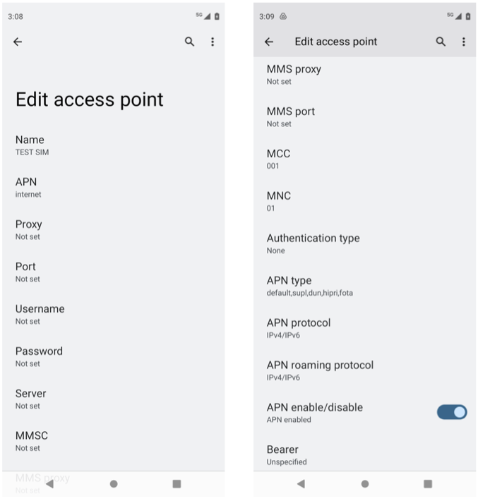

Physical RAN
---------------

We are now ready to replace the emulated RAN with physical gNBs and
real UEs. You will need to edit ``hosts.ini`` to reflect the Aether
cluster you want to support, where just a single server is sufficient
and there is no reason to include nodes in the ``[gnbsim_nodes]`` set.

In addition to the server(s) in your cluster, bringing up a physical
RAN requires the following hardware:

* One or more 5G small cell radios (e.g., MOSO CANOPY 5G INDOOR SMALL CELL).
* One or more 5G-capable UEs (e.g., unlocked Motorola Moto G 5G).
* A SIM reader/writer and associated software (e.g., OYEITIMES MCR3516).
* A set of programmable SIM cards (blank cards likely included with reader/writer).

There are multiple options for each component, but finding a
combination that works together can be challenging. This section makes
several recommendations based on working end-to-end systems. For
simplicity, we pared the above list back to a single example for each
item, but these should not be interpreted as the only possibility.

Note also that our example relies on the availability of spectrum in
the CBRS band, which is available in the United States. Spectrum
options are likely to be different in other countries.

.. admonition:: Troubleshooting Hint

  We are tracking community experience with different hardware in the
  ``#aether-onramp`` channel of the `ONF Workspace
  <https://onf-community.slack.com/>`__, with summaries of different
  combinations people have tried reported in the OnRamp
  `Troubleshooting Wiki Page
  <https://wiki.aetherproject.org/display/HOME/Troubleshooting>`__.

This blueprint assumes you start with a variant of ``vars/main.yml``
customized for running physical 5G radios. This is easy to do:

.. code-block::

   $ cd vars
   $ cp main-gNB.yml main.yml

This section focuses on bringing up a single gNB, and assumes that gNB
is on the same L2 network as the Aether cluster. In our running
example, this implies both are on subnet ``10.76.28.0/24``.

.. admonition:: Troubleshooting Hint

  Be aware that enterprise and campus networks have been known to
  filter packets in ways that impact gNB-to-Core connectivity.
  Fortunately, physical gNBs connect to SD-Core (both the AMF in the
  control plane and the UPF in the user plane) in exactly the same way
  as external instances of gNBsim. Going through the process of
  bringing up gNBsim in a second server, as described in the previous
  section, is a good way to validate that your Core is "gNB-ready".

Modify Configuration
~~~~~~~~~~~~~~~~~~~~~~~~

Modify the ``core`` section of ``vars/main.yml`` to match the
following, substituting your local details for ``ens18`` and
``10.76.28.113``. Of particular note, setting ``ran_subnet`` to the
empty string indicates that the gNB is connected to the same physical
L2 network as your Aether cluster, and the new ``values_file`` is
tailored for a physical RAN rather than the emulated RAN we've been
using.

.. code-block::

   core:
       standalone: "true"
       data_iface: ens18
       values_file: "deps/5gc/roles/core/templates/radio-5g-values.yaml"
       ran_subnet: ""
       helm:
           chart_ref: aether/sd-core
           chart_version: 0.12.6
       upf:
           ip_prefix: "192.168.252.0/24"
       amf:
           ip: "10.76.28.113"

Prepare UEs
~~~~~~~~~~~~

When selecting UEs to connect to Aether, be aware that not all phones
support the CBRS frequency bands that Aether uses. For band n78,
Aether is known to work with recent iPhones (11 and greater), Google
Pixel phones (4 and greater), OnePlus phones, and Moto G 5G
phones. For band n48, Aether is known to work with Moto G 5G and
OnePlus phones; Pixel 7 phones are purported to work as well.  Another
option is to use a 5G dongle connected to a Raspberry Pi as a
demonstration UE. This makes it easier to run diagnostic tests from
the UE. For example, we have used `APAL's 5G dongle
<https://www.apaltec.com/dongle/>`__ with Aether.

5G-connected devices must have a SIM card, which you are responsible
for programming and inserting.  You will need a SIM card writer, such
as the *OYEITIMES MCR3516* (available on Amazon), which comes with
five blank cards. You will need to set the PLMN identifier
(constructed from a valid MCC/MNC pair), the IMSI, and two secret keys
for each SIM card. As working examples, we have used two different
PLMN ids: ``315010`` constructed from MCC=315 (US) and MNC=010 (CBRS),
and ``00101`` constructed from MCC=001 (TEST) and MNC=01 (TEST).  You
should use whatever values are appropriate for your local environment,
where we use the following as a running example throughout this
section:

* IMSI: each one is unique, matching pattern ``315010*********`` (up to 15 digits)
* OPc: ``69d5c2eb2e2e624750541d3bbc692ba5``
* Key: ``000102030405060708090a0b0c0d0e0f``

Note that the actual config files distributed with OnRamp have IMSIs
constructed using PLMN id ``00101``. Both sets of examples are taken
from working deployments (``315010`` for a 4G/eNB and ``00101`` for a
5G/gNB), so in principle either should work as a model you can emulate
in your deployment. As a practical matter, however, it is certainly
easiest (and safest) to start with the existing code.

After inserting the SIM card into the device and powering it up, log
into the phone, select ``Network Settings > SIMs`` and create a new
*Access Point Name (APN)*, configured as shown in :numref:`Figure %s
<fig-apn>`. The entry name (``TEST SIM`` in the example) is arbitrary
and the MCC/MNC pair is set automatically based on the newly inserted
SIM card. The important value is the APN, which is set to
``internet``. This value corresponds to variable ``dnn`` (*Data
Network Name*) defined in
``deps/5gc/roles/core/templates/radio-5g-values.yaml``. Loosely
speaking, the role the APN plays in the mobile network is similar to
the role an SSID plays in a WiFi network.

.. _fig-apn:

    Configure an Access Point Name (APN) for the new SIM card on the UE.

Finally, modify the ``subscribers`` block of the
``omec-sub-provision`` section in file
``deps/5gc/roles/core/templates/radio-5g-values.yaml`` to record the IMSI,
OPc, and Key values configured onto your SIM cards. The block also
defines a sequence number that is intended to thwart replay
attacks. For example, the following code block adds IMSIs between
``315010999912301`` and ``315010999912310``:

.. code-block::

   subscribers:
   - ueId-start: "315010999912301"
     ueId-end: "315010999912310"
     plmnId: "315010"
     opc: "69d5c2eb2e2e624750541d3bbc692ba5"
     key: "000102030405060708090a0b0c0d0e0f"
     sequenceNumber: 135

Further down in the same ``omec-sub-provision`` section you will find
two other blocks that also need to be edited. The first,
``device-groups``, assigns IMSIs to *Device Groups*. You will need to
reenter the individual IMSIs from the ``subscribers`` block that will
be part of the device-group:

.. code-block::

   device-groups:
   - name:  "5g-user-group1"
      imsis:
          - "315010999912301"
          - "315010999912302"
          - "315010999912303"

The second block, ``network-slices``, sets various parameters
associated with the *Slices* that connect device groups to
applications.  Here, you will need to reenter the PLMN information,
with the other slice parameters remaining unchanged (for now):

.. code-block::

   plmn:
       mcc: "315"
       mnc: "010"

Aether supports multiple *Device Groups* and *Slices*, but the data
entered here is purposely minimal; it's just enough to bring up and
debug the installation. Over the lifetime of a running system,
information about *Device Groups* and *Slices* (and the other
abstractions they build upon) should be entered via the ROC, as
described in the `Runtime Control <roc.html>`__ section. When
you get to that point, Ansible variable ``standalone`` in
``vars/main.yml`` (which corresponds to the override value assigned to
``provision-network-slice`` in ``radio-5g-values.yaml``) should be set
to ``false``. Doing so causes the ``device-groups`` and
``network-slices`` blocks of ``radio-5g-values.yaml`` to be
ignored. The ``subscribers`` block is always required to configure
SD-Core.

Bring Up Aether
~~~~~~~~~~~~~~~~~~~~~

You are now ready to bring Aether on-line. We assume a fresh install
by typing the following:

.. code-block::

   $ make aether-k8s-install
   $ make aether-5gc-install

You can verify the installation by running ``kubectl`` just as you did
in earlier stages. Note that we postpone bringing up the AMP until
later so as to have fewer moving parts to debug.

gNodeB Setup
~~~~~~~~~~~~~~~~~~~~

Once the SD-Core is up and running, we are ready to bring up the
physical gNB. The details of how to do this depend on the specific
device you are using, but we identify the main issues you need to
address using SERCOMM's 5G femto cell (as distributed by MosoLabs) as
an example. That particular device uses either the n48 or n78 band and
is on the ONF MarketPlace, where you can also find a User's Guide that
gives detailed instructions about configuring the gNB.

.. _reading_sercomm:
.. admonition:: Further Reading

   `MOSO CANOPY 5G INDOOR SMALL CELL
   <https://wiki.aetherproject.org/display/HOME/Certified+Hardware>`__.

.. admonition:: Troubleshooting Hint

  The product data sheet shows support for frequency bands
  n78/n48/n77, but individual devices do not necessarily support all
  three. For example, we have experience with an n78 device and an n48
  device, with the latter (n48) becoming the preferred band (due in
  part to less risk of interfering with Radio Altimeters).  For n48,
  PLMN id ``00101`` is currently recommended.

For the purposes of the following description, we assume the gNB is
assigned IP address ``10.76.28.187``, which per our running example,
is on the same L2 network as our Aether server (``10.76.28.113``).
:numref:`Figure %s <fig-sercomm>` shows a screenshot of the SERCOMM
gNB management dashboard, which we reference in the instructions that
follow:

.. _fig-sercomm:
.. figure:: figures/Sercomm.png
    :width: 500px
    :align: center

    Management dashboard on the Sercomm gNB, showing the dropdown
    ``Settings`` menu overlaid on the ``NR Cell Configuration`` page
    (which shows default radio settings).

1. **Connect to Management Interface.** Start by connecting a laptop
   directly to the LAN port on the small cell, pointing your laptop's
   web browser at the device's management page
   (``https://10.10.10.189``).  You will need to assign your laptop an
   IP address on the same subnet (e.g., ``10.10.10.100``).  Once
   connected, log in with the credentials provided by the vendor.

2. **Configure WAN.** Visit the ``Settings > WAN`` page to configure
   how the small cell connects to the Internet via its WAN port,
   either dynamically using DHCP or statically by setting the device's
   IP address (``10.76.28.187``) and default gateway (``10.76.28.1``).

3. **Access Remote Management.** Once on the Internet, it should be
   possible to reach the management dashboard without being directly
   connected to the LAN port (``https://10.76.28.187``).

4. **Connect GPS.** Connect the small cell's GPS antenna to the GPS
   port, and place the antenna so it has line-of-site to the sky
   (i.e., place it in a window). The ``Status`` page of the management
   dashboard should report its latitude, longitude, and fix time.

5. **Spectrum Access System.** One reason the radio needs GPS is so it
   can report its location to a Spectrum Access System (SAS), a
   requirement in the US to coordinate access to the CBRS Spectrum in
   the 3.5 GHz band. For example, the production deployment of Aether
   uses the `Google SAS portal
   <https://cloud.google.com/spectrum-access-system/docs/overview>`__,
   which the small cell can be configured to query periodically. To do
   so, visit the ``Settings > SAS`` page.  Acquiring the credentials
   needed to access the SAS requires you go through a certification
   process, but as a practical matter, it may be possible to test an
   isolated/low-power femto cell indoors before completing that
   process. Consult with your local network administrator.

6. **Configure Radio Parameters.** Visit the ``Settings > NR Cell
   Configuration`` page (shown in the figure) to set parameters that
   control the radio. It should be sufficient to use the default
   settings when getting started.

7. **Configure the PLMN.** Visit the ``Settings > 5GC`` page to set
   the PLMN identifier on the small cell (``00101``) to match the
   MCC/MNC values (``001`` / ``01`` ) specified in the Core.

8. **Connect to Aether Control Plane.** Also on the ``Settings > 5GC``
   page, define the AMF Address to be the IP address of your Aether
   server (e.g., ``10.76.28.113``). Aether's SD-Core is configured to
   expose the corresponding AMF via a well-known port, so the server's
   IP address is sufficient to establish connectivity. The ``Status``
   page of the management dashboard should confirm that control
   interface is established.

9. **Connect to Aether User Plane.** As described in the `Verify
   Network <network.html>`__ section, the Aether User Plane (UPF) is
   running at IP address ``192.168.252.3``. Connecting to that address
   requires installing a route to subnet ``192.168.252.0/24``. How you
   install this route is device and site-dependent. If the small cell
   provides a means to install static routes, then a route to
   destination ``192.168.252.0/24`` via gateway ``10.76.28.113`` (the
   server hosting Aether) will work. If the small cell does not allow
   static routes (as is the case for the SERCOMM gNB), then
   ``10.76.28.113`` can be installed as the default gateway, but doing
   so requires that your server also be configured to forward IP
   packets on to the Internet.

.. admonition:: Troubleshooting Hint

  For the SERCOMM gNB, if you elect to enable GPS, then ``Setting >
  Sync_Settings > Sync_Mode`` should be set to ``TIME``.  With GPS and
  PTP disabled, ``Setting > Sync_Settings > Sync_Mode`` should be set
  to ``FREE_RUNNING``.

.. admonition:: Troubleshooting Hint

  For the SERCOMM gNB, we recommend the following when the gNB's
  addresses is acquired via DHCP, assuming that address is unlikely to
  change. When configuring the WAN (via the LAN), start with DHCP
  enabled. Note the IP address the gNB has been assigned, and then
  after disconnecting from the LAN, connect to the GUI via this
  address. You will be on the same L2 subnet as the Aether server,
  which you should be able to ping using the gNB’s diagnostic tool.
  The default gateway DHCP returns does not know how to route data
  packets to the UPF. To fix this, modify the WAN settings to use a
  static IP, with the DHCP-provided IP used as the gNB's static
  address. Then set the default gateway to the IP address of your
  Aether server.

Deployment Milestones
~~~~~~~~~~~~~~~~~~~~~~~~~~~~

Successfully connecting a UE to the Internet involves configuring the
UE, gNB, and SD-Core in a consistent way, and doing so for both the
control and user planes. This section identifies the key milestones
along the way, and how to use the available diagnostic tools to verify
that you are making progress. (As a reminder, the available tools
include running ``ping`` and ``traceroute`` from all three components,
capturing packet traces on the Aether server, viewing the monitoring
dashboard, and viewing the gNB Status panel).

* **Milestone 1:  Bring up SD-Core.** Success can be verified by using
  ``kubectl`` to observe the status of Kubernetes pods, and by noting
  that the monitoring dashboard reports *UPF Up*. And as noted earlier
  in this section, we recommend running gNBsim on a second server to
  verify that you have a working network path between the gNB and the
  Core before attempting to do the same with a physical gNB.

* **Milestone 2:  Connect gNB to the Internet.** Configuring the gNB to
  treat the Aether server as its default router (and configuring that
  server to forward IP packets) is the recommended way to provide the
  gNB with Internet connectivity. Such connectivity is needed when
  your deployment depends on Internet services like NTP, and it can be
  verified by running ``ping`` or ``traceroute`` to those services
  from the gNB.

* **Milestone 3: Connect gNB to the AMF.** The gNB will automatically
  try to establish control plane connectivity to the configured AMF,
  and once successful, the dashboard will indicate *NR Ready*. The
  Aether monitoring dashboard will also show *gNodeB Up*.

* **Milestone 4:  Connect gNB to the UPF.** Until we try to establish
  end-to-end connectivity from the UE (see the next Milestone), the
  best indicator of user plane connectivity between the gNB and UPF
  can be shown by successfully running ``ping 192.168.252.3`` on the
  gNB.

* **Milestone 5: Establish UE Connectivity.** Getting *5G bars* on the
  UE, followed by the ability to access Internet content, is the
  ultimate demonstration of success. To help diagnose problems,
  capture the packet traces described in the `Verify Network
  <network.html>`__ section.

One reason for calling out this sequence of milestones is that they
establish a baseline that makes it easier for the community to help
troubleshoot a deployment.
