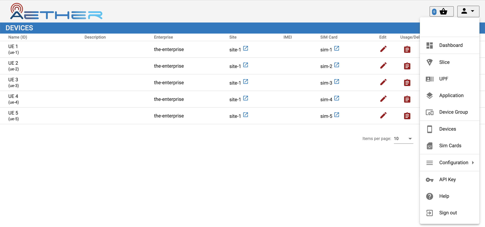
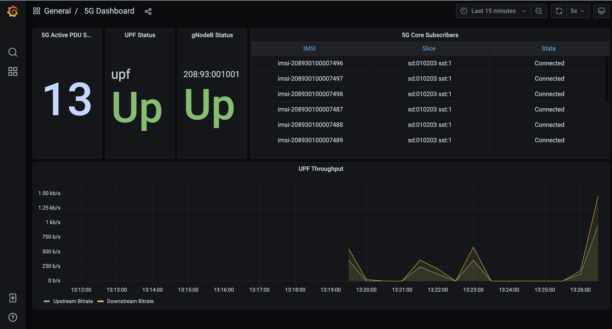
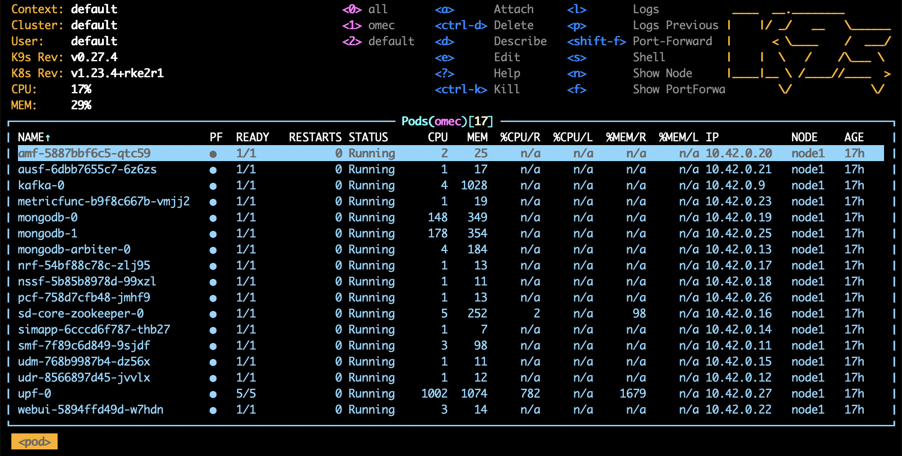

Closer Look
---------------

Before tearing down your Quick Start deployment, there are three
additional steps you can take to watch Aether in action. The first is
to bring up the Aether Management Plane (AMP), which includes
Dashboards showing different aspects of Aether's runtime behavior.
The second is to inspect the logs written by the various microservices.
The third is to enable packet capture, and then run an analysis
tool to trace the flow of packets into and out of SD-Core.

Install AMP
~~~~~~~~~~~~~~~

The Aether Management Platform (AMP) is implemented by two Kubernetes
applications: *Runtime Operational Control (ROC)* and a *Monitoring
Service*.\ [#]_ AMP can be deployed on the same cluster as SD-Core by
executing the following Make target:

.. code-block::

   $ make aether-amp-install

Once complete, ``kubectl`` will show the ``aether-roc`` and
``cattle-monitoring-system`` namespaces running in support of these
two services, respectively, plus new ``atomix`` pods in the
``kube-system`` namespace.  Atomix is the scalable key-value store
that keeps the ROC data model persistent.

.. [#] Note that what the implementation calls ROC, `Chapter 6
        <https://5g.systemsapproach.org/cloud.html>`__ refers to
        generically as *Service Orchestration*.

You can access the dashboards for the two subsystems,
respectively, at

.. code-block::

   http://<server_ip>:31194
   http://<server_ip>:30950

The programmatic API underlying the Control Dashboard, which was
introduced in `Section 6.4
<https://5g.systemsapproach.org/cloud.html#connectivity-api>`__, can
be accessed at ``http://10.76.28.113:31194/aether-roc-api/`` in our
example deployment (where Aether runs on host ``10.76.28.113``).

There is much more to say about the ROC and the Aether API, which we
return to in the section on Runtime Control. For now, we suggest you
simply peruse the Control Dashboard by starting with the dropdown menu
in the upper right corner. For example, selecting `Devices` will show
the set of UEs registered with Aether, similar to the screenshot in
:numref:`Figure %s <fig-roc>`. In an operational setting, these values
would be entered into the ROC through either the GUI or the underlying
API. For the Quick Start scenario we're limiting ourselves to in this
section, these values are loaded from
``deps/amp/5g-roc/templates/roc-5g-models.json``.

.. _fig-roc:

    Screenshot of the ROC dashboard, showing known *Devices*. The
    dropdown menu on the right lists other available pages.

Turning to the Monitoring Dashboard, you will initially see
Kubernetes-related performance stats. Select the *5G Dashboard* option
to display information reported by SD-Core. Similar to :numref:`Figure
%s <fig-monitor>`, the page shows an active (green) UPF, and once you
rerun the RAN simulator (gNBsim), some number of active base stations
and connected devices. The bottom panel shows the UPF throughput,
which due to gNBsim's focus on stressing the control plane, typically
shows only minimal activity.

.. _fig-monitor:

    Screenshot of the monitoring subsystem's 5G dashboard.

When you are done experimenting with AMP, type the following
to tear it down:

.. code-block::

   $ make aether-amp-uninstall

View Logs
~~~~~~~~~~~~~~~~

You've already seen the log file generated by gNBsim for each
emulation run, but you can also inspect the logs generated by
individual microservices that implement Aether. Doing so is certainly
helpful when debugging a failure, but it can also be an aid in
learning how each microservice works. For example, the following
command outputs the log for the ``bessd`` container, one of five
containers running as part of the ``upf-0`` pod:

.. code-block::

   $ kubectl logs -n omec -p upf-0 bessd

While ``kubectl`` works just fine for tasks like this, you may also
want to install `k9s <https://k9scli.io/>`__\ , a terminal-based UI
that provides a convenient alternative for interacting with Kubernetes.
Once installed, the following command brings up the UI for the OMEC
namespace that implements SD-Core.

.. code-block::

   $ k9s -n omec

:numref:`Figure %s <fig-k9s>` shows an example k9s display, where you
can scroll up and down, and then invoke one of the listed
commands—such as ``<l>`` (display log) or ``<s>`` (open a shell)—for
the selected pod.

.. _fig-k9s:

    Screenshot of k9s's UI for the OMEC namespace, with the AMF pod
    currently selected.

Run Ksniff and Wireshark
~~~~~~~~~~~~~~~~~~~~~~~~~~~

In addition to the trace output generated by the simulator, a good way
to understand the inner working of Aether is to use `Ksniff
<https://github.com/eldadru/ksniff>`__ (a Kubernetes plugin) to
capture packets and display their headers as they flow into and out of
the microservices that implement Aether. Output from Ksniff can then
be fed into `Wireshark <https://www.wireshark.org/>`__.

To install the Ksniff plugin on the server running Aether, you need to
first install ``krew``, the Kubernetes plugin manager. Instructions on
doing that can be found `online
<https://krew.sigs.k8s.io/docs/user-guide/setup/install/>`__. Once
that's done, you can install Ksniff by typing:

.. code-block::

   $ kubectl krew install sniff

You can then run Ksniff in the context of a specific Kubernetes pod by
specifying their namespace and instance names, and then redirecting
the output to Wireshark. If you don't have a desktop environment on
your Aether server, you can either view the output using a simpler
packet analyzer, such as `tshark
<https://www.wireshark.org/docs/man-pages/tshark.html>`__, or by
redirecting the PCAP output in a file and transfer it a desktop
machine for viewing in Wireshark.

For example, the following captures and displays traffic into and out
of the AMF, where you need to substitute the name of the AMP pod
you learned from ``kubectl`` in place of ``amf-5887bbf6c5-pc9g2``.

.. code-block::

   $ kubectl sniff -n omec amf-5887bbf6c5-pc9g2 -o - | tshark -r -

Of course, you'll also need to restart the RAN emulator to generate
workload for this tool to capture.
