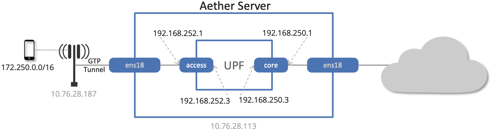
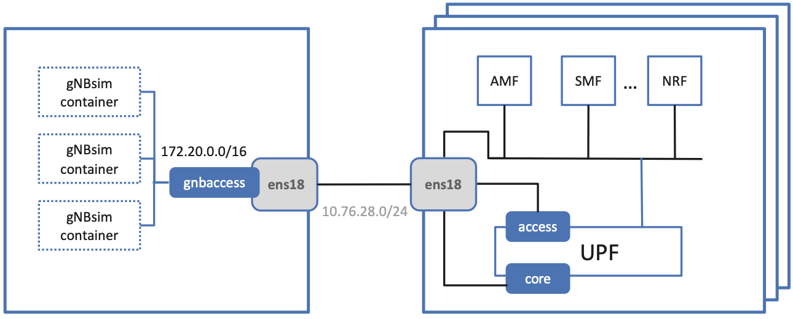

Verify Network
----------------

This section goes into depth on how SD-Core (which runs *inside* the
Kubernetes cluster) connects to either physical gNBs or an emulated
RAN (both running *outside* the Kubernetes cluster). For the purpose
of this section, we assume you already have a scalable cluster running
(as outlined in the previous section), SD-Core has been installed on
that cluster, and you have a terminal window open on the Master node
in that cluster.

:numref:`Figure %s <fig-macvlan>` shows a high-level schematic of
Aether's end-to-end User Plane connectivity, where we start by
focusing on the basics: a single Aether node, a single physical gNB,
and just the UPF container running inside SD-Core. The identifiers
shown in gray in the figure (``10.76.28.187``, ``10.76.28.113``,
``ens18``) are taken from our running example of an actual
deployment (meaning your details will be different). All the other
names and addresses are part of a standard Aether configuration.

.. _fig-macvlan:

    The UPF pod running inside the server hosting Aether, with
    ``core`` and ``access`` bridging the two. Identifiers
    ``10.76.28.187``, ``10.76.28.113``, ``ens18`` are specific to
    a particular deployment site.

As shown in the figure, there are two Macvlan bridges that connect the
physical interface (``ens18`` in our example) with the UPF
container. The ``access`` bridge connects the UPF downstream to the
RAN (this corresponds to 3GPP's N3 interface) and is assigned IP subnet
``192.168.252.0/24``.  The ``core`` bridge connects the UPF upstream
to the Internet (this corresponds to 3GPP's N6 interface) and is assigned
IP subnet ``192.168.250.0/24``.  This means, for example, that the
``access`` interface *inside* the UPF (which is assigned address
``192.168.252.3``) is the destination IP address of GTP-encapsulated
user plane packets from the gNB.

Following this basic schematic, it is possible to verify that the UPF
is connected to the network by checking to see that the ``core`` and
``access`` are properly configured. This can be done using ``ip``, and
you should see results similar to the following:

.. code-block::

   $ ip addr show core
   15: core@ens3: <BROADCAST,MULTICAST,UP,LOWER_UP> mtu 1500 qdisc noqueue state UP group default qlen 1000
       link/ether 06:f7:7c:65:31:fc brd ff:ff:ff:ff:ff:ff
       inet 192.168.250.1/24 brd 192.168.250.255 scope global core
          valid_lft forever preferred_lft forever
       inet6 fe80::4f7:7cff:fe65:31fc/64 scope link
          valid_lft forever preferred_lft forever

   $ ip addr show access
   14: access@ens3: <BROADCAST,MULTICAST,UP,LOWER_UP> mtu 1500 qdisc noqueue state UP group default qlen 1000
       link/ether 82:ef:d3:bb:d3:74 brd ff:ff:ff:ff:ff:ff
       inet 192.168.252.1/24 brd 192.168.252.255 scope global access
          valid_lft forever preferred_lft forever
       inet6 fe80::80ef:d3ff:febb:d374/64 scope link
          valid_lft forever preferred_lft forever

The above output from ``ip`` shows the two interfaces visible to the
server, but running *outside* the container. ``kubectl`` can be used
to see what's running *inside* the UPF, where ``bessd`` is the name of
the container image that implements the UPF, and ``access`` and
``core`` are the last two interfaces shown below:

.. code-block::

   $ kubectl -n omec exec -ti upf-0 bessd -- ip addr
   1: lo: <LOOPBACK,UP,LOWER_UP> mtu 65536 qdisc noqueue state UNKNOWN group default qlen 1000
       link/loopback 00:00:00:00:00:00 brd 00:00:00:00:00:00
       inet 127.0.0.1/8 scope host lo
       valid_lft forever preferred_lft forever
       inet6 ::1/128 scope host
       valid_lft forever preferred_lft forever
   3: eth0@if30: <BROADCAST,MULTICAST,UP,LOWER_UP> mtu 1450 qdisc noqueue state UP group default
       link/ether 8a:e2:64:10:4e:be brd ff:ff:ff:ff:ff:ff link-netnsid 0
       inet 192.168.84.19/32 scope global eth0
       valid_lft forever preferred_lft forever
       inet6 fe80::88e2:64ff:fe10:4ebe/64 scope link
       valid_lft forever preferred_lft forever
   4: access@if2: <BROADCAST,MULTICAST,UP,LOWER_UP> mtu 1500 qdisc noqueue state UP group default
       link/ether 82:b4:ea:00:50:3e brd ff:ff:ff:ff:ff:ff link-netnsid 0
       inet 192.168.252.3/24 brd 192.168.252.255 scope global access
       valid_lft forever preferred_lft forever
       inet6 fe80::80b4:eaff:fe00:503e/64 scope link
       valid_lft forever preferred_lft forever
   5: core@if2: <BROADCAST,MULTICAST,UP,LOWER_UP> mtu 1500 qdisc noqueue state UP group default
       link/ether 4e:ac:69:31:a3:88 brd ff:ff:ff:ff:ff:ff link-netnsid 0
       inet 192.168.250.3/24 brd 192.168.250.255 scope global core
       valid_lft forever preferred_lft forever
       inet6 fe80::4cac:69ff:fe31:a388/64 scope link
       valid_lft forever preferred_lft forever

When packets flowing upstream from the gNB arrive on the server's
physical interface, they need to be forwarded over the ``access``
interface.  This is done by having the following kernel route
installed, which should be the case if your Aether installation was
successful:

.. code-block::

   $ route -n | grep "Iface\|access"
   Destination     Gateway         Genmask         Flags Metric Ref    Use Iface
   192.168.252.0   0.0.0.0         255.255.255.0   U     0      0        0 access

Within the UPF, the correct behavior is to forward packets between the
``access`` and ``core`` interfaces.  Upstream packets arriving on the
``access`` interface have their GTP headers removed and the raw IP
packets are forwarded to the ``core`` interface.  The routes inside
the UPF's ``bessd`` container will look something like this:

.. code-block::

   $ kubectl -n omec exec -ti upf-0 -c bessd -- ip route
   default via 169.254.1.1 dev eth0
   default via 192.168.250.1 dev core metric 110
   10.76.28.0/24 via 192.168.252.1 dev access
   10.76.28.113 via 169.254.1.1 dev eth0
   169.254.1.1 dev eth0 scope link
   192.168.250.0/24 dev core proto kernel scope link src 192.168.250.3
   192.168.252.0/24 dev access proto kernel scope link src 192.168.252.3

The default route via ``192.168.250.1`` directs upstream packets to
the Internet via the ``core`` interface, with a next hop of the
``core`` interface outside the UPF.  These packets then undergo source
NAT in the kernel and are sent to the IP destination in the packet.
This means that the ``172.250.0.0/16`` addresses assigned to UEs are
not visible beyond the Aether server. The return (downstream) packets
undergo reverse NAT and now have a destination IP address of the UE.
They are forwarded by the kernel to the ``core`` interface by these
rules on the server:

.. code-block::

   $ route -n | grep "Iface\|core"
   Destination     Gateway         Genmask         Flags Metric Ref    Use Iface
   172.250.0.0     192.168.250.3   255.255.0.0     UG    0      0        0 core
   192.168.250.0   0.0.0.0         255.255.255.0   U     0      0        0 core

The first rule above matches packets to the UEs on the
``172.250.0.0/16`` subnet.  The next hop for these packets is the
``core`` IP address inside the UPF.  The second rule says that next
hop address is reachable on the ``core`` interface outside the UPF.
As a result, the downstream packets arrive in the UPF where they are
GTP-encapsulated with the IP address of the gNB.

Note that if you are not finding ``access`` and ``core`` interfaces
outside the UPF, the following commands can be used to create these
two interfaces manually (again using our running example for the
physical ethernet interface):

.. code-block::

    $ ip link add core link ens18 type macvlan mode bridge 192.168.250.3
    $ ip link add access link ens18 type macvlan mode bridge 192.168.252.3

Beyond this basic understanding, there are three other details of
note. First, we have been focusing on the User Plane because Control
Plane connectivity is much simpler: RAN elements (whether they are
physical gNBs or gNBsim) reach the AMF using the server's actual IP
address (``10.76.28.113`` in our running example). Kubernetes is
configured to forward SCTP packets arriving on port ``38412`` to the
AMF container.

Second, the basic end-to-end schematic shown in :numref:`Figure %s
<fig-macvlan>` assumes each gNB is assigned an address on the same L2
network as the Aether cluster (e.g., ``10.76.28.0/24`` in our example
scenario). This works when the gNB is physical or when we want to run
a single gNBsim traffic source, but once we scale up the gNBsim by
co-locating multiple containers on a single server, we need to
introduce another network so each container has a unique IP address
(even though they are all hosted at the same IP address). This more
complex configuration is depicted in :numref:`Figure %s <fig-gnbsim>`,
where ``172.20.0.0/16`` is the IP subnet for the virtual network (also
implemented by a Macvlan bridge, and named ``gnbaccess``).

.. _fig-gnbsim:

    A server running multiple instances of gNBsim, connected to Aether.

Finally, all of the configurable parameters used throughout this
section are defined in the ``core`` and ``gnbsim`` sections of the
``vars/main.yml`` file. Note that an empty value for
``core.ran_subnet`` implies the physical L2 network is used to connect
RAN elements to the core, as is typically the case when connecting
physical gNBs.

.. code-block::

    core:
        standalone: "true"
        data_iface: ens18
        values_file: "config/hpa-5g-values.yaml"
        ran_subnet: "172.20.0.0/16"
        helm:
           chart_ref: aether/sd-core
           chart_version: 0.12.6
        upf:
           ip_prefix: "192.168.252.0/24"
        amf:
           ip: "172.16.41.103"

    gnbsim:
        ...
        router:
            data_iface: ens18
            macvlan:
                iface: gnbaccess
                subnet_prefix: "172.20"
