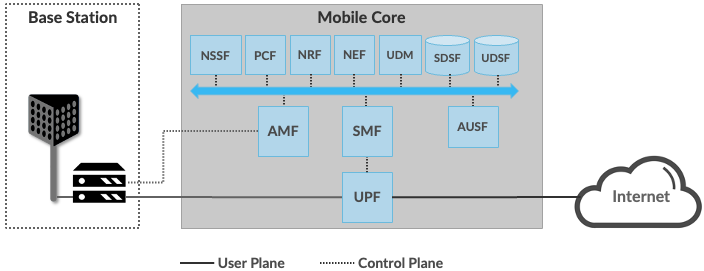

Verify the Network
-----------------------

**[Lifted from old Radio section. Update in Progress. Would benefit from Bilal's network diagrams.]**

This section goes into depth on how SD-Core (which runs *inside* the
Kubernetes cluster) connects to either physical gNBs or an emulated
RAN (both running *outside* the Kubernetes cluster). For the purpose
of this section, we assume you already have a scalable cluster running
(as outlined in the previous section), SD-Core has been installed on
that cluster, and you have SSH'ed into the Master node in that cluster
(where ``kubectl`` can be be executed).

To begin, you can verify that the UPF is properly connected to the
network by checking to see that the Macvlan networks ``core`` and
``access`` are properly configured on your server. This can be done
using ``ip``, and you should see results similar to the following:

.. code-block::

   $ ip addr show core
   15: core@ens3: <BROADCAST,MULTICAST,UP,LOWER_UP> mtu 1500 qdisc noqueue state UP group default qlen 1000
       link/ether 06:f7:7c:65:31:fc brd ff:ff:ff:ff:ff:ff
       inet 192.168.250.1/24 brd 192.168.250.255 scope global core
          valid_lft forever preferred_lft forever
       inet6 fe80::4f7:7cff:fe65:31fc/64 scope link
          valid_lft forever preferred_lft forever

   $ ip addr show access
   14: access@ens3: <BROADCAST,MULTICAST,UP,LOWER_UP> mtu 1500 qdisc noqueue state UP group default qlen 1000
       link/ether 82:ef:d3:bb:d3:74 brd ff:ff:ff:ff:ff:ff
       inet 192.168.252.1/24 brd 192.168.252.255 scope global access
          valid_lft forever preferred_lft forever
       inet6 fe80::80ef:d3ff:febb:d374/64 scope link
          valid_lft forever preferred_lft forever

Understanding why these two interfaces exist is helpful in
troubleshooting your deployment. They enable the UPF to exchange
packets with the gNB (``access``) and the Internet (``core``). In 3GPP
terms, these correspond to the N3 and N6 interfaces, respectively, as
shown in :numref:`Figure %s <fig-sd-core>`. But these two interfaces
exist both **inside** and **outside** the UPF.  The above output from
``ip`` shows the two outside interfaces; ``kubectl`` can be used
to see what's running inside the UPF, where ``access`` and ``core``
are the last two interfaces shown below:

.. code-block::

   $ kubectl -n omec exec -ti upf-0 bessd -- ip addr
   1: lo: <LOOPBACK,UP,LOWER_UP> mtu 65536 qdisc noqueue state UNKNOWN group default qlen 1000
       link/loopback 00:00:00:00:00:00 brd 00:00:00:00:00:00
       inet 127.0.0.1/8 scope host lo
       valid_lft forever preferred_lft forever
       inet6 ::1/128 scope host
       valid_lft forever preferred_lft forever
   3: eth0@if30: <BROADCAST,MULTICAST,UP,LOWER_UP> mtu 1450 qdisc noqueue state UP group default
       link/ether 8a:e2:64:10:4e:be brd ff:ff:ff:ff:ff:ff link-netnsid 0
       inet 192.168.84.19/32 scope global eth0
       valid_lft forever preferred_lft forever
       inet6 fe80::88e2:64ff:fe10:4ebe/64 scope link
       valid_lft forever preferred_lft forever
   4: access@if2: <BROADCAST,MULTICAST,UP,LOWER_UP> mtu 1500 qdisc noqueue state UP group default
       link/ether 82:b4:ea:00:50:3e brd ff:ff:ff:ff:ff:ff link-netnsid 0
       inet 192.168.252.3/24 brd 192.168.252.255 scope global access
       valid_lft forever preferred_lft forever
       inet6 fe80::80b4:eaff:fe00:503e/64 scope link
       valid_lft forever preferred_lft forever
   5: core@if2: <BROADCAST,MULTICAST,UP,LOWER_UP> mtu 1500 qdisc noqueue state UP group default
       link/ether 4e:ac:69:31:a3:88 brd ff:ff:ff:ff:ff:ff link-netnsid 0
       inet 192.168.250.3/24 brd 192.168.250.255 scope global core
       valid_lft forever preferred_lft forever
       inet6 fe80::4cac:69ff:fe31:a388/64 scope link
       valid_lft forever preferred_lft forever

All four are Macvlan interfaces bridged with ``DATA_IFACE``.  There
are two subnets on this bridge: the two ``access`` interfaces are on
``192.168.252.0/24`` and the two ``core`` interfaces are on
``192.168.250.0/24``. Note that while we refer to ``core`` and
``access`` as interfaces in the context of a particular compute
environment (e.g., the UPF container), they can also be viewed as
virtual bridges or virtual links connecting a pair of compute
environments (e.g., the host server and the UPF container). This
makes the schematic shown in :numref:`Figure %s <fig-macvlan>` a
helpful way to visualize the setup.

.. _fig-macvlan:

    The UPF container running inside the server hosting Aether, with
    ``core`` and ``access`` bridging the two. Information shown
    in gray (``10.76.28.187``, ``10.76.28.113``, ``enp193s0f0``) is
    specific to a particular deployment site.

In this setting, the ``access`` interface inside the UPF has an IP
address of ``192.168.252.3``; this is the destination IP address of
GTP-encapsulated user plane packets from the gNB.  In order for these
packets to find their way to the UPF, they must arrive on the
``DATA_IFACE`` interface and then be forwarded on the ``access``
interface outside the UPF.  (As described later in this section, it is
possible to configure a static route on the gNB to send the GTP
packets to ``DATA_IFACE``.)  Forwarding the packets to the ``access``
interface is done by the following kernel route, which should be
present if your Aether installation was successful:

.. code-block::

   $ route -n | grep "Iface\|access"
   Destination     Gateway         Genmask         Flags Metric Ref    Use Iface
   192.168.252.0   0.0.0.0         255.255.255.0   U     0      0        0 access

The high-level behavior of the UPF is to forward packets between its
``access`` and ``core`` interfaces, while at the same time
removing/adding GTP encapsulation on the ``access`` side.  Upstream
packets arriving on the ``access`` side from a UE have their GTP
headers removed and the raw IP packets are forwarded to the ``core``
interface.  The routes inside the UPF's ``bessd`` container will look
something like this:

.. code-block::

   $ kubectl -n omec exec -ti upf-0 -c bessd -- ip route
   default via 169.254.1.1 dev eth0
   default via 192.168.250.1 dev core metric 110
   10.76.28.0/24 via 192.168.252.1 dev access
   10.76.28.113 via 169.254.1.1 dev eth0
   169.254.1.1 dev eth0 scope link
   192.168.250.0/24 dev core proto kernel scope link src 192.168.250.3
   192.168.252.0/24 dev access proto kernel scope link src 192.168.252.3

The default route via ``192.168.250.1`` is directing upstream packets
to the Internet via the ``core`` interface, with a next hop of the
``core`` interface outside the UPF.  These packets undergo source NAT
in the kernel and are sent to the IP destination in the packet. This
means that the ``172.250.0.0/16`` addresses assigned to UEs are not
visible beyond the Aether server. The return (downstream) packets
undergo reverse NAT and now have a destination IP address of the UE.
They are forwarded by the kernel to the ``core`` interface by these
rules on the server:

.. code-block::

   $ route -n | grep "Iface\|core"
   Destination     Gateway         Genmask         Flags Metric Ref    Use Iface
   172.250.0.0     192.168.250.3   255.255.0.0     UG    0      0        0 core
   192.168.250.0   0.0.0.0         255.255.255.0   U     0      0        0 core

The first rule above matches packets to the UEs on the
``172.250.0.0/16`` subnet.  The next hop for these packets is the
``core`` IP address inside the UPF.  The second rule says that next
hop address is reachable on the ``core`` interface outside the UPF.
As a result, the downstream packets arrive in the UPF where they are
GTP-encapsulated with the IP address of the gNB.

Note that if you are not finding ``access`` and ``core`` interfaces
outside the UPF, the following commands can be used to create these
two interfaces manually:

.. code-block::

    $ ip link add core link <DATA_IFACE> type macvlan mode bridge 192.168.250.3
    $ ip link add access link <DATA_IFACE> type macvlan mode bridge 192.168.252.3

