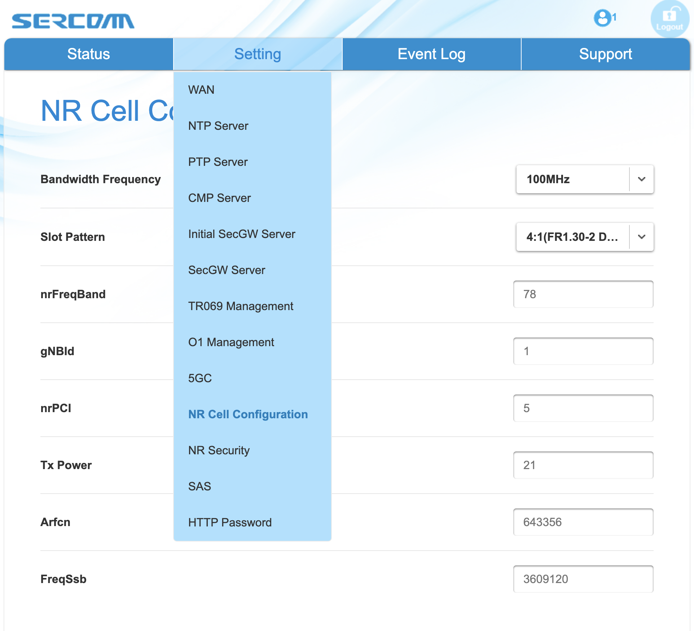

Stage 3: External Radio
========================

We are now ready to replace the emulated RAN with a physical small
cell and real UEs. Unlike earlier stages of Aether OnRamp that worked
exclusively with 5G, this stage allows either 4G or 5G small cells
(but not both simultaneously). The following instructions are written
for the 5G scenario, but you can substitute "4G" for "5G" in every
command or file name.  (Exceptions to that rule are explicitly noted.)

In addition to the physical server used in previous stages, we now
assume that server and the external radio are connected to the same L2
network and share an IP subnet.  This is not a hard requirement for
all deployments, but it does simplify communication between the
external radio and the UPF running within Kubernetes on the server.
Take note of the network interface on your server that provides
connectivity to the external radio, for example by typing:

.. code-block::

   $ ifconfig
   enp193s0f0: flags=4163<UP,BROADCAST,RUNNING,MULTICAST>  mtu 1500
           inet 10.76.28.113  netmask 255.255.255.0  broadcast 10.76.28.255
           inet6 fe80::2ef0:5dff:fef2:d821  prefixlen 64  scopeid 0x20<link>
           ether 2c:f0:5d:f2:d8:21  txqueuelen 1000  (Ethernet)
           RX packets 72409278  bytes 97551531344 (97.5 GB)
           RX errors 0  dropped 156  overruns 0  frame 5
           TX packets 31165137  bytes 2399311268 (2.3 GB)
           TX errors 0  dropped 0 overruns 0  carrier 0  collisions 0

   lo: flags=73<UP,LOOPBACK,RUNNING>  mtu 65536
           inet 127.0.0.1  netmask 255.0.0.0
           inet6 ::1  prefixlen 128  scopeid 0x10<host>
           loop  txqueuelen 1000  (Local Loopback)
           RX packets 2000815905  bytes 614846017824 (614.8 GB)
           RX errors 0  dropped 0  overruns 0  frame 0
           TX packets 2000815905  bytes 614846017824 (614.8 GB)
           TX errors 0  dropped 0 overruns 0  carrier 0  collisions 0

In what will serve as a running example throughout this section, the interface is
``enp193s0f0`` with IP address ``10.76.28.113``.
	   

Local Blueprint
~~~~~~~~~~~~~~~

Unlike earlier stages that took advantage of canned configurations,
adding a physical base station means you need to account for specifics
of your local environment. Editing various configuration files is a
necessary step in customizing a deployment, and so Aether OnRamp
establishes a simple convention to help manage that process.

Specifically, the ``blueprints`` directory currently defines four
distinct ways to configure and deploy Aether:

* ``release-2.0``: Deploys Aether v2.0 in a single server/VM, running
  an emulated RAN.

* ``release-2.1``: Deploys Aether v2.1 in a single server/VM, running
  an emulated RAN.

* ``latest``: Deploys the latest version of Aether in a single
  server/VM, running an emulated RAN.

* ``radio``: Deploys the latest version of Aether in a single
  server/VM, connected to an external small cell radio.

Up to this point, we have been using ``latest`` as our default
blueprint, but for this stage, we will shift to ``radio``.

Each blueprint specifies three sets of parameters that define how
Aether is configured and deployed: (1) a set of Makefile variables
that customize the deployment process; (2) a set of Helm Charts that
customize the Kubernetes workload that gets deployed; and (3) a set of
value override (and similar) files that customize how the
microservices in that workload are configured. All of these parameters
are defined in the blueprint's ``config`` file, so using the ``radio``
blueprint as an example:

.. code-block::

   $ cat blueprints/radio/config
   # Configuration or External (4G or 5G) Radio Blueprint

   # Variables
   ENABLE_RANSIM := false
   LOCAL_CHARTS := false
   DATA_IFACE := eth0

   # For installing the Core
   SD_CORE_CHART            := aether/sd-core

   # For installing the ROC
   AETHER_ROC_UMBRELLA_CHART := aether/aether-roc-umbrella
   ATOMIX_CONTROLLER_CHART   := atomix/atomix-controller
   ATOMIX_RAFT_STORAGE_CHART := atomix/atomix-raft-storage
   ATOMIX_RUNTIME_CHART      := atomix/atomix-runtime --version 0.1.9  # v0.2.0 not working
   ONOS_OPERATOR_CHART       := onosproject/onos-operator

   # For installing monitoring
   RANCHER_MONITORING_CRD_CHART := rancher/rancher-monitoring-crd
   RANCHER_MONITORING_CHART     := rancher/rancher-monitoring

   # Helm Value Overrides and other Config Files
   ROC_VALUES     := $(BLUEPRINTDIR)/roc-values.yaml
   ROC_DEFAULTENT_MODEL := $(BLUEPRINTDIR)/roc-defaultent-model.json
   ROC_4G_MODELS  := $(BLUEPRINTDIR)/roc-4g-models.json
   ROC_5G_MODELS  := $(BLUEPRINTDIR)/roc-5g-models.json
   4G_CORE_VALUES := $(BLUEPRINTDIR)/sd-core-4g-values.yaml
   5G_CORE_VALUES := $(BLUEPRINTDIR)/sd-core-5g-values.yaml
   TEST_APP_VALUES := $(BLUEPRINTDIR)/5g-test-apps-values.yaml
   MONITORING_VALUES := $(BLUEPRINTDIR)/monitoring.yaml

As your deployment deviates more and more from the release—either to
account for differences in your target computing environment or
changes you make to the software being deployed—you can record these
changes in these or other blueprints that you create. For the purpose
of this section, we will simply edit files in the ``blueprints/radio``
directory, but you may want to make your own local blueprint
directory, copy these files into it, and make your changes there.

At this point, you need to make two edits. The first is to the
``DATA_IFACE`` variable in ``blueprints/radio/config``, changing it
from ``eth0`` to whatever name you noted earlier (e.g., ``enp193s0f0``
in our running example). The second is to the default ``BLUEPRINT``
setting in ``MakefileVar.mk``, changing it from ``latest`` to
``radio``. Alternatively, you can modify that variable on a
case-by-case basis; for example:

.. code-block::

   BLUEPRINT=radio make net-prep

Going forward, you will be editing the ``yaml`` and ``json`` files in
the ``radio`` blueprint, so we recommend familiarizing yourself with
``radio/sd-core-5g-values.yaml`` and ``radio/roc-5g-models.json``
(or their 4G counterparts).
   
Prepare UEs 
~~~~~~~~~~~~

5G-connected devices must have a SIM card, which you are responsible
for creating and inserting.  You will need a SIM card writer (which
are readily available for purchase on Amazon) and a PLMN identifier
constructed from a valid MCC/MNC pair. For our purposes, we use two
different PLMN ids: ``315010`` constructed from MCC=315 (US) and
MNC=010 (CBRS), and ``00101`` constructed from MCC=001 (TEST) and
MNC=01 (TEST). You should use whatever values are appropriate for your
local environment.  You then assign an IMSI and two secret keys to
each SIM card. Throughout this section, we use the following values:

* IMSI: each one is unique, matching pattern ``315010*********`` (15 digits)
* OPc: ``69d5c2eb2e2e624750541d3bbc692ba5``
* Key: ``000102030405060708090a0b0c0d0e0f``

Insert the SIM cards into whatever devices you plan to connect to
Aether.  Be aware that not all phones support the CBRS frequency bands
that Aether uses. Aether is known to work with recent iPhones (11 and
greater) and Google Pixel phones (4 and greater).  CBRS may also be
supported by recent phones from Samsung, LG Electronics and Motorola
Mobility, but these have not been tested. Note that on each phone you
will need to configure ``internet`` as the *Access Point Name (APN)*.

Finally, modify the the ``subscribers`` block of the
``omec-sub-provision`` section in file
``radio/sd-core-5g-values.yaml`` to record the IMSI, OPc, and
Key values configured onto your SIM cards. The block also defines a
sequence number that is intended to thwart replay attacks. (As a
reminder, these values go in ``radio/sd-core-4g-values.yaml``
if you are using a 4G small cell.) For example, the following code
block adds IMSIs between ``315010999912301`` and ``315010999912303``:

.. code-block::

   subscribers:
   - ueId-start: "315010999912301"
     ueId-end: "315010999912303"
     plmnId: "315010"
     opc: "69d5c2eb2e2e624750541d3bbc692ba5"
     key: "000102030405060708090a0b0c0d0e0f"
     sequenceNumber: 135

Bring Up Aether
~~~~~~~~~~~~~~~~~~~~~

You are now ready to bring Aether on-line, but it is safest to start
with a fresh install of Kubernetes, so first type ``make clean`` if
you still have a cluster running from an earlier stage. Then execute
the following two Make targets (again assuming you have already edited
the ``BLUEPRINT`` variable in ``MakefileVar.mk``):

.. code-block::

   $ make node-prep
   $ make net-prep

Once Kubernetes is running and the network properly configured, you
are then ready to bring up the SD-Core as before:

.. code-block::

   $ make 5g-core

You can verify the installation by running `kubectl` just as you did
in Stage 1. You should see all pods with status ``Running``, keeping
in mind that you will see containers that implement the 4G core
instead of the 5G core running in the ``omec`` namespace if you
configured for that scenario.

Note that we postpone bringing up the AMP until we are confident the
SD-Core is running correctly.

Validating Configuration
~~~~~~~~~~~~~~~~~~~~~~~~

Regardless of whether you bring up a 4G or 5G version of the Control
Plane, the UPF pod implements SD-Core's User Plane. To verify that the
UPF is properly connected to the network (which is important because
the UPF has to connect to the radio), you can check to see that the
Macvlan networks ``core`` and ``access`` are properly configured on
your server. This can be done using ``ifconfig``, and you should see
results similar to the following:

.. code-block::
   
   $ ifconfig core
   core: flags=4163<UP,BROADCAST,RUNNING,MULTICAST>  mtu 1500
       inet 192.168.250.1  netmask 255.255.255.0  broadcast 192.168.250.255
       ether 16:9d:c1:0f:19:3a  txqueuelen 1000  (Ethernet)
       RX packets 513797  bytes 48400525 (48.4 MB)
       RX errors 0  dropped 0  overruns 0  frame 0
       TX packets 102996  bytes 26530538 (26.5 MB)
       TX errors 0  dropped 0 overruns 0  carrier 0  collisions 0

   $ ifconfig access
   access: flags=4163<UP,BROADCAST,RUNNING,MULTICAST>  mtu 1500
       inet 192.168.252.1  netmask 255.255.255.0  broadcast 192.168.252.255
       ether 7a:9f:38:c0:18:15  txqueuelen 1000  (Ethernet)
       RX packets 558162  bytes 64064410 (64.0 MB)
       RX errors 0  dropped 0  overruns 0  frame 0
       TX packets 99553  bytes 16646682 (16.6 MB)
       TX errors 0  dropped 0 overruns 0  carrier 0  collisions 0

Understanding why these two interfaces exist is helpful in
troubleshooting your deployment. They enable the UPF to exchange
packets with the gNB (``access``) and the Internet (``core``). But
these two interfaces exist both **inside** and **outside** the UPF.
The above output from ``ifconfig`` shows the two outside interfaces;
``kubectl`` can be used to see what's running inside the UPF, where
``access`` and ``core`` are the last two interfaces shown below:

.. code-block::
   
   $ kubectl -n omec exec -ti upf-0 bessd -- ip addr
   1: lo: <LOOPBACK,UP,LOWER_UP> mtu 65536 qdisc noqueue state UNKNOWN group default qlen 1000
       link/loopback 00:00:00:00:00:00 brd 00:00:00:00:00:00
       inet 127.0.0.1/8 scope host lo
       valid_lft forever preferred_lft forever
       inet6 ::1/128 scope host
       valid_lft forever preferred_lft forever
   3: eth0@if30: <BROADCAST,MULTICAST,UP,LOWER_UP> mtu 1450 qdisc noqueue state UP group default
       link/ether 8a:e2:64:10:4e:be brd ff:ff:ff:ff:ff:ff link-netnsid 0
       inet 192.168.84.19/32 scope global eth0
       valid_lft forever preferred_lft forever
       inet6 fe80::88e2:64ff:fe10:4ebe/64 scope link
       valid_lft forever preferred_lft forever
   4: access@if2: <BROADCAST,MULTICAST,UP,LOWER_UP> mtu 1500 qdisc noqueue state UP group default
       link/ether 82:b4:ea:00:50:3e brd ff:ff:ff:ff:ff:ff link-netnsid 0
       inet 192.168.252.3/24 brd 192.168.252.255 scope global access
       valid_lft forever preferred_lft forever
       inet6 fe80::80b4:eaff:fe00:503e/64 scope link
       valid_lft forever preferred_lft forever
   5: core@if2: <BROADCAST,MULTICAST,UP,LOWER_UP> mtu 1500 qdisc noqueue state UP group default
       link/ether 4e:ac:69:31:a3:88 brd ff:ff:ff:ff:ff:ff link-netnsid 0
       inet 192.168.250.3/24 brd 192.168.250.255 scope global core
       valid_lft forever preferred_lft forever
       inet6 fe80::4cac:69ff:fe31:a388/64 scope link
       valid_lft forever preferred_lft forever

All four are Macvlan interfaces bridged with ``DATA_IFACE``.  There
are two subnets on this bridge: the two ``access`` interfaces are on
``192.168.252.0/24`` and the two ``core`` interfaces are on
``192.168.250.0/24``.  It is helpful to think of two links, called
``access`` and ``core``, connecting the hosting server and the UPF.

The ``access`` interface inside the UPF has an IP address of
``192.168.252.3``; this is the destination IP address of
GTP-encapsulated data plane packets from the gNB.  In order for these
packets to find their way to the UPF, they must arrive on the
``DATA_IFACE`` interface and then be forwarded on the ``access``
interface outside the UPF.  (As described later in this section, it is
possible to configure a static route on the gNB to send the GTP
packets to ``DATA_IFACE``.)  Forwarding the packets to the ``access``
interface is done by the following kernel route, which should be
present if your Aether installation was successful:

.. code-block::

   $ route -n | grep "Iface\|access"
   Destination     Gateway         Genmask         Flags Metric Ref    Use Iface
   192.168.252.0   0.0.0.0         255.255.255.0   U     0      0        0 access

The high-level behavior of the UPF is to forward packets between its
``access`` and ``core`` interfaces, while at the same time
removing/adding GTP encapsulation on the ``access`` side.  Upstream
packets arriving on the ``access`` side from a UE have their GTP
headers removed and the raw IP packets are forwarded to the ``core``
interface.  The routes inside the UPF's ``bessd`` container will look
something like this:

.. code-block::

   $ kubectl -n omec exec -ti upf-0 -c bessd -- ip route
   default via 169.254.1.1 dev eth0
   default via 192.168.250.1 dev core metric 110
   10.76.28.0/24 via 192.168.252.1 dev access
   10.76.28.113 via 169.254.1.1 dev eth0
   169.254.1.1 dev eth0 scope link
   192.168.250.0/24 dev core proto kernel scope link src 192.168.250.3
   192.168.252.0/24 dev access proto kernel scope link src 192.168.252.3

The default route via ``192.168.250.1`` is directing upstream packets to
the Internet via the ``core`` interface, with a next hop of the
``core`` interface outside the UPF.  These packets undergo source NAT
in the kernel and are sent to the IP destination in the packet.  The
return (downstream) packets undergo reverse NAT and now have a
destination IP address of the UE.  They are forwarded by the kernel to
the ``core`` interface by these rules on the server:

.. code-block::

   $ route -n | grep "Iface\|core"
   Destination     Gateway         Genmask         Flags Metric Ref    Use Iface
   172.250.0.0     192.168.250.3   255.255.0.0     UG    0      0        0 core
   192.168.250.0   0.0.0.0         255.255.255.0   U     0      0        0 core

The first rule above matches packets to the UEs, which you will see
from the SD-Core value files, are allocated from the
``172.250.0.0/16`` subnet.  The next hop for these packets is the
``core`` IP address inside the UPF.  The second rule says that next
hop address is reachable on the ``core`` interface outside the UPF.
As a result, the downstream packets arrive in the UPF where they are
GTP-encapsulated with the IP address of the gNB.  Inside the UPF these
packets will match a route like the one output above
(``10.76.28.0/24`` in this case is the subnet of the ``DATA_IFACE``):

.. code-block::
   
    10.76.28.0/24 via 192.168.252.1 dev access

These packets are forwarded to the ``access`` interface outside the
UPF and out ``DATA_IFACE`` to the gNB.  Recall that we assume that the
gNB is on the same subnet as ``DATA_IFACE``, so in this case it also
has an IP address in the ``10.76.28.0/24`` range.

Note that If you are not finding ``access`` and ``core`` interfaces on
outside the UPF, the following commands can be used to create these
two interfaces manually:

.. code-block::

    $ ip link add core link <DATA_IFACE> type macvlan mode bridge 192.168.250.3
    $ ip link add access link <DATA_IFACE> type macvlan mode bridge 192.168.252.3

Runtime Control
~~~~~~~~~~~~~~~

Aether defines an API (and associated GUI) for managing connectivity
at runtime. Even though some connectivity parameters are passed
directly to the SD-Core at startup using Helm Chart overrides, (e.g.,
the IMSI-related edits of ``radio/sd-core-5g-values.yaml`` described
above), others correspond to abstractions that ROC layers on top of
SD-Core, where file ``radio/roc-5g-models.json`` "bootstraps"
the ROC database with an initial set of data (saving you from a
laborious GUI session).

To bring up the ROC, you first need to edit
``radio/roc-5g-models.json`` to record the same IMSI information as
before. Do this by editing, adding or removing ``sim-card`` entries as
necessary. Note that only the IMSIs need to match the earlier data;
the ``sim-id`` and ``display-name`` values are arbitrary and need only
be consistent *within* ``radio/roc-5g-models.json``.

.. code-block::

   "imsi-definition": {
         "mcc": "315",
          "mnc": "010",
          "enterprise": 1,
          "format": "CCCNNNEESSSSSSS"
   },
   ...
   
   "sim-card": [
          {
              "sim-id": "aiab-sim-1",
              "display-name": "SIM 1",
              "imsi": "315010999912301"
          },
   ...

Then type

.. code-block::

   $ make 5g-roc
   $ make 5g monitoring

To see these initial configuration values using the GUI, open the
dashboard available at ``http://<server-ip>:31194``. If you select
``Configuration > Site`` from the drop-down menu at top right, and
click the ``Edit`` icon associated with the ``Aether Site`` you can
see (and potentially change) the following values:

* MCC: 315
* MNC: 010

If you make a change to these values click ``Update`` to save them.

Similarly, if you select ``Sim Cards`` from the drop-down menu at top
right, the ``Edit`` icon associated with each SIM cards allows you to
see (and potentially change) the IMSI values associated with each device.

Finally, the registered IMISs can be aggregated into *Device-Groups*
(a ROC abstraction that makes it easier to associated classes of
devices to different Slices) by selecting ``Device-Groups`` from the
drop-down menu at the top right, and adding a new device group.  When
you are done with these edits, select the ``Basket`` icon at top right
and click the ``Commit`` button.

As currently configured, the *Device-Group* information is duplicated
between ``radio/sd-core-5g-values.yaml`` and
``radio/roc-5g-models.json``. This makes it possible to bring up the
SD-Core without the ROC, for example as we just did to verify the
configuration, but it can lead to problems of keeping the two in sync.
As an exercise, you can delete the *Device-Group* blocks in the
former, restart the SD-Core, and see that the latter brings the Aether
up in the correct state. Once running, changes should be made via the
ROC (either the GUI or the API).

gNodeB Setup
~~~~~~~~~~~~~~~~~~~~

Once the SD-Core is up and running, we are ready to bring up the
external gNodeB. The details of how to do this depend on the small
cell you are using, but we identify the main issues you need to
address. For example 4G and 5G small cells commonly used with Aether,
we recommend the two SERCOMM devices on the ONF MarketPlace:

.. _reading_sercomm:
.. admonition:: Further Reading

   `SERCOMM – SCE4255W-BCS-A5
   <https://opennetworking.org/products/sercomm-sce4255w-bcs-a5/>`__.

   `SERCOMM – SCE5164-B78 INDOOR SMALL CELL
   <https://opennetworking.org/products/sercomm-sce5164-b78/>`__.

The first of these (4G eNB) is documented in the `Aether Guide
<https://docs.aetherproject.org/master/edge_deployment/enb_installation.html>`__.
The second of these (5G gNB) includes a `Users Guide
<https://opennetworking.org/wp-content/uploads/2022/10/AiabSercomm-gNB-User-Guide_v1.2-20220922-Carl-Zhu.pdf>`__.
We use details from the SERCOMM gNB in the following to make the
discussion concrete, where the gNB is assigned IP address
``10.76.28.187`` and per our running example, the server hosting
Aether is at IP address ``10.76.28.113``. (Recall that we assume these
are both on the same subnet.)  See :numref:`Figure %s <fig-sercomm>`
for a screenshot of the SERCOMM gNB management dashboard, which we
reference in the instructions that follow.

.. _fig-sercomm:

    
    Management dashboard on the Sercomm gNB, showing the dropdown
    ``Settings`` menu overlayed on the ``NR Cell Configuration`` page
    (which shows default radio settings).

1. **Connect to Management Interface.** Start by connecting a laptop
   directly to the LAN port on the small cell, pointing your laptop's web
   browser at the device's management page (``https://10.10.10.189``).
   You will need to assign your laptop an IP address on the same subnet
   (e.g., ``10.10.10.100``).  Once connected, log in with the provided
   credentials (``login=sc_femto``, ``password=scHt3pp``).

2. **Configure WAN.** Visit the ``Settings > WAN`` page to configure
   how the small cell connects to the Internet via its WAN port,
   either dynamically using DHCP or statically by setting the device's
   IP address (``10.76.28.187``) and default gateway (``10.76.28.1``).

3. **Access Remote Management.** Once on the Internet, it should be
   possible to reach the management dashboard without being directly
   connected to the LAN port (``https://10.76.28.187``).

4. **Connect GPS.** Connect the small cell's GPS antenna to the GPS
   port, and place the antenna so it has line-of-site to the sky
   (i.e., place it in a window). The ``Status`` page of the management
   dashboard should report its latitude, longitude, and fix time.

5. **Spectrum Access System.** One reason the radio needs GPS is so it
   can report its location to a Spectrum Access System (SAS), a
   requirement in the US to coordinate access to the CBRS Spectrum in
   the 3.5 GHz band. For example, the production deployment of Aether
   uses the `Google SAS portal
   <https://cloud.google.com/spectrum-access-system/docs/overview>`__,
   which the small cell can be configured to query periodically. To do
   so, visit the ``Settings > SAS``.  Acquiring the credentials needed
   to access the SAS requires you go through a certification process,
   but as a practical matter, it may be possible to test an
   isolated/low-power femto cell indoors before completing that
   process. Consult with your local network administrator.

6. **Configure Radio Parameters.** Visit the ``Settings > NR Cell
   Configuration`` page (shown in the figure) to set parameters that
   control the radio. It is usually sufficient to use the default
   settings when getting started.

7. **Configure the PLMN.** Visit the ``Settings > 5GC`` page to set
   the PLMN identifier on the small cell (``00101``) to match the
   MCC/MNC values (``001`` / ``01`` ) specified in the Core.

8. **Connect to Aether Control Plane.** Also on the ``Settings > 5GC``
   page, define the AMF Address to be the IP address of your Aether
   server (e.g., ``10.76.28.113``). Aether's SD-Core is configured to
   expose the corresponding AMF via a well-known port, so the server's
   IP address is sufficient to establish connectivity. (The same is
   true for the MME on a 4G small cell.) The ``Status`` page of the
   management dashboard should confirm that control interface is
   established.

9. **Connect to Aether User Plane.** As described in an earlier
   section, the Aether User Plane (UPF) is running at IP address
   ``192.168.252.3`` in both the 4G and 5G cases. Connecting to that
   address requires installing a route to subnet
   ``192.168.252.0/24``. How you install this route is device and
   site-dependent. If the small cell provides a means to install
   static routes, then a route to destination ``192.168.252.0/24`` via
   gateway ``10.76.28.113`` (the server hosting Aether) will work.
   (This is the case for the SERCOMM eNB). If the small cell does not
   allow static routes (as is the case for the SERCOMM gNB), then
   ``10.76.28.113`` can be installed as the default gateway, but doing
   so requires that your server also be configured to forward IP
   packets on to the Internet.

10. **Run Diagnostics.** Visit the ``Support`` page to run
    diagnostics, for example, ``ping`` and ``traceroute``. This can be
    used to verify connectivity, first to the UPF, and then to the
    rest of the Internet via the UPF.

