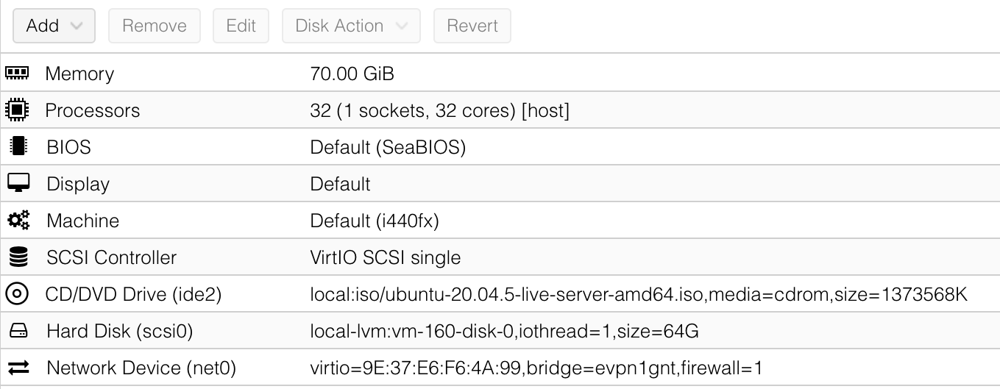

Quick Start
-----------------------

This section describes a low-overhead way to get started with OnRamp.
It brings up a one-node Kubernetes cluster, deploys a 5G version of
SD-Core on that cluster, and runs an emulated 5G workload against the
5G Core. It assumes a low-end server that meets the following
requirements:

* Haswell CPU (or newer), with at least 4 CPUs and 12GB RAM.
* Clean install of Ubuntu 20.04 or 22.04, with 5.15 (or later) kernel.

For example, something like an Intel NUC is more than enough to get
started.

While it's possible to use OnRamp to deploy Aether on a laptop (e.g.,
in a VirtualBox VM), because the goal is to eventually scale a
deployment and/or run Aether 24/7, OnRamp has been developed and
tested on physical servers and server-based VMs. The latter includes
Proxmox (see the example configuration in :numref:`Figure %s
<fig-proxmox>`); AWS (specify a ``t2.xlarge`` instance); and CloudLab
(see ``scripts/cloudlab-disksetup.sh`` once you download OnRamp for a
script that can be used to configure the disk).

.. _fig-proxmox:

    Example configuration of Proxmox VM.

Prep Environment
~~~~~~~~~~~~~~~~~~~~~

To install Aether OnRamp, you must be able able to run ``sudo`` without
a password, and there should be no firewall running on the server. You can
verify this is the case by executing the following, which should
report ``Status: inactive``:

.. code-block::

   $ sudo ufw status
   Status: inactive

OnRamp depends on Ansible, which you can install on your server as
follows:

.. code-block::

   $ sudo apt install pipx
   $ sudo apt install python3.8-venv
   $ pipx install --include-deps ansible
   $ pipx ensurepath
   $ sudo apt-get install sshpass

Once installed, displaying the Ansible version number should result in
output similar to the following:

.. code-block::

   $ ansible --version
   ansible [core 2.11.12]
     config file = None
     configured module search path = ['/home/foo/.ansible/plugins/modules', '/usr/share/ansible/plugins/modules']
     ansible python module location = /home/foo/.local/lib/python3.6/site-packages/ansible
     ansible collection location = /home/foo/.ansible/collections:/usr/share/ansible/collections
     executable location = /home/foo/.local/bin/ansible
     python version = 3.6.9 (default, Mar 10 2023, 16:46:00) [GCC 8.4.0]
     jinja version = 3.0.3
     libyaml = True

Note that a fresh install of Ubuntu may be missing other packages that
you need (e.g., ``git``, ``curl``, ``make``), but you will be prompted
to install them as you step through the Quick Start sequence.

Download Aether OnRamp
~~~~~~~~~~~~~~~~~~~~~~~~~~~~~~~

Once ready, clone the Aether OnRamp repo on this target deployment
server:

.. code-block::

   $ git clone --recursive https://github.com/opennetworkinglab/aether-onramp.git
   $ cd aether-onramp

Taking a quick look at your ``aether-onramp`` directory, there are
four things to note:

1. The ``deps`` directory contains the Ansible deployment
   specifications for all the Aether subsystems. Each of these
   subdirectories (e.g., ``deps/5gc``) is self-contained, meaning you
   can execute the Make targets in each individual directory. Doing so
   causes Ansible to run the corresponding playbook. For example, the
   installation playbook for the 5G Core can be found in
   ``deps/5gc/roles/core/tasks/install.yml``.

2. The Makefile in the main OnRamp directory imports (``#include``)
   the per-subsystem Makefiles, meaning all the individual steps
   required to install Aether can be managed from this main directory.
   The Makefile includes comments listing the key Make targets defined
   by the included Makefiles. *Importantly, the rest of this guide
   assumes you are working in the main OnRamp directory, and not in
   the individual subsystems.*

3. File ``vars/main.yml`` defines all the Ansible variables you will
   potentially need to modify to specify your deployment scenario.
   This file is the union of all the per-component ``var/main.yml``
   files you find in the corresponding ``deps`` directory. This
   top-level variable file overrides the per-component var files, so
   you will not need to modify the latter. Note that the ``vars``
   directory contains several variants of ``main.yml``, each tailored
   for a different deployment scenario. The default ``main.yml``
   (which is the same as ``main-quickstart.yml``) supports the Quick
   Start deployment described in this section; we'll substitute the
   other variants in later sections.

4. File ``hosts.ini`` (host inventory) is Ansible's way of specifying
   the set of servers (physical or virtual) that Ansible targets with
   various installation playbooks. The default version of ``hosts.ini``
   included with OnRamp is simplified to run everything on a single
   server (the one you've cloned the repo onto), with additional lines
   you may eventually need for a multi-node cluster commented out.

Set Target Parameters
~~~~~~~~~~~~~~~~~~~~~~~~~~~

The Quick Start deployment described in this section requires that you
modify two sets of parameters to reflect the specifics of your target
deployment.

The first set is in file ``hosts.ini``, where you will need to give the IP
address and login credentials for the server you are working on. At
this stage, we assume the server you downloaded OnRamp onto is the
same server you will be installing Aether on.

.. code-block::

   node1  ansible_host=10.76.28.113 ansible_user=aether ansible_password=aether ansible_sudo_pass=aether

In this example, address ``10.76.28.113`` and the three occurrences
of the string ``aether`` need to be replaced with the appropriate
values.  Note that if you set up your server to use SSH keys instead
of passwords, then ``ansible_password=aether`` needs to be replaced
with ``ansible_ssh_private_key_file=~/.ssh/id_rsa`` (or wherever
your private key can be found).

The second set of parameters is in ``vars/main.yml``, where the **two** lines
currently reading

.. code-block::

   data_iface: ens18

need to be edited to replace ``ens18`` with the device interface for
you server, and the line specifying the IP address of the Core's AMF
needs to be edited to reflect your server's IP address:

.. code-block::

   amf:
      ip: "10.76.28.113"

You can learn your server's IP address and interface using the Linux ``ip``
command:

.. code-block::

   $ ip a
   1: lo: <LOOPBACK,UP,LOWER_UP> mtu 65536 qdisc noqueue state UNKNOWN group default qlen 1000
       link/loopback 00:00:00:00:00:00 brd 00:00:00:00:00:00
       inet 127.0.0.1/8 scope host lo
          valid_lft forever preferred_lft forever
       inet6 ::1/128 scope host
          valid_lft forever preferred_lft forever
   2: ens18: <BROADCAST,MULTICAST,UP,LOWER_UP> mtu 1500 qdisc fq_codel state UP group default qlen 1000
       link/ether 2c:f0:5d:f2:d8:21 brd ff:ff:ff:ff:ff:ff
       inet 10.76.28.113/24 metric 100 brd 10.76.28.255 scope global ens3
          valid_lft forever preferred_lft forever
       inet6 fe80::2ef0:5dff:fef2:d821/64 scope link
          valid_lft forever preferred_lft forever

In this example, the reported interface is ``ens18`` and the IP
address is ``10.76.28.113`` on subnet ``10.76.28.0/24``.  We will use
these three values as a running example throughout the guide, as a
placeholder for your local details.

.. admonition:: Troubleshooting Hint

  Due to a limitation in gNBsim (the RAN emulator introduced later in
  this section), it is necessary for your server to be configured with
  IPv6 enabled (as the ``inet6`` line in the example output indicates
  is the case for interface ``ens18``). If IPv6 is not enabled, the
  emulated RAN will not successfully connect to the AMF.

Note that ``vars/main.yml`` and ``hosts.ini`` are the only two files
you need to modify for now, but there are additional config files that
you may want to modify as we move beyond the Quick Start deployment.
We'll identify those files throughout this section, for informational
purposes, and revisit them in later sections.

Many of the tasks specified in the various Ansible playbooks result in
calls to Kubernetes, either directly via ``kubectl``, or indirectly
via ``helm``. This means that after executing the sequence of
Makefile targets described in the rest of this guide, you'll want to
run some combination of the following commands to verify that the
right things happened:

.. code-block::

   $ kubectl get pods --all-namespaces
   $ helm repo list
   $ helm list --namespace kube-system

The first reports the set of Kubernetes namespaces currently running;
the second shows the known set of repos you are pulling charts from;
and the third shows the version numbers of the charts currently
deployed in the ``kube-system`` namespace.

If you are not familiar with ``kubectl`` (the CLI for Kubernetes), we
recommend that you start with `Kubernetes Tutorial
<https://kubernetes.io/docs/tutorials/kubernetes-basics/>`__.  And
although not required, you may also want to install
`k9s <https://k9scli.io/>`__\ , a terminal-based UI that provides a
convenient alternative to ``kubectl`` for interacting with Kubernetes.

Note that we have not yet installed Kubernetes or Helm, so these
commands are not yet available. At this point, the only verification
step you can take is to type the following:

.. code-block::

   $ make aether-pingall

The output should show that Ansible is able to securely connect to all
the nodes in your deployment, which is currently just the one that
Ansible knows as ``node1``.

Install Kubernetes
~~~~~~~~~~~~~~~~~~~

The next step is to bring up an RKE2.0 Kubernetes cluster on your
target server. Do this by typing:

.. code-block::

   $ make aether-k8s-install

Note that the Ansible playbooks triggered by this (and other) make
targets will output red results from time-to-time (indicating an
exception or failure), but as long as Ansible keeps progressing
through the playbook, such output can be safely ignored.

Once the playbook completes, executing ``kubectl`` will show the
``kube-system`` namespace running, with output looking something like
the following:

.. code-block::

   $ kubectl get pods --all-namespaces
   NAMESPACE     NAME                                                    READY   STATUS      RESTARTS   AGE
   kube-system   cloud-controller-manager-node1                          1/1     Running     0          2m4s
   kube-system   etcd-node1                                              1/1     Running     0          104s
   kube-system   helm-install-rke2-canal-8s67r                           0/1     Completed   0          113s
   kube-system   helm-install-rke2-coredns-bk5rh                         0/1     Completed   0          113s
   kube-system   helm-install-rke2-ingress-nginx-lsjz2                   0/1     Completed   0          113s
   kube-system   helm-install-rke2-metrics-server-t8kxf                  0/1     Completed   0          113s
   kube-system   helm-install-rke2-multus-tbbhc                          0/1     Completed   0          113s
   kube-system   kube-apiserver-node1                                    1/1     Running     0          97s
   kube-system   kube-controller-manager-node1                           1/1     Running     0          2m7s
   kube-system   kube-multus-ds-96cnl                                    1/1     Running     0          95s
   kube-system   kube-proxy-node1                                        1/1     Running     0          2m1s
   kube-system   kube-scheduler-node1                                    1/1     Running     0          2m7s
   kube-system   rke2-canal-h79qq                                        2/2     Running     0          95s
   kube-system   rke2-coredns-rke2-coredns-869b5d56d4-tffjh              1/1     Running     0          95s
   kube-system   rke2-coredns-rke2-coredns-autoscaler-5b947fbb77-pj5vk   1/1     Running     0          95s
   kube-system   rke2-ingress-nginx-controller-s68rx                     1/1     Running     0          48s
   kube-system   rke2-metrics-server-6564db4569-snnv4                    1/1     Running     0          56s

If you are interested in seeing the details about how Kubernetes is
customized for Aether, look at
``deps/k8s/roles/rke2/templates/master-config.yaml``.  Of particular
note, we have instructed Kubernetes to allow service for ports ranging
from ``2000`` to ``36767`` and we are using the ``multus`` and
``canal`` CNI plugins.

Install SD-Core
~~~~~~~~~~~~~~~~~~~~~~~~~

We are now ready to bring up the 5G version of the SD-Core. To do
that, type:

.. code-block::

   $ make aether-5gc-install

``kubectl`` will now show the ``omec`` namespace running (in addition
to ``kube-system``), with output similar to the following:

.. code-block::

   $ kubectl get pods -n omec
   NAME                         READY   STATUS             RESTARTS      AGE
   amf-5887bbf6c5-pc9g2         1/1     Running            0             6m13s
   ausf-6dbb7655c7-42z7m        1/1     Running            0             6m13s
   kafka-0                      1/1     Running            0             6m13s
   metricfunc-b9f8c667b-r2x9g   1/1     Running            0             6m13s
   mongodb-0                    1/1     Running            0             6m13s
   mongodb-1                    1/1     Running            0             4m12s
   mongodb-arbiter-0            1/1     Running            0             6m13s
   nrf-54bf88c78c-kcm7t         1/1     Running            0             6m13s
   nssf-5b85b8978d-d29jm        1/1     Running            0             6m13s
   pcf-758d7cfb48-dwz9x         1/1     Running            0             6m13s
   sd-core-zookeeper-0          1/1     Running            0             6m13s
   simapp-6cccd6f787-jnxc7      1/1     Running            0             6m13s
   smf-7f89c6d849-wzqvx         1/1     Running            0             6m13s
   udm-768b9987b4-9qz4p         1/1     Running            0             6m13s
   udr-8566897d45-kv6zd         1/1     Running            0             6m13s
   upf-0                        5/5     Running            0             6m13s
   webui-5894ffd49d-gg2jh       1/1     Running            0             6m13s

If you see problematic pods that are not getting into the ``Running``
state, a re-install usually corrects the problem. Type:

.. code-block::

   make aether-resetcore

Once running, you will recognize pods that correspond to many of the
microservices discussed is `Chapter 5
<https://5g.systemsapproach.org/core.html>`__. For example,
``amf-5887bbf6c5-pc9g2`` implements the AMF. Note that for historical
reasons, the Aether Core is called ``omec`` instead of ``sd-core``.

If you are interested in seeing the details about how SD-Core is
configured, look at
``deps/5gc/roles/core/templates/radio-5g-values.yaml``.  This is an
example of a *values override* file that Helm passes along to
Kubernetes when launching the service. Most of the default settings
will remain unchanged, with the main exception being the
``subscribers`` block of the ``omec-sub-provision`` section. This
block will eventually need to be edited to reflect the SIM cards you
actually deploy. We return to this topic in the section describing how
to bring up a physical gNB.

Run Emulated RAN Test
~~~~~~~~~~~~~~~~~~~~~~~~~~~~~~~~~

We can now test SD-Core with emulated traffic by typing:

.. code-block::

   $ make aether-gnbsim-install
   $ make aether-gnbsim-run

Note that you can re-execute the ``aether-gnbsim-run`` target multiple
times, where the results of each run are saved in a file within the
Docker container running the test. You can access that file by typing:

.. code-block::

   $ docker exec -it gnbsim-1 cat summary.log

If successful, the output should look like the following:

.. code-block::

   2023-08-09T19:57:09Z [INFO][GNBSIM][Summary] Profile Name: profile2 , Profile Type: pdusessest
   2023-08-09T19:57:09Z [INFO][GNBSIM][Summary] UEs Passed: 5 , UEs Failed: 0
   2023-08-09T19:57:09Z [INFO][GNBSIM][Summary] Profile Status: PASS

This particular test, which runs the cryptically named ``pdusessest``
profile, emulates five UEs, each of which: (1) registers with the
Core, (2) initiates a user plane session, and (3) sends a minimal data
packet over that session. In addition to displaying the summary
results, you can also open a shell in the ``gnbsim-1`` container,
where you can view the full trace of every run of the emulation, each
of which has been saved in a timestamped file:

.. code-block::

   $ docker exec -it gnbsim-1 bash
   bash-5.1# ls
   gnbsim                          gnbsim1-20230809T125702.config  summary.log
   gnbsim.log                      gnbsim1-20230809T125702.log
   bash-5.1# more gnbsim1-20230809T125702.log
   2023-08-09T19:57:05Z [INFO][GNBSIM][App] App Name: GNBSIM
   2023-08-09T19:57:05Z [INFO][GNBSIM][App] Setting log level to: info
   2023-08-09T19:57:05Z [INFO][GNBSIM][GNodeB][gnb1] GNodeB IP:  GNodeB Port: 9487
   2023-08-09T19:57:05Z [INFO][GNBSIM][GNodeB][UserPlaneTransport] User Plane transport listening on: 172.20.0.2:2152
   2023-08-09T19:57:05Z [INFO][GNBSIM][GNodeB] Current range selector value: 63
   2023-08-09T19:57:05Z [INFO][GNBSIM][GNodeB] Current ID range start: 1056964608 end: 1073741823
   2023-08-09T19:57:05Z [INFO][GNBSIM][GNodeB][ControlPlaneTransport] Connected to AMF, AMF IP: 10.76.28.113 AMF Port: 38412
   ...

.. admonition:: Troubleshooting Hint

  If ``summary.log`` is empty, it means the emulation did not run due
  to a configuration error. To debug the problem, open a bash shell on
  the gNBsim container (as shown in the preceding example), and look
  at ``gnbsim.log``. Output that includes ``failed to connect amf``
  and ``err: address family not supported by protocol`` indicates that
  your server does not have IPv6 enabled.

If you are interested in the config file that controls the test,
including the option of enabling other profiles, take a look at
``deps/gnbsim/config/gnbsim-default.yaml``. We return to the issue of
customizing gNBsim in a later section, but for now there are some
simple modifications you can try. For example, the following code
block defines a set of parameters for ``pdusessest`` (also known as
``profile2``):

.. code-block::

    - profileType: pdusessest         # UE Initiated Session
    profileName: profile2
    enable: true
    gnbName: gnb1
    execInParallel: false
    startImsi: 208930100007487
    ueCount: 5
    defaultAs: "192.168.250.1"
    perUserTimeout: 100
    plmnId:
       mcc: 208
       mnc: 93
    dataPktCount: 5
    opc: "981d464c7c52eb6e5036234984ad0bcf"
    key: "5122250214c33e723a5dd523fc145fc0"
    sequenceNumber: "16f3b3f70fc2"

You can edit ``ueCount`` to change the number of UEs included in the
emulation (currently limited to 100) and you can set
``execInParallel`` to ``true`` to emulate those UEs connecting to the
Core in parallel (rather than serially). You can also change the
amount of information gNBsim outputs by modifying ``logLevel`` in the
``logger`` block at the end of the file.  For any changes you make,
just rerun ``make aether-gnbsim-run`` to see the effects; you do not
need to reinstall gNBsim.

Clean Up
~~~~~~~~~~~~~~~~~

We recommend continuing on to the next section before wrapping up, but
when you are ready to tear down your Quick Start deployment of Aether,
simply execute the following commands:

.. code-block::

   $ make aether-gnbsim-uninstall
   $ make aether-5gc-uninstall
   $ make aether-k8s-uninstall

Note that while we stepped through the system one component at a time,
OnRamp includes compound Make targets. For example, you can uninstall
everything covered in this section by typing:

.. code-block::

   $ make aether-uninstall

Look at the ``Makefile`` to see the available set of Make targets.
